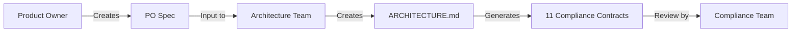

# Solutions Architect Skills

[](https://github.com/shadowx4fox/solutions-architect-skills/releases)
[](LICENSE)
[](https://claude.com/claude-code)

Professional architecture documentation workflow for Claude Code: Transform business requirements into technical architecture and compliance documents.

## Overview

This Claude Code plugin provides a complete three-phase workflow for enterprise architecture documentation:

```
Phase 1: Business Requirements (PO Spec)
    ↓
Phase 2: Technical Architecture (ARCHITECTURE.md)
    ↓
Phase 3: Compliance Documents (11 contracts)
```

## Claude Code Marketplace & Plugin System

This project is distributed as a **Claude Code Plugin** via the **shadowX4fox Marketplace**:

- **Marketplace**: A catalog of available plugins ([Learn more](https://docs.anthropic.com/claude/docs/claude-code-plugins))
- **Plugin**: This repository, installable from the marketplace
- **Skills**: Three specialized tools within the plugin

For detailed information about Claude Code's plugin system, see the [official Claude Code documentation](https://docs.anthropic.com/claude/docs/claude-code).

---

### What's Included

- **3 Integrated Skills**
  - `architecture-readiness`: Product Owner Specifications
  - `architecture-docs`: ARCHITECTURE.md creation and maintenance
  - `architecture-compliance`: Generate 11 compliance contracts

- **11 Compliance Templates**
  - Business Continuity, SRE, Cloud, Security, Enterprise Architecture, and more

- **Automatic Validation** ⭐ NEW v1.3.0
  - External validation system (0-10 scoring) for all 11 contracts
  - 4-tier approval workflow (Auto-approve, Manual review, Needs work, Rejected)
  - Template-specific validation configurations
  - Metric consistency checking
  - Design Drivers calculation

- **Complete Documentation**
  - Installation guide, Quick Start tutorial, Workflow guide, Troubleshooting

## Quick Start

### Installation

**Method 1: Using Claude Code Marketplace (Recommended)**

```bash
# Add the shadowX4fox marketplace
/plugin marketplace add https://github.com/shadowX4fox/shadowx4fox-marketplace

# Install the plugin
/plugin install solutions-architect-skills

# Verify installation
/plugin list
```

**Note:** The marketplace repository (`shadowx4fox-marketplace`) contains a catalog of plugins. You add the marketplace once, then can install any plugin listed in it.

**Method 2: Direct Git Clone**

```bash
# Clone directly to plugins directory
git clone https://github.com/shadowX4fox/solutions-architect-skills.git ~/.claude/plugins/solutions-architect-skills

# Restart Claude Code and verify
/plugin list
```

You should see `solutions-architect-skills v1.3.0` in the list.

### First Workflow

```bash
# Phase 1: Create Product Owner Spec
/skill architecture-readiness

# Phase 2: Create ARCHITECTURE.md
/skill architecture-docs

# Phase 3: Generate compliance documents
/skill architecture-compliance
```

## Features

### Phase 1: Architecture Readiness (Product Owner)

Create comprehensive Product Owner Specifications before technical design begins.

**Key Features:**
- 8-section template (Business Context, User Personas, Use Cases, Success Criteria, etc.)
- Weighted scoring methodology (0-10 scale)
- Readiness threshold: ≥7.5 for architecture handoff
- Focus: Business requirements, no technical implementation

**Output:** `PRODUCT_OWNER_SPEC.md`

### Phase 2: Architecture Documentation

Create and maintain technical architecture documentation following enterprise standards.

**Key Features:**
- 12-section standardized structure (Executive Summary → ADRs)
- Automatic Document Index (lines 1-50)
- 4 architecture type templates (META, 3-Tier, Microservices, N-Layer)
- Interactive Mermaid diagrams in Section 4
- Metric consistency validation across document
- Design Drivers calculation (Value Delivery %, Scale, Impacts)
- 9 mandatory Architecture Principles + 1 optional
- ADR (Architecture Decision Record) templates

**Output:** `ARCHITECTURE.md` (2,000-3,000 lines typically)

### Phase 3: Compliance Documentation

Generate compliance contracts from ARCHITECTURE.md with full traceability.

**Key Features:**
- Context-efficient generation (70-80% reduction in loaded content)
- **v1.3.0**: 11 complete compliance contracts with external validation system ⭐ NEW
- **Automatic Validation (0-10 scoring)**: All contracts validated with granular scoring ⭐ NEW
- **4-Tier Approval Workflow**: Auto-approve (8.5-10), Manual review (7.0-8.4), Needs work (5.0-6.9), Rejected (0-4.9) ⭐ NEW
- Source traceability (section + line number references)
- [PLACEHOLDER] markers for missing data with completion guidance
- Compliance manifest (index of all generated documents)

**Output:** `/compliance-docs/` directory with all 11 contracts + manifest (v1.3.0)

#### Compliance Contract Types ⭐ v1.3.0: All 11 Contracts Complete

**✅ All 11 Contracts with External Validation System**:

1. **Business Continuity** - RTO/RPO, disaster recovery, backup strategy, resilience
2. **SRE Architecture** - SLOs, error budgets, monitoring, incident management, observability
3. **Cloud Architecture** - Deployment model, cloud provider, connectivity, security
4. **Security Architecture** - API security, authentication, encryption, compliance, controls
5. **Data & Analytics/AI Architecture** - Data quality, AI governance, model validation, hallucination control
6. **Development Architecture** - Technology stack, coding standards, technical debt, **26-item validation**
7. **Process Transformation** - Automation, efficiency, ROI analysis, workflow optimization
8. **Platform & IT Infrastructure** - Environments, databases, capacity, naming conventions
9. **Enterprise Architecture** - Strategic alignment, modularity, cloud-first, API-first, governance
10. **Integration Architecture** - Integration catalog, patterns, API security, standards
11. **Risk Management** - Risk identification, assessment, mitigation, monitoring

**🎯 New in v1.3.0: External Validation System**

All 11 contracts now include automatic validation with:
- **Scoring (0-10 scale)**: Granular feedback on compliance completeness
- **4-Tier Approval**:
  - **8.5-10.0**: Auto-approved by system (high confidence)
  - **7.0-8.4**: Manual review required by approval authority
  - **5.0-6.9**: Draft status - must address gaps
  - **0.0-4.9**: Rejected - cannot proceed
- **Template-Specific Rules**: Each contract has customized validation criteria
- **Full Traceability**: All scores link back to ARCHITECTURE.md sources
- **Actionable Feedback**: Clear recommendations for improving scores

**Validation Configuration Files**: 11 JSON configs in `/skills/architecture-compliance/validation/`

## Architecture Types & Visualization

### 4 Supported Architecture Types

Choose the architecture type that best fits your system:

**1. META (6-Layer Enterprise)** - Large enterprise systems with complex integrations
- Layers: Channels → UX → Business Scenarios → Business → Domain → Core
- Best for: Financial services, regulated industries, enterprise platforms
- Template: Section 4 META with [BIAN V12.0](https://bian.org/servicelandscape-12-0-0/views/view_51891.html) alignment (default version)
- **BIAN Standard**: Uses [BIAN Service Landscape V12.0](https://bian.org/servicelandscape-12-0-0/views/view_51891.html) for Layer 5 Domain service domains

**2. 3-Tier (Classic Web Application)** - Standard web applications and REST APIs
- Tiers: Presentation → Application/Business Logic → Data
- Best for: Web apps, line-of-business applications, standard CRUD systems
- Template: Section 4 3-Tier with tier separation enforcement

**3. Microservices (Cloud-Native)** - Distributed systems with independent services
- Components: API Gateway, Service Mesh, Event Bus, independent services
- Best for: Cloud-native systems, event-driven architectures, polyglot environments
- Template: Section 4 Microservices with service catalog

**4. N-Layer (DDD/Clean Architecture)** - Flexible custom patterns
- Patterns: Classic DDD (4-Layer), Extended (5-Layer), Clean Architecture
- Best for: Domain-Driven Design, Hexagonal Architecture, testable systems
- Template: Section 4 N-Layer with dependency inversion

**How to Choose**: See [ARCHITECTURE_TYPE_SELECTOR.md](skills/architecture-docs/templates/ARCHITECTURE_TYPE_SELECTOR.md) for decision tree and comparison matrix.

### Interactive Mermaid Diagrams

All ARCHITECTURE.md documents include **Mermaid architecture diagrams** integrated into Section 4:

**Capabilities**:
- ✅ Interactive visualization (zoom, pan, clickable components)
- ✅ Color-coded components (Blue=Orchestrators, Orange=Workers, Green=Query, Purple=Events)
- ✅ Data flow patterns (solid arrows=synchronous, dashed arrows=asynchronous)
- ✅ Security protocol visualization (OAuth 2.0, JWT, mTLS, TLS 1.2+, SASL)
- ✅ GitHub/GitLab native rendering (no plugins required)
- ✅ Professional, maintainable, version-control-friendly

**Comprehensive Guide**: See [MERMAID_DIAGRAMS_GUIDE.md](skills/architecture-docs/MERMAID_DIAGRAMS_GUIDE.md) for templates, color schemes, and examples.

## Documentation

- **[Installation Guide](docs/INSTALLATION.md)** - Detailed installation instructions
- **[Quick Start](docs/QUICK_START.md)** - 5-minute getting started tutorial
- **[Workflow Guide](docs/WORKFLOW_GUIDE.md)** - Complete end-to-end workflow
- **[Troubleshooting](docs/TROUBLESHOOTING.md)** - FAQ and common issues

## Examples

> **Note**: Example repositories demonstrating real-world usage will be added here. Check back soon or see [Issues](https://github.com/shadowx4fox/solutions-architect-skills/issues) for updates.

**Planned Examples:**
- Enterprise architecture documentation workflow
- Multi-project compliance generation
- Integration with existing documentation systems

To request specific examples, [open an issue](https://github.com/shadowx4fox/solutions-architect-skills/issues/new).

**Current Examples in Repository:**

The `examples/` directory contains basic demonstrations:

- **PRODUCT_OWNER_SPEC_example.md** - Complete PO Spec (Job Scheduling Platform)
- **ARCHITECTURE_example.md** - Full ARCHITECTURE.md based on PO Spec
- **compliance-docs/** - All 11 generated compliance contracts

## Requirements

- **Claude Code** (latest version)
- **Platform:** macOS, Linux, or Windows
- **No dependencies** - Pure markdown-based plugin

## Use Cases

Perfect for:
- Enterprise architects documenting solution designs
- Product Owners preparing requirements for architecture teams
- Compliance teams generating organizational contracts
- Technical leads maintaining architecture documentation
- Teams needing standardized architecture workflows

## Workflow Integration



## External Validation System (v1.3.0)

All 11 compliance contracts use an **external validation system** with standardized 0-10 scoring:

### Validation States & Scoring
- ✅ **PASS (10 points)**: Complies with requirements
- ❌ **FAIL (0 points)**: Non-compliant or deprecated technology
- ⚪ **N/A (10 points)**: Not applicable to this architecture
- ❓ **UNKNOWN (0 points)**: Missing data in ARCHITECTURE.md
- 🔓 **EXCEPTION (10 points)**: Documented exception via LADES2 process

### Scoring Formula
```
Final Score = (Completeness × 0.4) + (Compliance × 0.5) + (Quality × 0.1)

Where:
- Completeness = (Filled required fields / Total required) × 10
- Compliance = (PASS + N/A + EXCEPTION items / Total applicable) × 10
- Quality = Source traceability coverage (0-10)
```

### Approval Workflow
| Score | Status | Review Actor | Outcome |
|-------|--------|--------------|---------|
| 8.5-10.0 | Approved | System (Auto-Approved) | Ready for implementation |
| 7.0-8.4 | In Review | [Approval Authority] | Manual review required |
| 5.0-6.9 | Draft | Architecture Team | Address gaps before review |
| 0.0-4.9 | Rejected | N/A (Blocked) | Cannot proceed to review |

### Validation Configuration
- **11 JSON config files**: One per contract type in `/skills/architecture-compliance/validation/`
- **Template-specific weights**: Each contract can customize Completeness/Compliance/Quality weights
- **Validation schema**: `VALIDATION_SCHEMA.json` defines standard structure
- **Example scenarios**: `VALIDATION_EXAMPLES.md` shows all 4 outcome tiers

### Example: Development Architecture Validation
The Development Architecture contract validates against a **26-item checklist**:
- **Java Backend** (6 items): Version, Spring Boot, tools, containers, libraries, naming
- **.NET Backend** (6 items): C# version, ASP.NET Core, tools, containers, libraries, naming
- **Frontend** (6 items): Framework, TypeScript/JavaScript, tools, architecture, libraries, naming
- **Other Stacks** (5 items): Automation, IaC, databases, APIs, CI/CD
- **Exceptions** (3 items): Deviations exist?, Documented?, Approved?

## Roadmap

### v1.3.0 (Current Release) ✅
**Major Release: Complete Validation System**

- ✅ **All 11 compliance contracts** with templates and validation ⭐ MAJOR
- ✅ **External validation system** (0-10 scoring, 4-tier approval) ⭐ MAJOR
- ✅ **11 validation configuration files** (JSON-based, template-specific)
- ✅ **Validation documentation**:
  - `VALIDATION_SCHEMA.json` - Schema definition
  - `VALIDATION_EXAMPLES.md` - 4-tier outcome examples
  - Updated COMPLIANCE_GENERATION_GUIDE.md
  - Updated SKILL.md workflow
- ✅ **Document Control standardization** across all 11 templates
- ✅ **Automated approval workflow**:
  - Auto-approve: Score ≥ 8.5
  - Manual review: Score 7.0-8.4
  - Needs work: Score 5.0-6.9
  - Rejected: Score < 5.0

### v1.2.2 (Previous Release)
- ✅ Document Control format standardization
- ✅ Strict source traceability enforcement

### v1.2.0
- ✅ 3 integrated skills (architecture-readiness, architecture-docs, architecture-compliance)
- ✅ 4 architecture types with Mermaid diagrams (META, 3-Tier, Microservices, N-Layer)
- ✅ BIAN V12.0 integration for META architecture
- ✅ 4 ready-to-use compliance contracts
- ✅ Enhanced Data & AI Architecture compliance (Version 2.0)

### v1.1.0
- ✅ Initial release with 3 compliance contracts
- ✅ Foundation for architecture documentation workflow

### Future Releases 🚀

### v2.0.0 (Future)
- Multi-project support
- Custom compliance contract templates
- Integration with CI/CD pipelines
- Advanced reporting and dashboards

---

## Contributing

Contributions are welcome! Please feel free to submit issues or pull requests.

### Reporting Issues

If you encounter problems:
1. Check the [Troubleshooting Guide](docs/TROUBLESHOOTING.md)
2. Search [existing issues](https://github.com/shadowx4fox/solutions-architect-skills/issues)
3. Open a new issue with detailed description

### Feature Requests

Have an idea for improvement? Open an issue with the `enhancement` label.

## Version History

See [CHANGELOG.md](CHANGELOG.md) for detailed version history.

## License

This project is licensed under the MIT License - see the [LICENSE](LICENSE) file for details.

## Author

**shadowx4fox**
- GitHub: [@shadowx4fox](https://github.com/shadowx4fox)
- Repository: [solutions-architect-skills](https://github.com/shadowx4fox/solutions-architect-skills)

## Acknowledgments

- Built for [Claude Code](https://claude.com/claude-code) by Anthropic
- Follows enterprise architecture best practices
- Inspired by organizational compliance frameworks

---

**Get Started:** Download the [latest release](https://github.com/shadowx4fox/solutions-architect-skills/releases) and transform your architecture workflow today!