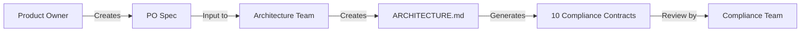

# Solutions Architect Skills

[](https://github.com/shadowx4fox/solutions-architect-skills/releases)
[](LICENSE)
[](https://claude.com/claude-code)

Professional architecture documentation workflow for Claude Code: Transform business requirements into technical architecture and compliance documents.

## Overview

This Claude Code plugin provides a complete three-phase workflow for enterprise architecture documentation:

```
Phase 1: Business Requirements (PO Spec)
    ↓
Phase 2: Technical Architecture (ARCHITECTURE.md)
    ↓
Phase 3: Compliance Documents (10 contracts)
```

## Claude Code Marketplace & Plugin System

This project is distributed as a **Claude Code Plugin** via the **shadowX4fox Marketplace**:

- **Marketplace**: A catalog of available plugins ([Learn more](https://docs.anthropic.com/claude/docs/claude-code-plugins))
- **Plugin**: This repository, installable from the marketplace
- **Skills**: Six specialized tools within the plugin

For detailed information about Claude Code's plugin system, see the [official Claude Code documentation](https://docs.anthropic.com/claude/docs/claude-code).

---

### What's Included

- **8 Integrated Skills**
  - `architecture-readiness`: Requirements Elicitation + Product Owner Specifications
  - `architecture-docs`: ARCHITECTURE.md creation and maintenance
  - `architecture-compliance`: Generate 10 compliance contracts
  - `architecture-compliance-review`: Compliance portfolio health review + gap explorer
  - `architecture-component-guardian`: Manages `docs/components/README.md` index
  - `architecture-peer-review`: Interactive peer review with playground tool
  - `architecture-dev-handoff`: Component development handoffs with deliverable assets ⭐ NEW
  - `architecture-doc-export`: On-demand Word (.docx) export for architecture docs and handoffs ⭐ NEW

- **10 Compliance Templates**
  - Business Continuity, SRE, Cloud, Security, Enterprise Architecture, and more

- **Automatic Validation** ⭐ NEW v1.3.0
  - External validation system (0-10 scoring) for all 10 contracts
  - 4-tier approval workflow (Auto-approve, Manual review, Needs work, Rejected)
  - Template-specific validation configurations
  - Metric consistency checking
  - Design Drivers calculation

- **Complete Documentation**
  - Installation guide, Quick Start tutorial, Workflow guide, Troubleshooting

## Quick Start

### Installation

**See [Installation Guide](docs/INSTALLATION.md) for detailed instructions.**

**Quick Start (Using Marketplace - Recommended):**

```bash
# Step 1: Register marketplace (one-time)
/plugin marketplace add shadowX4fox/solutions-architect-skills

# Step 2: Install plugin
/plugin install solutions-architect-skills@shadowx4fox-solution-architect-marketplace

# Step 3: Verify installation
/plugin list
```

**Alternative: Direct Git Clone**

```bash
# Clone directly to plugins directory
git clone https://github.com/shadowX4fox/solutions-architect-skills.git ~/.claude/plugins/solutions-architect-skills

# Restart Claude Code and verify
/plugin list
```

You should see `solutions-architect-skills v2.10.8` in the list.

**Important:** Marketplace registration is a security feature - you must explicitly add marketplaces before installing plugins. See [docs/INSTALLATION.md](docs/INSTALLATION.md) for detailed setup instructions.

### First Workflow

**Phase 1 — Business Requirements (Product Owner)**

```bash
/skill architecture-readiness
```

The skill auto-detects whether a PO Spec already exists:

- **No PO Spec found** → starts a guided discovery interview (4 phases, ~35 min):
  1. Foundation — business problem, stakeholders, personas
  2. Value & Boundaries — goals with targets, budget, timeline, regulatory constraints
  3. Behavior — use cases (scenario walking), user stories
  4. Experience & Measurement — UX expectations, KPIs with baselines and targets

  After the interview: Discovery Summary for your review → draft PO Spec → self-scored to ≥ 7.5/10 → saved as `PRODUCT_OWNER_SPEC.md`

- **PO Spec found** → offers Evaluation (scored out of 10) or Creation (template-guided)

**Phase 2 — Technical Architecture**

```bash
/skill architecture-docs
```

Hand off `PRODUCT_OWNER_SPEC.md` to your architecture team. The skill produces a multi-file structure:

```
ARCHITECTURE.md          ← navigation index (~130 lines)
docs/                    ← all section content
└── components/          ← one file per architectural component
adr/                     ← Architecture Decision Records
```

**Phase 3 — Compliance Documents**

```bash
/skill architecture-compliance
```

Generates 10 compliance contracts from `ARCHITECTURE.md` into `/compliance-docs/`. To remediate gaps found in compliance contracts, use `/skill architecture-docs` — the skill guides you through updating `ARCHITECTURE.md` for each finding.

## Features

### Phase 1: Architecture Readiness (Product Owner)

Create comprehensive Product Owner Specifications before technical design begins. Now includes a structured discovery interview when starting from scratch.

**Key Features:**
- **Requirements Elicitation** ⭐ NEW v2.5.6 — 4-phase guided discovery interview (Foundation → Value & Boundaries → Behavior → Experience & Measurement)
  - Probing techniques: scenario walking, quantification, negative probing, assumption surfacing
  - Industry defaults when PO is unsure; unknowns logged as Open Questions
  - Discovery Summary checkpoint before drafting; self-scoring gap loop until ≥7.5
- 8-section template (Business Context, User Personas, Use Cases, Success Criteria, etc.)
- Weighted scoring methodology (0-10 scale)
- Readiness threshold: ≥7.5 for architecture handoff
- Focus: Business requirements, no technical implementation
- Bilingual interview support (language auto-detected from user's first message)

**Output:** `PRODUCT_OWNER_SPEC.md`

### Phase 2: Architecture Documentation

Create and maintain technical architecture documentation following enterprise standards.

**Key Features:**
- **Multi-file structure** — `ARCHITECTURE.md` at project root is a navigation index (~130 lines); all content lives in `docs/` as numbered section files; components in `docs/components/` (one file per component); see [RESTRUCTURING_GUIDE.md](skills/architecture-docs/RESTRUCTURING_GUIDE.md)
- 5 architecture type templates (META, 3-Tier, Microservices, N-Layer, BIAN) ⭐ UPDATED v1.5
- Interactive Mermaid diagrams in `docs/03-architecture-layers.md`
- Metric consistency validation across document
- Design Drivers calculation (Value Delivery %, Scale, Impacts)
- 9 mandatory Architecture Principles + 1 optional
- ADR (Architecture Decision Record) templates with automatic file generation
- **Foundational Context Anchor Protocol** — dependency-aware editing workflow that loads required upstream context (principles, metrics, ADRs) before any downstream section edit, enforces source attribution for derived claims, and detects cross-section impact when any section changes
- All files kept under ~400 lines each for context efficiency

**Output structure:**
```
<project-root>/
├── ARCHITECTURE.md          (~130 lines — navigation index only)
├── adr/                     (ADR files)
└── docs/
    ├── 01-system-overview.md
    ├── 02-architecture-principles.md
    ├── 03-architecture-layers.md
    ├── 04-data-flow-patterns.md
    ├── 05-integration-points.md
    ├── 06-technology-stack.md
    ├── 07-security-architecture.md
    ├── 08-scalability-and-performance.md
    ├── 09-operational-considerations.md
    └── components/
        ├── README.md        (component index)
        └── NN-<name>.md     (one file per component)
```

### Phase 3: Compliance Documentation

Generate compliance contracts from ARCHITECTURE.md with full traceability.

**Key Features:**
- Context-efficient generation (70-80% reduction in loaded content)
- **v1.3.0**: 10 complete compliance contracts with external validation system ⭐ NEW
- **Automatic Validation (0-10 scoring)**: All contracts validated with granular scoring ⭐ NEW
- **4-Tier Approval Workflow**: Auto-approve (8.0-10), Manual review (7.0-7.9), Needs work (5.0-6.9), Rejected (0-4.9) ⭐ NEW
- Source traceability (section + line number references)
- [PLACEHOLDER] markers for missing data with completion guidance
- Compliance manifest (index of all generated documents)

**Output:** `/compliance-docs/` directory with all 10 contracts + manifest (v1.3.0)

**🎯 New in v1.5.0: Business Continuity v2.0**
- Table-based format with 43 LACN requirements (expanded from 10 LABC)
- 6-column compliance summary table
- 330% increase in validation data points
- Cloud-native resilience patterns (circuit breaker, retry, bulkhead, auto-scaling)

#### Compliance Contract Types ⭐ v1.3.0: All 10 Contracts Complete

**✅ All 10 Contracts with External Validation System**:

1. **Business Continuity** - RTO/RPO, disaster recovery, backup strategy, resilience
2. **SRE Architecture** - SLOs, error budgets, monitoring, incident management, observability
3. **Cloud Architecture** - Deployment model, cloud provider, connectivity, security
4. **Security Architecture** - API security, authentication, encryption, compliance, controls
5. **Data & Analytics/AI Architecture** - Data quality, AI governance, model validation, hallucination control
6. **Development Architecture** - Technology stack, coding standards, technical debt, **26-item validation**
7. **Process Transformation** - Automation, efficiency, ROI analysis, workflow optimization
8. **Platform & IT Infrastructure** - Environments, databases, capacity, naming conventions
9. **Enterprise Architecture** - Strategic alignment, modularity, cloud-first, API-first, governance
10. **Integration Architecture** - Integration catalog, patterns, API security, standards

**🎯 New in v1.3.0: External Validation System**

All 10 contracts now include automatic validation with:
- **Scoring (0-10 scale)**: Granular feedback on compliance completeness
- **4-Tier Approval**:
  - **8.0-10.0**: Auto-approved by system (high confidence)
  - **7.0-7.9**: Manual review required by approval authority
  - **5.0-6.9**: Draft status - must address gaps
  - **0.0-4.9**: Rejected - cannot proceed
- **Template-Specific Rules**: Each contract has customized validation criteria
- **Full Traceability**: All scores link back to ARCHITECTURE.md sources
- **Actionable Feedback**: Clear recommendations for improving scores

**Validation Configuration Files**: 22 JSON files in `/skills/architecture-compliance/validation/` — 10 main contract configs, 10 template validation configs, plus `VALIDATION_SCHEMA.json` and `VALIDATION_EXAMPLES.md`

### Phase 3.5: Architecture Peer Review ⭐ NEW v2.7.0

Perform Solution Architect peer reviews of your ARCHITECTURE.md before finalizing for implementation.

**Key Features:**
- **3 depth levels**: Light (structural, 22 checks), Medium (content quality, 44 checks), Hard (deep analysis, 82 checks)
- **13 review categories**: Structural Completeness, Naming & Conventions, Section Completeness, Content Coherence, Technology Alignment, Integration Soundness, Metric Realism, Scalability Design, Security Posture, Performance Design, Operational Readiness, ADR Quality, Trade-off Honesty
- **Interactive HTML playground** (via `playground` plugin): approve/reject/comment on each finding, live scorecard
- **Weighted 0–10 scorecard**: per category and overall, with rating bands (Production-ready → Major rework)
- **Fix prompt generation**: copy approved findings as a structured prompt for Claude to apply

**Output:** Interactive HTML peer review file (`architecture-peer-review-YYYY-MM-DD.html`) + scored findings

```
/skill architecture-peer-review
→ Locate ARCHITECTURE.md
→ Choose depth: Light / Medium / Hard
→ Run review (22–82 checks)
→ Generate scorecard + open playground in browser
→ Triage findings: Approve / Reject / Comment
→ Copy fix prompt → paste back to apply changes
```

## Architecture Types & Visualization

### 5 Supported Architecture Types

Choose the architecture type that best fits your system:

**1. META (6-Layer Enterprise)** - Large enterprise systems with complex integrations
- Layers: Channels → UX → Business Scenarios → Business → Domain → Core
- Best for: Financial services, regulated industries, enterprise platforms
- Template: Section 4 META with BIAN V12.0 alignment
- **BIAN Standard**: Full V12.0 compliance with 12 metadata fields ⭐ ENHANCED v1.5
- **Layer 5 Enhancement**: Matches BIAN Layer 4 comprehensiveness with complete service domain metadata

**2. 3-Tier (Classic Web Application)** - Standard web applications and REST APIs
- Tiers: Presentation → Application/Business Logic → Data
- Best for: Web apps, line-of-business applications, standard CRUD systems
- Template: Section 4 3-Tier with tier separation enforcement

**3. Microservices (Cloud-Native)** - Distributed systems with independent services
- Components: API Gateway, Service Mesh, Event Bus, independent services
- Best for: Cloud-native systems, event-driven architectures, polyglot environments
- Template: Section 4 Microservices with service catalog

**4. N-Layer (DDD/Clean Architecture)** - Flexible custom patterns
- Patterns: Classic DDD (4-Layer), Extended (5-Layer), Clean Architecture
- Best for: Domain-Driven Design, Hexagonal Architecture, testable systems
- Template: Section 4 N-Layer with dependency inversion

**5. BIAN (Full BIAN V12.0 Certification)** - Pure BIAN Service Landscape architecture ⭐ NEW v1.5
- Layers: Channels → BIAN Business Scenarios → BIAN Business Capabilities → BIAN Service Domains → Core Systems
- Best for: Banking, financial services requiring full BIAN certification
- Template: Section 4 BIAN and Section 5 BIAN with comprehensive metadata
- **Compliance**: Mandatory full BIAN V12.0 compliance (12 metadata fields, 7 standard operations)
- **Validation**: All service domain names validated against official [BIAN Service Landscape V12.0](https://bian.org/servicelandscape-12-0-0/views/view_51891.html)
- **Traceability**: Full BIAN hierarchy (Service Domain → Business Domain → Business Area)

**How to Choose**: See [ARCHITECTURE_TYPE_SELECTOR.md](skills/architecture-docs/templates/ARCHITECTURE_TYPE_SELECTOR.md) for decision tree and comparison matrix.

### Diagram Generation & Enforcement (Workflow 9) ⭐ UPDATED v2.6.0

Architecture diagrams are generated by the `architecture-docs` skill with strict placement enforcement:

**Mandatory diagrams** (always generated, not optional):
- **High-Level Architecture** → `docs/03-architecture-layers.md`
- **Data Flow Diagrams** → `docs/04-data-flow-patterns.md`

**On-request diagrams** (opt-in):
- Infrastructure / Deployment → `docs/09-operational-considerations.md`
- HA / Failover + Performance → `docs/08-scalability-and-performance.md`
- Integration → `docs/05-integration-points.md`
- Security → `docs/07-security-architecture.md`

**Enforcement rules** (new in v2.6.0):
- ⛔ Non-canonical placement is **denied** — diagrams go to their designated `docs/` file, no override
- 📥 **External diagram reconciliation** — diagrams from external files are classified, matched against architecture docs, and either relocated or discarded (no undocumented flows)
- 📊 **Completeness audit** — after generation, every documented flow is checked for a corresponding diagram; missing `[REQUIRED]` diagrams produce a compliance warning
- 🔍 New trigger keywords: `reconcile diagrams`, `audit diagrams`, `diagram completeness`, `fix diagram placement`

**Diagram Capabilities**:
- ✅ Interactive visualization (zoom, pan, clickable components)
- ✅ Color-coded components (Blue=Orchestrators, Orange=Workers, Green=Query, Purple=Events)
- ✅ Data flow patterns (solid arrows=synchronous, dashed arrows=asynchronous)
- ✅ Security protocol visualization (OAuth 2.0, JWT, mTLS, TLS 1.2+, SASL)
- ✅ GitHub/GitLab native rendering (no plugins required)

**Comprehensive Guide**: See [MERMAID_DIAGRAMS_GUIDE.md](skills/architecture-docs/MERMAID_DIAGRAMS_GUIDE.md) for templates, color schemes, and examples.

## Documentation

- **[Installation Guide](docs/INSTALLATION.md)** - Detailed installation instructions
- **[Quick Start](docs/QUICK_START.md)** - 5-minute getting started tutorial
- **[Workflow Guide](docs/WORKFLOW_GUIDE.md)** - Complete end-to-end workflow
- **[Troubleshooting](docs/TROUBLESHOOTING.md)** - FAQ and common issues

## Examples

### Real-World Example Repository

**[Task Scheduling Platform Example](https://github.com/shadowX4fox/task-scheduling-example)** ⭐

Complete end-to-end demonstration of the three-phase workflow:

**Phase 1: Product Owner Specification**
- Business requirements and user personas
- Use cases and success criteria
- Weighted readiness scoring (8.3/10)

**Phase 2: Technical Architecture (ARCHITECTURE.md)**
- Multi-file structure: navigation index + `docs/` section files + `docs/components/`
- Microservices architecture pattern
- Interactive Mermaid diagrams in `docs/03-architecture-layers.md`
- Technology stack documentation
- Complete with metrics, SLOs, and ADRs

**Phase 3: Compliance Documentation**
- All 10 generated compliance contracts with v1.3.0 validation
- Development Architecture with 26-item stack validation
- Security, Cloud, SRE, and Enterprise Architecture contracts
- Full source traceability to ARCHITECTURE.md

**Repository**: https://github.com/shadowX4fox/task-scheduling-example

---

**Additional Examples in This Repository:**

The `examples/` directory contains reference templates:

- **PRODUCT_OWNER_SPEC_example.md** - PO Spec template (Job Scheduling Platform)
- **ARCHITECTURE_example.md** - Full ARCHITECTURE.md example (multi-file structure: navigation index + `docs/` section files)

---

**Want More Examples?**

To request specific examples or use cases, [open an issue](https://github.com/shadowx4fox/solutions-architect-skills/issues/new).

## Requirements

- **Claude Code** (latest version)
- **Bun** (v1.0.0 or later) - Required for compliance generation and template validation
- **Platform:** macOS, Linux, or Windows

### Why Bun?

The architecture-compliance skill uses Bun for:
- Template expansion with `@include` directives
- Pre-validation of template structure (Phase 4.1)
- Post-validation of generated contracts (Phase 4.6)
- High-performance TypeScript execution

**Installation:** See [INSTALLATION.md](docs/INSTALLATION.md#installing-bun) for Bun setup instructions.

## Use Cases

Perfect for:
- Enterprise architects documenting solution designs
- Product Owners preparing requirements for architecture teams
- Compliance teams generating organizational contracts
- Technical leads maintaining architecture documentation
- Teams needing standardized architecture workflows

## Workflow Integration


```mermaid
graph LR
    A[Product Owner] -->|Creates| B[PO Spec]
    B -->|Input to| C[Architecture Team]
    C -->|Creates| D[ARCHITECTURE.md]
    D -->|Generates| E[10 Compliance Contracts]
    E -->|Review by| F[Compliance Team]
```

## External Validation System (v1.3.0)

All 10 compliance contracts use an **external validation system** with standardized 0-10 scoring:

### Validation States & Scoring
- ✅ **PASS (10 points)**: Complies with requirements
- ❌ **FAIL (0 points)**: Non-compliant or deprecated technology
- ⚪ **N/A (10 points)**: Not applicable to this architecture
- ❓ **UNKNOWN (0 points)**: Missing data in ARCHITECTURE.md
- 🔓 **EXCEPTION (10 points)**: Documented exception via LADES2 process

### Scoring Formula
```
Final Score = (Completeness × 0.4) + (Compliance × 0.5) + (Quality × 0.1)

Where:
- Completeness = (Filled required fields / Total required) × 10
- Compliance = (PASS + N/A + EXCEPTION items / Total applicable) × 10
- Quality = Source traceability coverage (0-10)
```

### Approval Workflow
| Score | Status | Review Actor | Outcome |
|-------|--------|--------------|---------|
| 8.0-10.0 | Approved | System (Auto-Approved) | Ready for implementation |
| 7.0-7.9 | In Review | [Approval Authority] | Manual review required |
| 5.0-6.9 | Draft | Architecture Team | Address gaps before review |
| 0.0-4.9 | Rejected | N/A (Blocked) | Cannot proceed to review |

### Validation Configuration
- **11 JSON config files**: One per contract type in `/skills/architecture-compliance/validation/`
- **Template-specific weights**: Each contract can customize Completeness/Compliance/Quality weights
- **Validation schema**: `VALIDATION_SCHEMA.json` defines standard structure
- **Example scenarios**: `VALIDATION_EXAMPLES.md` shows all 4 outcome tiers

### Example: Development Architecture Validation
The Development Architecture contract validates against a **26-item checklist**:
- **Java Backend** (6 items): Version, Spring Boot, tools, containers, libraries, naming
- **.NET Backend** (6 items): C# version, ASP.NET Core, tools, containers, libraries, naming
- **Frontend** (6 items): Framework, TypeScript/JavaScript, tools, architecture, libraries, naming
- **Other Stacks** (5 items): Automation, IaC, databases, APIs, CI/CD
- **Exceptions** (3 items): Deviations exist?, Documented?, Approved?

## Roadmap

### v2.10.8 (Current Release) ✅
**feat: assign distinct amber/gold color to ADR exports**

- ✅ **`tools/docgen/generate-doc.js`**: ADR document type now uses amber/gold (`#8B6914`) instead of corporate blue — each type has its own distinct identity (SA = corporate blue, ADR = amber/gold, Handoff = teal)
- ✅ **`skills/architecture-doc-export/SKILL.md`**: Updated color table to reflect 3-color scheme
- ✅ **`CLAUDE.md`**: Updated document styling section with new 3-color breakdown

### v2.10.7 (Previous Release) ✅
**fix: markdown parser robustness and I/O error handling hardening**

- ✅ **`tools/docgen/generate-doc.js`**: Added `i < lines.length` guard before skipping closing ` ``` ` — prevents out-of-bounds read on unclosed code fences at EOF
- ✅ **`tools/docgen/generate-doc.js`**: CHANGELOG directive parsing now uses destructuring with defaults — malformed entries no longer produce `undefined` values in output
- ✅ **`tools/docgen/generate-doc.js`**: `parseTable()` guards against empty header row before dividing `PAGE.content / headers.length` — prevents `Infinity` column width corrupting the docx
- ✅ **`tools/docgen/generate-doc.js`**: `get()` CLI helper now checks `i + 1 < args.length` before reading the flag value — prevents silent `undefined` when a flag is the last arg with no value
- ✅ **`tools/docgen/generate-doc.js`**: `fs.mkdirSync()` and `fs.writeFileSync()` wrapped in try-catch — disk full or permission errors now print a clean message instead of a raw stack trace

### v2.10.6 (Previous Release) ✅
**fix: resolve SA generation freeze caused by H5/H6 headings + add input file validation**

- ✅ **`tools/docgen/generate-doc.js`**: Expanded markdown heading regex from `#{1,4}` to `#{1,6}` — `#####` and `######` headings no longer cause an infinite loop in the parser; H5/H6 rendered as H4 in docx output
- ✅ **`tools/docgen/generate-doc.js`**: Added `else { i++ }` safety fallback in paragraph collector — prevents infinite loop if any other unrecognized line pattern is encountered
- ✅ **`tools/docgen/generate-doc.js`**: Added `fs.existsSync(input)` check before `readFileSync` — produces a clear "Input file not found" error instead of an unhandled ENOENT crash

### v2.10.5 (Previous Release) ✅
**fix: enforce Bun runtime and write executive summary temp file to project root**

- ✅ **`skills/architecture-doc-export/SKILL.md`**: Added explicit runtime enforcement callout — prohibits falling back to `node`, includes troubleshooting steps for when `bun run` appears to hang; added `# MUST use bun — never node` comment to all 3 bash code blocks
- ✅ **`skills/architecture-doc-export/SKILL.md`**: Changed executive summary temp file location from `/tmp/sa-executive-summary-<slug>.md` to `sa-executive-summary.md` at project root — fixes path resolution issues when skill runs from plugin cache directory

### v2.10.4 (Previous Release) ✅
**feat: architecture export now generates synthesized executive summary instead of raw ARCHITECTURE.md conversion**

- ✅ **`skills/architecture-doc-export/SKILL.md`**: Workflow A completely redesigned — reads `docs/01-system-overview.md` (executive summary + system overview), `docs/components/README.md` (component index), and `compliance-docs/COMPLIANCE_MANIFEST.md` (optional compliance summary); synthesizes them into a single executive summary markdown then exports to `exports/SA-<name>.docx`; ADRs are still exported individually as `exports/ADR-NNN-<title>.docx`
- ✅ **`CLAUDE.md`**: Updated doc-export section to reflect synthesized executive summary approach

### v2.10.3 (Previous Release) ✅
**fix: replace Word TOC field with pre-rendered table of contents — works in all readers**

- ✅ **`tools/docgen/generate-doc.js`**: Replaced `TableOfContents` field code with `buildManualToc()` — a new function that iterates parsed heading blocks (H1–H3) and renders styled paragraphs with level-based indentation; TOC is now pre-rendered at generation time and visible in Word, LibreOffice, Google Docs, and Word Online without any "update fields" step
- ✅ **`tools/docgen/generate-doc.js`**: Removed `TableOfContents` from `docx` imports and removed `features: { updateFields: true }` — no longer needed

### v2.10.2 (Previous Release) ✅
**fix: correct skill routing for dev handoff — export phrases route to doc-export, component selection always prompted**

- ✅ **`skills/architecture-dev-handoff/SKILL.md`**: Added `triggers:` frontmatter with explicit generation phrases (generate handoff, create handoff, component handoff, etc.) — prevents router from fuzzy-matching the description and stealing "export" phrases
- ✅ **`skills/architecture-dev-handoff/SKILL.md`**: Phase 2 component selection now **always** prompts with the component list; previously only asked "if ambiguous", causing the skill to auto-process all components silently
- ✅ **`skills/architecture-doc-export/SKILL.md`**: Added `export dev handoff` and `export dev handoffs` triggers to ensure those phrases unambiguously route to the Word export skill

### v2.10.1 (Previous Release) ✅
**fix: Word document Table of Contents now auto-populates on open**

- ✅ **`tools/docgen/generate-doc.js`**: Added `features: { updateFields: true }` to the `Document` constructor — instructs Word/LibreOffice to auto-update all field codes (including the `TOC` field) when the document is opened, so the Table of Contents page renders with headings and page numbers without manual intervention

### v2.10.0 (Previous Release) ✅
**feat: architecture-doc-export skill + architecture-dev-handoff skill + remove presentation generation + workflow renumbering**

- ✅ **`skills/architecture-doc-export/`** (new skill): On-demand Word (.docx) export for Solution Architecture documents and Component Development Handoffs — powered by `docx` v8; corporate blue for SA/ADR artifacts, teal for dev handoffs; cover page, TOC, headers/footers, inline styling
- ✅ **`tools/docgen/generate-doc.js`**: Professional Word generator adapted for 3 doc types: `solution-architecture`, `adr`, `handoff`; Bun runtime (`#!/usr/bin/env bun`); CHANGELOG directive support; auto-creates output directory
- ✅ **`tools/docgen/package.json`**: Isolated `docx ^8.5.0` workspace dependency
- ✅ **`skills/architecture-dev-handoff/`** (new skill): Per-component handoff documents — 16-section template, component-type-specific asset generation (OpenAPI, DDL, K8s Deployment, AsyncAPI, Avro/Protobuf schemas, CronJob), gap detection, compliance enrichment
- ✅ **`skills/architecture-component-guardian/`**: Renamed from `component-index-guardian` for consistent `architecture-*` prefix
- ✅ **`skills/architecture-docs/SKILL.md`**: Removed Presentation Generation workflow (~500 lines); removed `officegen` dependency; renumbered Workflow 9 (Diagrams) → 8, Workflow 10 (Migrate) → 9; cleaned all cross-references
- ✅ **`CLAUDE.md`**: Updated to 8 skills, 4-phase workflow, added doc-export and dev-handoff sections
- ✅ **`package.json`**: Added `"workspaces": ["tools/docgen"]`

### v2.8.28 (Previous Release) ✅
**fix: correct skill routing — "recreate compliance manifest" no longer triggers architecture-compliance-review**

- ✅ **`architecture-compliance/SKILL.md`**: added "recreate/regenerate/rebuild" activation triggers for both compliance contracts and the compliance manifest — ensures generation requests route to the correct skill
- ✅ **`architecture-compliance-review/SKILL.md`**: added explicit "Do NOT invoke for: recreating, regenerating, or rebuilding compliance contracts or the manifest" exclusion, redirecting to `architecture-compliance`

### v2.8.27 (Previous Release) ✅
**fix: compliance manifest date accuracy — use contract's embedded generation date and local timezone**

- ✅ **`generation-helper.ts`**: added `getLocalDateString()` helper returning YYYY-MM-DD in local timezone (mirrors bash `date +%Y-%m-%d`), avoiding UTC date shift from `toISOString()` in negative-offset timezones
- ✅ **`post-generation-pipeline.ts`**: manifest table's `Generated` column now reads the date embedded in each contract file (`**Generation Date**: YYYY-MM-DD`) instead of re-computing a fresh UTC date at pipeline run time; `today` fallback also uses local timezone
- ✅ **`manifest-generator.ts`**: `**Validation Date**:`, `Last Updated`, and CLI path all use `getLocalDateString()` — no more UTC drift in manifest header
- ✅ **`score-calculator.ts`**: `validation_date` field uses `getLocalDateString()` for consistent local-timezone date across all contract Document Control sections

### v2.8.26 (Previous Release) ✅
**refactor: compliance-review skill — remove fix prompt generation, focus on exploration**

- ✅ **`PLAYGROUND_TEMPLATE.md`**: removed Fix Prompt Output panel, cluster checkboxes, `updateFixPrompt()` function, presets dropdown, `selectedConceptIds` state, `fixGuidance` field, `.fix-prompt-area` CSS, and `cluster-selected` styling — playground is now a pure exploration tool
- ✅ **`SKILL.md`**: removed `fixGuidance` from concept cluster spec and JSON schema, updated Step 7 and success criteria to reflect exploration-only purpose, updated integration table description for `architecture-docs`
- ✅ **`CLAUDE.md` / `README.md`**: removed fix prompt references from compliance-review skill descriptions
- ✅ Fix prompt generation remains exclusively in `architecture-peer-review` skill

### v2.8.25 (Previous Release) ✅
**feat: add `architecture-compliance-review` skill — compliance portfolio health review with interactive gap explorer**

- ✅ **New skill**: `skills/architecture-compliance-review/SKILL.md` — validates all 10 compliance contracts are present and ≤6 months old; offers to regenerate expired/missing contracts via `architecture-compliance` skill before proceeding
- ✅ **Gap extraction**: reads each contract's compliance summary table and extracts Non-Compliant and Unknown requirements with priority (Blocker/Desired), source section, and concept tags
- ✅ **Concept clustering**: groups gaps across all contracts by underlying ARCHITECTURE.md concept (load testing, DR/RTO, IAM, observability, etc.); ranks clusters by cross-contract impact score
- ✅ **Interactive playground**: `PLAYGROUND_TEMPLATE.md` defines a two-panel compliance gap explorer — portfolio health panel (all 10 contracts with color-coded scores) and concept cluster gap explorer with filters for exploring gap areas across all contracts
- ✅ **CLAUDE.md**: documented new skill, updated skills count to 6, added `Read(compliance-docs/*)` to required permissions block
- ✅ **settings.json + settings.json.example**: added `Read(compliance-docs/*)` permission for contract file reading

### v2.8.24 (Previous Release) ✅
**Fix: drop temp-file approach in Step B — call resolve-plugin-dir.ts directly from marketplace path**

- ✅ **Root cause**: every temp-file approach hit an approval wall — heredoc security check, Write tool relative-path rewriting, `//tmp/` double-slash not helping — all required user approval
- ✅ **`SKILL.md` Step B**: replaced the entire Write-then-run temp-file block with a single `bun ~/.claude/plugins/marketplaces/shadowx4fox-solution-architect-marketplace/skills/architecture-compliance/utils/resolve-plugin-dir.ts` call — uses `Bash(bun *)` (already permitted), no Write tool, no temp file, no approval prompt
- ✅ `resolve-plugin-dir.ts` uses `import.meta.dir` so calling it from any location returns the correct `plugin_dir` for that installation

### v2.8.23 (Previous Release) ✅
**Fix: use `//tmp/` (double-slash) in Step B Write file_path to match `Write(//tmp/*)` permission exactly**

- ✅ **Root cause**: Claude Code's permission system uses `//` prefix for absolute paths — `Write(//tmp/*)` requires the path to be `//tmp/filename`, not `/tmp/filename`; single-slash path kept getting rewritten as a relative traversal `../../../../../tmp/...` which didn't match the permission
- ✅ **`SKILL.md` Step B**: changed `file_path` from `` `/tmp/sas-discover-plugin-dir-[UUID].ts` `` to `` `//tmp/sas-discover-plugin-dir-[UUID].ts` `` so it matches `Write(//tmp/*)` directly and fires no approval prompt

### v2.8.22 (Previous Release) ✅
**Fix: force absolute `/tmp/` path in Write tool call — prevents relative-path traversal that broke permission match**

- ✅ **Root cause**: Write tool was called with `../../../../../tmp/sas-discover-plugin-dir-[UUID].ts` (relative from project root) instead of absolute `/tmp/...` — relative path doesn't match `Write(//tmp/*)` permission, causing approval prompt
- ✅ **`SKILL.md` Step B**: annotated `file_path` with explicit warning — absolute path starting with `/tmp/` — do NOT convert to relative

### v2.8.21 (Previous Release) ✅
**Fix: enforce Write tool for temp file creation in Step B — eliminates heredoc approval prompt**

- ✅ **Root cause**: Step B instructed "write using the Write tool" but the orchestrator used `cat > file << 'EOF'` (Bash heredoc), which triggers a security prompt ("expansion obfuscation") requiring manual approval
- ✅ **`SKILL.md` Step B**: reworded to explicitly call the **Write tool** and forbid `cat`/Bash/heredoc for this step — `Write(//tmp/*)` is pre-approved so no prompt fires

### v2.8.20 (Previous Release) ✅
**Fix: replace hardcoded Step B path with temp-file discovery — works for marketplace and dev installs alike**

- ✅ **Root cause**: Step B in v2.8.19 hardcoded `~/.claude/plugins/solutions-architect-skills/` — wrong for marketplace installs (which land at `~/.claude/plugins/marketplaces/shadowx4fox-solution-architect-marketplace/`) and custom dev paths
- ✅ **`SKILL.md` Step 3.1 Step B**: replaced hardcoded `bun` call with instructions to Write a temporary TS file to `/tmp/sas-discover-plugin-dir-[UUID].ts` and run it — the script uses Bun's `Glob` + `os.homedir()` to scan `$HOME` for `resolve-plugin-dir.ts` at any installation path
- ✅ **No settings changes needed**: `Write(//tmp/*)` and `Bash(bun *)` are already in allowed permissions

### v2.8.19 (Previous Release) ✅
**Fix: robust plugin_dir resolution — add resolve-plugin-dir.ts Bun utility + two-step fallback in SKILL.md**

- ✅ **Root cause**: `SKILL.md` Step 3.1 used a single Glob to find the plugin root, which silently fails when the skill runs from a project outside the plugin directory — passing empty `plugin_dir` to agents, causing them to go off-script with `find` and read unrelated files
- ✅ **New utility** `skills/architecture-compliance/utils/resolve-plugin-dir.ts`: uses `import.meta.dir` to compute and output the plugin root from its own location — always correct regardless of the calling directory
- ✅ **`SKILL.md` Step 3.1**: added Step B fallback — if Glob fails, runs `bun ~/.claude/plugins/solutions-architect-skills/.../resolve-plugin-dir.ts`; hard error if both steps fail

### v2.8.18 (Previous Release) ✅
**Fix: remove leading slash from agent output paths — compliance agents now write directly without permission denial**

- ✅ **Root cause**: all 10 compliance agents used `` `/compliance-docs/FILENAME.md` `` (absolute path from filesystem root) in PHASE 5 Step 5.1, but `Write(compliance-docs/*)` permission only covers project-relative paths — causing permission denial and requiring a manual recovery workaround
- ✅ **All 10 agent files**: removed leading `/` from 21 occurrences across Allowed Output and Format lines so agents write to `compliance-docs/FILENAME.md` (relative, matches permission)
- ✅ **Agents affected**: Vulcan, Aegis, Prometheus, Atlas, Mnemosyne, Hephaestus, Hermes, Argus, Athena, Iris

### v2.8.17 (Previous Release) ✅
**Fix missing `Write(compliance-docs/*)` permission — agents were blocked writing output contracts**

- ✅ **Root cause**: compliance agents write contracts directly to `compliance-docs/` via the Write tool, but `Write(compliance-docs/*)` was never included in the required permissions
- ✅ **`.claude/settings.json.example`**: added `Write(compliance-docs/*)` after `Write(//tmp/*)`
- ✅ **`.claude/settings.json`**: same fix for local dev runs
- ✅ **`CLAUDE.md`**: permissions block updated with the new entry
- ✅ **`docs/INSTALLATION.md`**: permissions block and explanation updated

### v2.8.16 (Previous Release) ✅
**Fix stale A.3.2 reference and rename A.3.3 → A.3.2 across all compliance templates**

- ✅ **`completion-guide-intro.md`**: replaced stale "Section A.3.2 below" with link to plugin README
- ✅ **All 10 templates**: renamed `#### A.3.3 Achieving Auto-Approve Status` → `#### A.3.2 Achieving Auto-Approve Status` (section is now correctly the second subsection under A.3)
- ✅ **`TEMPLATE_SCHEMA.md`**: updated A.3.2 placeholder to reflect `Achieving Auto-Approve Status`
- ✅ **`COMPLIANCE_GENERATION_GUIDE.md`**: updated stale A.3.2 section description and implementation notes
- ✅ **`field-updater.ts`**: updated all A.3.3 comments to A.3.2 (regex patterns were already correct)

### v2.8.15 (Previous Release) ✅
**Remove A.3.2 Remediation Steps from compliance contracts — save ~13,000 tokens per run**

- ✅ **Deleted** `shared/sections/remediation-workflow-guide.md` (232-line shared fragment)
- ✅ **Removed A.3.2 sections** from all 10 templates (~806 lines total): the Step-by-Step Remediation Workflow heading, `@include` directive, and all domain-specific examples
- ✅ **Schema updated**: A.3.2 renumbered to "Completion Status and Score Estimates" (A.3.3 → A.3.2) in `TEMPLATE_SCHEMA.md`
- ✅ **Docs updated**: `COMPLIANCE_GENERATION_GUIDE.md` and `VALIDATION_EXAMPLES.md` references cleaned up
- ✅ **README**: added remediation guidance — use `/skill architecture-docs` to remediate gaps found in contracts

### v2.8.14 (Previous Release) ✅
**Add `check-dir.ts` Bun utility — eliminate shell operator safety prompts in dir check**

- ✅ **Root cause**: `[ -d compliance-docs ] && echo "..."` (v2.8.13) triggered Claude Code's "ambiguous command separator" safety prompt due to `&&`, blocking autonomous execution
- ✅ **Fix**: new `skills/architecture-compliance/utils/check-dir.ts` TypeScript utility called via `bun [plugin_dir]/skills/architecture-compliance/utils/check-dir.ts compliance-docs` — no shell operators, no prompts
- ✅ **Permission cleanup**: removed `Bash([ *)` from all 4 permission files — no longer needed since check-dir.ts is covered by existing `Bash(bun *)`
- ✅ **All 10 agents updated**: ALLOWED commands section and Step 5.2 now reference `check-dir.ts`

### v2.8.13 (Previous Release) ✅
**Replace Glob-check with Bash `[ -d ]` for compliance-docs directory existence check**

- ✅ **Root cause**: model consistently hallucinated `Search` (Grep) instead of `Glob` to check if `compliance-docs/` exists — text warnings ("NOT Search, NOT Grep") in v2.8.12 were ignored
- ✅ **Structural fix**: eliminated the tool-choice decision point entirely — directory existence is now checked via `[ -d compliance-docs ] && echo "Directory compliance-docs/ exists."` in a Bash call, with mkdir only triggered when output is empty
- ✅ **New permission**: `Bash([ *)` added to all 4 permission files (settings.json, settings.json.example, CLAUDE.md, INSTALLATION.md)
- ✅ **All 10 agents updated**: ALLOWED Bash commands section (now 4 commands) and Step 5.2 rewritten

### v2.8.12 (Previous Release) ✅
**Fix tool confusion: agents must use Glob (not Search/Grep) to check directory existence**

- ✅ **Root cause identified**: compliance agents used `Search` (Grep) instead of `Glob` to check if `compliance-docs/` exists — Grep searches file *contents*, so it always returned no results, triggering `mkdir` on a directory that already existed
- ✅ **Fix applied to all 10 agents**: Step 5.2 and the ALLOWED Bash commands section now explicitly state `NOT Search, NOT Grep — those search file contents, not paths`
- ✅ **Affects**: all 10 compliance generator agents (sre, cloud, data-ai, development, enterprise, integration, platform, process, security, business-continuity)

### v2.8.11 (Previous Release) ✅
**Fully autonomous compliance generation confirmed — permission fix journey complete**

All 10 compliance agents now run end-to-end without any permission prompts. No human intervention required after invoking `/skill architecture-compliance`.

**Confirmed working permission set** (copy into your project's `.claude/settings.json`):
```json
"permissions": {
  "allow": [
    "Bash(bun *)",
    "Bash(mkdir *)",
    "Bash(date *)",
    "Bash(cat *)",
    "Bash(cp *)",
    "Bash(grep *)",
    "Bash(python3 *)",
    "Read(//tmp/*)",
    "Write(//tmp/*)",
    "Agent(solutions-architect-skills:business-continuity-compliance-generator)",
    "Agent(solutions-architect-skills:sre-compliance-generator)",
    "Agent(solutions-architect-skills:cloud-compliance-generator)",
    "Agent(solutions-architect-skills:data-ai-compliance-generator)",
    "Agent(solutions-architect-skills:development-compliance-generator)",
    "Agent(solutions-architect-skills:process-compliance-generator)",
    "Agent(solutions-architect-skills:security-compliance-generator)",
    "Agent(solutions-architect-skills:platform-compliance-generator)",
    "Agent(solutions-architect-skills:enterprise-compliance-generator)",
    "Agent(solutions-architect-skills:integration-compliance-generator)"
  ]
}
```

**Key lessons from the v2.8.x permission fix series:**
- Use `Bash(command *)` with a **space** — `Bash(command:*)` colon syntax is legacy/deprecated
- Use `//` prefix for absolute paths in Read/Write: `Read(//tmp/*)` not `Read(/tmp/*)`
- Flags change the command string: `mkdir -p` is a different pattern from `mkdir` — avoid flags by redesigning the command (Glob-check + plain `mkdir`)
- Agents must not improvise with unauthorized tools — TOOL DISCIPLINE block enforces allowed commands

### v2.8.10 (Previous Release) ✅
**Replace `mkdir -p` with Glob-check + plain `mkdir` in all 10 compliance agents**

- ✅ **Root cause**: `Bash(mkdir -p *)` permission didn't match `mkdir -p compliance-docs` even with the explicit pattern added. The `-p` flag is fundamentally incompatible with the permission matcher.
- ✅ **Fix**: All 10 agent Step 5.2 blocks now use Glob tool to check if `compliance-docs/` exists, then run plain `mkdir compliance-docs` (no `-p`) only if not found — covered by the existing `Bash(mkdir *)` permission.
- ✅ **Cleanup**: Removed `Bash(mkdir -p *)` from all 4 permission files — no longer needed.

### v2.8.9 (Previous Release) ✅
**Add explicit `Bash(mkdir -p *)` permission pattern**

- ✅ **Root cause**: `Bash(mkdir *)` matches `mkdir compliance-docs` but not `mkdir -p compliance-docs` — the `-p` flag is part of the command string and requires its own pattern (per Claude Code docs `Bash(npm run *)` pattern)
- ✅ **Fix**: Added `Bash(mkdir -p *)` alongside `Bash(mkdir *)` in all 4 permission files (`.claude/settings.json`, `.claude/settings.json.example`, `CLAUDE.md`, `docs/INSTALLATION.md`)

### v2.8.8 (Previous Release) ✅
**Switch Bash permissions to `command *` space format (not legacy `command:*`)**

- ✅ **Root cause**: `Bash(mkdir:*)` legacy colon format may match differently from the current recommended `Bash(mkdir *)` space format. Docs confirm `*` in Bash patterns **does** match across `/` separators.
- ✅ **Fix**: All 7 Bash rules updated to space format: `bun *`, `mkdir *`, `date *`, `cat *`, `cp *`, `grep *`, `python3 *`
- ✅ **Updated docs**: Corrected permission format guidance — `Bash(command *)` with space is recommended; `command:*` colon syntax is legacy/deprecated

### v2.8.7 (Previous Release) ✅
**Fix Read/Write /tmp/ permissions — use `//` prefix for absolute paths**

- ✅ **Root cause**: `Read(/tmp/*)` is treated as relative to the project root — Claude Code requires `//` prefix for absolute paths (documented: "Use `//Users/alice/file` for absolute paths")
- ✅ **Fix**: Changed to `Read(//tmp/*)` and `Write(//tmp/*)` across all permission blocks

### v2.8.6 (Previous Release) ✅
**Add `Read(//tmp/*)` and `Write(//tmp/*)` permissions**

- ✅ **Root cause**: Agents expand templates to `/tmp/` via bun then read them back with the Read tool — Claude Code prompts for files outside the project directory
- ✅ **Fix**: Added `Read(/tmp/*)` and `Write(/tmp/*)` to all permission blocks (corrected to `//tmp/*` in v2.8.7)

### v2.8.5 (Previous Release) ✅
**Fix Bash permission format — use `command:*` syntax (not `command *`)**

- ✅ **Root cause confirmed**: `Bash(command *)` patterns cannot match arguments containing `/` — `*` can never cross path separators. Both `Bash(bun */skills/...)` and `Bash(bun *)` fail for absolute paths like `/home/user/.claude/plugins/cache/.../script.ts`
- ✅ **Fix**: All Bash patterns now use `command:*` format (e.g. `Bash(bun:*)`) — this matches the auto-learn syntax Claude Code itself uses when you select "don't ask again"
- ✅ **All 7 Bash rules updated**: `bun:*`, `mkdir:*`, `date:*`, `cat:*`, `cp:*`, `grep:*`, `python3:*`

### v2.8.4 (Previous Release) ✅
**Fix `Bash(bun *)` permission — glob `*` can't cross path separators**

- ✅ **Root cause**: `Bash(bun */skills/architecture-compliance/utils/*)` uses a single `*` which can't match across `/` separators in the deep plugin cache path (`/home/.../.claude/plugins/cache/.../2.8.3/skills/...`). Claude Code's permission checker requires `*` to match within a single path segment.
- ✅ **Fix**: Changed to `Bash(bun *)` — bun is a safe runtime, no risk in allowing any bun command

### v2.8.3 (Previous Release) ✅
**Autonomous compliance agent execution — eliminate permission prompts**

- ✅ **Root cause fixed**: Agents improvised with `python3`/`cat`/`cp` because Step 5.3 referenced `/tmp/populated_*_contract.md` (a file never created). Removed the intermediate temp file — agents now Write the populated contract directly from working memory in one step
- ✅ **TOOL DISCIPLINE block added** to all 10 agents: explicit forbidden list (`python3`, `cat`, `cp`, `sed`, `awk`, `grep` via Bash) with redirect to dedicated Read/Write/Grep/Glob tools
- ✅ **Safety-net Bash permissions**: `Bash(cat *)`, `Bash(cp *)`, `Bash(grep *)`, `Bash(python3 /tmp/*)` added to settings.json so any model improvisation still runs without prompting

### v2.8.2 (Previous Release) ✅
**Revert compliance agents back to Sonnet**

- ✅ **All 10 compliance agents reverted to `model: sonnet`** — live testing confirmed Haiku is insufficient for certain contract sections that require Sonnet's reasoning capability

### v2.8.1 (Previous Release) ✅
**Switch compliance agents from Sonnet to Haiku**

- ✅ **All 10 compliance agents now use `model: haiku`** — agents are template-filling machines (extract data → replace `[PLACEHOLDER]` tokens); Haiku is sufficient and faster/cheaper than Sonnet for this mechanical task

### v2.8.0 (Previous Release) ✅
**Compliance agent orchestration simplification + post-generation pipeline**

- ✅ **Removed `find && cd` Bash blocker** — all 10 compliance agents now receive `plugin_dir` as an input parameter instead of running `find "$HOME" ... && cd` (compound command blocked by Claude Code's `&&`-aware permission checker)
- ✅ **`post-generation-pipeline.ts`** (new) — single `bun` call that scans compliance-docs, calculates validation scores, updates contract fields, and writes `COMPLIANCE_MANIFEST.md` in one pass via direct TypeScript imports
- ✅ **`resolve-includes.ts` `--strip-internal` flag** — strips `BEGIN_INTERNAL_INSTRUCTIONS` blocks during template expansion, eliminating the separate `sed` step from all agents
- ✅ **SKILL.md reduced from 2,863 → 701 lines** — simplified to: resolve `plugin_dir` → spawn N agents in parallel → run pipeline in one Bash call
- ✅ **`Agent()` permissions** — 10 `Agent(solutions-architect-skills:*-compliance-generator)` rules in `settings.json` using the Claude Code permissions API so agent spawning needs no manual approval
- ✅ **Bash permissions updated** — `bun */skills/.../*` (wildcard prefix for absolute paths), `sed *` removed, `mkdir -p *` broadened

### v2.7.0 (Previous Release) ✅
**Architecture Peer Review skill**

- ✅ **New skill: `architecture-peer-review`** — Solution Architect peer review with interactive HTML playground ⭐ MAJOR
  - 3 review depth levels: Light (22 checks), Medium (44 checks), Hard (82 checks)
  - 13 review categories with weighted 0–10 scoring and rating bands
  - Interactive HTML playground via `playground` plugin — approve/reject/comment on each finding
  - Fix prompt generation for approved findings
  - Fallback plain-text report when playground plugin is not installed
- ✅ **CLAUDE.md updated** — registered new skill under "Using the Architecture Peer Review Skill"
- ✅ **README updated** — Phase 3.5 section + skill listing

### v2.6.0 (Previous Release) ✅
**Diagram enforcement, external reconciliation & completeness audit**

- ✅ **Workflow 9 fully restructured** — 11-step process replacing the old 2-step flow ⭐ MAJOR
- ✅ **Mandatory diagrams** — High-Level Architecture and Data Flow diagrams are always generated (not optional)
- ✅ **Canonical location enforcement** — all diagram types have fixed `docs/` targets; non-canonical placement requests are denied
- ✅ **New Step 2: External diagram detection & intake** — scans external files for mermaid blocks, classifies each into 7 categories using keyword analysis, presents intake inventory table
- ✅ **New Step 3: External diagram reconciliation** — matches diagram entities against architecture docs; MATCH/PARTIAL diagrams are relocated, NO MATCH diagrams are discarded (strict enforcement, no override)
- ✅ **New Step 10: Flow-diagram completeness audit** — checks every documented flow for a corresponding diagram; `[REQUIRED]` gaps produce a compliance warning; offers to generate missing diagrams
- ✅ **Expanded trigger keywords** — reconcile diagrams, audit diagrams, diagram completeness, fix diagram placement
- ✅ **CLAUDE.md**: Added Diagram Enforcement Policy summary

### v2.5.9 (Previous Release) ✅
**First Workflow documentation update**

- ✅ **First Workflow section expanded** — now documents the full elicitation interview flow: auto-detection of existing PO Spec, 4 interview phases with time estimate, Discovery Summary → draft → self-score → save path, and the alternate Evaluation/Creation path when a PO Spec already exists
- ✅ Multi-file ARCHITECTURE.md output structure shown inline in Phase 2

### v2.5.8 (Previous Release) ✅
**README accuracy: multi-file structure + release command improvement**

- ✅ **README updated to reflect multi-file ARCHITECTURE.md structure** — replaced stale single-file references (12-section, 2000+ lines, Automatic Document Index lines 1-50) with accurate multi-file output tree (`ARCHITECTURE.md` as ~130-line nav index, `docs/` numbered section files, `docs/components/` per-component files)
- ✅ **`/release` command updated** — README is now updated as the first step of every release (version badge, installation reference, roadmap entry)

### v2.5.6 (Previous Release) ✅
**Requirements Elicitation for architecture-readiness**

- ✅ **Requirements Elicitation — 3rd function in architecture-readiness skill** ⭐ MAJOR
  - New `REQUIREMENTS_ELICITATION_GUIDE.md` with complete 4-phase interview methodology
  - Phase 1 — Foundation: business problem, market context, stakeholders, personas
  - Phase 2 — Value & Boundaries: objectives with metrics/timeframes, all constraint types (budget, timeline, regulatory, integration, resource, operational)
  - Phase 3 — Behavior: scenario walking technique, min 3 use cases with flows + edge cases, derived user stories
  - Phase 4 — Experience & Measurement: UX expectations, KPIs with baselines and targets
  - 8 probing techniques (broadening, deepening, scenario walking, negative probing, quantification, assumption surfacing, priority forcing, stakeholder perspective)
  - Industry defaults for common unknowns (load time, SLA, abandonment rate, API latency)
  - Question batching (2–3 per message), phase progress summaries, skip protection on high-weight sections
  - Discovery Summary checkpoint (confidence levels + open questions per section) before drafting
  - Self-scoring gap loop: iterates until PO Spec reaches ≥7.5/10 or PO explicitly accepts
  - Score-aware priority matrix (Use Cases 2.5, Constraints 2.0, Objectives 1.5)
  - Auto-detects existing PO Spec files before starting (offers Evaluation/Creation instead)
  - Bilingual support: interview language adapts to user's first message

### v2.3.15 (Previous Release) ✅
**Major Release: BIAN Full Compliance + Business Continuity v2.0**

- ✅ **5th Architecture Type: Full BIAN V12.0** ⭐ MAJOR
  - New SECTION_4_BIAN.md and SECTION_5_BIAN.md templates
  - Mandatory Full BIAN V12.0 compliance (no Partial/Custom options)
  - 12 BIAN metadata fields (expanded from 4)
  - 7 standardized BIAN service operations (Initiate, Update, Retrieve, Control, Exchange, Execute, Request)
  - Full BIAN hierarchy traceability (Service Domain → Business Domain → Business Area)
  - All service domain names validated against official BIAN V12.0 Service Landscape
- ✅ **META Layer 5 Enhancement** - Upgraded to match BIAN Layer 4 comprehensiveness
  - Expanded from 4 to 12 BIAN metadata fields
  - Complete service domain documentation requirements
- ✅ **Business Continuity v2.0** - Table-based format with 43 LACN requirements ⭐ MAJOR
  - Expanded from 10 LABC to 43 LACN requirements (330% increase in validation coverage)
  - 6-column compliance summary table (Code, Requirement, Category, Status, Source, Role)
  - 6 validation categories: BC-GEN, BC-RTO, BC-DR, BC-BACKUP, BC-AUTO, BC-CLOUD
  - Cloud-native resilience patterns (circuit breaker, retry, bulkhead, auto-scaling)
  - Comprehensive disaster recovery documentation
- ✅ **Automatic ADR file generation** from Section 12 table in ARCHITECTURE.md
  - 4-option prompt: Generate, Preview, Skip, Learn More
  - Automatic metadata population (title, status, date, authors)
  - Slug generation with conflict handling
  - Creates `adr/` directory with properly formatted ADR files
- ✅ **Enhanced compliance validation** - Multi-layer format enforcement
  - LACN003 extraction for META architecture layers
  - Template format validators with strict enforcement
  - Improved error messages and validation feedback
- ✅ **Principle #10 rename** - "Decouple Through Events" (formerly "Event-Driven Integration")

### v1.3.0 (Previous Release)
**Major Release: Complete Validation System**

- ✅ **All 10 compliance contracts** with templates and validation ⭐ MAJOR
- ✅ **External validation system** (0-10 scoring, 4-tier approval) ⭐ MAJOR
- ✅ **10 validation configuration files** (JSON-based, template-specific) + 10 template validation configs
- ✅ **Validation documentation**:
  - `VALIDATION_SCHEMA.json` - Schema definition
  - `VALIDATION_EXAMPLES.md` - 4-tier outcome examples
  - Updated COMPLIANCE_GENERATION_GUIDE.md
  - Updated SKILL.md workflow
- ✅ **Document Control standardization** across all 11 templates
- ✅ **Automated approval workflow**:
  - Auto-approve: Score ≥ 8.0
  - Manual review: Score 7.0-7.9
  - Needs work: Score 5.0-6.9
  - Rejected: Score < 5.0

### v1.2.2 (Previous Release)
- ✅ Document Control format standardization
- ✅ Strict source traceability enforcement

### v1.2.0
- ✅ 3 integrated skills (architecture-readiness, architecture-docs, architecture-compliance)
- ✅ 4 architecture types with Mermaid diagrams (META, 3-Tier, Microservices, N-Layer)
- ✅ BIAN V12.0 integration for META architecture
- ✅ 4 ready-to-use compliance contracts
- ✅ Enhanced Data & AI Architecture compliance (Version 2.0)

### v1.1.0
- ✅ Initial release with 3 compliance contracts
- ✅ Foundation for architecture documentation workflow

### Future Releases 🚀

- **Agent permission fixes** — resolve parallel execution permission issues in compliance generation agents
- **Component asset generation skill** — generates component-level technical assets (OpenAPI specs, technical documents, and more) from architecture documentation

---

## Contributing

Contributions are welcome! Please feel free to submit issues or pull requests.

### Reporting Issues

If you encounter problems:
1. Check the [Troubleshooting Guide](docs/TROUBLESHOOTING.md)
2. Search [existing issues](https://github.com/shadowx4fox/solutions-architect-skills/issues)
3. Open a new issue with detailed description

### Feature Requests

Have an idea for improvement? Open an issue with the `enhancement` label.

## Version History

See [CHANGELOG.md](CHANGELOG.md) for detailed version history.

## License

This project is licensed under the MIT License - see the [LICENSE](LICENSE) file for details.

## Author

**shadowx4fox**
- GitHub: [@shadowx4fox](https://github.com/shadowx4fox)
- Repository: [solutions-architect-skills](https://github.com/shadowx4fox/solutions-architect-skills)

## Acknowledgments

- Built for [Claude Code](https://claude.com/claude-code) by Anthropic
- Follows enterprise architecture best practices
- Inspired by organizational compliance frameworks

---

**Get Started:** Download the [latest release](https://github.com/shadowx4fox/solutions-architect-skills/releases) and transform your architecture workflow today!