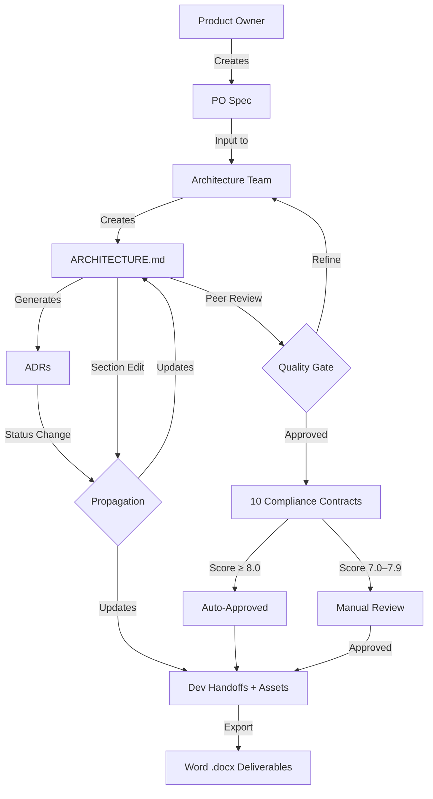

# Solutions Architect Skills

[](https://github.com/shadowx4fox/solutions-architect-skills/releases)
[](LICENSE)
[](https://claude.com/claude-code)

Professional architecture documentation workflow for Claude Code: Transform business requirements into technical architecture, compliance documents, and development handoffs.


## Overview

This Claude Code plugin provides a complete four-phase workflow for enterprise architecture documentation:

```
Phase 1: Business Requirements (PO Spec)
    ↓
Phase 2: Technical Architecture (ARCHITECTURE.md)
    ↓
Phase 3: Compliance Documents (10 contracts)
    ↓
Phase 4: Development Handoff & Export (.md + .docx)
```

## Claude Code Marketplace & Plugin System

This project is distributed as a **Claude Code Plugin** via the **shadowX4fox Marketplace**:

- **Marketplace**: A catalog of available plugins ([Learn more](https://docs.anthropic.com/claude/docs/claude-code-plugins))
- **Plugin**: This repository, installable from the marketplace
- **Skills**: Thirteen specialized skills within the plugin

For detailed information about Claude Code's plugin system, see the [official Claude Code documentation](https://docs.anthropic.com/claude/docs/claude-code).

---

### What's Included

- **14 Integrated Skills**
  - `architecture-readiness`: Requirements Elicitation + Product Owner Specifications
  - `architecture-docs`: ARCHITECTURE.md creation and maintenance (with diagram generation)
  - `architecture-component-guardian`: Single owner of `docs/components/README.md` index + C4 migration
  - `architecture-definition-record`: Create, update, and manage Architecture Decision Records (ADRs)
  - `architecture-compliance`: Generate 10 compliance contracts from ARCHITECTURE.md
  - `architecture-compliance-review`: Compliance portfolio health review + gap explorer playground
  - `architecture-peer-review`: Interactive peer review with playground tool + JSON persistence
  - `architecture-traceability`: PO Spec use cases vs architecture coverage report (markdown, portable)
  - `architecture-analysis`: 10-analysis risk & design-characteristics dashboard (SPOF, Blast Radius, Bottleneck, Cost Hotspots, STRIDE, Vendor Lock-in, Latency Budget, Tech Debt/EOL, Coupling, Data Sensitivity)
  - `architecture-dev-handoff`: Component development handoffs (C4 L2 only) with deliverable assets
  - `architecture-docs-export`: On-demand Word (.docx) export for architecture docs and handoffs
  - `architecture-blueprint`: Business & Application blueprint files (datos de iniciativa) from ARCHITECTURE.md
  - `architecture-onboarding`: Interactive concept map playground for new team members
  - `architecture-icepanel-sync` (beta): Sync C4 model to IcePanel via import YAML or REST API

- **C4 Model Integration (IcePanel)**
  - Components follow C4 Level 2 (Container diagram) rules — every component must be a separately deployable unit (App or Store)
  - 5 architecture types with reference docs + C4 translation guides: Microservices, 3-Tier, N-Layer, META, BIAN
  - C4 L1 systems become folder structure, C4 L2 containers become component files
  - Component guardian enforces C4 boundary test and IcePanel naming conventions (`[Technology in brackets]`)

- **10 Compliance Contracts (CC-001 to CC-010)**
  - Universal generator + 10 domain validators with personality and EOL checks
  - 4-tier approval workflow (Auto-approve, Manual review, Needs work, Rejected)
  - External Validation Summary in every contract
  - EOL-first validation via WebSearch (6-month safety period)

- **Automatic Validation**
  - External validation system (0-10 scoring) for all 10 contracts
  - Template-specific validation configurations
  - Metric consistency checking
  - Design Drivers calculation

- **Optional MCP Integration — [context7](https://context7.com)**
  - Fetches current library/framework documentation during asset generation and component documentation
  - Used by `architecture-dev-handoff` (spec validation for OpenAPI, AsyncAPI, K8s, etc.) and `architecture-docs` (technology context briefs)
  - Fully optional — all skills degrade gracefully without it

- **Complete Documentation**
  - Installation guide, Quick Start tutorial, Workflow guide, Troubleshooting

## Quick Start

### Installation

**See [Installation Guide](docs/INSTALLATION.md) for detailed instructions.**

**Quick Start (Using Marketplace - Recommended):**

```bash
# Step 1: Register marketplace (one-time)
/plugin marketplace add shadowX4fox/solutions-architect-skills

# Step 2: Install plugin
/plugin install solutions-architect-skills@shadowx4fox-solution-architect-marketplace

# Step 3: Verify installation
/plugin list
```

**Alternative: Direct Git Clone**

```bash
# Clone directly to plugins directory
git clone https://github.com/shadowX4fox/solutions-architect-skills.git ~/.claude/plugins/solutions-architect-skills

# Restart Claude Code and verify
/plugin list
```

You should see `solutions-architect-skills v3.5.8` in the list.

**Important:** Marketplace registration is a security feature - you must explicitly add marketplaces before installing plugins. See [docs/INSTALLATION.md](docs/INSTALLATION.md) for detailed setup instructions.

### Optional: Enable context7

[context7](https://context7.com) provides up-to-date library documentation to improve generated assets (OpenAPI specs, K8s manifests, DDL, etc.). Two skills use it when available:

| Skill | Usage |
|-------|-------|
| `architecture-dev-handoff` | Fetches current spec docs (OpenAPI, AsyncAPI, Kubernetes, Protobuf, Avro, DDL, Redis) to validate generated asset syntax |
| `architecture-docs` | Fetches framework docs for technologies in new component files; presents a Technology Context Brief |

**MCP server setup (recommended):**

Add to your Claude Code MCP settings (`~/.claude.json` or project `.mcp.json`):

```json
{
  "mcpServers": {
    "context7": {
      "command": "npx",
      "args": ["@upstash/context7-mcp"]
    }
  }
}
```

**Alternative — automatic setup via CLI:**

```bash
npx ctx7 setup --claude
```

This authenticates via OAuth, generates an API key, and configures context7 automatically.

For headless/remote environments, pass your API key directly:

```bash
npx ctx7 setup --claude --api-key YOUR_API_KEY
```

Generate your API key at the [context7 dashboard](https://context7.com).

> context7 is fully optional. All skills complete successfully without it — no errors or warnings.

### First Workflow

**Phase 1 — Business Requirements (Product Owner)**

```bash
/skill architecture-readiness
```

The skill has 4 modes (ordered by priority):

1. **Async Intake** — provide a file (ticket, email, requirements doc) → gap report with email-ready questions → STOPS (never enters elicitation)
2. **Requirements Elicitation** — guided discovery interview (4 phases):
   - Foundation → Value & Boundaries → Behavior → Experience & Measurement
   - Discovery Summary → draft PO Spec → self-scored to ≥ 7.5/10 → `PRODUCT_OWNER_SPEC.md`
3. **PO Spec Creation** — template-guided document creation
4. **PO Spec Evaluation** — score existing PO Spec (0-10 weighted rubric)

**Phase 2 — Technical Architecture**

```bash
/skill architecture-docs
```

Hand off `PRODUCT_OWNER_SPEC.md` to your architecture team. The skill produces a multi-file structure:

```
ARCHITECTURE.md          ← navigation index (~130 lines)
docs/                    ← all section content
└── components/          ← one file per architectural component
adr/                     ← Architecture Decision Records
```

**Phase 3 — Compliance Documents**

```bash
/skill architecture-compliance
```

Generates 10 compliance contracts from `ARCHITECTURE.md` into `/compliance-docs/`. To remediate gaps found in compliance contracts, use `/skill architecture-docs` — the skill guides you through updating `ARCHITECTURE.md` for each finding.

**Phase 4 — Development Handoff**

```bash
/skill architecture-dev-handoff
```

Generates per-component handoff documents with deliverable assets into `docs/handoffs/`. Produces a 16-section guide per component (API contract, data model, security, observability, acceptance criteria, etc.) plus type-specific assets (OpenAPI specs, DDL scripts, K8s manifests, and more).

**Phase 4.5 — Word Export (optional)**

```bash
/skill architecture-docs-export
```

Exports architecture documents to professional Word (.docx) files: SA executive summary (synthesized from overview + component index + compliance manifest), individual ADRs, or component handoffs.

**Quality Gates (recommended after Phase 2)**

```bash
/skill architecture-peer-review       # Quality review — 3 depth levels, 13 categories, scorecard
/skill architecture-traceability      # PO Spec coverage check — generates TRACEABILITY_REPORT.md
/skill architecture-compliance-review # Portfolio health + concept gap explorer (after Phase 3)
```

### Supporting Skills

| Skill | When to Use |
|-------|-------------|
| `/skill architecture-peer-review` | After ARCHITECTURE.md is complete — interactive quality review with approve/reject/fix workflow (JSON persistence for fast regeneration) |
| `/skill architecture-traceability` | Check if architecture covers all PO Spec requirements — generates portable markdown report |
| `/skill architecture-analysis` | Risk and design-characteristics dashboard — 10 analyses (SPOF, Blast Radius, Bottleneck, Cost Hotspots, STRIDE, Vendor Lock-in, Latency Budget, Tech Debt/EOL, Coupling, Data Sensitivity) run individually or all-ten in parallel |
| `/skill architecture-blueprint` | When organizational blueprint forms (datos de iniciativa) are required |
| `/skill architecture-compliance-review` | After compliance contracts are generated — explore gaps across all 10 contracts |
| `/skill architecture-component-guardian` | Adding, removing, updating components, or migrating flat components to C4 multi-system structure |
| `/skill architecture-definition-record` | All ADR write operations — create, update, supersede |
| `/skill architecture-onboarding` | Onboarding new team members — interactive concept map of the architecture suite |
| `/skill architecture-icepanel-sync` | Sync architecture C4 model to IcePanel (beta) |

## Features

### Phase 1: Architecture Readiness (Product Owner)

Create comprehensive Product Owner Specifications before technical design begins. Includes a structured discovery interview when starting from scratch.

**Key Features:**
- **Requirements Elicitation** — 4-phase guided discovery interview (Foundation → Value & Boundaries → Behavior → Experience & Measurement)
  - Probing techniques: scenario walking, quantification, negative probing, assumption surfacing
  - Industry defaults when PO is unsure; unknowns logged as Open Questions
  - Discovery Summary checkpoint before drafting; self-scoring gap loop until ≥7.5
- **Async Intake** — file-based requirements extraction from tickets, emails, or documents
  - Scores input against the PO Spec rubric (same 8 sections, same weights)
  - Produces `PO_SPEC_GAP_REPORT.md` with ready-to-send questions per gap, prioritized by section weight
  - No interactive interview — output is a written gap report the architect forwards to the requester
  - If score ≥ 7.5, also drafts `PRODUCT_OWNER_SPEC.md` automatically
- 8-section template (Business Context, User Personas, Use Cases, Success Criteria, etc.)
- Weighted scoring methodology (0-10 scale)
- Readiness threshold: ≥7.5 for architecture handoff
- Focus: Business requirements, no technical implementation
- Bilingual interview support (language auto-detected from user's first message)

**Output:** `PRODUCT_OWNER_SPEC.md`

### Phase 2: Architecture Documentation

Create and maintain technical architecture documentation following enterprise standards.

**Key Features:**
- **Multi-file structure** — `ARCHITECTURE.md` at project root is a navigation index (~130 lines); all content lives in `docs/` as numbered section files; components in `docs/components/` (one file per component); see [RESTRUCTURING_GUIDE.md](skills/architecture-docs/RESTRUCTURING_GUIDE.md)
- **5 architecture types** with reference docs + C4 translation guides:
  - `STANDARD`: Microservices (1), 3-Tier (2), N-Layer (3)
  - `ENTERPRISE`: META (4), BIAN (5)
- **C4 component process**: C4 L1 systems → confirm → select focus system → C4 L2 boundary test → create component files
- Interactive Mermaid diagrams in `docs/03-architecture-layers.md`
- Metric consistency validation across document
- Design Drivers calculation (Value Delivery %, Scale, Impacts)
- 9 mandatory Architecture Principles + 1 optional
- ADR (Architecture Decision Record) templates with automatic file generation
- **Foundational Context Anchor Protocol** — dependency-aware editing workflow that loads required upstream context before any downstream section edit
- **Downstream Documentation Propagation** — after any substantive section edit, detects affected downstream files via reverse dependency table, presents a user-approval checklist, and cascades updates in tier order following the Context Anchor Protocol
- All files kept under ~400 lines each for context efficiency

**Output structure:**
```
<project-root>/
├── ARCHITECTURE.md          (~130 lines — navigation index only)
├── adr/                     (ADR files — canonical 10-section template)
└── docs/
    ├── 01-system-overview.md
    ├── 02-architecture-principles.md
    ├── 03-architecture-layers.md
    ├── 04-data-flow-patterns.md
    ├── 05-integration-points.md
    ├── 06-technology-stack.md
    ├── 07-security-architecture.md
    ├── 08-scalability-and-performance.md
    ├── 09-operational-considerations.md
    └── components/
        ├── README.md                (5-column index grouped by system)
        ├── <system-name>.md         (C4 L1 system descriptor)
        └── <system-name>/           (C4 L1 folder per system)
            └── NN-<name>.md         (C4 L2 containers inside system folder)
```

Each component file includes a **C4 metadata header**: Type, Technology `[in brackets]`, C4 Level, Deploys as, Communicates via. All architectures use **grouped tables** with `### System Name` headers in README.md.

#### Peer Review (Quality Gate)

Use `/skill architecture-peer-review` after ARCHITECTURE.md is complete, before handing off to compliance.

- **3 depth levels**: Light (22 checks), Medium (44 checks), Hard (82 checks)
- **13 review categories** with weighted 0–10 scoring: Structural Completeness, Naming & Conventions, Section Completeness, Content Coherence, Technology Alignment, Integration Soundness, Metric Realism, Scalability Design, Security Posture, Performance Design, Operational Readiness, ADR Quality, Trade-off Honesty
- **Interactive HTML playground** — approve/reject/comment on each finding, live scorecard
- **Fix prompt generation** — copy approved findings as a structured prompt to apply changes via `architecture-docs`

**Output:** Interactive HTML peer review file (`architecture-peer-review-YYYY-MM-DD.html`) + scored findings

#### Blueprint Generation

Use `/skill architecture-blueprint` when organizational blueprint forms are required.

- **Business blueprint** (`BLUEPRINT_BUSINESS_EN.md` / `BLUEPRINT_BUSINESS_ES.md`) — fills the "Datos de la Iniciativa" organizational template (business domain, strategy, deployment location, team roles)
- **Application blueprint** (`BLUEPRINT_APPLICATION_EN.md` / `BLUEPRINT_APPLICATION_ES.md`) — fills an application-level template (Design Drivers, Architecture Decisions, Capacity Sizing, Compliance Approvals)
- **Language auto-detection** — reads `docs/01-system-overview.md`, selects matching EN or ES template
- **NOT FOUND handling** — fields not found in architecture docs are marked `NOT FOUND` with a recommended keyword or section to add the missing data
- Bilingual (ES/EN) with explicit language override support

**Output location:** same directory as `ARCHITECTURE.md`

#### Architecture Type Selection & C4 Model

When creating a new architecture, the user selects from 5 types. Each type comes with two reference documents that govern the architecture and component structure:

```
📐 Architecture Type Selection

── Industry Standard ─────────────────────────────
  1. Microservices    STANDARD  RECOMMENDED
  2. 3-Tier           STANDARD
  3. N-Layer          STANDARD

── Enterprise / Domain-Specific ──────────────────
  4. META             ENTERPRISE
  5. BIAN             ENTERPRISE  BANKING
```

Each type loads:
- **Section 4 + 5 templates** — structure and component format
- **Architecture Rules** (`references/{TYPE}-ARCHITECTURE.md`) — defines the pattern, layers, principles
- **C4 Translation** (`references/{TYPE}-TO-C4-TRANSLATION.md`) — maps the architecture to C4 levels

Types without both reference docs are **greyed out** and cannot be selected.

After type selection, the C4 component process runs:

```
Step 4a: C4 Level 1 — Identify systems → confirm with user
Step 4b: C4 Level 2 — Confirm focus system
Step 4c: C4 Level 2 — Identify containers per system (boundary test)
Step 4d: Create component files with C4 metadata headers
Step 4e: Create README.md index (5-column, grouped by system)
```

### Phase 3: Compliance Documentation

Generate compliance contracts from ARCHITECTURE.md with full traceability. Each contract follows the `CC-NNN` naming convention for consistent identification.

**Key Features:**
- **1 universal generator** reads domain config at runtime — no per-domain agents
- **10 domain validators** with personality, EOL checks (WebSearch), and standard validation
- **EOL-first validation**: Technology versions checked against endoflife.date before any compliance scoring (6-month safety period)
- **Automatic Validation (0-10 scoring)**: All contracts validated with granular scoring
- **4-Tier Approval Workflow**: Auto-approve (8.0-10), Manual review (7.0-7.9), Needs work (5.0-6.9), Rejected (0-4.9)
- **External Validation Summary**: Standardized section in every contract referencing the validator agent
- Compliance manifest (index of all generated documents)

**Output:** `/compliance-docs/` with contracts named `CC-NNN-{type}_{project}_{date}.md`

#### Compliance Contract Types

| CC Code | Contract Type | Validator | Focus | Requirements |
|---------|--------------|-----------|-------|-------------|
| CC-001 | Business Continuity | Aegis | RTO/RPO, DR, backup, resilience | 43 LACN |
| CC-002 | Cloud Architecture | Atlas | Deployment model, provider, IaC, security | 6 LAC |
| CC-003 | Data & AI Architecture | Mnemosyne | Data governance, AI/ML, privacy | 11 LAD/LAIA |
| CC-004 | Development Architecture | Hephaestus | Tech stack, EOL validation, coding standards | 2 LADES |
| CC-005 | Enterprise Architecture | Athena | Strategic alignment, governance | 7 LAE |
| CC-006 | Integration Architecture | Iris | API standards, message patterns | 7 LAI |
| CC-007 | Platform & IT Infrastructure | Vulcan | Environments, databases, capacity | 9 LAPI |
| CC-008 | Process Transformation | Hermes | Automation, efficiency, ROI | 4 LAA |
| CC-009 | Security Architecture | Argus | Auth, encryption, vulnerability mgmt | 8 LAS |
| CC-010 | SRE Architecture | Prometheus | SLOs, observability, incident mgmt | 57 LASRE |

#### Compliance Generation Architecture

The system uses a **two-phase parallel execution** model: validators run first (with domain personality and WebSearch for EOL), then a single universal generator is invoked 10 times with each validator's results.

```
                    ┌─────────────────────────────┐
                    │   architecture-compliance    │
                    │       (orchestrator)         │
                    └──────────┬──────────────────┘
                               │
              Phase 1: Spawn 10 validators (parallel)
                               │
         ┌─────────────────────┼─────────────────────┐
         ▼                     ▼                     ▼
  ┌──────────────┐   ┌────────────────┐   ┌────────────────┐
  │ Aegis        │   │ Hephaestus     │   │ Prometheus      │
  │ (BC, 16 items│   │ (Dev, 26 items │   │ (SRE, 25 items │  ...×10
  │  + EOL)      │   │  + EOL via     │   │  + EOL)        │
  │              │   │  WebSearch)    │   │                │
  └──────┬───────┘   └──────┬─────────┘   └──────┬─────────┘
         │                  │                    │
         ▼                  ▼                    ▼
  VALIDATION_RESULT  VALIDATION_RESULT    VALIDATION_RESULT
         │                  │                    │
         │   Phase 2: Spawn 1 generator ×10 (parallel)
         │          (with results in prompt)
         │                  │                    │
         ▼                  ▼                    ▼
  ┌─────────────────────────────────────────────────────┐
  │         compliance-generator (universal)             │
  │                                                      │
  │  Reads config: agents/base/configs/{type}.json       │
  │  Loads template: cc-NNN-{type}.template.md           │
  │  Parses VALIDATION_RESULT from prompt                │
  │  Fills template placeholders                         │
  │  Writes contract to compliance-docs/                 │
  └──────────────────────────┬──────────────────────────┘
                             │
                             ▼
  ┌─────────────────────────────────────────────────────┐
  │              compliance-docs/                        │
  │  CC-001-business-continuity_Project_2026-03-29.md   │
  │  CC-004-development-architecture_Project_2026-03-29.md │
  │  CC-010-sre-architecture_Project_2026-03-29.md      │
  │  ...                                                 │
  │  COMPLIANCE_MANIFEST.md                              │
  └─────────────────────────────────────────────────────┘
```

#### How It Works: CC-004 Development Example

```
  Orchestrator                Hephaestus Validator           Universal Generator
  ───────────                 ────────────────────           ───────────────────
       │                            │                              │
       │── spawn validator ────────►│                              │
       │                            │                              │
       │                     Phase 1: EOL Gathering                │
       │                     ├─ WebSearch: "Java 17 EOL"           │
       │                     ├─ WebSearch: "Spring Boot 3.2 EOL"   │
       │                     ├─ WebSearch: "Angular 19 EOL"        │
       │                     └─ Build EOL lookup table             │
       │                                                           │
       │                     Phase 2: Stack Validation (26 items)  │
       │                     ├─ DEV-01: Java 17 → PASS (2030)     │
       │                     ├─ DEV-02: Spring 3.2 → FAIL (EOL)   │
       │                     ├─ DEV-13: Angular 19 → FAIL (<6mo)  │
       │                     └─ ...26 items with EOL evidence      │
       │                            │                              │
       │◄── VALIDATION_RESULT ──────┘                              │
       │                                                           │
       │── spawn generator (contract_type: development) ──────────►│
       │   + VALIDATION_RESULT in prompt                           │
       │                                                           │
       │                                       Read config JSON    │
       │                                       Load template       │
       │                                       Parse VALIDATION_RESULT
       │                                       Fill placeholders   │
       │                                       Write CC-004-*.md   │
       │                                                           │
       │◄── contract written ──────────────────────────────────────┘
       │
       │── post-generation pipeline (scoring, manifest)
```

**Key principles:**
- **Validators own the personality and domain knowledge** — they frame evidence, deviations, and recommendations
- **The generator is a pure template-filler** — no domain logic, reads everything from config + VALIDATION_RESULT
- **EOL is a blocking condition** — approved + EOL = FAIL (6-month safety period via WebSearch)
- **Every contract has a standardized External Validation Summary** referencing its validator

#### Compliance Review (Quality Gate)

Use `/skill architecture-compliance-review` after contracts are generated to understand what ARCHITECTURE.md improvements would push contracts to auto-approve (≥8.0/10).

- **Coverage validation**: Checks all 10 required contracts are present and ≤6 months old
- **Gap extraction**: Reads every contract's compliance summary table and extracts Non-Compliant and Unknown requirements
- **Concept clustering**: Groups gaps across contracts by underlying ARCHITECTURE.md concept (load testing, DR/RTO, IAM, observability, etc.) ranked by cross-contract impact
- **Interactive HTML playground** — portfolio health panel + concept cluster gap explorer

### Architecture Analysis (Risk & Design Dashboard)

Use `/skill architecture-analysis` to run risk and design-characteristics analyses over the architecture documentation — the kind of assessments that come out of a release-readiness review, pre-incident audit, or annual architecture review.

**10 analyses** across two groups, each producing a date-stamped report in `analysis/`. Run individually, by group (1–5 or 6–10), or all ten in parallel via a single-message parallel spawn.

#### HIGH-priority (runtime / security risk)

| # | Analysis | Key output | Invocation |
|---|----------|-----------|-----------|
| 1 | **SPOF** — Single Points of Failure | Critical (C) / Degradation (D) / Operational (O) tables + ASCII heat map (Impact × Likelihood) + Top-5 remediations | `/skill architecture-analysis` → `1` |
| 2 | **Blast Radius** — Downstream cascade impact | S1–S4+Isolated severity tiers, fan-out depth (direct+indirect), cascade vs. bulkhead vs. fail-open, Mermaid cascade path flowcharts for top-3 worst scenarios, ⚡ SPOF+Blast cross-reference | `2` |
| 3 | **Bottleneck** — Throughput chokepoints | B1–B4 tier model (B1=critical chokepoint), capacity metrics table (Max RPS / HPA / connection pool / queue depth), ASCII capacity headroom bar chart, ADR-driven bottleneck tracking | `3` |
| 4 | **Cost Hotspots** — Cost concentration | Q1–Q4 cost quality tiers, Pareto 80% rule, over-provisioning candidates, vendor concentration (≥60% flag), normalization to USD/month, ADR cost decision table | `4` |
| 5 | **STRIDE** — Security threats per trust boundary | Trust boundary inventory (TB-xx), per-boundary S/T/R/I/D/E matrix, High-Priority Threats table, compliance cross-reference with `compliance-docs/SECURITY_*.md` | `5` |

#### Strategic / sustainability

| # | Analysis | Key output | Invocation |
|---|----------|-----------|-----------|
| 6 | **Vendor Lock-in** — Portability risk | L1 (locked) / L2 (lock-prone) / L3 (portable) tiers, per-vendor concentration table (≥60% flag), exit cost ranking (proprietary surface × replacement effort × data export), heat map (lock severity × strategic importance) | `6` |
| 7 | **Latency Budget** — Per-hop SLO decomposition | Per-flow p95 decomposition into hops (Within / Tight / Over Budget / Untracked), ASCII Gantt-style budget bars per flow, Hops Over Budget summary, tail-latency variance flag (p99/p95 > 3×) | `7` |
| 8 | **Tech Debt / EOL** — Technology currency | T1 (EOL now) / T2 (EOL ≤6mo) / T3 (deprecated) / T4 (current) / T5 (unknown) tiers, EOL Hotlist, deprecated SDK keyword scan, ADR architectural debt table (superseded ADRs whose replacement is not implemented), heat map (severity × effort) | `8` |
| 9 | **Coupling** — Fan-in/fan-out, cycles | Fan-in (Ca) / Fan-out (Ce) / Instability (I = Ce/(Ca+Ce)) per component, K1 critical hubs (fan-in ≥5) / K2 volatile leaves (fan-out ≥5) / K3 god objects (both) / K4 cycles with Mermaid subgraphs, ASCII distribution histograms | `9` |
| 10 | **Data Sensitivity** — PII flow & encryption gaps | S1–S4 data classification per store/queue/cache, G1 (unencrypted transit) / G2 (unencrypted at rest) / G3 (retention breach) / G4 (cross-boundary leakage) / G5 (undocumented) gaps, Mermaid sequence diagrams for top-3 S1 flows, compliance cross-reference | `10` |

**Key principles:**
- **Documentation Fidelity Rule** — every finding cites the source file and section; ungrounded findings are marked `[NOT DOCUMENTED — add to <source-file>]` rather than estimated
- **Parallel spawn** — all selected agents issue in a single message (no serial bottleneck)
- **Date-stamped output** — `analysis/<TYPE>-<YYYY-MM-DD>.md`; re-running same day overwrites, new day preserves history

**Output location:** `analysis/` at project root

**Permissions required** (add to `.claude/settings.json`):
```json
"Write(analysis/*)", "Read(analysis/*)", "Bash(mkdir *)", "Agent(solutions-architect-skills:architecture-analysis-agent)"
```

### Phase 4: Development Handoff & Export

#### Dev Handoff

Use `/skill architecture-dev-handoff` when handing off a component to the development team for implementation.

**Key Features:**
- **16-section handoff document** per component — metadata, overview, scope, API contract, data model, integrations, security, performance, configuration, observability, error handling, technology constraints, acceptance criteria, ADRs, deliverable assets, open questions
- **8 component-type-specific assets**:

| Component Type | Asset Generated |
|---------------|-----------------|
| API / REST / Service | `openapi.yaml` (OpenAPI 3.1) |
| Database / Data Store | `ddl.sql` (DDL with tables, indexes, constraints) |
| Redis / Cache | `redis-key-schema.md` (key patterns, TTL, eviction, fail-open) |
| Kubernetes workload | `deployment.yaml` (Deployment + Service + HPA) |
| Message Consumer/Producer | `asyncapi.yaml` (AsyncAPI 3.0) |
| Kafka + Avro | `schema.avsc` (Avro schema for Schema Registry) |
| Kafka + Protobuf | `schema.proto` (Protobuf message definition) |
| Scheduled Job | `cronjob.yaml` (Kubernetes CronJob) |

- **Gap detection** — fields not found in architecture docs are marked `[NOT DOCUMENTED]` and listed in Section 15 as a remediation checklist
- **Compliance enrichment** — if `compliance-docs/` exists, security/SRE/development contract gaps are surfaced in relevant sections
- **Managed index** at `docs/handoffs/README.md` — 6-column table tracking all handoff docs

**Output location:** `docs/handoffs/NN-<component-name>-handoff.md` + `docs/handoffs/assets/NN-<component-name>/`

#### Doc Export

Use `/skill architecture-docs-export` when professional Word deliverables are needed.

| Mode | What it exports | Output |
|------|----------------|--------|
| **Solution Architecture** | Executive Summary synthesized from `docs/01-system-overview.md` + component index + compliance manifest (if present), plus one `.docx` per ADR | `exports/SA-<name>.docx` + `exports/ADR-NNN-<title>.docx` |
| **Dev Handoff** | Selected component handoff(s) from `docs/handoffs/` | `exports/HANDOFF-<component>.docx` |

**Document styling**: Corporate blue (`#1F4E79`) for SA, Amber/Gold (`#8B6914`) for ADRs, Teal (`#0D7377`) for handoffs.

**Output location:** `exports/` at project root

## Architecture Types & Visualization

### 5 Supported Architecture Types

Choose the architecture type that best fits your system:

**1. META (6-Layer Enterprise)** - Large enterprise systems with complex integrations
- Layers: Channels → UX → Business Scenarios → Business → Domain → Core
- Best for: Financial services, regulated industries, enterprise platforms
- Template: Section 4 META with BIAN V12.0 alignment
- **BIAN Standard**: Full V12.0 compliance with 12 metadata fields
- **Layer 5 Enhancement**: Matches BIAN Layer 4 comprehensiveness with complete service domain metadata

**2. 3-Tier (Classic Web Application)** - Standard web applications and REST APIs
- Tiers: Presentation → Application/Business Logic → Data
- Best for: Web apps, line-of-business applications, standard CRUD systems
- Template: Section 4 3-Tier with tier separation enforcement

**3. Microservices (Cloud-Native)** - Distributed systems with independent services
- Components: API Gateway, Service Mesh, Event Bus, independent services
- Best for: Cloud-native systems, event-driven architectures, polyglot environments
- Template: Section 4 Microservices with service catalog

**4. N-Layer (DDD/Clean Architecture)** - Flexible custom patterns
- Patterns: Classic DDD (4-Layer), Extended (5-Layer), Clean Architecture
- Best for: Domain-Driven Design, Hexagonal Architecture, testable systems
- Template: Section 4 N-Layer with dependency inversion

**5. BIAN (Full BIAN V12.0 Certification)** - Pure BIAN Service Landscape architecture
- Layers: Channels → BIAN Business Scenarios → BIAN Business Capabilities → BIAN Service Domains → Core Systems
- Best for: Banking, financial services requiring full BIAN certification
- Template: Section 4 BIAN and Section 5 BIAN with comprehensive metadata
- **Compliance**: Mandatory full BIAN V12.0 compliance (12 metadata fields, 7 standard operations)
- **Validation**: All service domain names validated against official [BIAN Service Landscape V12.0](https://bian.org/servicelandscape-12-0-0/views/view_51891.html)
- **Traceability**: Full BIAN hierarchy (Service Domain → Business Domain → Business Area)

**How to Choose**: See [ARCHITECTURE_TYPE_SELECTOR.md](skills/architecture-docs/templates/ARCHITECTURE_TYPE_SELECTOR.md) for decision tree and comparison matrix.

### Diagram Generation & Enforcement (Workflow 8)

Architecture diagrams are generated by the `architecture-docs` skill with strict placement enforcement. All diagrams adapt their grouping, naming, and colors to the detected architecture type (META, BIAN, 3-Tier, N-Layer, Microservices) and support light/dark theme variants.

**Mandatory diagrams** (always generated, 4 standard + data flow):

All 4 standard diagrams live in `docs/03-architecture-layers.md` under `## Architecture Diagrams`:

| # | Diagram | Format | Audience |
|---|---------|--------|----------|
| 1 | Logical View | ASCII art | Executives, architects |
| 2 | C4 Level 1 — System Context | Mermaid `C4Context` | Non-technical stakeholders |
| 3 | C4 Level 2 — Container | Mermaid `C4Container` | Development teams |
| 4 | Detailed View | Mermaid `graph TB` | Architects, SREs |

Plus **Data Flow Diagrams** — one Mermaid **ZenUML** sequence diagram per H3 flow subsection in `docs/04-data-flow-patterns.md`. ZenUML provides code-like readability with method-call syntax for sync, arrow syntax for async, and native `if/else`/`try/catch`/`par` control flow.

**On-request diagrams** (opt-in):
- Infrastructure / Deployment → `docs/09-operational-considerations.md`
- HA / Failover + Performance → `docs/08-scalability-and-performance.md`
- Integration → `docs/05-integration-points.md`
- Security → `docs/07-security-architecture.md`

**Enforcement rules**:
- ⛔ Non-canonical placement is **denied** — diagrams go to their designated `docs/` file, no override
- 🎨 **Theme selection** — user must choose light or dark theme before diagram generation; persisted as `<!-- DIAGRAM_THEME: light|dark -->`
- 📥 **External diagram reconciliation** — diagrams from external files are classified, matched against architecture docs, and either relocated or discarded (no undocumented flows)
- 📊 **Completeness audit** — after generation, every documented flow is checked for a corresponding diagram; all 4 standard diagrams verified present
- 🚫 **Semicolon in labels is forbidden** — `;` terminates Mermaid/ZenUML statements and causes parse errors; use `,` instead

**Target**: Mermaid v11.4.1 (VS Code Mermaid Chart extension 2.1.0+).

**Comprehensive Guide**: See [DIAGRAM-GENERATION-GUIDE.md](skills/architecture-docs/references/DIAGRAM-GENERATION-GUIDE.md) for the 4 standard diagrams with architecture-type-specific templates, C4 color conventions, ZenUML syntax reference, and generation workflow. See [MERMAID_DIAGRAMS_GUIDE.md](skills/architecture-docs/MERMAID_DIAGRAMS_GUIDE.md) for authoring reference (syntax patterns, component guidelines, common scenarios).

## Documentation

- **[Installation Guide](docs/INSTALLATION.md)** - Detailed installation instructions
- **[Quick Start](docs/QUICK_START.md)** - 5-minute getting started tutorial
- **[Workflow Guide](docs/WORKFLOW_GUIDE.md)** - Complete end-to-end workflow
- **[Troubleshooting](docs/TROUBLESHOOTING.md)** - FAQ and common issues

## Examples

### Real-World Example Repository

**[Task Scheduling Platform Example](https://github.com/shadowX4fox/task-scheduling-example)**

Complete end-to-end demonstration of the four-phase workflow:

**Phase 1: Product Owner Specification**
- Business requirements and user personas
- Use cases and success criteria
- Weighted readiness scoring (8.3/10)

**Phase 2: Technical Architecture (ARCHITECTURE.md)**
- Multi-file structure: navigation index + `docs/` section files + `docs/components/`
- Microservices architecture pattern
- Interactive Mermaid diagrams in `docs/03-architecture-layers.md`
- Technology stack documentation
- Complete with metrics, SLOs, and ADRs

**Phase 3: Compliance Documentation**
- All 10 generated compliance contracts with validation
- Development Architecture with 26-item stack validation
- Security, Cloud, SRE, and Enterprise Architecture contracts
- Full source traceability to ARCHITECTURE.md

**Phase 4: Development Handoff**
- Per-component handoff documents with deliverable assets
- Type-specific scaffolded artifacts (OpenAPI, DDL, K8s manifests)

**Repository**: https://github.com/shadowX4fox/task-scheduling-example

---

**Additional Examples in This Repository:**

The `examples/` directory contains reference templates:

- **PRODUCT_OWNER_SPEC_example.md** - PO Spec template (Job Scheduling Platform)
- **ARCHITECTURE_example.md** - Full ARCHITECTURE.md example (multi-file structure: navigation index + `docs/` section files)

---

**Want More Examples?**

To request specific examples or use cases, [open an issue](https://github.com/shadowX4fox/solutions-architect-skills/issues/new).

## Requirements

- **Claude Code** (latest version)
- **Bun** (v1.0.0 or later) - Required for compliance generation and template validation
- **Platform:** macOS, Linux, or Windows

### Why Bun?

The architecture-compliance skill uses Bun for:
- Template expansion with `@include` directives
- Pre-validation of template structure (Phase 4.1)
- Post-validation of generated contracts (Phase 4.6)
- High-performance TypeScript execution

**Installation:** See [INSTALLATION.md](docs/INSTALLATION.md#installing-bun) for Bun setup instructions.

## Recommended VS Code Setup

For the best experience working with this plugin, install these VS Code extensions:

| Extension | Publisher | Purpose |
|-----------|-----------|---------|
| [Claude Code for VS Code](https://marketplace.visualstudio.com/items?itemName=anthropic.claude-code) | Anthropic | Run Claude Code skills directly from the editor |
| [Mermaid Chart](https://marketplace.visualstudio.com/items?itemName=MermaidChart.vscode-mermaid-chart) | Mermaid Chart | Live preview of Mermaid diagrams (v11.4.1) with pan, zoom, and export |

### Why these extensions?

- **Claude Code** is required to run the plugin's 9 skills from VS Code
- **Mermaid Chart** lets you validate architecture diagrams (`docs/*.md`) in real-time as they are generated — supports native C4 diagrams, sequence diagrams, and all diagram types used by this plugin

## Use Cases

Perfect for:
- Enterprise architects documenting solution designs
- Product Owners preparing requirements for architecture teams
- Compliance teams generating organizational contracts
- Technical leads maintaining architecture documentation
- Development teams receiving component handoffs for implementation
- Teams needing standardized architecture workflows

## Workflow Integration


```mermaid
graph TD
    A[Product Owner] -->|Creates| B[PO Spec]
    B -->|Input to| C[Architecture Team]
    C -->|Creates| D[ARCHITECTURE.md]
    D -->|Generates| L[ADRs]
    L -->|Status Change| M{Propagation}
    D -->|Section Edit| M
    M -->|Updates| D
    M -->|Updates| J
    D -->|Peer Review| E{Quality Gate}
    E -->|Approved| F[10 Compliance Contracts]
    E -->|Refine| C
    F -->|Score ≥ 8.0| G[Auto-Approved]
    F -->|Score 7.0–7.9| H[Manual Review]
    G --> J[Dev Handoffs + Assets]
    H -->|Approved| J
    J -->|Export| K[Word .docx Deliverables]
```

## External Validation System

All 10 compliance contracts use an **external validation system** with standardized 0-10 scoring:

### Validation States & Scoring
- ✅ **PASS (10 points)**: Complies with requirements
- ❌ **FAIL (0 points)**: Non-compliant or deprecated technology
- ⚪ **N/A (10 points)**: Not applicable to this architecture
- ❓ **UNKNOWN (0 points)**: Missing data in ARCHITECTURE.md
- 🔓 **EXCEPTION (10 points)**: Documented exception via LADES2 process

### Scoring Formula
```
Final Score = (Completeness × 0.4) + (Compliance × 0.5) + (Quality × 0.1)

Where:
- Completeness = (Filled required fields / Total required) × 10
- Compliance = (PASS + N/A + EXCEPTION items / Total applicable) × 10
- Quality = Source traceability coverage (0-10)
```

### Approval Workflow
| Score | Status | Review Actor | Outcome |
|-------|--------|--------------|---------|
| 8.0-10.0 | Approved | System (Auto-Approved) | Ready for implementation |
| 7.0-7.9 | In Review | [Approval Authority] | Manual review required |
| 5.0-6.9 | Draft | Architecture Team | Address gaps before review |
| 0.0-4.9 | Rejected | N/A (Blocked) | Cannot proceed to review |

### Validation Configuration
- **10 JSON config files**: One per contract type in `/skills/architecture-compliance/validation/`
- **Template-specific weights**: Each contract can customize Completeness/Compliance/Quality weights
- **Validation schema**: `VALIDATION_SCHEMA.json` defines standard structure
- **Example scenarios**: `VALIDATION_EXAMPLES.md` shows all 4 outcome tiers

## Roadmap

### v3.5.8 (Current Release) ✅
**chore: all 13 sub-agents migrated to `model: opus` (Claude Opus 4.7)**

All sub-agent files under `agents/` switched from `model: sonnet` to `model: opus`. On the Anthropic API the `opus` alias currently resolves to Claude Opus 4.7 (1M context window).

**Agents migrated (13 total):**
- `agents/compliance-generator.md`, `agents/peer-review-category-agent.md`, `agents/architecture-analysis-agent.md`
- 10 domain validators under `agents/validators/` — business-continuity, cloud, data-ai, development, enterprise, integration, platform, process, security, sre

**Rationale:** Stronger reasoning improves compliance contract fidelity (template preservation + placeholder extraction), peer-review nuance across 13 category checks, validator evidence extraction with Grep-based citation, and architecture-analysis classification across the 10 risk/design lenses. The 1M context window removes split-read constraints previously planned for large ARCHITECTURE.md suites.

**Skills unchanged (14 total):** All skill orchestration patterns (parallel agent spawning, template-filling, structured output blocks) are natively supported by Opus 4.7. Skill frontmatter continues to inherit model selection from the calling session — no SKILL.md changes.

### v3.5.2 (Previous Release) ✅
**docs: architecture-analysis full README documentation — 14-skill count, analysis tables, features section**

Complete README documentation for the `architecture-analysis` skill: version badge corrected to 3.5.1/3.5.2, skills count updated from 13 to 14, `architecture-analysis` added to the skills list with a 10-analysis summary, added to the Supporting Skills table, installation verification line updated, and a full Architecture Analysis features section added between Phase 3 Compliance and Phase 4 Dev Handoff documenting all 10 analyses (both groups) with per-analysis output tables, key principles, output location, and required permissions.

### v3.5.1 (Previous Release) ✅
**feat: architecture-analysis — 5 additional analyses (Vendor Lock-in, Latency Budget, Tech Debt, Coupling, Data Sensitivity)**

Extends the `architecture-analysis` skill from 5 to 10 analyses. The dispatcher menu grows to 11 options (10 individual + "All ten"), with grouped sections for HIGH-priority and Strategic/sustainability analyses. Range selection (e.g., "6-10") and group selection ("all") are supported. All ten analyses spawn in a single message via parallel `Task()` calls.

**New analyses:**
- **Vendor Lock-in** — L1 (locked) / L2 (lock-prone) / L3 (portable) classification per component/capability, per-vendor concentration table (≥60% flag), exit cost ranking (proprietary surface × replacement effort × data export feasibility), lock severity × strategic importance heat map
- **Latency Budget** — per-flow p95 SLO decomposition into hops, Within Budget / Tight / Over Budget / Untracked classification per hop, ASCII Gantt-style budget bars, tail-latency variance flag (p99/p95 > 3×), Hops Over Budget summary table
- **Tech Debt / EOL** — T1 (EOL now) / T2 (EOL ≤6mo) / T3 (deprecated) / T4 (current) / T5 (unknown) currency tiers, EOL Hotlist table, deprecated SDK scan, ADR architectural debt table (Superseded ADRs whose replacement is not yet implemented), severity × effort heat map
- **Coupling** — per-component fan-in (Ca), fan-out (Ce), instability (I = Ce/(Ca+Ce)) metrics, K1 critical hubs (fan-in ≥5) / K2 volatile leaves (fan-out ≥5) / K3 god objects (both) / K4 cyclical dependencies with Mermaid cycle subgraphs, ASCII fan-in/fan-out distribution histograms
- **Data Sensitivity** — S1–S4 data classification per store/queue/cache, G1–G5 gap classification (unencrypted transit, at-rest, retention breach, cross-boundary leakage, undocumented), sensitive data flow Mermaid sequence diagrams for top-3 S1 flows, compliance cross-reference to `compliance-docs/SECURITY_*.md` and `DATA_AI_*.md`

**Files added:** `analyses/VENDOR_LOCKIN.md`, `analyses/LATENCY_BUDGET.md`, `analyses/TECH_DEBT.md`, `analyses/COUPLING.md`, `analyses/DATA_SENSITIVITY.md`

**Files modified:** `SKILL.md` (menu + map), `agents/architecture-analysis-agent.md` (enum), `CLAUDE.md` (10-analysis section)

### v3.5.0 (Previous Release) ✅
**feat: architecture-analysis skill — 5 HIGH-priority risk analyses (SPOF, Blast Radius, Bottleneck, Cost Hotspots, STRIDE)**

New `architecture-analysis` skill delivering a risk and design-characteristics dashboard for architects. Five analyses can be run individually or all five in parallel, each producing a date-stamped report in `analysis/` with structured findings, heat maps, and prioritized remediation recommendations. Every finding is grounded in architecture documentation with source citations; missing data is flagged as `[NOT DOCUMENTED]` rather than estimated.

**Analyses:**
- **SPOF** — Critical (full outage) / Degradation (partial-silent) / Operational SPOFs + ASCII heat map + top-5 remediations. Modeled after the worked Notification Inbox Platform v1.2.0 example.
- **Blast Radius** — per-component fan-out and cascade severity, bulkhead vs. cascading classification, Mermaid cascade paths for top-3 worst scenarios, SPOF cross-reference (`⚡ SPOF+Blast` flag for maximum risk concentration)
- **Bottleneck** — throughput chokepoints (B1–B4 tiers), HPA and connection-pool saturation risk, ASCII capacity headroom bar chart, ADR-driven bottleneck tracking
- **Cost Hotspots** — Pareto cost ranking (80% concentration rule), over-provisioning candidates, vendor concentration summary, ADR cost decision table, right-sizing recommendations with trade-off analysis
- **STRIDE** — trust boundary inventory, per-boundary 6-category threat matrix, High-Priority Threats table, compliance cross-reference with security contract gaps

**Files added:**
- `skills/architecture-analysis/SKILL.md` — dispatcher, BLOCKING menu, parallel Task() orchestration
- `skills/architecture-analysis/analyses/` — 5 analysis spec files (SPOF, BLAST_RADIUS, BOTTLENECK, COST_HOTSPOTS, STRIDE)
- `skills/architecture-analysis/templates/analysis-report-skeleton.md` — shared report structure
- `agents/architecture-analysis-agent.md` — universal analysis agent (parameterized by analysis_type)
- `CLAUDE.md` — new "Using the Architecture Analysis Skill" section
- `.claude/settings.json.example` — added `architecture-analysis-agent` + `Write/Read(analysis/*)` permissions

### v3.4.7 (Previous Release) ✅
**fix: architecture release workflow pushes git tag to origin automatically**

After `git tag -a architecture-v{version}` is created, the workflow now immediately pushes the tag to `origin`. Graceful fallbacks: reports (but does not fail) when no remote is configured, and preserves the local tag on push failure with a manual-push hint.

- **`skills/architecture-docs/RELEASE_WORKFLOW.md`**: Step 7.4 rewritten — checks for `origin` remote, pushes the tag, handles no-remote and push-failure cases without deleting the local tag.

### v3.4.6 (Previous Release) ✅
**feat: ADR institutional/user scope with reserved numbering (001–100 / 101+)**

Introduces a first-class `**Scope**` field (`Institutional` | `User`) to all ADRs, with the number range encoding the scope: ADR-001–100 are reserved for organization-wide institutional decisions (Architecture Team), and ADR-101+ are used for project-local user decisions.

- **`skills/architecture-definition-record/SKILL.md`**: Workflow 2 Step 2.1 rewritten as a scope-aware partitioned next-number lookup — asks scope first, then scans existing ADR headers to compute the correct next number in the institutional (001–100) or user (101+) range. Overflow of the institutional range is blocked with a reclassify/supersede/cancel prompt. Workflow 1 updated to extract or infer scope from the ARCHITECTURE.md Section 12 table (Case A: explicit Scope column; Case B: number-range inference with user confirmation). Workflow 5 audit output updated with a Scope column and institutional-range utilization line.
- **`skills/architecture-definition-record/adr/ADR-000-template.md`**: Added `**Scope**: Institutional | User` header field; updated File Naming Convention block with the 001–100 / 101+ partition and annotated examples.
- **`skills/architecture-definition-record/ADR_GUIDE.md`**: New "ADR Scope" subsection explaining the two scope types, their number ranges, and why scope is encoded in the number. Added `**Scope**` to the template block.
- **`CLAUDE.md`**: Added ADR Scope and numbering partition paragraph to the Architecture Definition Record skill section.

### v3.4.4 (Previous Release) ✅
**fix: bidirectional routing disambiguation — architecture-docs-export no longer captures release/publish/tag intent**

Adds a negative disclaimer to `architecture-docs-export/SKILL.md` to complement the v3.4.3 positive-routing fix in `architecture-docs/SKILL.md`. The one-sided fix wasn't sufficient — the export skill's semantic proximity to "produce final output" still caused it to win on "release my architecture". Bidirectional disambiguation makes the routing unambiguous from both sides.

- **`architecture-docs-export/SKILL.md`**: Extended `description:` with explicit NOT-clause covering release/publish/tag/freeze/bump/finalize intent, listing each mis-routed phrase and redirecting to `architecture-docs` Workflow 10. Removed unsupported `triggers:` block (was flagged by VS Code in v3.4.3 diagnostic).
- **`architecture-docs/SKILL.md`** (v3.4.3): Already contains positive routing for all release-intent phrases.

> **Note**: SKILL.md description changes take effect in **new Claude Code sessions only** — the router caches descriptions at session start. After updating, open a fresh Claude Code window before testing.

### v3.4.3 (Previous Release) ✅
**fix: architecture-docs skill routes correctly for release/publish/tag phrasing**

Fixed skill-router mis-routing where "release my architecture" (and related phrasing) fell through to `architecture-docs-export` instead of the correct `architecture-docs` skill (which owns Workflow 10 — architecture version release lifecycle).

- **Root cause**: `architecture-docs/SKILL.md` used an unsupported `triggers:` frontmatter block (flagged by VS Code). The Claude Code router matches against the `description:` field, which did not mention release, publish, tag, freeze, bump, or finalize.
- **Fix**: Removed the unsupported `triggers:` block and extended `description:` to explicitly cover the Draft → Released lifecycle (git tag `architecture-v{version}`, archive snapshot, semver bump) and added a disambiguation clause directing the router away from `architecture-docs-export` for release-intent phrases.
- **Result**: "release my architecture", "publish architecture", "tag architecture version", "freeze architecture", "bump architecture version", "ship architecture", "finalize architecture" now route to `architecture-docs` → Workflow 10.

### v3.4.2 (Previous Release) ✅
**feat: mandatory Description field (≤120 chars) added to all component templates**

All four architecture type templates and the component creation workflow now include a dedicated one-line `**Description:**` field positioned immediately after `**Communicates via:**`:

- **SECTION_5_META.md**: Description field added to all 6 layer templates (L1–L6) and the Mobile Banking App example
- **SECTION_5_3TIER.md**: Description field added to all 3 tier templates and 3 example components (User API Controller, User Service, User Repository)
- **SECTION_5_MICROSERVICES.md**: Description field added to both the microservice and infrastructure templates, and the Order Service example
- **SECTION_5_BIAN.md**: Description field added to all 5 layer templates and 2 example components (Mobile Banking App, Payment Order)
- **ARCHITECTURE_TYPE_SELECTION_WORKFLOW.md**: Creation block updated with `**Description:**` field + enforcement note: mandatory, ≤120 characters, longer prose belongs in **Purpose**

The field provides a structured, length-bounded tagline that downstream tooling (dev handoffs, IcePanel sync, peer review) can consume without re-parsing the free-form Purpose paragraph. Component Guardian index schema is unchanged (5-column fixed table; description lives in the component file only).

### v3.4.1 (Previous Release) ✅
**docs: remove obsolete monolithic ARCHITECTURE.md leftovers from architecture-docs skill**

Full cleanup of "old Document Index + line ranges" pattern that predated the multi-file `docs/NN-*.md` migration:

- **ARCHITECTURE_DOCUMENTATION_GUIDE.md**: Removed old `→ Lines [START]-[END]` index template; rewrote Instructions for Creating the Index for multi-file structure; 3 Design Drivers examples use file-path + section-anchor citations
- **QUERY_SECTION_MAPPING.md**: Deleted 12 `Typical line range: Lines NNN-MMM` entries; rewrote Example Query Mapping Workflow to read `docs/NN-*.md` files in full (no `offset`/`limit`); updated 4 best-practice bullets
- **METRIC_CALCULATIONS.md**: Rewrote entire file — removed Section 1 (Automatic Index Updates); Section 2 (Metric Consistency) now reads `docs/01-system-overview.md` + scans `docs/` instead of using line offsets
- **DESIGN_DRIVER_CALCULATIONS.md**: Replaced "load Document Index + offset" blocks with direct file reads; 4 justification examples use file-path citations; sequential loading strategy rewritten for multi-file
- **REVIEW_AUDIT_WORKFLOW.md**: LOW.5 "Document Index Maintenance" rewritten as "Navigation Index Maintenance"; observations use file paths; 3 line-range warnings updated
- **VALIDATIONS.md**: Section Renumbering Workflow Step 3 rewritten with multi-file navigation table; `grep -n "^## [0-9]" ARCHITECTURE.md` replaced with `ls docs/*.md`; 4 checklist/best-practice entries updated
- **SKILL.md**: "Automatic Index Updates" section rewritten as "Navigation Index Updates" (no line ranges — just add/remove rows when files change)
- **ARCHITECTURE_TYPE_SELECTION_WORKFLOW.md**: 2 Document Index references updated to the multi-file Documentation table format
- **examples/ARCHITECTURE_example_3tier.md**: Added prominent HISTORICAL warning at top marking the monolithic format as obsolete

### v3.4.0 (Previous Release) ✅
**feat: architecture versioning — release baselines, per-component versions, git tag, archive snapshots**

Complete 5-phase versioning system across the architecture docs cycle:

**Phase 1 — Metadata blocks**:
- `ARCHITECTURE.md` header now carries `<!-- ARCHITECTURE_VERSION: X.Y.Z -->` + Status/Released/Architect/Supersedes fields
- Every `docs/components/**/*.md` file has `Component Version` + `Architecture Version` + `Last Updated` after the C4 metadata block
- Updated all 4 Section 5 templates (3-Tier, BIAN, META, Microservices)

**Phase 2 — CHANGELOG**:
- `docs/CHANGELOG.md` auto-created at initial architecture creation with `[1.0.0] - Draft` entry (Keep a Changelog format)

**Phase 3 — Release Workflow (Workflow 10)**:
- New `RELEASE_WORKFLOW.md` with 8-step procedure: read version → detect changes → ask bump type → generate changelog → update all metadata → create annotated git tag → archive snapshot → report
- Semver rules: MAJOR (breaking structural), MINOR (new components/ADRs), PATCH (clarifications)
- Git tag convention: `architecture-v{version}` (namespaced). Refuses to tag on dirty working tree or existing tag
- Version Drift Detection on every skill invocation (doc version vs latest git tag)

**Phase 4 — Downstream integration**:
- All 10 compliance contract templates include `Architecture Version: [ARCHITECTURE_VERSION]` (compliance-generator resolves the placeholder)
- Dev handoff Section 0 Metadata now has `Architecture Version` + `Component Version` rows
- Traceability report header + completion message include the Architecture Version
- Component Guardian auto-updates `Last Updated` on every edit and suggests version bumps (MAJOR/MINOR/PATCH) based on change type

**Phase 5 — Archive snapshots**:
- Immutable `archive/v{version}/` snapshot of ARCHITECTURE.md + docs/ + adr/ + RELEASE_NOTES.md + `.immutable` marker
- **Non-git projects**: archive is created automatically (primary snapshot mechanism)
- **Git projects**: archive is opt-in for regulated industries / audit compliance (git tag is primary)

**Backward compatible**: Architectures without version metadata still work — downstream artifacts use `unversioned` as the value.

### v3.3.26 (Previous Release) ✅
**feat: META WebSocket L1 → L4 exception + mandatory security requirements**

- Documented that L1 (Channels) MAY connect directly to L4 (Business) via WebSocket for real-time push (market data, live alerts, streaming telemetry, trading events) — the standard top-down rule is preserved for all request/response traffic
- Mandatory security stack required on the L4 endpoint when accepting direct WebSocket connections: WSS/TLS 1.2+, token auth re-validated on reconnect, per-message authorization, origin checks, rate limiting, audit logging, input validation on all inbound frames
- Updated: `META-TO-C4-TRANSLATION.md` (Anti-Pattern 6 extended with two explicit exceptions), `SECTION_5_META.md` (Layer 1 + Layer 4 Dependencies blocks), `META-ARCHITECTURE.md` (Layer 1 Key Rules)
- Exception must be captured as an ADR and security controls documented in the L4 component file Section 9

### v3.3.25 (Previous Release) ✅
**fix: Pre-Write Validation control prevents Mermaid parse errors**

- Added Pre-Write Validation section to DIAGRAM-GENERATION-GUIDE.md with 6-row forbidden pattern checklist (HTML tags, semicolons, emoji, pipe, quotes, subgraph arrows)
- Strengthened HTML tag rules: both topology and sequence DO NOT lists now explicitly list `<br/>`, `<br>`, `<b>`, `<i>`, `<sup>`, `<span>` and "any `<...>` element"
- New Step 10.5 in Generation Workflow: validate all Mermaid/ZenUML blocks against forbidden patterns before writing
- Added mandatory Pre-Write Validation block to Step 7.1 in ARCHITECTURE_TYPE_SELECTION_WORKFLOW.md
- Prevents `<br/>`, `;`, emoji, and other parse-breaking patterns from reaching diagram files

### v3.3.24 (Previous Release) ✅
**docs: README updated with latest skill count (13) and diagram generation changes**

- Updated "What's Included" list: 9 → 13 skills (added traceability, onboarding, icepanel-sync, definition-record)
- Rewrote Diagram Generation section: documents 4 standard diagrams (Logical View ASCII, C4 L1, C4 L2, Detailed View) + ZenUML data flow diagrams
- Added architecture-type adaptation note, theme selection enforcement, semicolon prohibition, Mermaid v11.4.1 target
- Supporting Skills table expanded with traceability, definition-record, onboarding, icepanel-sync
- New Quality Gates section highlighting peer-review, traceability, and compliance-review

### v3.3.23 (Previous Release) ✅
**fix: diagram theme selection skipped + semicolon parse error in labels**

- Theme selection (light/dark) during diagram generation was silently defaulting to light instead of asking the user — made the prompt mandatory with "MUST ask, do NOT default silently"
- Added semicolon prohibition to Mermaid compatibility rules — `;` in message/node/edge labels terminates statements causing parse errors; use `,` instead
- Applied to both topology diagrams (graph TB) and data flow diagrams (sequence) sections

### v3.3.22 (Previous Release) ✅
**fix: architecture-docs must delegate all component structural operations to guardian**

- Added Component Operations Delegation Rule to architecture-docs SKILL.md
- All structural operations on `docs/components/` (create, rename, delete, README update, migration, C4 metadata) MUST delegate to architecture-component-guardian
- Architecture-docs may read component files for context but must NOT create, restructure, or modify the component index directly

### v3.3.21 (Previous Release) ✅
**fix: C4 component folder structure missing when using inline PO Spec (option 3)**

- Fixed CLAUDE.md PO Spec gate: listed 3 options but workflow has 4 — numbering mismatch caused "option 2" confusion (inline vs async intake)
- Added CRITICAL reinforcement note at Step 5 entry: C4 Steps 4a-4g are MANDATORY for all PO Spec paths — no skipping system identification or flat file creation
- Added Step 4d-VERIFY structural validation gate before guardian invocation: verifies system folders, component files, and descriptor files exist
- Prevents flat `docs/components/` layout bypassing the required C4 system subfolder structure
- Added missing `triggers:` to architecture-component-guardian (was relying on description-only matching)
- 11 trigger phrases for guardian: `migrate components to C4`, `sync components`, `add component`, etc.
- Added component migration exclusion to architecture-docs "Do NOT activate" list

### v3.3.20 (Previous Release) ✅
**fix: C4 metadata missing from Section 5 template layers/tiers — all architecture types**

- All Section 5 templates now include `**Type:** {C4 type}`, `**C4 Level:** Container (L2)`, `**Deploys as:**`, `**Communicates via:**` in every layer/tier template, not just Layer 1
- Previously only the first layer had C4 metadata; subsequent layers used non-canonical type hints (e.g., `Application Service`, `Scenario Orchestrator`, `BIAN Service Domain`) requiring C4 migration afterward
- Updated: `SECTION_5_3TIER.md` (Tier 2, Tier 3, all 3 examples), `SECTION_5_META.md` (Layers 2–6 + example), `SECTION_5_BIAN.md` (Layers 2–5 + 2 examples), `SECTION_5_MICROSERVICES.md` (infrastructure template + example)
- Fixed stale references in `ARCHITECTURE_TYPE_SELECTION_WORKFLOW.md`: flat component path (`docs/components/NN-name.md` → `docs/components/<system-name>/NN-name.md`) and column count (`4-column` → `5-column` index)

### v3.3.19 (Previous Release) ✅
**fix: traceability triggers use "requirements" prefix to avoid peer-review/docs collision**

- Replaced ambiguous triggers (`architecture deviation`, `deviation check`) with requirements-prefixed phrases: `requirements deviation`, `requirements coverage`, `PO spec deviation`
- Removes collision with peer-review skill ("architecture quality") and architecture-docs skill ("architecture validation")
- Updated architecture-docs exclusion to reference "requirements deviation checks"

### v3.3.18 (Previous Release) ✅
**fix: traceability skill description + architecture-docs exclusion for deviation checks**

- Rewrote traceability skill description to lead with "deviation checks, traceability reports, PO Spec coverage" for stronger signal matching
- Added "Do NOT activate for" section to architecture-docs SKILL.md redirecting deviation/traceability requests to the correct skill
- Prevents architecture-docs from hijacking "architecture deviation check" via its broad "validating/checking" description match

### v3.3.17 (Previous Release) ✅
**fix: traceability skill trigger phrases expanded to prevent architecture-docs skill hijacking**

- Added 7 compound trigger phrases: `architecture deviation`, `architecture deviation check`, `traceability report`, `traceability matrix`, `coverage check`, `PO spec vs architecture`, `check PO spec`
- Previously, "architecture deviation check" was captured by the broader `architecture-docs` skill instead of `architecture-traceability`

### v3.3.16 (Previous Release) ✅
**fix: traceability skill enforces PO Spec "what" vs architecture "how" boundary**

- Added PO Spec Scope Rule: evaluate business capabilities, not implementation paths
- Requirement extraction now strips "how" details (technologies, integration paths) from PO Spec — keeps only business capability as traceable requirement
- Architecture satisfying a requirement via a different path than PO expected is ✅ Covered (not a gap)
- Only flags gaps when the business capability itself is missing from the architecture

### v3.3.15 (Previous Release) ✅
**feat: architecture-traceability skill — PO Spec use cases vs architecture coverage report**

- New `architecture-traceability` skill comparing PO Spec use cases against architecture documentation
- Generates portable `TRACEABILITY_REPORT.md` — designed for tickets, emails, and external platforms
- Per-use-case coverage tables with evidence citations (section + quote)
- Summary statistics with per-phase breakdown and coverage percentages
- Gap Report consolidating all Not Covered and Partial items with suggested architecture sections
- Parses requirements from primary flows, alternative flows, edge cases, preconditions, postconditions, and success metrics

### v3.3.14 (Previous Release) ✅
**fix: suppress false-positive peer review finding on file prefix vs section number offset**

- Added explicit clarification to PEER_REVIEW_CRITERIA.md checks STRUCT-04, NAMING-02, and NAMING-05
- Reviewer agents no longer flag the intentional two-number offset between docs/ file prefixes (01–10) and internal section numbers (S1–S12)
- Offset is by design: S1+S2 share `01-system-overview.md`, S5 uses `docs/components/` (no numbered file)
- Updated: PEER_REVIEW_CRITERIA.md (STRUCT-04, NAMING-02, NAMING-05 "What to Look For" columns)

### v3.3.13 (Previous Release) ✅
**fix: use case count is a complexity indicator, not a hard minimum**

- Reframed use case count across all architecture-readiness scoring and elicitation files
- Previously enforced "minimum 3 use cases" as a hard constraint; now treated as architecture complexity signal
- Simple systems may need 1-2 use cases, complex ones may need 5+ — no fixed minimum
- Updated: PO_SPEC_SCORING_GUIDE.md (evaluation criteria, completeness scoring, gap analysis), REQUIREMENTS_ELICITATION_GUIDE.md (Phase 3 goal, target, phase transition), PRODUCT_OWNER_SPEC_GUIDE.md (scoring prep, self-assessment checklist), SKILL.md (Phase 3 description)

### v3.3.12 (Previous Release) ✅
**fix: NAMING-04 ADR file naming pattern false positive**

- Fixed peer review NAMING-04 check: pattern was `NNN-kebab-case.md` but correct ADR convention is `ADR-NNN-kebab-case.md`
- Previously flagged valid ADR files (e.g., `ADR-001-architecture-type-selection.md`) as incorrectly named

### v3.3.11 (Previous Release) ✅
**perf: persist peer review results as JSON + fast-path playground regeneration**

- Review data now saved to `architecture-peer-review-<date>.json` after each run (Step 6.1)
- New Step 0 fast path: "regenerate playground" reads saved JSON and skips agent evaluation entirely
- Staleness detection: compares source file timestamps to warn if architecture changed since review
- Enables instant playground regeneration without re-running 13 parallel agents (saves 40s-3min)
- JSON schema matches the playground `reviewData` structure exactly — validated with test HTML

### v3.3.10 (Previous Release) ✅
**fix: clean up old compliance contracts before regeneration**

- Added Step 3.2.1 to compliance skill: deletes existing contracts for selected types before spawning generators, preventing stale dated files from accumulating
- Previously, regenerating contracts on a different date left old files behind (e.g., both `_2026-04-04.md` and `_2026-04-06.md` coexisted)
- Post-generation pipeline cleanup (Phase 4) retained as a safety net
- Updated Regeneration Behavior documentation to reflect new pre-generation cleanup

### v3.3.9 (Previous Release) ✅
**perf: remove document panel from peer review playground**

- Eliminated the left-side document viewer from the peer review playground — findings already carry `file` + `lineRef` on each card, making full document embedding redundant
- Removed `doc_files` from Step 7 embed list in `SKILL.md` — playground agent no longer reads and embeds all architecture files
- Removed `renderDocument()`, `findingForLine()`, `docContent` state field, `#doc-panel` HTML element, and all associated CSS from `PLAYGROUND_TEMPLATE.md`
- Layout simplified to single-column: scorecard → findings → prompt output
- Runtime token savings: ~50-80K tokens per review (no more reading and embedding ~2,000 lines of architecture files as HTML)
- Net: ~143 lines removed from PLAYGROUND_TEMPLATE.md

### v3.3.8 (Previous Release) ✅
**refactor: reduce peer review token usage — eliminate duplicated content across skill files**

- Replaced 13 near-identical Task() examples in SKILL.md with a concise loop instruction referencing the Scoring Weights table (~53 lines removed)
- Removed Active Categories table and Rating Bands table from SKILL.md — both are now single references to `PEER_REVIEW_CRITERIA.md` as the source of truth
- Removed per-finding `category`, `categoryName`, `depthLevel` fields from agent output schema — orchestrator injects them during merge (Step 5.2), eliminating ~3 redundant fields per finding × 30+ findings in HARD depth
- Collapsed score formula in agent file to a reference to `PEER_REVIEW_CRITERIA.md`; removed duplicate "no findings" example (one sentence suffices)
- Removed Pre-Populating section from `PLAYGROUND_TEMPLATE.md` (duplicated SKILL.md Step 7); collapsed 13-row hardcoded scorecard example to a 2-line comment
- Net: 1,285 → 1,168 lines (−117 lines, ~11% reduction across the 4 skill files)

### v3.3.7 (Previous Release) ✅
**perf: eliminate redundant file reads in peer review playground generation**

- Removed orchestrator's Step 7 file-read/concatenation loop — no longer reads all architecture files between agent completion and playground spawn
- Playground generator now receives `doc_files` (path list) and reads + concatenates once, replacing the previous triple-read pattern (agents → orchestrator → playground agent)
- `PLAYGROUND_TEMPLATE.md` updated with explicit instruction: generator reads `doc_files` via Read tool and builds `docContent` itself
- Eliminates ~100KB of redundant token usage per HARD depth review (~66% reduction in doc-related tokens)

### v3.3.6 (Previous Release) ✅
**fix: peer review playground syntax error + agent scorecard delegation**

- Fixed `Uncaught SyntaxError: missing } in template string` in generated playground HTML — root cause was nested template literals in `PLAYGROUND_TEMPLATE.md` `renderDocument()` function; extracted to local variables + added warning comment
- Category agents now compute their own score (start 10.0, deduct per severity, floor 0.0) and return `score` + `weight` in `CATEGORY_REVIEW_RESULT` — orchestrator assembles scorecard directly without recalculation
- Simplified `SKILL.md` Step 6: reads `score`/`weight` from agent results, applies renormalization, computes weighted average — no per-finding deduction logic in orchestrator

### v3.3.5 (Previous Release) ✅
**refactor: peer review category agents read files directly instead of receiving inline content**

- Category agents now receive a `FILES:` list of file paths and read them via the Read tool — no more full document text duplicated 13× in HARD depth prompts
- `SKILL.md` Step 4 now resolves `doc_files` (ordered path list) instead of concatenating content; Step 7 handles concatenation for the playground `docContent` embed
- `peer-review-category-agent.md` Step 2 updated: reads each file in `FILES:` using the Read tool, tracks per-file line numbers for accurate `lineRef` values

### v3.3.4 (Previous Release) ✅
**feat: parallel category agents for architecture peer review**

- New universal `agents/peer-review-category-agent.md` sub-agent — evaluates one review category's checks against architecture docs and returns a `CATEGORY_REVIEW_RESULT` JSON block
- Peer review skill now fans out all active categories in a single parallel message (3 agents for Light, 7 for Medium, 13 for Hard)
- Dramatic speed improvement: Light ~40s (was ~2 min), Medium ~90s (was ~5 min), Hard ~2-3 min (was ~10 min)
- Added Step 5.2 (merge + renumber): collects all `CATEGORY_REVIEW_RESULT` blocks, merges findings, renumbers IDs globally, handles per-agent failures gracefully
- Added `Agent(solutions-architect-skills:peer-review-category-agent)` to `.claude/settings.json.example` and CLAUDE.md permissions

### v3.3.3 (Previous Release) ✅
**fix: peer review playground layout for large finding counts**

- Added structural layout CSS to `PLAYGROUND_TEMPLATE.md`: viewport constraints, flex containers, panel scroll isolation
- Document panel and findings panel now scroll independently — no more full-page scroll with 19+ findings
- Filter bar (All/Pending/Approved/Rejected tabs + dropdowns) is now sticky at top of findings panel
- Added explicit HTML structure reference (`#app`, `#main`, `#doc-panel`, `#findings-filters`, `#findings-list`, etc.) so generated playground uses correct IDs

### v3.3.2 (Previous Release) ✅
**fix: compliance-docs write permission glob pattern for subdirectories**

- Fixed `.claude/settings.json` permission glob: `Write(compliance-docs/*)` → `Write(compliance-docs/**)` to allow writing to subdirectories
- Fixed README.md installation verification version (was stuck at v3.2.7)

### v3.3.1 (Previous Release) ✅
**fix: references file (`docs/10-references.md`) now included in downstream propagation**

- Added `docs/10-references.md` to cross-cutting files in Step 5.5 Downstream Documentation Propagation
- S5 (Components), S8 (Tech Stack), S12 (ADRs) now list `docs/10-references.md` as downstream in Reverse Dependency Table
- New propagation rule: ADR changes update ADR index table, technology changes update doc links, new terms update glossary
- S12 ADR special rule now always syncs references after ADR file creation

### v3.3.0 (Previous Release) ✅
**feat: IcePanel C4 model sync skill (beta) + Section 12 ADR propagation fix**

- New `architecture-icepanel-sync` skill (beta): extracts C4 elements from architecture docs, generates IcePanel-compatible import YAML, checks IcePanel API for existing objects, and imports or reports drift
- Three workflows: Full Sync (online/offline), Drift Report Only, YAML Export Only
- Online mode uses IcePanel REST API (`ICEPANEL_API_KEY` + `ICEPANEL_LANDSCAPE_ID`) for check/import/drift detection
- Offline mode generates `icepanel-sync/c4-model.yaml` for manual import via IcePanel UI
- Includes `ICEPANEL_IMPORT_REFERENCE.md` with LandscapeImportData schema, type mapping, and tag conventions
- Fix: Section 12 ADR table updates now trigger ADR file creation via `/skill architecture-definition-record` delegation
- Added S12 to Reverse Dependency Table in architecture-docs skill

### v3.2.10 (Previous Release) ✅
**feat: theme-aware diagram generation — light/dark mode support for all Mermaid diagrams**

- Theme detection: asks user light/dark once, persists as `<!-- DIAGRAM_THEME: light|dark -->` in `docs/03-architecture-layers.md`
- Dark mode C4/sequence diagrams: `%%{init: {'theme': 'dark'}}%%` init block prepended automatically
- Dark classDef palettes for all 4 architecture types (META/BIAN, 3-Tier, N-Layer, Microservices) with WCAG AA contrast
- Generation Workflow step 5.5 added for theme detection before diagram generation
- Updated across 4 files: DIAGRAM-GENERATION-GUIDE, MERMAID_DIAGRAMS_GUIDE, SKILL.md, ARCHITECTURE_TYPE_SELECTION_WORKFLOW

### v3.2.9 (Previous Release) ✅
**feat: system-folder-aware component add with L1+L2 structure creation for external systems**

- Step 3a added: detects existing system folders and prompts user to select target system
- New system creation workflow: asks Internal/External classification and creates L1 descriptor + L2 container folder
- External system "explode" support: promotes external system references into full C4 L1+L2 hierarchy
- Change Propagation Report now shows system context (new vs existing, Internal/External)
- Flow C updated to reflect system selection and L1+L2 creation steps

### v3.2.8 ✅
**fix: mandatory diagram cascade on component add/remove — replace optional prompt with `/skill architecture-docs` delegation**

- Step 6e now mandatory: diagrams are regenerated automatically after add/remove operations (no Yes/No prompt)
- Explicit `/skill architecture-docs` invocation with structured context block (component name, type, system, connections)
- Post-generation verification: grep diagrams for component name to confirm it appears in C4 L2 and Detailed View
- Fallback path if generation fails: PENDING marker + manual instructions (does not block component operation)
- M8.3 (C4 migration) updated with same mandatory pattern
- Step 6f Change Propagation Report now includes diagram update status row

### v3.2.7 ✅
**fix: delegate README.md creation to guardian skill during initial architecture creation**

- Step 4e now invokes `architecture-component-guardian` with `sync` instead of creating README.md directly
- Fixes 6 format inconsistencies: title ("Component Details"), em dash comment, 5.N numbering, intro paragraph, Key Relationships section, Related Documentation section
- Fallback to manual creation using guardian format spec when skill is unavailable

### v3.2.6 ✅
**feat: always nest C4 L2 containers in system folders — remove flat single-system exception**

- All architectures now use nested folder structure: `docs/components/<system-name>/NN-component.md`
- Removed single-system flat layout exception — system descriptor file and folder always created
- README.md component index always uses grouped tables with `### System Name` headers
- Updated across 5 files: workflow, guardian, C4 migration reference, restructuring guide, README

### v3.2.5 (Previous Release) ✅
**feat: ADR Context Block — pre-identify decisions from PO Spec and propagate through creation**

- New Step 0.5 in Workflow 1: derives ADR candidate list from PO Spec analysis (Sections 1, 3, 4, 7) before architecture design begins
- ADR Context Block maintained through all creation steps — decisions tracked from PENDING to DECIDED with rationale
- Step 2 (architecture type selection) resolves first ADR candidate automatically
- Step 5 (section creation) references the block for consistency across principles, tech stack, security, and ADR table
- Step 6 (ADR generation) passes enriched context with drivers, decisions, and rationale to the ADR skill

### v3.2.4 (Previous Release) ✅
**feat: pure C4 grouping for Level 2 Container diagram — no architecture-specific layers**

- C4 L2 Container diagram now groups by C4 element type (`Container()`, `ContainerDb()`, `ContainerQueue()`) instead of architecture-specific layers/tiers
- Architecture Type Adaptation table scoped to Diagrams 1 and 4 only — C4 diagrams use pure C4 conventions
- All 5 C4 translation files updated (META, BIAN, 3-Tier, N-Layer, Microservices) to enforce pure C4 grouping at L2
- Layer/tier visual grouping explicitly directed to Logical View (Diagram 1) and Detailed View (Diagram 4)

### v3.2.3 (Previous Release) ✅
**fix: dynamic principle count in Section 3 header — 9 or 10 based on content**

- Section 3 heading now reflects actual principle count: "(9 Core Principles)" or "(10 Core Principles)" when optional Decouple Through Events is included
- Document Header Rule added to ARCHITECTURE_DOCUMENTATION_GUIDE.md template
- Validation checklist updated to verify heading matches principle count
- Creation workflow enforcement block includes header rule

### v3.2.2 (Previous Release) ✅
**fix: enforce Section 3 (Architecture Principles) 9-principle template across all paths**

- Creation workflow (Workflow 1) now explicitly enforces the mandatory 9-principle template with exact order, three subsections (Description/Implementation/Trade-offs), and validation checklist reference
- Migration workflow (Workflow 9) now validates Section 3 against the template during extraction, with update workflow for non-standard source documents
- Universal enforcement gate added to SKILL.md for any write to `docs/02-architecture-principles.md` — creation, migration, or edit

### v3.2.1 (Previous Release) ✅
**fix: recommended VS Code setup — Mermaid Chart extension replaces Office Viewer**

- Removed Office Viewer from recommended extensions
- Replaced Mermaid Preview with Mermaid Chart (official extension from Mermaid.js creators, v11.4.1)
- Recommended setup simplified to 2 extensions: Claude Code + Mermaid Chart

### v3.2.0 (Previous Release) ✅
**feat: Mermaid v11.4.1 target — native C4 diagrams + classic sequenceDiagram**

- All generated Mermaid diagrams now target **Mermaid v11.4.1** (Mermaid Chart VS Code extension 2.1.0+)
- Data flow diagrams reverted from ZenUML to Mermaid `sequenceDiagram` with full modern syntax (`-)` async, `par/and/end`, `critical/break`)
- C4 Level 1 uses native `C4Context` with `Person()`, `System()`, `System_Ext()`, `Rel()`
- C4 Level 2 uses native `C4Container` with `Container()`, `ContainerDb()`, `ContainerQueue()`, `Container_Boundary()`
- Diagrams 1 (Logical View) and 4 (Detailed View) remain `graph TB` with `classDef` styling
- DIAGRAM-GENERATION-GUIDE.md updated with complete syntax references, templates, and compatibility rules for v11
- All secondary files updated: SKILL.md, ARCHITECTURE_TYPE_SELECTION_WORKFLOW.md, MERMAID_DIAGRAMS_GUIDE.md

### v3.1.6 (Previous Release) ✅
**feat: data flow diagrams migrated to ZenUML syntax**

- Data flow diagrams used Mermaid ZenUML syntax (reverted in v3.2.0)

### v3.1.5 ✅
**feat: multi-architecture diagram generation guide — 4 standard diagrams for all 5 architecture types**

- New `references/DIAGRAM-GENERATION-GUIDE.md` defining 4 standard architecture diagrams: Logical View (ASCII), C4 L1 System Context, C4 L2 Container, and Detailed View (Mermaid)
- Architecture Type Adaptation table maps grouping, naming, and color conventions for META, BIAN, 3-Tier, N-Layer, and Microservices
- C4 L1 translation table per architecture type (what collapses into Internal System vs External)
- Diagram 4 color convention tables per architecture type
- Mermaid 8.x compatibility rules (DO/DON'T) and generation workflow algorithm
- Workflow 8 now references DIAGRAM-GENERATION-GUIDE (primary) + MERMAID_DIAGRAMS_GUIDE (authoring)
- Step 7 in Architecture Type Selection generates all 4 diagrams + data flow sequences
- CLAUDE.md Diagram Enforcement Policy updated to list 4 mandatory standard diagrams

### v3.1.4 (Previous Release) ✅
**feat: dev handoff enforces C4 L2-only gate — no Level 1 components processed**

- Dev handoff skill now explicitly scoped to C4 Level 2 (Container) components only
- Two-layer filter in Step 1.3: file naming heuristic + `**C4 Level:**` metadata check
- C4 Level Validation Gate in Step 2.1: rejects System (L1) components with clear warning message
- Missing `**C4 Level:**` metadata triggers a warning but proceeds (assumes L2)
- If all selected components are L1, skill stops before Phase 3
- SECTION_EXTRACTION_GUIDE.md updated with C4 L2 scope note
- CLAUDE.md dev-handoff description updated to reflect L2-only scope

### v3.1.3 (Previous Release) ✅
**feat: C4 L1 system descriptor files + cross-skill impact fixes**

- Multi-system architectures now create C4 L1 system descriptor files at `docs/components/` root (`{system-name}.md`) alongside system subfolders
- System files contain: C4 Level (System L1), Type (Internal/External), Owner, Containers table, System Boundaries, Communication patterns
- README.md system headers now link to system files: `### [System Name](system-name.md)`
- Guardian scan distinguishes `NN-*.md` (L2 containers) from `{name}.md` (L1 system descriptors)
- Migration workflow Phase M4.1b creates system files automatically
- Dev handoff excludes system descriptor files from handoff targets
- Peer review NAMING-03 recognizes both L1 (no NN- prefix) and L2 (NN- prefix) naming patterns

### v3.1.2 (Previous Release) ✅
**feat: guardian loads architecture-type C4 translation on every invocation**

- Component guardian now detects `<!-- ARCHITECTURE_TYPE: -->` from `docs/03-architecture-layers.md` on every operation (sync, add, migrate)
- Loads the matching C4 translation guide (`{TYPE}-TO-C4-TRANSLATION.md`) to apply type-specific container rules
- Type-specific validation: flags components that violate the translation guide (e.g., "Service Layer" in 3-Tier = C3, not a valid C2 component)
- Graceful fallback: if no architecture type detected, uses generic C4 L2 rules only

### v3.1.1 (Previous Release) ✅
**feat: C4 migration workflow + guardian governance cleanup**

- Added `migrate` operation to component guardian — 8-phase automated workflow converting flat `docs/components/` to C4 multi-system structure (detect → classify → fix metadata → move files → update references → regenerate README → update ARCHITECTURE.md → verify)
- Supports both git repos (`git mv`) and non-git folders (Read → Write → delete)
- `C4-MIGRATION-REFERENCE.md` — type mapping table (28 entries), ownership heuristics, cross-reference impact map, edge cases from live migration session
- C4 Model Governance section cleaned — removed redundancies with ICEPANEL-C4-MODEL.md, kept only guardian-specific enforcement rules (canonical types table, ambiguous cases)
- Removed unsupported `triggers` frontmatter from component guardian

### v3.1.0 (Previous Release) ✅
**feat: C4 model integration, architecture reference docs, multi-system components, async intake reorder**

- **C4 Model Integration**: Components follow C4 L2 (Container diagram) — boundary test, App/Store classification, IcePanel bracket convention for technology
- **11 architecture reference docs** in `references/`: C4 model + 5 architecture rules + 5 C4 translation guides (Microservices, 3-Tier, N-Layer, META, BIAN)
- **C4 component structure**: C4 L1 systems → folders under `docs/components/`, C4 L2 containers → component files nested in system folders (all architectures)
- **5-column component index**: `#`, `Component`, `File`, `Type`, `Technology` with grouped system headers
- **C4 metadata header** on all component templates: Type, Technology `[in brackets]`, C4 Level, Deploys as, Communicates via
- **Architecture type selection reordered**: Industry Standard (1-3) first, Enterprise (4-5) after, with `STANDARD`/`ENTERPRISE`/`BANKING` tags
- **Reference doc gate**: Types without both reference docs are greyed out and cannot be selected
- **Component guardian** governed by `ICEPANEL-C4-MODEL.md` — enforces C4 boundary test and canonical types
- **Async intake** reordered to flow #1 in readiness skill with email-ready gap report output
- **Canonical ADR template rule** enforced across all write workflows (1, 2, 4) with explicit gate checks
- **Validator personalities** moved from generators to validators; validators load domain config at runtime
- Cross-skill compatibility: handoff, peer review, ADR, docs-export all updated for 5-column index + system subfolders

### v3.0.2 (Previous Release) ✅
**fix: align validator names, enforce canonical ADR template, async intake isolation + email-ready output**

- Validator spawn descriptions now use full codename + domain format (e.g., `Aegis — Business Continuity Validator`)
- Config `agent_description` fields aligned with validator frontmatter (single source of truth)
- Removed `Glob` from validator tools — prevents wildcard permission prompts
- ADR canonical template rule enforced across all workflows (Workflows 1, 2, 4) with explicit gate checks
- Async intake reordered to flow #1 in readiness skill, with `⛔ NEVER transitions to elicitation` isolation rule
- PO Spec menu reordered: (1) Elicitation, (2) Async intake, (3) Inline context, (4) Skip
- Added Ready-to-Send Message template to async intake gap report — email/ticket-ready copyable block

### v3.0.1 (Previous Release) ✅
**docs: update README Phase 3 with v3.0.0 architecture — two-phase diagram, CC-004 sequence flow**

- Rewrote Phase 3 Compliance Documentation section for the universal generator architecture
- Added two-phase parallel execution diagram (validators → universal generator ×10)
- Added CC-004 Development example sequence showing EOL-first WebSearch flow
- Contract types table now includes Validator codename column
- Documented key principles: validators own personality, generator is pure template-filler, EOL is blocking

### v3.0.0 (Previous Release) ✅
**major: universal compliance generator — 10 agents consolidated to 1 + config-driven validators**

- Replaced 10 domain-specific generator agents with a single `agents/compliance-generator.md` that reads domain config at runtime
- Personality, key data points, focus areas, and agent notes moved from generators to validators — generators are pure template-fillers
- Validators read their domain config (`agents/base/configs/*.json`) at startup for extensibility
- Removed build system (`scripts/build-agents.ts`, `agents/base/AGENT_BASE.md`, `agents/base/sections/`, `agents/base/overrides/`) — no longer needed
- Removed `Glob` from validator tools (caused wildcard permission prompts)
- Simplified permissions: 10 generator Agent rules → 1 (`compliance-generator`)
- Cleaned redundant `validation_agent`/`validation_agent_name` fields from configs
- Architecture: Orchestrator → 10 validators (parallel, with personality + EOL) → 1 universal generator ×10 (parallel, config-driven)

### v2.16.1 (Previous Release) ✅
**fix: clean up agent permissions — remove unused Bash commands, align CLAUDE.md with settings.json.example**

- Removed unused Bash permissions (`ls`, `cat`, `cp`, `grep`, `python3`) — agents self-constrain via TOOL DISCIPLINE
- Added 10 validator Agent permissions and WebSearch to CLAUDE.md permissions block
- Verified all 20 agent references (SKILL.md → agent names → permissions) are in sync

### v2.16.0 (Previous Release) ✅
**refactor: standardized External Validation Summary across all 10 contracts + generators folder**

- All 10 compliance templates now have a consistent `## External Validation Summary` section (table with Status, Validator, Date, Items, Result + Deviations + Recommendations)
- Step 4.6 (Populate External Validation Summary) moved from development-only override into the base template — all agents now have it
- Development-specific overrides removed (development-step46.md, development-validation-summary.md) — no longer needed
- Generated agents moved to `agents/generators/` for clean separation from `agents/validators/` and `agents/base/`
- Validator name parameterized per domain (e.g., `Atlas Validator (cloud-validator)`, `Prometheus Validator (sre-validator)`)

### v2.15.1 (Previous Release) ✅
**fix: add WebSearch permission to settings.json.example for validator EOL checks**

- Added `WebSearch` to the permissions allow list in `.claude/settings.json.example`

### v2.15.0 (Previous Release) ✅
**refactor: orchestrator-spawned validators — validators run before generators with results passed via prompt**

- Validators are now spawned by the orchestrator (SKILL.md Step 3.3) in parallel, before generators
- Each validator's VALIDATION_RESULT is collected and passed into its generator's prompt (Step 3.4)
- Generators no longer attempt nested sub-agent spawning — they parse the pre-provided VALIDATION_RESULT
- Fixes EOL detection failure: validators now run at orchestrator level with full WebSearch access
- Architecture: Orchestrator → 10 validators (parallel) → collect results → 10 generators (parallel, with results)

### v2.14.4 (Previous Release) ✅
**fix: harden EOL enforcement — WebSearch in tools, context7 forbidden for EOL, Spring Boot 3.2 example**

- Added `WebSearch` to development validator tools frontmatter (was missing — agent couldn't invoke it)
- Explicitly forbids context7 for EOL checks in 3 locations — context7 provides docs, not lifecycle data
- Spring Boot 3.2 EOL example in mission section as concrete FAIL reference
- Phase 1 marked ⛔ DO NOT SKIP with non-negotiable ordering enforcement

### v2.14.3 (Previous Release) ✅
**fix: EOL-first validation — Phase 1 gathers EOL data before any stack checks**

- Restructured development validator: Phase 1 now builds an EOL lookup table via WebSearch BEFORE Phase 2 evaluates the 26 stack items
- 6-month safety period: versions within 6 months of EOL are treated as FAIL, not just past-EOL
- Version-bearing items (1, 2, 7, 8, 13, 19-23) consult the EOL table — approved + EOL = FAIL regardless of catalog status
- Evidence now includes EOL dates: `"Spring Boot 3.2 — approved but EOL since 2024-12-31 — endoflife.date"`
- Glob permission for marketplace directory added to settings.json.example

### v2.14.2 (Previous Release) ✅
**fix: EOL checks integrated into Phase 1 version items — approved does not mean supported**

- Version-bearing validation items (1, 2, 7, 8, 13, 19, 20, 21, 22, 23) now verify EOL status via WebSearch as part of PASS/FAIL criteria — a technology on the approved list but past end-of-support is marked FAIL
- Evidence includes both facts: `"Spring Boot 3.2 is in approved list but EOL since 2024-12-31 — endoflife.date"`
- Phase 2 simplified to supplementary catch-all for technologies not covered by the 26 standard items
- Compact VALIDATION_RESULT format maintained across all 10 validators

### v2.14.1 (Previous Release) ✅
**feat: development validator as sole validation point + EOL checks + compact VALIDATION_RESULT**

- Development validator is now the single source of truth for stack validation — Step 4.6 override no longer duplicates criteria, only maps VALIDATION_RESULT to template placeholders
- Added Phase 2: EOL Validation to development validator — uses WebSearch to check technology version lifecycle status against endoflife.date and vendor documentation
- EOL items (DEV-EOL-*) are supplementary: PASS (supported), FAIL (EOL), UNKNOWN (no info); included in deviations/recommendations
- Compact VALIDATION_RESULT format across all 10 validators — single-line summary + pipe-delimited items table replaces verbose per-item YAML blocks
- Graceful degradation when WebSearch is unavailable — Phase 2 silently skipped

### v2.14.0 (Previous Release) ✅
**refactor: compliance contract naming — CC-prefixed kebab-case with numbered types**

- Renamed all compliance contracts to `CC-NNN-{type}` convention: templates, output files, validation configs, and type identifiers
- Template files: `TEMPLATE_BUSINESS_CONTINUITY.md` → `cc-001-business-continuity.template.md` (10 templates)
- Output files: `BUSINESS_CONTINUITY_Project_Date.md` → `CC-001-business-continuity_Project_Date.md`
- Fixed numbering: CC-001 (Business Continuity) through CC-010 (SRE Architecture)
- Updated all TypeScript registries, validation schemas (20 files), utility CLIs, tests (334 pass), and documentation references

### v2.13.0 (Previous Release) ✅
**refactor: compliance agent build system — base template + domain configs + 10 validation agents**

- Refactored 10 compliance agents (~85% shared boilerplate) into a build-time generation system: `agents/base/AGENT_BASE.md` + 9 shared sections + 10 domain config JSONs → 10 generated agent .md files via `bun run build:agents`
- Added 10 new validation agents (`agents/validators/`) — one per compliance domain — that perform external standard checks (stack validation, security controls, SRE readiness, etc.)
- Each compliance agent now invokes its domain validator in Step 3.4 before populating the template
- Build script (`scripts/build-agents.ts`) handles `{{variable}}` substitution, `@foreach`/`@if` directives, section injection, and domain-specific overrides
- Integrated into `bun run build` pipeline; generated files marked `linguist-generated` via `.gitattributes`

### v2.12.12 (Previous Release) ✅
**feat: dependency-based ordering for batch dev handoff generation**

- Added Step 2.2 to `architecture-dev-handoff`: when generating multiple handoffs, components are sorted ascending by inter-component dependency count (least → most)
- Ensures foundational components are generated first so heavily-dependent components can cross-reference upstream handoffs for consistency

### v2.12.11 (Previous Release) ✅
**docs: add context7 MCP integration guide to README**

- Added context7 to "What's Included" feature list as optional MCP integration
- New "Optional: Enable context7" section in Quick Start with MCP server JSON config (recommended), CLI setup, and headless alternative
- Documented which skills use context7 (`architecture-dev-handoff`, `architecture-docs`) with usage table
- Fixed stale installation verification version

### v2.12.10 (Previous Release) ✅
**docs: merge propagation gates — unified ADR and downstream propagation node in workflow diagram**

- Merged `{Propagation}` (ADR status change) and `{Downstream Propagation}` (section edit) diamond nodes into a single `{Propagation}` gate in the Workflow Integration diagram
- Both triggers — `Status Change` from ADRs and `Section Edit` from ARCHITECTURE.md — now feed into one propagation gate with unified `Updates` outputs to ARCHITECTURE.md and Dev Handoffs

### v2.12.9 (Previous Release) ✅
**feat: asset regeneration advisory in downstream propagation workflows**

- Added **Phase 5: Asset Regeneration Advisory** after Phase 4 Propagation Report in both `architecture-docs` (Step 5.5) and `architecture-definition-record` (Workflows 3 & 4)
- After propagation completes, scans fact-deltas for asset-impact keywords (API, database, Redis, deployment, Kafka, Avro, Protobuf, cron) and cross-references against actual asset files in `docs/handoffs/assets/`
- When stale assets are detected, displays advisory listing affected components and asset types, then asks the user whether to re-run `/skill architecture-dev-handoff`
- Skips silently when no handoffs were affected or no asset-impact keywords match; also fires on propagation skip to warn that both text and assets may be stale

### v2.12.8 (Previous Release) ✅
**feat: context7 MCP integration for asset generation and component documentation**

- `architecture-dev-handoff`: added Step 3.3b (Spec Documentation Lookup) — fetches current spec docs via context7 (`resolve-library-id` + `get-library-docs`) for each asset type before generation; caches per session
- `ASSET_GENERATION_GUIDE.md`: new "Spec Documentation Integration (context7)" section with asset→library mapping table; per-asset `context7 validation` callouts for all 8 asset types (OpenAPI, DDL, Kubernetes Deployment, AsyncAPI, CronJob, Avro, Protobuf, Redis)
- `architecture-docs`: new "Technology Context Enrichment (context7)" subsection — fetches framework docs during Workflow 1 component creation and presents advisory Technology Context Brief (never auto-fills)
- All 4 Section 5 templates: HTML comment hint on `**Technology**:` field directing Claude to use context7 advisory lookup
- `CLAUDE.md`: documented context7 as an optional MCP dependency with graceful degradation
- Syntax/structure only — "no invention" / Asset Fidelity Rule unchanged; all data values still come exclusively from architecture docs

### v2.12.7 (Previous Release) ✅
**feat: architecture-docs downstream propagation — cascade updates to dependent sections, components, and handoffs after any substantive section edit**

- Added Step 5.5 to the architecture-docs editing workflow: Downstream Documentation Propagation
- Embedded reverse dependency table mapping each section to its structurally-dependent downstream files
- 4-phase propagation: fact-delta extraction → user-approval checklist → tier-ordered Context Anchor updates → completion report
- Cross-cutting scan always covers `docs/components/` and `docs/handoffs/` regardless of section tier
- Cosmetic edit heuristic skips propagation silently for formatting/typo changes
- Anti-recursion rule: propagation edits do not re-trigger propagation
- Component file edits cascade through S5's full dependency row + always include matching handoff doc

### v2.12.6 (Previous Release) ✅
**feat: ADR change propagation — downstream documentation impact tracking and execution**

When an ADR is updated (status change) or superseded (Workflow 3/4), the `architecture-definition-record` skill now runs a 4-phase Documentation Impact Propagation step. Phase 1 (Impact Discovery): greps all `docs/`, `docs/components/`, and `docs/handoffs/` for explicit ADR citations, applies a keyword-to-file topic mapping table to find conceptually-affected files without explicit citations, and extracts concrete fact changes from the ADR content. Phase 2 (Checklist): presents a "Documentation Updates Required" checklist grouped by file type (Architecture Docs / Component Files / Handoff Docs) — each entry states what needs updating and why; user approves all or deselects items for manual handling. Phase 3 (Execute): applies each approved update following the architecture-docs Context Anchor Protocol (load foundation + section-specific parents + changed ADR, update citations and derived facts, run 5-check Post-Write Audit); handoff updates follow the dev-handoff Documentation Fidelity Policy. If user skips, adds `<!-- PROPAGATION PENDING -->` marker to the ADR file. Phase 4 (Report): completion report with `[x]` completed / `[ ]` deselected / `⚠️` failed items. For supersede: also migrates `per [ADR-old]` citations to `per [ADR-new]` across all docs and updates ARCHITECTURE.md Section 12 table. Integration table and Success Criteria updated.

### v2.12.5 (Previous Release) ✅
**feat: focus mode filters sidebar to connected nodes for scoped knowledge cycling and learning prompts**

When a node is clicked (focus mode), the sidebar node list now filters to show only the focused node and its direct connections — with a header showing "Exploring: [node name] (N nodes)" and a "Show All" button to exit. The focused node appears bold in accent color. Knowledge cycling (Know/Fuzzy/Unknown) works within this filtered scope, so users can mark what they know about just the connected concepts. The learning prompt also scopes to the focused subset: only edges and nodes touching the focused node are included, and the prompt opens with "I'm currently exploring: **[node name]** and its N direct connections." Clicking empty canvas or "Show All" restores the full node list and global prompt.

### v2.12.4 (Previous Release) ✅
**feat: concept map node focus mode — click to highlight connections, dim unrelated nodes**

Clicking a node in the onboarding concept map now enters focus mode: the clicked node and all directly connected nodes stay at full opacity while every unrelated node dims to 12% and unrelated edges dim to 6%. Clicking the same node again or clicking empty canvas clears focus and restores full rendering. Implementation: added `focusedNode` state variable; updated `draw()` to build a `connectedIds` set (node + both-direction edge neighbors) and pass it to `drawNode()`/`drawEdge()`; updated `drawNode()` to apply `alpha=0.12` for dimmed nodes; updated `drawEdge()` to apply `globalAlpha=0.06` for dimmed edges and `0.04` for their labels; updated `mouseup` to toggle focus on click-without-drag; updated `mousedown` to clear focus when clicking empty canvas. Drag behavior is unchanged — focus only triggers on click (mousedown + mouseup with no movement).

### v2.12.3 (Previous Release) ✅
**fix: enforce lowercase kebab-case naming convention for component files across all skills**

Component file names under `docs/components/` must follow `NN-kebab-case-name.md` (e.g., `01-api-gateway.md`, `02-payment-service.md`) — lowercase, hyphens only, no spaces, no uppercase, no underscores. This was defined in RESTRUCTURING_GUIDE.md but not enforced downstream. Fixed in 4 skills: (1) `architecture-component-guardian` — added naming validation on scan with auto-rename offer for violations, and kebab-case conversion on `add component`; (2) `architecture-peer-review` NAMING-03 check — now explicitly requires `NN-kebab-case-name.md` with examples (was ambiguous `NN-component-name.md`); (3) `architecture-docs` SKILL.md — added component file examples alongside section file examples in naming convention; (4) `architecture-dev-handoff` — stated that handoff filenames derive from component file names using kebab-case.

### v2.12.2 (Previous Release) ✅
**fix: ADR generation uses full template with populated body sections, not abbreviated stubs**

When ADRs are generated from the ARCHITECTURE.md Section 12 table (Workflow 1 in `architecture-definition-record`), all 10 template sections are now populated from architecture documentation context — not just the metadata placeholders. Root cause: Step 1.5 only instructed replacing ADR number, title, status, date, and authors, leaving Context, Decision, Rationale, Consequences, and Alternatives empty for the user to fill in later. Fixed by rewriting Step 1.5 with: (1) a keyword-based topic-to-docs mapping table that identifies which `docs/` files are relevant per ADR title, (2) a section-by-section population guide mapping every template section to its architecture doc source, (3) an explicit "CRITICAL: use the full canonical template — do NOT produce abbreviated stubs" directive. Comparison tables must use real data (not placeholder rows). Only Implementation Plan and Success Metrics remain as optional stubs. Step 1.6 summary now says "review and refine" instead of "fill in Context, Decision, and Rationale". Step 6 delegation in ARCHITECTURE_TYPE_SELECTION_WORKFLOW.md also updated to explicitly pass the full-template instruction to the ADR skill.

### v2.12.1 (Previous Release) ✅
**fix: concept map auto-layout — rectangle-aware repulsion, band gravity, and overlap resolution**

Rewrote `autoLayout()` in the `architecture-onboarding` PLAYGROUND_TEMPLATE.md to eliminate node overlap. Three root causes fixed: (1) **Rectangle-aware collision** — replaced point-based `REPULSION/dist²` with bounding-box overlap detection; overlapping nodes are pushed apart along the axis of minimum penetration (push strength 0.55× overlap), while non-overlapping nodes use mild long-range repulsion (3000/dist²). (2) **Band gravity** — added a Y-axis restoring force (`BAND_GRAVITY=0.3`) per iteration that pulls each node back toward its group's proportional lane (15%/45%/80% of canvas height), preserving the Use Cases → Sections → Components traceability spine through the simulation. (3) **Weaker edge attraction** — reduced `ATTRACTION` from 0.04 → 0.02 and cross-group edges (`traces-to`, `served-by`) to 0.01 so band gravity and repulsion win locally. Also shortened `REST_LEN` 180→120, increased max iterations 200→300, and added early exit when kinetic energy drops below 0.1. `initializePositions()` band centers updated to proportional values (H×0.15/0.45/0.80) matching the simulation.

### v2.12.0 (Previous Release) ✅
**feat: new `architecture-definition-record` skill — single owner of all ADR write operations**

Extracted ADR handling from `architecture-docs` into a dedicated `architecture-definition-record` skill (9th skill). The new skill owns five workflows: generate ADR files from ARCHITECTURE.md Section 12 table, create individual ADRs interactively (guided interview), update ADR status (Proposed → Accepted / Deprecated / Rejected), supersede an ADR (creates new + marks old as superseded), and list/audit the ADR inventory. All other skills now delegate write operations here while retaining direct read access to `adr/*.md`. Moved `ADR_GUIDE.md` and `ADR-000-template.md` into the new skill directory. Removed ~500-line Step 6 implementation from `ARCHITECTURE_TYPE_SELECTION_WORKFLOW.md`, replaced with a single delegation instruction. Updated CLAUDE.md, README.md, and 4 other skills with delegation notes.

### v2.11.2 (Previous Release) ✅
**feat: use case traceability in onboarding concept map; focus on UC → Sections → Components spine**

Redesigned the `architecture-onboarding` concept map around a business-to-technical traceability spine. Adds a **Use Cases** node group (pink) extracted from PO Spec Section 4 or `docs/01-system-overview.md` Section 2.3 — placed at the top band, tracing down through Architecture Sections (middle) to Components (bottom). New edge types: `traces-to` (UC → section, dashed pink) and `served-by` (UC → component, from handoff docs' Business Context field). Removed lifecycle, compliance, principles, and skill groups entirely — they don't add value to onboarding exploration. Concept map now contains exactly 3 node groups and 3 presets (Use Case Traceability, Section Dependencies, Component Map). Default preset is "Use Case Traceability".

### v2.11.1 (Previous Release) ✅
**fix: complete concept map rendering — full JS implementation in PLAYGROUND_TEMPLATE.md**

Rewrote `PLAYGROUND_TEMPLATE.md` for the `architecture-onboarding` skill to include complete, verbatim JavaScript implementations for all canvas rendering functions. Previously, key functions (`initializePositions`, `autoLayout`, `drawEdge`, drag handlers, tooltip) had elided `// ...` bodies that the playground plugin could not fill in — causing most nodes to render at undefined positions (invisible). All functions are now fully specified: grid-based initial node placement per group band, force-directed auto-layout with pairwise repulsion + edge attraction, full Canvas 2D arrowhead drawing, bounding-box drag, and absolute-positioned tooltips.

### v2.11.0 (Previous Release) ✅
**feat: new architecture-onboarding skill with interactive concept map playground; rename architecture-doc-export → architecture-docs-export**

New `architecture-onboarding` skill — generates a canvas-based interactive concept map via the `playground` plugin for onboarding new team members. Draggable nodes represent lifecycle phases (5), architecture sections S1-S12, components, compliance contracts (10 slots), required principles (9), and available skills (9) — connected by dependency, workflow, and validation edges. Users cycle knowledge levels per node (Know/Fuzzy/Unknown) and copy a targeted learning prompt. Includes 6 preset views (Full Map, Lifecycle Flow, Section Dependencies, Component Map, Compliance Coverage, Principles View), ghost nodes for missing artifacts, and force-directed auto-layout. Also renamed `architecture-doc-export` to `architecture-docs-export` for consistency across all references.

### v2.10.39 (Previous Release) ✅
**fix: remove dead instruction blocks from generated compliance contracts — wrap compliance-score-calculation fragment in internal tags; remove duplicate Dynamic Field Instructions from Development template**

Two agent-guidance blocks were appearing verbatim in generated contracts: (1) `**CRITICAL - Compliance Score Calculation**` from `shared/fragments/compliance-score-calculation.md` — included in all 9 non-SRE templates but not wrapped in `<!-- BEGIN_INTERNAL_INSTRUCTIONS -->` tags, so `--strip-internal` never removed it. Fixed by wrapping the fragment content. (2) `**Dynamic Field Instructions**: [VALIDATION_SUMMARY]...` inline block in `TEMPLATE_DEVELOPMENT_ARCHITECTURE.md` — a duplicate of the already-properly-wrapped `dynamic-field-instructions.md` include. Removed the inline duplicate and moved `[VALIDATION_SUMMARY]` replacement rule into the development agent instead.

### v2.10.38 (Previous Release) ✅
**fix: add Glob permission for plugin_dir resolution to settings.json.example and CLAUDE.md**

Added `"Glob(**/skills/architecture-compliance/SKILL.md)"` to the permissions `allow` list in both `.claude/settings.json.example` and `CLAUDE.md`. This prevents approval prompts when agents run the Glob to resolve `plugin_dir` in marketplace installations.

### v2.10.37 (Previous Release) ✅
**fix: plugin_dir Glob pattern now works for marketplace installations — remove hardcoded repo name from path**

The Glob pattern used to resolve `plugin_dir` was `**/solutions-architect-skills/skills/architecture-compliance/SKILL.md`, which hardcodes the repo name and only matches the dev directory structure. When running as an installed plugin, the marketplace directory is named `shadowx4fox-solution-architect-marketplace/` (not `solutions-architect-skills/`), so the Glob failed and agents fell back to a wrong path that appended `solutions-architect-skills/` as a subdirectory — producing `Module not found` errors on every compliance contract run. Fixed in `skills/architecture-compliance/SKILL.md` (orchestrator) and all 10 agent files by changing the pattern to `**/skills/architecture-compliance/SKILL.md`, which matches both dev and marketplace paths correctly.

### v2.10.36 (Previous Release) ✅
**fix: Responsible Role always populated — BC/SRE templates now use category-specific roles; all agents forbidden from defaulting to N/A**

Business Continuity and SRE compliance contracts were generating N/A in the Responsible Role column because both templates used a generic `[Role or N/A]` placeholder with no role hint, and all 10 agent instructions permitted defaulting to N/A. Fix: (1) BC template now maps roles by category — BC-GEN → Solution Architect, BC-DR/BC-RTO → Business Continuity Manager, BC-BACKUP → Infrastructure Architect, BC-AUTO → Platform Engineer, BC-CLOUD → Cloud Architect — across all 86 occurrences (summary table + detailed sections). (2) SRE template table rows now use Practice/Observability → SRE Lead, Automation → Platform Engineer; detailed section entries cleaned up from `SRE Engineer or N/A` to plain `SRE Engineer`. (3) All 10 agent instructions updated: role placeholders must resolve to the template-specified role name; N/A is only permitted when Status = "Not Applicable".

### v2.10.35 (Previous Release) ✅
**fix: auto-populate [NEXT_REVIEW_DATE] as generation date +6 months; fix Section 1.6 stack validation placeholders left unreplaced in Development contract**

Two fixes in one release: (1) `[NEXT_REVIEW_DATE]` in the Document Control table was never replaced — added `getNextReviewDate()` to `date-utils.ts` and wired it into `field-updater.ts` so it computes generation date + 6 months with correct month-end clamping. (2) Development contract Section 1.6 "Stack Validation Checklist" had ~30 unreplaced placeholders (`[JAVA_ITEM_1]`–`[JAVA_ITEM_6]`, `[DOTNET_*]`, `[FRONTEND_*]`, `[OTHER_STACKS_*]`, `[EXCEPTIONS_*]`, `[TOTAL_ITEMS]`, etc.) — removed the dead "Dynamic Field Mapping Instructions" block from the template and added Step 4.6 to the development agent with full 26-item evaluation criteria (Java, .NET, Frontend, Other Stacks, Exceptions). Added 6 new tests for `getNextReviewDate` and `[NEXT_REVIEW_DATE]` field-updater replacement.

### v2.10.34 (Previous Release) ✅
**fix: shorten Compliance Summary table Requirement columns in Business Continuity and SRE templates to use section titles instead of full descriptions; simplify SRE Category column to prefix-only (Practice/Observability/Automation)**

Aligns the two remaining outlier templates (Business Continuity: 43 rows, SRE: 57 rows) with the short-title pattern already used by the other 8 compliance templates. BC Requirement column now uses H2 section titles (e.g., "Application or Initiative Name" instead of the full question). SRE Requirement column uses H2 section titles and Category column simplified from "Practice - Log Management" to just "Practice".

### v2.10.33 (Previous Release) ✅
**feat: standardize Questions & Gaps Register across all 10 compliance contracts; add Word export for compliance contracts; fix TypeScript errors; expand test coverage**

Replaces three inconsistent post-appendix gap sections (5-col "Missing Data", 3-col "Not Applicable", 4-col "Unknown Status") with a single unified `## Questions & Gaps Register` (8 columns: Code | Requirement | Type | Status | Owner | ARCHITECTURE.md Section | Action Required | Priority) populated automatically by the post-generation pipeline. New `questions-register-populator.ts` derives priority (Critical/High/Medium/Low) and action text from the domain validation JSON — agents are explicitly forbidden from populating it. Added `compliance` doc type to `generate-doc.js` (purple `#7B2D8E`) with yellow-highlighted editable cells (Owner, Action Required, Priority) and status-conditional coloring in the Compliance Summary table. Added full Workflow C to `architecture-docs-export/SKILL.md` for exporting compliance contracts to Word. Fixed inline A.2 schema violations in Development and Integration templates (now use shared `@include-with-config`). Fixed 2 pre-existing TypeScript errors. Added 78 new tests across 4 new test files (questions-register-populator, manifest-generator, resolve-includes, contract-types). Deleted 3 deprecated shared section templates.

### v2.10.28 ✅
**feat: enforce internal section numbers (S1-S12) across all skills and agents; add supplementary context file intake to architecture creation**

Adds explicit S1-S12 section number disambiguation throughout all architecture skills and compliance agents — file prefix numbers (01-10) now never conflate with internal section numbers (S9 = `docs/07-security-architecture.md`, not `docs/09-*`). Added canonical S-prefix mapping table and WARNING blocks to ARCHITECTURE_DOCUMENTATION_GUIDE.md, RESTRUCTURING_GUIDE.md, SKILL.md, QUERY_SECTION_MAPPING.md, SECTION_MAPPING_GUIDE.md, and VALIDATIONS.md. Updated all 10 compliance generator agents with a disambiguation note at their Section Mapping. Fixed all legacy `Section N.M` source references in validation examples, test fixtures, and compliance guides to use file paths. Also added Step 0.5 to the architecture creation workflow: after the PO Spec gate, the user is prompted for supplementary context files (ADRs, HLD PDFs, tech stack specs, OpenAPI/AsyncAPI, data models, NFRs, IaC templates) before architecture type selection — HLD documents are enforced as PDF-only.

### v2.10.27 (Previous Release) ✅
**feat: add Async Intake mode to architecture-readiness skill**

New 4th mode for file-based requirements extraction from tickets, emails, or documents. Reads a context file, maps content to the 8 PO Spec sections using keyword indicators, scores against the weighted rubric, and produces `PO_SPEC_GAP_REPORT.md` with ready-to-send questions prioritized by section weight. If score ≥7.5, also drafts `PRODUCT_OWNER_SPEC.md` automatically. No interactive interview — fully async. Added `ASYNC_INTAKE_GUIDE.md`, updated `architecture-docs` PO Spec gate with Option 4, and updated CLAUDE.md and README.

See [CHANGELOG.md](CHANGELOG.md) for full version history.

### v2.10.26 (Previous Release) ✅
**feat: auto-delete superseded compliance contracts in post-generation pipeline**

The pipeline now detects when multiple contracts of the same type exist with different dates, keeps only the newest, and deletes the older ones automatically. Each removal is logged. The JSON summary includes a `removedContracts` field and the SKILL.md orchestrator reporting was updated to relay the cleanup notice to the user.

### v2.10.25 (Previous Release) ✅
**docs: expand compliance approval paths in Workflow Integration diagram**

Updated the Workflow Integration diagram to show both compliance approval paths: auto-approval (score ≥8.0) and manual review (score 7.0–7.9), with both converging on Dev Handoffs before proceeding to Export.

### v2.10.24 (Previous Release) ✅
**docs: add refinement feedback edge from peer review Quality Gate back to Architecture Team**

Added `Refine` edge from the peer review Quality Gate back to the Architecture Team node in the Workflow Integration diagram, reflecting that failed reviews loop back for architecture refinement before re-submission.

### v2.10.23 (Previous Release) ✅
**docs: convert Workflow Integration diagram to top-down layout**

Changed the Workflow Integration mermaid diagram from left-to-right (`graph LR`) to top-down (`graph TD`) for better readability on standard screen widths.

### v2.10.22 (Previous Release) ✅
**docs: overhaul README to reflect four-phase workflow and migrate version history to CHANGELOG**

Rewrote README from ~1048 to ~581 lines: corrected three-phase → four-phase workflow, updated overview diagram, Quick Start, and Features section to include Phase 4 (Dev Handoff + Doc Export); documented `architecture-blueprint` and quality gate skills (peer review, compliance review); removed stale version markers; replaced the 530-line roadmap/changelog block with a slim current-version summary linked to CHANGELOG.md; migrated all version history (v1.2.0–v2.10.21) to CHANGELOG.md.

### v2.10.21 (Previous Release) ✅
**feat: add redis-key-schema.md asset type for Redis/Cache components in dev handoff**

### Future Releases 🚀

- Improved playground interactivity for compliance review and peer review
- Additional architecture type templates

---

## Contributing

Contributions are welcome! Please feel free to submit issues or pull requests.

### Reporting Issues

If you encounter problems:
1. Check the [Troubleshooting Guide](docs/TROUBLESHOOTING.md)
2. Search [existing issues](https://github.com/shadowx4fox/solutions-architect-skills/issues)
3. Open a new issue with detailed description

### Feature Requests

Have an idea for improvement? Open an issue with the `enhancement` label.

## Version History

See [CHANGELOG.md](CHANGELOG.md) for detailed version history.

## License

This project is licensed under the MIT License - see the [LICENSE](LICENSE) file for details.

## Author

**shadowx4fox**
- GitHub: [@shadowx4fox](https://github.com/shadowx4fox)
- Repository: [solutions-architect-skills](https://github.com/shadowx4fox/solutions-architect-skills)

## Acknowledgments

- Built for [Claude Code](https://claude.com/claude-code) by Anthropic
- Follows enterprise architecture best practices
- Inspired by organizational compliance frameworks

---

**Get Started:** Download the [latest release](https://github.com/shadowX4fox/solutions-architect-skills/releases) and transform your architecture workflow today!
