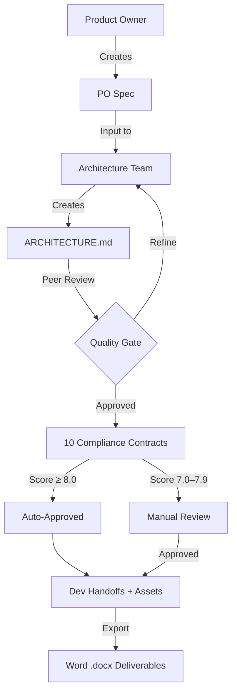

# Solutions Architect Skills

[](https://github.com/shadowx4fox/solutions-architect-skills/releases)
[](LICENSE)
[](https://claude.com/claude-code)

Professional architecture documentation workflow for Claude Code: Transform business requirements into technical architecture, compliance documents, and development handoffs.

## Overview

This Claude Code plugin provides a complete four-phase workflow for enterprise architecture documentation:

```
Phase 1: Business Requirements (PO Spec)
    ↓
Phase 2: Technical Architecture (ARCHITECTURE.md)
    ↓
Phase 3: Compliance Documents (10 contracts)
    ↓
Phase 4: Development Handoff & Export (.md + .docx)
```

## Claude Code Marketplace & Plugin System

This project is distributed as a **Claude Code Plugin** via the **shadowX4fox Marketplace**:

- **Marketplace**: A catalog of available plugins ([Learn more](https://docs.anthropic.com/claude/docs/claude-code-plugins))
- **Plugin**: This repository, installable from the marketplace
- **Skills**: Eight specialized skills within the plugin

For detailed information about Claude Code's plugin system, see the [official Claude Code documentation](https://docs.anthropic.com/claude/docs/claude-code).

---

### What's Included

- **8 Integrated Skills**
  - `architecture-readiness`: Requirements Elicitation + Product Owner Specifications
  - `architecture-docs`: ARCHITECTURE.md creation and maintenance
  - `architecture-compliance`: Generate 10 compliance contracts
  - `architecture-compliance-review`: Compliance portfolio health review + gap explorer
  - `architecture-component-guardian`: Manages `docs/components/README.md` index
  - `architecture-peer-review`: Interactive peer review with playground tool
  - `architecture-dev-handoff`: Component development handoffs with deliverable assets
  - `architecture-doc-export`: On-demand Word (.docx) export for architecture docs and handoffs

  Plus `architecture-blueprint`: generates Business & Application blueprint files (datos de iniciativa) from ARCHITECTURE.md

- **10 Compliance Templates**
  - Business Continuity, SRE, Cloud, Security, Enterprise Architecture, and more

- **Automatic Validation**
  - External validation system (0-10 scoring) for all 10 contracts
  - 4-tier approval workflow (Auto-approve, Manual review, Needs work, Rejected)
  - Template-specific validation configurations
  - Metric consistency checking
  - Design Drivers calculation

- **Complete Documentation**
  - Installation guide, Quick Start tutorial, Workflow guide, Troubleshooting

## Quick Start

### Installation

**See [Installation Guide](docs/INSTALLATION.md) for detailed instructions.**

**Quick Start (Using Marketplace - Recommended):**

```bash
# Step 1: Register marketplace (one-time)
/plugin marketplace add shadowX4fox/solutions-architect-skills

# Step 2: Install plugin
/plugin install solutions-architect-skills@shadowx4fox-solution-architect-marketplace

# Step 3: Verify installation
/plugin list
```

**Alternative: Direct Git Clone**

```bash
# Clone directly to plugins directory
git clone https://github.com/shadowX4fox/solutions-architect-skills.git ~/.claude/plugins/solutions-architect-skills

# Restart Claude Code and verify
/plugin list
```

You should see `solutions-architect-skills v2.10.28` in the list.

**Important:** Marketplace registration is a security feature - you must explicitly add marketplaces before installing plugins. See [docs/INSTALLATION.md](docs/INSTALLATION.md) for detailed setup instructions.

### First Workflow

**Phase 1 — Business Requirements (Product Owner)**

```bash
/skill architecture-readiness
```

The skill auto-detects whether a PO Spec already exists:

- **No PO Spec found** → starts a guided discovery interview (4 phases, ~35 min):
  1. Foundation — business problem, stakeholders, personas
  2. Value & Boundaries — goals with targets, budget, timeline, regulatory constraints
  3. Behavior — use cases (scenario walking), user stories
  4. Experience & Measurement — UX expectations, KPIs with baselines and targets

  After the interview: Discovery Summary for your review → draft PO Spec → self-scored to ≥ 7.5/10 → saved as `PRODUCT_OWNER_SPEC.md`

- **PO Spec found** → offers Evaluation (scored out of 10) or Creation (template-guided)

**Phase 2 — Technical Architecture**

```bash
/skill architecture-docs
```

Hand off `PRODUCT_OWNER_SPEC.md` to your architecture team. The skill produces a multi-file structure:

```
ARCHITECTURE.md          ← navigation index (~130 lines)
docs/                    ← all section content
└── components/          ← one file per architectural component
adr/                     ← Architecture Decision Records
```

**Phase 3 — Compliance Documents**

```bash
/skill architecture-compliance
```

Generates 10 compliance contracts from `ARCHITECTURE.md` into `/compliance-docs/`. To remediate gaps found in compliance contracts, use `/skill architecture-docs` — the skill guides you through updating `ARCHITECTURE.md` for each finding.

**Phase 4 — Development Handoff**

```bash
/skill architecture-dev-handoff
```

Generates per-component handoff documents with deliverable assets into `docs/handoffs/`. Produces a 16-section guide per component (API contract, data model, security, observability, acceptance criteria, etc.) plus type-specific assets (OpenAPI specs, DDL scripts, K8s manifests, and more).

**Phase 4.5 — Word Export (optional)**

```bash
/skill architecture-doc-export
```

Exports architecture documents to professional Word (.docx) files: SA executive summary (synthesized from overview + component index + compliance manifest), individual ADRs, or component handoffs.

### Supporting Skills

| Skill | When to Use |
|-------|-------------|
| `/skill architecture-peer-review` | After ARCHITECTURE.md is complete — interactive quality review with approve/reject/fix workflow |
| `/skill architecture-blueprint` | When organizational blueprint forms (datos de iniciativa) are required |
| `/skill architecture-compliance-review` | After compliance contracts are generated — explore gaps across all 10 contracts |
| `/skill architecture-component-guardian` | When adding, removing, or updating a component in `docs/components/` |

## Features

### Phase 1: Architecture Readiness (Product Owner)

Create comprehensive Product Owner Specifications before technical design begins. Includes a structured discovery interview when starting from scratch.

**Key Features:**
- **Requirements Elicitation** — 4-phase guided discovery interview (Foundation → Value & Boundaries → Behavior → Experience & Measurement)
  - Probing techniques: scenario walking, quantification, negative probing, assumption surfacing
  - Industry defaults when PO is unsure; unknowns logged as Open Questions
  - Discovery Summary checkpoint before drafting; self-scoring gap loop until ≥7.5
- **Async Intake** — file-based requirements extraction from tickets, emails, or documents
  - Scores input against the PO Spec rubric (same 8 sections, same weights)
  - Produces `PO_SPEC_GAP_REPORT.md` with ready-to-send questions per gap, prioritized by section weight
  - No interactive interview — output is a written gap report the architect forwards to the requester
  - If score ≥ 7.5, also drafts `PRODUCT_OWNER_SPEC.md` automatically
- 8-section template (Business Context, User Personas, Use Cases, Success Criteria, etc.)
- Weighted scoring methodology (0-10 scale)
- Readiness threshold: ≥7.5 for architecture handoff
- Focus: Business requirements, no technical implementation
- Bilingual interview support (language auto-detected from user's first message)

**Output:** `PRODUCT_OWNER_SPEC.md`

### Phase 2: Architecture Documentation

Create and maintain technical architecture documentation following enterprise standards.

**Key Features:**
- **Multi-file structure** — `ARCHITECTURE.md` at project root is a navigation index (~130 lines); all content lives in `docs/` as numbered section files; components in `docs/components/` (one file per component); see [RESTRUCTURING_GUIDE.md](skills/architecture-docs/RESTRUCTURING_GUIDE.md)
- 5 architecture type templates (META, 3-Tier, Microservices, N-Layer, BIAN)
- Interactive Mermaid diagrams in `docs/03-architecture-layers.md`
- Metric consistency validation across document
- Design Drivers calculation (Value Delivery %, Scale, Impacts)
- 9 mandatory Architecture Principles + 1 optional
- ADR (Architecture Decision Record) templates with automatic file generation
- **Foundational Context Anchor Protocol** — dependency-aware editing workflow that loads required upstream context before any downstream section edit
- All files kept under ~400 lines each for context efficiency

**Output structure:**
```
<project-root>/
├── ARCHITECTURE.md          (~130 lines — navigation index only)
├── adr/                     (ADR files)
└── docs/
    ├── 01-system-overview.md
    ├── 02-architecture-principles.md
    ├── 03-architecture-layers.md
    ├── 04-data-flow-patterns.md
    ├── 05-integration-points.md
    ├── 06-technology-stack.md
    ├── 07-security-architecture.md
    ├── 08-scalability-and-performance.md
    ├── 09-operational-considerations.md
    └── components/
        ├── README.md        (component index)
        └── NN-<name>.md     (one file per component)
```

#### Peer Review (Quality Gate)

Use `/skill architecture-peer-review` after ARCHITECTURE.md is complete, before handing off to compliance.

- **3 depth levels**: Light (22 checks), Medium (44 checks), Hard (82 checks)
- **13 review categories** with weighted 0–10 scoring: Structural Completeness, Naming & Conventions, Section Completeness, Content Coherence, Technology Alignment, Integration Soundness, Metric Realism, Scalability Design, Security Posture, Performance Design, Operational Readiness, ADR Quality, Trade-off Honesty
- **Interactive HTML playground** — approve/reject/comment on each finding, live scorecard
- **Fix prompt generation** — copy approved findings as a structured prompt to apply changes via `architecture-docs`

**Output:** Interactive HTML peer review file (`architecture-peer-review-YYYY-MM-DD.html`) + scored findings

#### Blueprint Generation

Use `/skill architecture-blueprint` when organizational blueprint forms are required.

- **Business blueprint** (`BLUEPRINT_BUSINESS_EN.md` / `BLUEPRINT_BUSINESS_ES.md`) — fills the "Datos de la Iniciativa" organizational template (business domain, strategy, deployment location, team roles)
- **Application blueprint** (`BLUEPRINT_APPLICATION_EN.md` / `BLUEPRINT_APPLICATION_ES.md`) — fills an application-level template (Design Drivers, Architecture Decisions, Capacity Sizing, Compliance Approvals)
- **Language auto-detection** — reads `docs/01-system-overview.md`, selects matching EN or ES template
- **NOT FOUND handling** — fields not found in architecture docs are marked `NOT FOUND` with a recommended keyword or section to add the missing data
- Bilingual (ES/EN) with explicit language override support

**Output location:** same directory as `ARCHITECTURE.md`

### Phase 3: Compliance Documentation

Generate compliance contracts from ARCHITECTURE.md with full traceability.

**Key Features:**
- Context-efficient generation (70-80% reduction in loaded content)
- 10 complete compliance contracts with external validation system
- **Automatic Validation (0-10 scoring)**: All contracts validated with granular scoring
- **4-Tier Approval Workflow**: Auto-approve (8.0-10), Manual review (7.0-7.9), Needs work (5.0-6.9), Rejected (0-4.9)
- Source traceability (section + line number references)
- [PLACEHOLDER] markers for missing data with completion guidance
- Compliance manifest (index of all generated documents)

**Output:** `/compliance-docs/` directory with all 10 contracts + manifest

#### Compliance Contract Types

1. **Business Continuity** - RTO/RPO, disaster recovery, backup strategy, resilience (43 LACN requirements)
2. **SRE Architecture** - SLOs, error budgets, monitoring, incident management, observability
3. **Cloud Architecture** - Deployment model, cloud provider, connectivity, security
4. **Security Architecture** - API security, authentication, encryption, compliance, controls
5. **Data & Analytics/AI Architecture** - Data quality, AI governance, model validation, hallucination control
6. **Development Architecture** - Technology stack, coding standards, technical debt, 26-item validation
7. **Process Transformation** - Automation, efficiency, ROI analysis, workflow optimization
8. **Platform & IT Infrastructure** - Environments, databases, capacity, naming conventions
9. **Enterprise Architecture** - Strategic alignment, modularity, cloud-first, API-first, governance
10. **Integration Architecture** - Integration catalog, patterns, API security, standards

#### Compliance Review (Quality Gate)

Use `/skill architecture-compliance-review` after contracts are generated to understand what ARCHITECTURE.md improvements would push contracts to auto-approve (≥8.0/10).

- **Coverage validation**: Checks all 10 required contracts are present and ≤6 months old
- **Gap extraction**: Reads every contract's compliance summary table and extracts Non-Compliant and Unknown requirements
- **Concept clustering**: Groups gaps across contracts by underlying ARCHITECTURE.md concept (load testing, DR/RTO, IAM, observability, etc.) ranked by cross-contract impact
- **Interactive HTML playground** — portfolio health panel + concept cluster gap explorer

### Phase 4: Development Handoff & Export

#### Dev Handoff

Use `/skill architecture-dev-handoff` when handing off a component to the development team for implementation.

**Key Features:**
- **16-section handoff document** per component — metadata, overview, scope, API contract, data model, integrations, security, performance, configuration, observability, error handling, technology constraints, acceptance criteria, ADRs, deliverable assets, open questions
- **8 component-type-specific assets**:

| Component Type | Asset Generated |
|---------------|-----------------|
| API / REST / Service | `openapi.yaml` (OpenAPI 3.1) |
| Database / Data Store | `ddl.sql` (DDL with tables, indexes, constraints) |
| Redis / Cache | `redis-key-schema.md` (key patterns, TTL, eviction, fail-open) |
| Kubernetes workload | `deployment.yaml` (Deployment + Service + HPA) |
| Message Consumer/Producer | `asyncapi.yaml` (AsyncAPI 3.0) |
| Kafka + Avro | `schema.avsc` (Avro schema for Schema Registry) |
| Kafka + Protobuf | `schema.proto` (Protobuf message definition) |
| Scheduled Job | `cronjob.yaml` (Kubernetes CronJob) |

- **Gap detection** — fields not found in architecture docs are marked `[NOT DOCUMENTED]` and listed in Section 15 as a remediation checklist
- **Compliance enrichment** — if `compliance-docs/` exists, security/SRE/development contract gaps are surfaced in relevant sections
- **Managed index** at `docs/handoffs/README.md` — 6-column table tracking all handoff docs

**Output location:** `docs/handoffs/NN-<component-name>-handoff.md` + `docs/handoffs/assets/NN-<component-name>/`

#### Doc Export

Use `/skill architecture-doc-export` when professional Word deliverables are needed.

| Mode | What it exports | Output |
|------|----------------|--------|
| **Solution Architecture** | Executive Summary synthesized from `docs/01-system-overview.md` + component index + compliance manifest (if present), plus one `.docx` per ADR | `exports/SA-<name>.docx` + `exports/ADR-NNN-<title>.docx` |
| **Dev Handoff** | Selected component handoff(s) from `docs/handoffs/` | `exports/HANDOFF-<component>.docx` |

**Document styling**: Corporate blue (`#1F4E79`) for SA, Amber/Gold (`#8B6914`) for ADRs, Teal (`#0D7377`) for handoffs.

**Output location:** `exports/` at project root

## Architecture Types & Visualization

### 5 Supported Architecture Types

Choose the architecture type that best fits your system:

**1. META (6-Layer Enterprise)** - Large enterprise systems with complex integrations
- Layers: Channels → UX → Business Scenarios → Business → Domain → Core
- Best for: Financial services, regulated industries, enterprise platforms
- Template: Section 4 META with BIAN V12.0 alignment
- **BIAN Standard**: Full V12.0 compliance with 12 metadata fields
- **Layer 5 Enhancement**: Matches BIAN Layer 4 comprehensiveness with complete service domain metadata

**2. 3-Tier (Classic Web Application)** - Standard web applications and REST APIs
- Tiers: Presentation → Application/Business Logic → Data
- Best for: Web apps, line-of-business applications, standard CRUD systems
- Template: Section 4 3-Tier with tier separation enforcement

**3. Microservices (Cloud-Native)** - Distributed systems with independent services
- Components: API Gateway, Service Mesh, Event Bus, independent services
- Best for: Cloud-native systems, event-driven architectures, polyglot environments
- Template: Section 4 Microservices with service catalog

**4. N-Layer (DDD/Clean Architecture)** - Flexible custom patterns
- Patterns: Classic DDD (4-Layer), Extended (5-Layer), Clean Architecture
- Best for: Domain-Driven Design, Hexagonal Architecture, testable systems
- Template: Section 4 N-Layer with dependency inversion

**5. BIAN (Full BIAN V12.0 Certification)** - Pure BIAN Service Landscape architecture
- Layers: Channels → BIAN Business Scenarios → BIAN Business Capabilities → BIAN Service Domains → Core Systems
- Best for: Banking, financial services requiring full BIAN certification
- Template: Section 4 BIAN and Section 5 BIAN with comprehensive metadata
- **Compliance**: Mandatory full BIAN V12.0 compliance (12 metadata fields, 7 standard operations)
- **Validation**: All service domain names validated against official [BIAN Service Landscape V12.0](https://bian.org/servicelandscape-12-0-0/views/view_51891.html)
- **Traceability**: Full BIAN hierarchy (Service Domain → Business Domain → Business Area)

**How to Choose**: See [ARCHITECTURE_TYPE_SELECTOR.md](skills/architecture-docs/templates/ARCHITECTURE_TYPE_SELECTOR.md) for decision tree and comparison matrix.

### Diagram Generation & Enforcement (Workflow 8)

Architecture diagrams are generated by the `architecture-docs` skill with strict placement enforcement:

**Mandatory diagrams** (always generated, not optional):
- **High-Level Architecture** → `docs/03-architecture-layers.md`
- **Data Flow Diagrams** → `docs/04-data-flow-patterns.md`

**On-request diagrams** (opt-in):
- Infrastructure / Deployment → `docs/09-operational-considerations.md`
- HA / Failover + Performance → `docs/08-scalability-and-performance.md`
- Integration → `docs/05-integration-points.md`
- Security → `docs/07-security-architecture.md`

**Enforcement rules**:
- ⛔ Non-canonical placement is **denied** — diagrams go to their designated `docs/` file, no override
- 📥 **External diagram reconciliation** — diagrams from external files are classified, matched against architecture docs, and either relocated or discarded (no undocumented flows)
- 📊 **Completeness audit** — after generation, every documented flow is checked for a corresponding diagram; missing `[REQUIRED]` diagrams produce a compliance warning

**Diagram Capabilities**:
- ✅ Interactive visualization (zoom, pan, clickable components)
- ✅ Color-coded components (Blue=Orchestrators, Orange=Workers, Green=Query, Purple=Events)
- ✅ Data flow patterns (solid arrows=synchronous, dashed arrows=asynchronous)
- ✅ Security protocol visualization (OAuth 2.0, JWT, mTLS, TLS 1.2+, SASL)
- ✅ GitHub/GitLab native rendering (no plugins required)

**Comprehensive Guide**: See [MERMAID_DIAGRAMS_GUIDE.md](skills/architecture-docs/MERMAID_DIAGRAMS_GUIDE.md) for templates, color schemes, and examples.

## Documentation

- **[Installation Guide](docs/INSTALLATION.md)** - Detailed installation instructions
- **[Quick Start](docs/QUICK_START.md)** - 5-minute getting started tutorial
- **[Workflow Guide](docs/WORKFLOW_GUIDE.md)** - Complete end-to-end workflow
- **[Troubleshooting](docs/TROUBLESHOOTING.md)** - FAQ and common issues

## Examples

### Real-World Example Repository

**[Task Scheduling Platform Example](https://github.com/shadowX4fox/task-scheduling-example)**

Complete end-to-end demonstration of the four-phase workflow:

**Phase 1: Product Owner Specification**
- Business requirements and user personas
- Use cases and success criteria
- Weighted readiness scoring (8.3/10)

**Phase 2: Technical Architecture (ARCHITECTURE.md)**
- Multi-file structure: navigation index + `docs/` section files + `docs/components/`
- Microservices architecture pattern
- Interactive Mermaid diagrams in `docs/03-architecture-layers.md`
- Technology stack documentation
- Complete with metrics, SLOs, and ADRs

**Phase 3: Compliance Documentation**
- All 10 generated compliance contracts with validation
- Development Architecture with 26-item stack validation
- Security, Cloud, SRE, and Enterprise Architecture contracts
- Full source traceability to ARCHITECTURE.md

**Phase 4: Development Handoff**
- Per-component handoff documents with deliverable assets
- Type-specific scaffolded artifacts (OpenAPI, DDL, K8s manifests)

**Repository**: https://github.com/shadowX4fox/task-scheduling-example

---

**Additional Examples in This Repository:**

The `examples/` directory contains reference templates:

- **PRODUCT_OWNER_SPEC_example.md** - PO Spec template (Job Scheduling Platform)
- **ARCHITECTURE_example.md** - Full ARCHITECTURE.md example (multi-file structure: navigation index + `docs/` section files)

---

**Want More Examples?**

To request specific examples or use cases, [open an issue](https://github.com/shadowX4fox/solutions-architect-skills/issues/new).

## Requirements

- **Claude Code** (latest version)
- **Bun** (v1.0.0 or later) - Required for compliance generation and template validation
- **Platform:** macOS, Linux, or Windows

### Why Bun?

The architecture-compliance skill uses Bun for:
- Template expansion with `@include` directives
- Pre-validation of template structure (Phase 4.1)
- Post-validation of generated contracts (Phase 4.6)
- High-performance TypeScript execution

**Installation:** See [INSTALLATION.md](docs/INSTALLATION.md#installing-bun) for Bun setup instructions.

## Recommended VS Code Setup

For the best experience working with this plugin, install these three VS Code extensions:

| Extension | Publisher | Purpose |
|-----------|-----------|---------|
| [Claude Code for VS Code](https://marketplace.visualstudio.com/items?itemName=anthropic.claude-code) | Anthropic | Run Claude Code skills directly from the editor |
| [Mermaid Preview](https://marketplace.visualstudio.com/items?itemName=bierner.markdown-mermaid) | Mermaid OSS | Live preview of Mermaid diagrams in architecture docs |
| [Office Viewer](https://marketplace.visualstudio.com/items?itemName=cweijan.vscode-office) | Database Client | Preview `.docx` exports without leaving VS Code |

### Why these extensions?

- **Claude Code** is required to run the plugin's 8 skills from VS Code
- **Mermaid Preview** lets you validate architecture diagrams (`docs/*.md`) in real-time as they are generated
- **Office Viewer** lets you open and review `.docx` files produced by the `architecture-doc-export` skill directly in the editor

## Use Cases

Perfect for:
- Enterprise architects documenting solution designs
- Product Owners preparing requirements for architecture teams
- Compliance teams generating organizational contracts
- Technical leads maintaining architecture documentation
- Development teams receiving component handoffs for implementation
- Teams needing standardized architecture workflows

## Workflow Integration


```mermaid
graph TD
    A[Product Owner] -->|Creates| B[PO Spec]
    B -->|Input to| C[Architecture Team]
    C -->|Creates| D[ARCHITECTURE.md]
    D -->|Peer Review| E{Quality Gate}
    E -->|Approved| F[10 Compliance Contracts]
    E -->|Refine| C
    F -->|Score ≥ 8.0| G[Auto-Approved]
    F -->|Score 7.0–7.9| H[Manual Review]
    G --> J[Dev Handoffs + Assets]
    H -->|Approved| J
    J -->|Export| K[Word .docx Deliverables]
```

## External Validation System

All 10 compliance contracts use an **external validation system** with standardized 0-10 scoring:

### Validation States & Scoring
- ✅ **PASS (10 points)**: Complies with requirements
- ❌ **FAIL (0 points)**: Non-compliant or deprecated technology
- ⚪ **N/A (10 points)**: Not applicable to this architecture
- ❓ **UNKNOWN (0 points)**: Missing data in ARCHITECTURE.md
- 🔓 **EXCEPTION (10 points)**: Documented exception via LADES2 process

### Scoring Formula
```
Final Score = (Completeness × 0.4) + (Compliance × 0.5) + (Quality × 0.1)

Where:
- Completeness = (Filled required fields / Total required) × 10
- Compliance = (PASS + N/A + EXCEPTION items / Total applicable) × 10
- Quality = Source traceability coverage (0-10)
```

### Approval Workflow
| Score | Status | Review Actor | Outcome |
|-------|--------|--------------|---------|
| 8.0-10.0 | Approved | System (Auto-Approved) | Ready for implementation |
| 7.0-7.9 | In Review | [Approval Authority] | Manual review required |
| 5.0-6.9 | Draft | Architecture Team | Address gaps before review |
| 0.0-4.9 | Rejected | N/A (Blocked) | Cannot proceed to review |

### Validation Configuration
- **10 JSON config files**: One per contract type in `/skills/architecture-compliance/validation/`
- **Template-specific weights**: Each contract can customize Completeness/Compliance/Quality weights
- **Validation schema**: `VALIDATION_SCHEMA.json` defines standard structure
- **Example scenarios**: `VALIDATION_EXAMPLES.md` shows all 4 outcome tiers

## Roadmap

### v2.10.36 (Current Release) ✅
**fix: Responsible Role always populated — BC/SRE templates now use category-specific roles; all agents forbidden from defaulting to N/A**

Business Continuity and SRE compliance contracts were generating N/A in the Responsible Role column because both templates used a generic `[Role or N/A]` placeholder with no role hint, and all 10 agent instructions permitted defaulting to N/A. Fix: (1) BC template now maps roles by category — BC-GEN → Solution Architect, BC-DR/BC-RTO → Business Continuity Manager, BC-BACKUP → Infrastructure Architect, BC-AUTO → Platform Engineer, BC-CLOUD → Cloud Architect — across all 86 occurrences (summary table + detailed sections). (2) SRE template table rows now use Practice/Observability → SRE Lead, Automation → Platform Engineer; detailed section entries cleaned up from `SRE Engineer or N/A` to plain `SRE Engineer`. (3) All 10 agent instructions updated: role placeholders must resolve to the template-specified role name; N/A is only permitted when Status = "Not Applicable".

### v2.10.35 (Previous Release) ✅
**fix: auto-populate [NEXT_REVIEW_DATE] as generation date +6 months; fix Section 1.6 stack validation placeholders left unreplaced in Development contract**

Two fixes in one release: (1) `[NEXT_REVIEW_DATE]` in the Document Control table was never replaced — added `getNextReviewDate()` to `date-utils.ts` and wired it into `field-updater.ts` so it computes generation date + 6 months with correct month-end clamping. (2) Development contract Section 1.6 "Stack Validation Checklist" had ~30 unreplaced placeholders (`[JAVA_ITEM_1]`–`[JAVA_ITEM_6]`, `[DOTNET_*]`, `[FRONTEND_*]`, `[OTHER_STACKS_*]`, `[EXCEPTIONS_*]`, `[TOTAL_ITEMS]`, etc.) — removed the dead "Dynamic Field Mapping Instructions" block from the template and added Step 4.6 to the development agent with full 26-item evaluation criteria (Java, .NET, Frontend, Other Stacks, Exceptions). Added 6 new tests for `getNextReviewDate` and `[NEXT_REVIEW_DATE]` field-updater replacement.

### v2.10.34 (Previous Release) ✅
**fix: shorten Compliance Summary table Requirement columns in Business Continuity and SRE templates to use section titles instead of full descriptions; simplify SRE Category column to prefix-only (Practice/Observability/Automation)**

Aligns the two remaining outlier templates (Business Continuity: 43 rows, SRE: 57 rows) with the short-title pattern already used by the other 8 compliance templates. BC Requirement column now uses H2 section titles (e.g., "Application or Initiative Name" instead of the full question). SRE Requirement column uses H2 section titles and Category column simplified from "Practice - Log Management" to just "Practice".

### v2.10.33 (Previous Release) ✅
**feat: standardize Questions & Gaps Register across all 10 compliance contracts; add Word export for compliance contracts; fix TypeScript errors; expand test coverage**

Replaces three inconsistent post-appendix gap sections (5-col "Missing Data", 3-col "Not Applicable", 4-col "Unknown Status") with a single unified `## Questions & Gaps Register` (8 columns: Code | Requirement | Type | Status | Owner | ARCHITECTURE.md Section | Action Required | Priority) populated automatically by the post-generation pipeline. New `questions-register-populator.ts` derives priority (Critical/High/Medium/Low) and action text from the domain validation JSON — agents are explicitly forbidden from populating it. Added `compliance` doc type to `generate-doc.js` (purple `#7B2D8E`) with yellow-highlighted editable cells (Owner, Action Required, Priority) and status-conditional coloring in the Compliance Summary table. Added full Workflow C to `architecture-doc-export/SKILL.md` for exporting compliance contracts to Word. Fixed inline A.2 schema violations in Development and Integration templates (now use shared `@include-with-config`). Fixed 2 pre-existing TypeScript errors. Added 78 new tests across 4 new test files (questions-register-populator, manifest-generator, resolve-includes, contract-types). Deleted 3 deprecated shared section templates.

### v2.10.28 ✅
**feat: enforce internal section numbers (S1-S12) across all skills and agents; add supplementary context file intake to architecture creation**

Adds explicit S1-S12 section number disambiguation throughout all architecture skills and compliance agents — file prefix numbers (01-10) now never conflate with internal section numbers (S9 = `docs/07-security-architecture.md`, not `docs/09-*`). Added canonical S-prefix mapping table and WARNING blocks to ARCHITECTURE_DOCUMENTATION_GUIDE.md, RESTRUCTURING_GUIDE.md, SKILL.md, QUERY_SECTION_MAPPING.md, SECTION_MAPPING_GUIDE.md, and VALIDATIONS.md. Updated all 10 compliance generator agents with a disambiguation note at their Section Mapping. Fixed all legacy `Section N.M` source references in validation examples, test fixtures, and compliance guides to use file paths. Also added Step 0.5 to the architecture creation workflow: after the PO Spec gate, the user is prompted for supplementary context files (ADRs, HLD PDFs, tech stack specs, OpenAPI/AsyncAPI, data models, NFRs, IaC templates) before architecture type selection — HLD documents are enforced as PDF-only.

### v2.10.27 (Previous Release) ✅
**feat: add Async Intake mode to architecture-readiness skill**

New 4th mode for file-based requirements extraction from tickets, emails, or documents. Reads a context file, maps content to the 8 PO Spec sections using keyword indicators, scores against the weighted rubric, and produces `PO_SPEC_GAP_REPORT.md` with ready-to-send questions prioritized by section weight. If score ≥7.5, also drafts `PRODUCT_OWNER_SPEC.md` automatically. No interactive interview — fully async. Added `ASYNC_INTAKE_GUIDE.md`, updated `architecture-docs` PO Spec gate with Option 4, and updated CLAUDE.md and README.

See [CHANGELOG.md](CHANGELOG.md) for full version history.

### v2.10.26 (Previous Release) ✅
**feat: auto-delete superseded compliance contracts in post-generation pipeline**

The pipeline now detects when multiple contracts of the same type exist with different dates, keeps only the newest, and deletes the older ones automatically. Each removal is logged. The JSON summary includes a `removedContracts` field and the SKILL.md orchestrator reporting was updated to relay the cleanup notice to the user.

### v2.10.25 (Previous Release) ✅
**docs: expand compliance approval paths in Workflow Integration diagram**

Updated the Workflow Integration diagram to show both compliance approval paths: auto-approval (score ≥8.0) and manual review (score 7.0–7.9), with both converging on Dev Handoffs before proceeding to Export.

### v2.10.24 (Previous Release) ✅
**docs: add refinement feedback edge from peer review Quality Gate back to Architecture Team**

Added `Refine` edge from the peer review Quality Gate back to the Architecture Team node in the Workflow Integration diagram, reflecting that failed reviews loop back for architecture refinement before re-submission.

### v2.10.23 (Previous Release) ✅
**docs: convert Workflow Integration diagram to top-down layout**

Changed the Workflow Integration mermaid diagram from left-to-right (`graph LR`) to top-down (`graph TD`) for better readability on standard screen widths.

### v2.10.22 (Previous Release) ✅
**docs: overhaul README to reflect four-phase workflow and migrate version history to CHANGELOG**

Rewrote README from ~1048 to ~581 lines: corrected three-phase → four-phase workflow, updated overview diagram, Quick Start, and Features section to include Phase 4 (Dev Handoff + Doc Export); documented `architecture-blueprint` and quality gate skills (peer review, compliance review); removed stale version markers; replaced the 530-line roadmap/changelog block with a slim current-version summary linked to CHANGELOG.md; migrated all version history (v1.2.0–v2.10.21) to CHANGELOG.md.

### v2.10.21 (Previous Release) ✅
**feat: add redis-key-schema.md asset type for Redis/Cache components in dev handoff**

### Future Releases 🚀

- Improved playground interactivity for compliance review and peer review
- Additional architecture type templates

---

## Contributing

Contributions are welcome! Please feel free to submit issues or pull requests.

### Reporting Issues

If you encounter problems:
1. Check the [Troubleshooting Guide](docs/TROUBLESHOOTING.md)
2. Search [existing issues](https://github.com/shadowx4fox/solutions-architect-skills/issues)
3. Open a new issue with detailed description

### Feature Requests

Have an idea for improvement? Open an issue with the `enhancement` label.

## Version History

See [CHANGELOG.md](CHANGELOG.md) for detailed version history.

## License

This project is licensed under the MIT License - see the [LICENSE](LICENSE) file for details.

## Author

**shadowx4fox**
- GitHub: [@shadowx4fox](https://github.com/shadowx4fox)
- Repository: [solutions-architect-skills](https://github.com/shadowx4fox/solutions-architect-skills)

## Acknowledgments

- Built for [Claude Code](https://claude.com/claude-code) by Anthropic
- Follows enterprise architecture best practices
- Inspired by organizational compliance frameworks

---

**Get Started:** Download the [latest release](https://github.com/shadowX4fox/solutions-architect-skills/releases) and transform your architecture workflow today!
