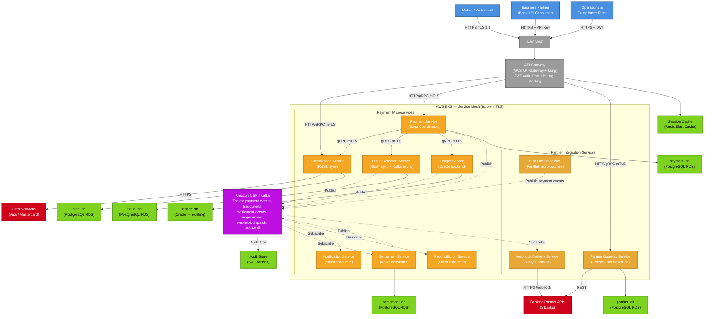

<!-- ARCHITECTURE_TYPE: MICROSERVICES -->

# Section 4: Architecture Layers

[Architecture](../ARCHITECTURE.md) > Architecture Layers

---

## Overview

PayStream uses a **Microservices Architecture** organized into functional layers. Services communicate synchronously via REST/gRPC on the critical authorization path and asynchronously via Kafka for settlement, reconciliation, fraud processing, and partner webhook delivery.

Per [ADR-001](../adr/ADR-001-microservices-architecture.md), the Microservices pattern was selected to enable independent scaling of hot-path services (Authorization, Fraud Detection) without scaling cold-path services (Reconciliation, Reporting).

---

## Architecture Overview

| Component Layer | Function |
|----------------|----------|
| **Client & Partner Layer** | Mobile/web clients and business partner API consumers |
| **API Gateway** | Single entry point: routing, authentication, rate limiting, TLS termination |
| **Service Mesh (Istio)** | mTLS, circuit breaking, distributed tracing, traffic management |
| **Payment Microservices** | Core business logic: authorization, fraud, settlement, ledger, notification |
| **Partner Integration Services** | Webhook delivery, bulk file processing, partner API adapters |
| **Event Bus (Amazon MSK / Kafka)** | Asynchronous backbone for all inter-service events |
| **Data Stores** | Database-per-service (PostgreSQL/RDS, Redis, Oracle for ledger) |
| **Supporting Infrastructure** | AWS EKS, Secrets Manager, CloudWatch, S3, CloudTrail |

---

## Layer Descriptions

### Layer 1: Client & Partner Layer

External consumers of the PayStream API:
- **Mobile/Web Clients**: End customers using FinTech Corp's consumer-facing apps
- **Business Partner APIs**: 3 external banks submitting bulk payment files and consuming webhook callbacks
- **Operations Dashboard**: Internal web application for operations and compliance teams

All external traffic terminates at the API Gateway over HTTPS (TLS 1.3).

### Layer 2: API Gateway (AWS API Gateway + Kong)

Single entry point for all inbound traffic. Responsibilities:
- JWT token validation (OAuth 2.0 / PKCE for consumer clients)
- API key authentication for business partners
- Rate limiting per client tier (consumer: 100 req/min; partner: 1,000 req/min; internal: unlimited)
- Request routing to downstream microservices
- TLS termination and certificate management
- WAF integration (AWS WAF) for OWASP Top 10 protection

Technology: AWS API Gateway (edge) + Kong Gateway (internal routing layer)

### Layer 3: Service Mesh (Istio on EKS)

Infrastructure layer governing all service-to-service communication within the Kubernetes cluster:
- **mTLS**: All service-to-service calls encrypted and mutually authenticated (PCI-DSS requirement per [Principle P2](02-architecture-principles.md#principle-2-security-by-design-pci-dss-first))
- **Circuit Breaking**: Prevents cascade failures; critical for authorization path resilience
- **Distributed Tracing**: OpenTelemetry sidecars inject trace headers; traces shipped to AWS X-Ray
- **Traffic Management**: Canary deployments, weighted routing for zero-downtime releases
- **Retry Policies**: Configurable per-route retry budgets

### Layer 4: Payment Microservices

Core business services organized by bounded context:

| Service | Bounded Context | Sync/Async |
|---------|----------------|-----------|
| Authorization Service | Payment authorization | Sync (critical path) |
| Fraud Detection Service | Transaction risk scoring | Sync (inline) + Async (ML batch) |
| Payment Service | Payment orchestration (Saga coordinator) | Sync + Async |
| Ledger Service | Debit/credit ledger entries (Oracle) | Sync |
| Settlement Service | Settlement batch and position calculation | Async |
| Notification Service | Customer and partner notifications | Async |
| Reconciliation Service | End-of-day reconciliation reports | Async |

See [Component Details](components/README.md) for full per-service specifications.

### Layer 5: Partner Integration Services

Services managing banking partner connectivity:

| Service | Function |
|---------|----------|
| Partner Gateway Service | Partner API adapter (per-bank protocol normalization) |
| Webhook Delivery Service | Reliable webhook dispatch with retry and exponential backoff |
| Bulk File Processor | Splits partner bulk payment files into individual transactions |

### Layer 6: Event Bus (Amazon MSK / Kafka)

Asynchronous communication backbone per [ADR-003](../adr/ADR-003-event-driven-payment-processing.md):

| Topic | Producers | Consumers |
|-------|-----------|-----------|
| `payment.events` | Payment Service | Settlement Service, Notification Service, Audit Log |
| `fraud.alerts` | Fraud Detection Service | Payment Service, Operations Dashboard |
| `settlement.events` | Settlement Service | Reconciliation Service, Partner Gateway |
| `ledger.entries` | Ledger Service | Reconciliation Service, Audit Log |
| `webhook.dispatch` | Payment Service, Settlement Service | Webhook Delivery Service |
| `audit.trail` | All services | Audit Log Service (append-only) |

### Layer 7: Data Stores

Per [Principle P4](02-architecture-principles.md#principle-4-database-per-service-bounded-context-ownership) (Database-per-Service):

| Service | Database | Technology | Notes |
|---------|----------|------------|-------|
| Authorization Service | auth_db | PostgreSQL (AWS RDS) | Idempotency keys, auth history |
| Payment Service | payment_db | PostgreSQL (AWS RDS) | Transaction records, saga state |
| Fraud Detection Service | fraud_db | PostgreSQL (AWS RDS) | Risk scores, model decisions |
| Ledger Service | ledger_db | Oracle (existing) | Required per [ADR-002](../adr/ADR-002-oracle-ledger-persistence.md) |
| Settlement Service | settlement_db | PostgreSQL (AWS RDS) | Position calculations, batches |
| Partner Gateway Service | partner_db | PostgreSQL (AWS RDS) | Partner configs, API credentials |
| Session / Rate Limiting | cache | Redis (AWS ElastiCache) | JWT sessions, rate limit counters |
| Audit Log | audit_store | S3 + Athena | Immutable event archive |

### Layer 8: Supporting Infrastructure

| Component | Technology | Purpose |
|-----------|-----------|---------|
| Container Orchestration | AWS EKS (Kubernetes) | Service deployment and scaling |
| Secrets Management | AWS Secrets Manager | DB credentials, API keys, certificates |
| Observability | CloudWatch + X-Ray + OpenTelemetry | Metrics, logs, traces |
| Infrastructure as Code | Terraform | All AWS resources defined as code |
| CI/CD | GitHub Actions + ArgoCD | Build, test, deploy pipeline |
| Audit & Compliance | AWS CloudTrail + Security Hub | Infrastructure audit, compliance checks |
| CDN / Edge | AWS CloudFront | Mobile/web asset delivery (future) |

---

## High-Level Architecture Diagram

---

## Communication Patterns

### Synchronous Communication (Critical Path)

Used for operations requiring sub-2-second response (see [Key Metrics](01-system-overview.md#key-metrics)):

- **Protocol**: REST over HTTP/2 and gRPC
- **Security**: mTLS enforced by Istio service mesh
- **Circuit Breakers**: Istio circuit breaker policies on all synchronous dependencies
- **Timeouts**: Payment critical path total budget = 1,800ms (leaving 200ms for network/client overhead)
  - Authorization Service call: max 800ms
  - Fraud Detection call: max 500ms
  - Ledger Service call: max 300ms

### Asynchronous Communication (Settlement, Notification, Reconciliation)

Used for operations that can tolerate eventual consistency:

- **Protocol**: Kafka (Amazon MSK) with exactly-once semantics
- **Delivery Guarantee**: At-least-once with consumer-side idempotency; EOS enabled on producers
- **Dead-Letter Queue**: Every consumer group has a DLQ topic; failed events are retried 3 times before routing to DLQ
- **Retry Strategy**: Exponential backoff (2s, 4s, 8s) with jitter
- **Settlement latency target**: < 30 seconds end-to-end from payment confirmed to ledger entry (see [Key Metrics](01-system-overview.md#key-metrics))

---

## Service Catalog

| Service | Bounded Context | Technology | Data Store | File |
|---------|----------------|------------|------------|------|
| Authorization Service | Payment authorization | Java/Spring Boot | PostgreSQL RDS | [01-authorization-service.md](components/01-authorization-service.md) |
| Fraud Detection Service | Transaction risk | Python/FastAPI | PostgreSQL RDS | [02-fraud-detection-service.md](components/02-fraud-detection-service.md) |
| Payment Service | Payment orchestration | Java/Spring Boot | PostgreSQL RDS | [03-payment-service.md](components/03-payment-service.md) |
| Ledger Service | Ledger management | Java/Spring Boot | Oracle DB | [04-ledger-service.md](components/04-ledger-service.md) |
| Settlement Service | Settlement processing | Java/Spring Boot | PostgreSQL RDS | [05-settlement-service.md](components/05-settlement-service.md) |
| Partner Gateway Service | Partner integration | Node.js/NestJS | PostgreSQL RDS | [06-partner-gateway-service.md](components/06-partner-gateway-service.md) |
| Webhook Delivery Service | Webhook dispatch | Node.js/NestJS | Redis | [07-webhook-delivery-service.md](components/07-webhook-delivery-service.md) |
| Notification Service | Customer notifications | Node.js/NestJS | Redis | [08-notification-service.md](components/08-notification-service.md) |
| Reconciliation Service | End-of-day reconciliation | Python/FastAPI | PostgreSQL RDS | [09-reconciliation-service.md](components/09-reconciliation-service.md) |
| API Gateway | Edge routing & auth | Kong + AWS API Gateway | Redis (rate limit) | [10-api-gateway.md](components/10-api-gateway.md) |
