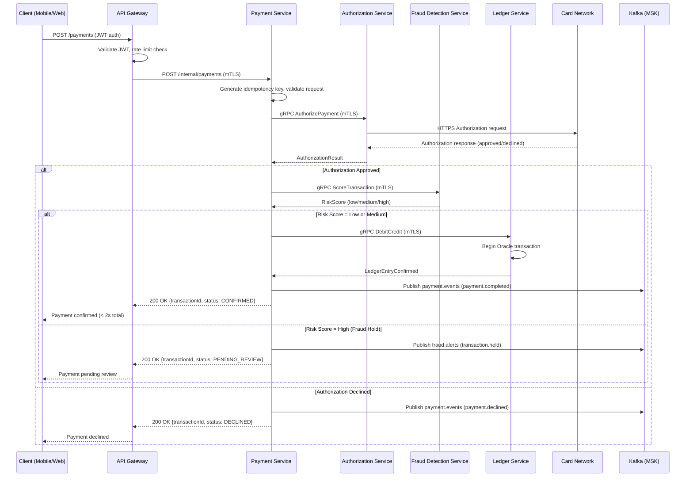
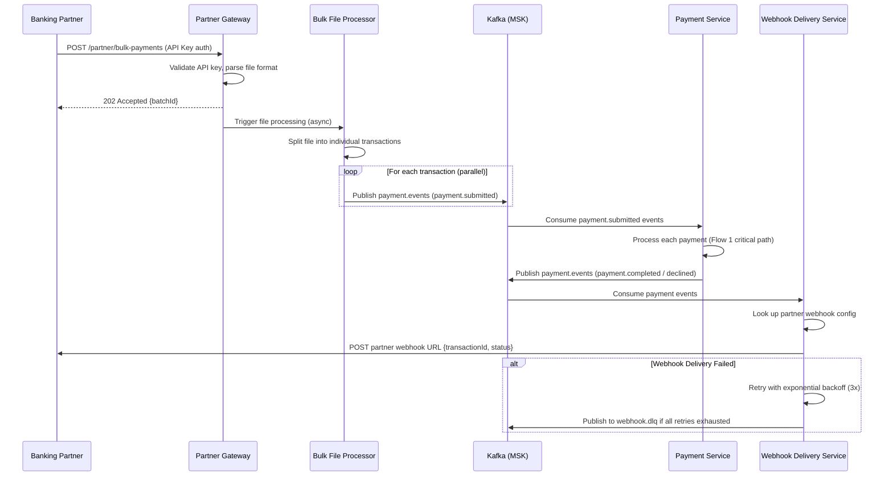
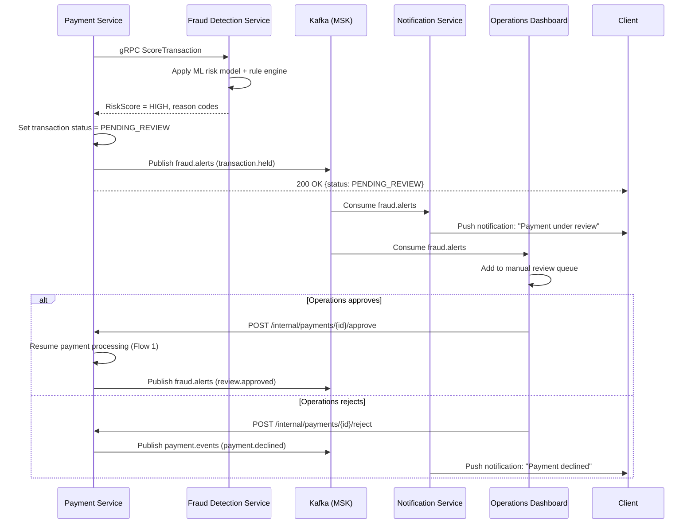
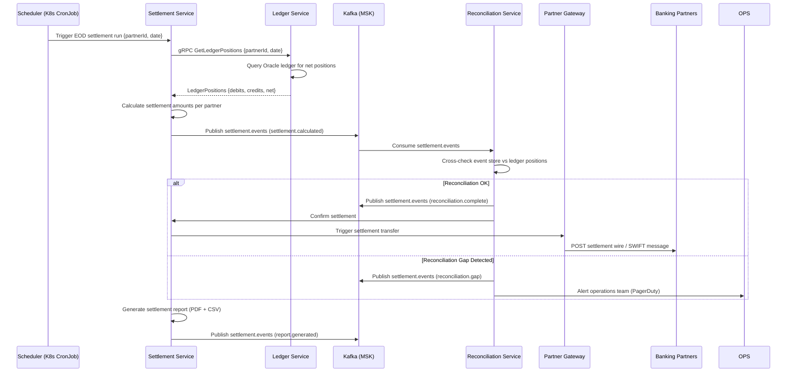

# Section 6: Data Flow Patterns

[Architecture](../ARCHITECTURE.md) > Data Flow Patterns

---

## Overview

PayStream has four primary data flow patterns, each with distinct latency profiles, consistency requirements, and failure modes. These patterns are derived from the use cases in the [System Overview](01-system-overview.md#use-cases) and constrained by [Key Metrics](01-system-overview.md#key-metrics).

---

## Flow 1: Real-Time Payment Authorization (Critical Path)

**Target Latency**: ≤ 2 seconds P99 (see [Key Metrics](01-system-overview.md#key-metrics))

**Trigger**: End customer initiates payment via mobile or web app.

**Participants**: Client → API Gateway → Payment Service → Authorization Service → Fraud Detection Service → Ledger Service → Card Network

### Sequence



### Timing Budget

| Step | Max Duration | Cumulative |
|------|-------------|------------|
| API Gateway (JWT validation, routing) | 50ms | 50ms |
| Payment Service (validation, idempotency) | 50ms | 100ms |
| Authorization Service + Card Network round-trip | 800ms | 900ms |
| Fraud Detection Service (risk scoring) | 500ms | 1,400ms |
| Ledger Service (Oracle transaction) | 300ms | 1,700ms |
| Response marshalling + network | 100ms | 1,800ms |
| **Buffer** | 200ms | **2,000ms** |

### Idempotency

- Client must send `X-Idempotency-Key` header (UUID v4)
- Payment Service checks key against Redis cache before processing
- Duplicate requests within 24 hours return the original response without re-processing

---

## Flow 2: Bulk Partner Payment Processing

**Target Latency**: Per-transaction status via webhook within 30 seconds of individual transaction processing

**Trigger**: Business partner submits bulk payment file via Partner Gateway API.

### Sequence



### Parallelism

- Bulk file processor splits files into individual transaction events
- Payment Service consumer group scales horizontally — up to N consumers per Kafka partition
- Kafka topic `payment.events` partitioned by `partnerId` to preserve per-partner ordering while enabling parallel processing across partners

---

## Flow 3: Fraud Detection and Hold Workflow

**Target Latency**: Inline detection < 500ms; manual review notification < 5 seconds

**Trigger**: Fraud Detection Service assigns HIGH risk score during payment processing.

### Sequence



---

## Flow 4: End-of-Day Settlement and Reconciliation

**Target Latency**: Settlement report available within 30 minutes of EOD cutoff

**Trigger**: Scheduled job (cron) at EOD cutoff time per banking partner timezone.

### Sequence



---

## Data Consistency Strategy

| Scenario | Pattern | Implementation |
|----------|---------|----------------|
| Payment authorization + ledger debit | Saga (Choreography) | Payment Service publishes events; Ledger Service reacts |
| Bulk payment processing | Idempotent consumers | Each consumer deduplicates by event ID |
| Settlement calculation | Eventual consistency | Settlement Service reads from event store and ledger after payment events settle |
| Fraud hold → approve/reject | State machine | Payment Service owns FSM; transitions are atomic with event publish |

### Saga Compensation

Per [ADR-005](../adr/ADR-005-saga-pattern-distributed-transactions.md), if any step in the payment Saga fails after ledger debit, a compensating transaction is published:

- `payment.cancelled` → Ledger Service receives and posts credit reversal
- `payment.cancelled` → Notification Service sends cancellation message to customer
- All saga steps are logged to the audit trail

---

## Event Schema Conventions

All Kafka events follow a common envelope schema:

```json
{
  "eventId": "uuid-v4",
  "eventType": "payment.completed",
  "aggregateId": "transactionId",
  "aggregateType": "Payment",
  "occurredAt": "2026-03-26T14:32:00.000Z",
  "schemaVersion": "1.0",
  "payload": { ... }
}
```

- `eventId` is used for consumer-side idempotency deduplication
- `aggregateId` is the correlation ID propagated through all downstream events
- Schema versions are managed via AWS Glue Schema Registry
