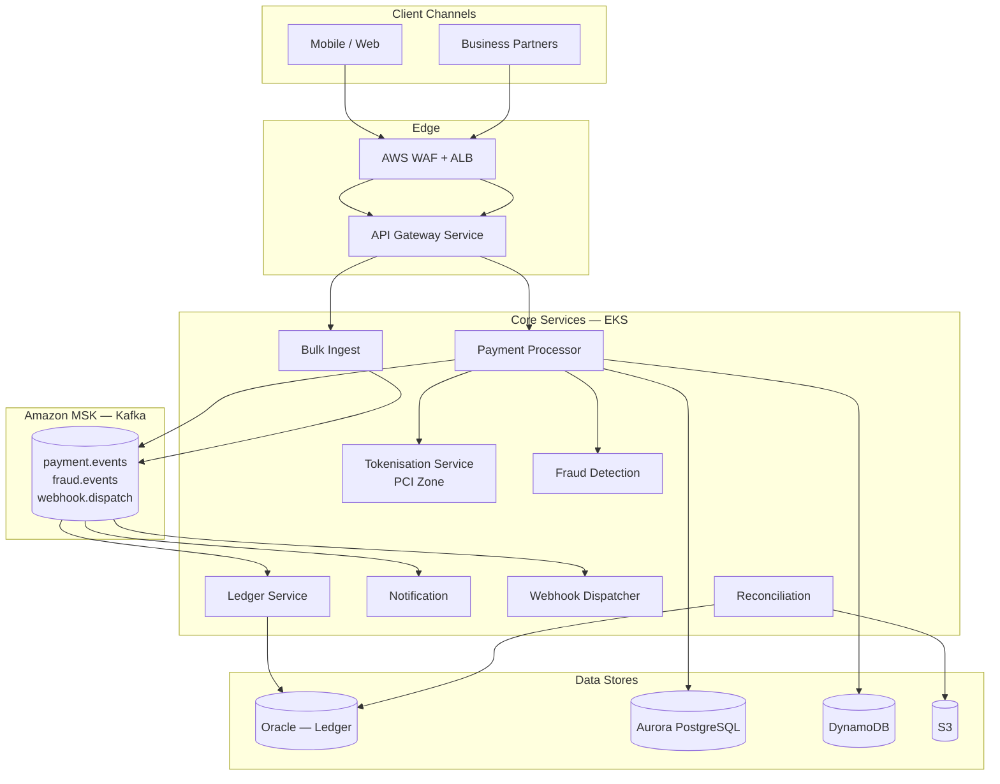

# PayStream — Architecture Documentation

**Version**: 1.0.0
**Date**: 2026-03-26
**Status**: Draft — Under Review
**Architecture Type**: Microservices
**Cloud**: AWS (us-east-1 primary; eu-west-1 for EU data residency)
**Regulatory**: PCI-DSS Level 1, GDPR

---

## Document Map

| Section | File | Description |
|---------|------|-------------|
| 1. System Overview | [docs/01-system-overview.md](docs/01-system-overview.md) | Business context, personas, use cases, SLOs |
| 2. Architecture Principles | [docs/02-architecture-principles.md](docs/02-architecture-principles.md) | Guiding principles, architecture style, constraints |
| 3. Architecture Topology | [docs/03-architecture-topology.md](docs/03-architecture-topology.md) | High-level diagram, network zones, multi-AZ, deployment model |
| 4. Component Details | [docs/04-components.md](docs/04-components.md) | Per-service responsibility, tech, data stores, scaling |
| 5. Data Flow Patterns | [docs/05-data-flow.md](docs/05-data-flow.md) | Sequence diagrams, latency budgets, event schemas |
| 6. Integration Points | [docs/06-integrations.md](docs/06-integrations.md) | External APIs, Kafka topics, Oracle, SFTP |
| 7. Technology Stack | [docs/07-technology-stack.md](docs/07-technology-stack.md) | Full stack table, language versions, dependency governance |
| 8. Security Architecture | [docs/08-security-architecture.md](docs/08-security-architecture.md) | PCI-DSS controls, GDPR, IAM, encryption, audit trail |
| 9. Scalability and Performance | [docs/09-scalability-performance.md](docs/09-scalability-performance.md) | Capacity model, scaling strategy, DB scaling, performance testing |
| 10. Operational Considerations | [docs/10-operational-considerations.md](docs/10-operational-considerations.md) | Observability, alerting, deployment pipeline, DR, runbooks |
| 11. Architecture Decision Records | [docs/11-adrs.md](docs/11-adrs.md) | Key decisions with context, alternatives, and trade-offs |

---

## Executive Summary

PayStream is FinTech Corp's cloud-native, real-time payment processing platform. It replaces a legacy batch system that imposed 8–12 hour settlement delays with a microservices architecture delivering end-to-end payment authorization in under 2 seconds.

### Business Problem

The current monolithic system processes 50,000 transactions/day in nightly batches. Business partners require real-time payment confirmation. Volume is projected to reach 500,000 transactions/day within 18 months — a 10× increase the legacy system cannot support.

### Solution

Nine domain-scoped microservices running on AWS EKS, communicating via Apache Kafka (Amazon MSK) for async flows and gRPC/REST for latency-sensitive synchronous paths. All cardholder data is handled exclusively by a PCI-isolated Tokenisation Service backed by AWS CloudHSM.

### Architecture at a Glance

### Key Design Decisions

| Decision | Choice | Rationale |
|---------|--------|-----------|
| Architecture style | Microservices | Independent scaling, PCI isolation, fault isolation |
| Async messaging | Apache Kafka (Amazon MSK) | Exactly-once, durable replay, fan-out |
| Exactly-once events | Transactional Outbox + Debezium CDC | Atomic DB + event publish without distributed transactions |
| Cardholder data | Tokenisation Service + AWS CloudHSM | PCI-DSS Req 3 (FIPS 140-2 Level 3); PAN never leaves PCI zone |
| Ledger persistence | Oracle 19c (existing) | Finance team mandate; migration prohibited |
| Container platform | AWS EKS | AWS-managed; aligns with enterprise agreement |
| Key management | AWS CloudHSM | FIPS 140-2 Level 3; PCI-DSS Level 1 requirement |

### SLO Summary

| SLO | Target |
|-----|--------|
| P99 end-to-end transaction latency | ≤ 2 seconds |
| Platform availability | 99.99% |
| Settlement time | < 30 seconds |
| Transaction loss | Zero (exactly-once) |
| RTO (Tier 1) | < 5 minutes |
| RPO (Tier 1) | < 30 seconds |

### Timeline

| Milestone | Target | Scope |
|-----------|--------|-------|
| MVP | Month 3 | Card payments, consumer channel |
| Full Platform | Month 6 | All channels, 3 banking partner integrations |
| PCI Audit | Month 7 | Level 1 certification |

---

## Stakeholders

| Role | Name | Responsibility |
|------|------|---------------|
| Product Owner | Maria Chen | Business requirements, success criteria |
| Engineering Lead | Carlos Mendez | Technical architecture, delivery |
| Compliance Officer | Janet Kirk | PCI-DSS, GDPR oversight |
| Banking Partner Integration | 3 external banks | Payment authorization and settlement APIs |

---

*For section details, follow the links in the Document Map above.*
