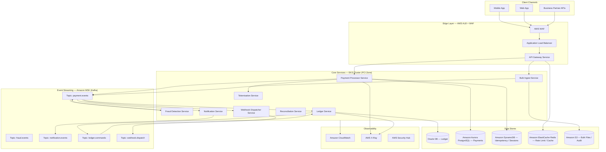
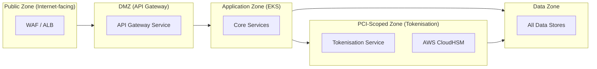
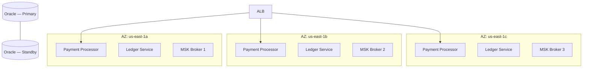

# Section 3 — Architecture Topology

## 3.1 High-Level Architecture

## 3.2 Network Zones and Segmentation

PayStream is deployed across four distinct network zones in AWS, enforced through VPC security groups and NACLs:

| Zone | Components | Inbound Allowed From | Egress Allowed To |
|------|-----------|---------------------|------------------|
| Public | AWS WAF, ALB | Internet | DMZ only |
| DMZ | API Gateway Service | Public Zone | App Zone only |
| Application | All core microservices | DMZ | Data Zone, Messaging, PCI Zone |
| PCI-Scoped | Tokenisation Service, CloudHSM | App Zone (payment paths only) | Data Zone (token vault only) |
| Data | All data stores | App Zone, PCI Zone | None (no external egress) |

## 3.3 Multi-AZ Topology

All Tier 1 services are deployed across 3 AWS Availability Zones (`us-east-1a`, `us-east-1b`, `us-east-1c`) to meet the 99.99% availability SLO and < 5 min RTO.

## 3.4 Deployment Model

| Layer | Technology | Deployment Unit |
|-------|-----------|----------------|
| Container orchestration | AWS EKS (Kubernetes 1.28+) | EKS Managed Node Groups, auto-scaling |
| Service mesh | AWS App Mesh | Envoy sidecar per pod |
| Container registry | Amazon ECR | Per-service image repository |
| Infrastructure-as-Code | AWS CDK (TypeScript) | Per-environment stacks |
| CI/CD | GitHub Actions + ArgoCD | GitOps; environment promotion via PR |
| Secrets | AWS Secrets Manager | Injected at pod startup via CSI driver |
| Configuration | AWS Systems Manager Parameter Store | Non-secret runtime config |
