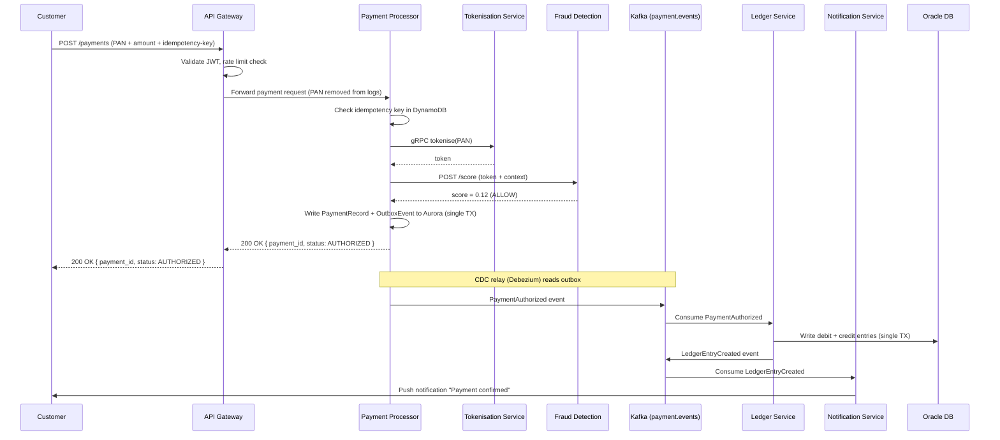
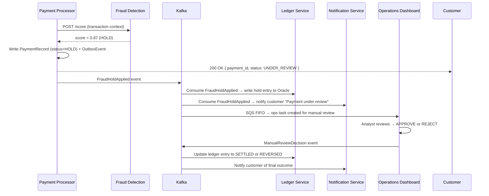
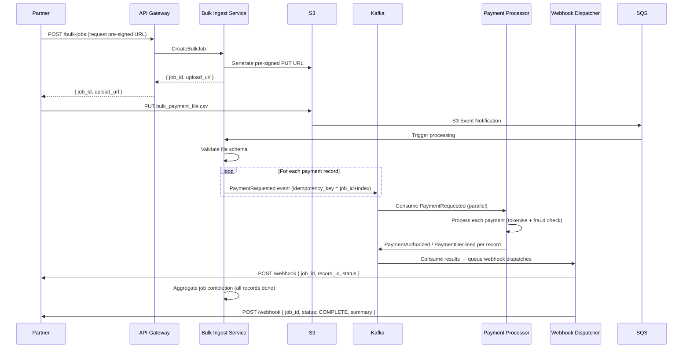
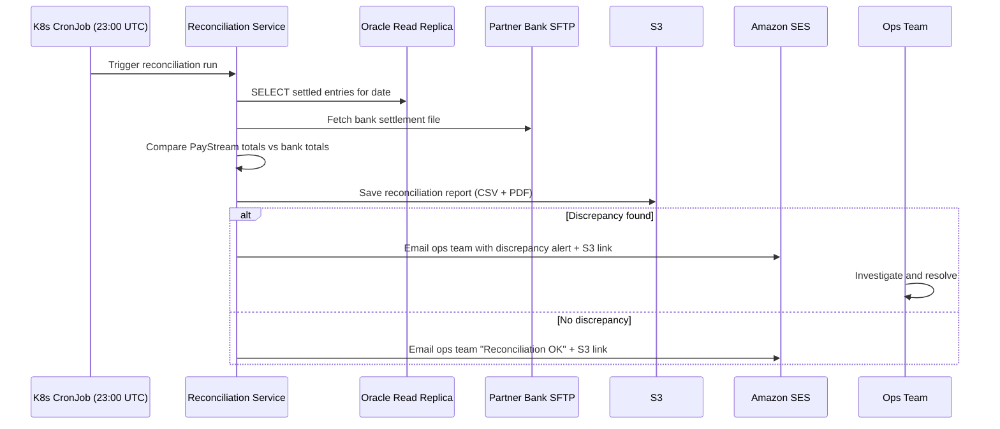

# Section 5 — Data Flow Patterns

## 5.1 Consumer Payment Flow (Happy Path)

The primary flow for a consumer initiating a card payment via mobile or web.



**End-to-end latency budget**:

| Segment | Budget |
|---------|--------|
| API Gateway (auth + routing) | 50 ms |
| Payment Processor (validation + idempotency check) | 100 ms |
| Tokenisation Service (gRPC) | 10 ms |
| Fraud Detection (inline score) | 200 ms |
| Aurora write (payment record + outbox) | 50 ms |
| API response to customer | ≤ 410 ms subtotal |
| Kafka CDC relay + Ledger write (async) | ≤ 1.5 s async |
| **Total customer-visible P99** | **≤ 2 s** |

---

## 5.2 Fraud Hold Flow

Triggered when the Fraud Detection Service scores a transaction above the hold threshold.



---

## 5.3 Partner Bulk Processing Flow



---

## 5.4 End-of-Day Reconciliation Flow



---

## 5.5 Event Schema (Kafka)

### `payment.events` — `PaymentAuthorized`

```json
{
  "event_type": "PaymentAuthorized",
  "event_id": "uuid-v4",
  "payment_id": "uuid-v4",
  "idempotency_key": "string",
  "token": "string (opaque card token)",
  "amount": { "value": "decimal", "currency": "ISO-4217" },
  "merchant_id": "string",
  "customer_id": "string (hashed, GDPR)",
  "timestamp": "ISO-8601",
  "schema_version": "1.0"
}
```

### `fraud.events` — `FraudHoldApplied`

```json
{
  "event_type": "FraudHoldApplied",
  "event_id": "uuid-v4",
  "payment_id": "uuid-v4",
  "fraud_score": "float [0.0–1.0]",
  "triggered_rules": ["string"],
  "timestamp": "ISO-8601",
  "schema_version": "1.0"
}
```

All events conform to a schema registry (AWS Glue Schema Registry with Avro). Producers must register and validate against the schema before publishing; consumers reject unregistered schema versions.
