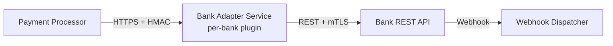

# Section 6 — Integration Points

## 6.1 Integration Inventory

| # | Integration | Direction | Protocol | Auth | SLA |
|---|------------|-----------|----------|------|-----|
| 1 | Amazon Cognito (Consumer Auth) | Inbound | OIDC / JWT | mTLS to Cognito JWKS | N/A (external) |
| 2 | Banking Partner APIs (3 banks) | Bidirectional | REST HTTPS | HMAC-signed API keys | ≥ 99.9% |
| 3 | AWS CloudHSM (Key Management) | Internal | PKCS#11 | IAM + HSM partition PIN | < 1 ms |
| 4 | AWS Glue Schema Registry | Internal | HTTP | IAM role | N/A |
| 5 | Amazon MSK (Kafka) | Internal | Kafka protocol | IAM + mTLS | ≥ 99.99% (SLA) |
| 6 | Oracle Database (Ledger) | Internal | JDBC/OCI | IAM DB Auth + SSL | Managed by DBA |
| 7 | Partner Bank SFTP (Settlement) | Outbound | SFTP | SSH key pair | Best-effort |
| 8 | Amazon SES (Email) | Outbound | HTTPS | IAM | ≥ 99.9% |
| 9 | Amazon SNS (Push) | Outbound | HTTPS | IAM | ≥ 99.9% |
| 10 | Amazon Pinpoint (SMS) | Outbound | HTTPS | IAM | ≥ 99.9% |

## 6.2 Banking Partner Integration

PayStream integrates with 3 external banking partners to support payment authorisation and settlement. Each bank exposes a REST API with bank-specific authentication.

**Integration architecture** (per bank):

**Bank Adapter Service** (planned for Month 3 MVP):
- Thin per-bank adapter implementing a common `BankGateway` interface.
- Handles bank-specific request/response transformation, retry logic, and circuit-breaking.
- Deployed as a separate microservice per bank to isolate failures.
- Each adapter stores its credentials (API key, client certificate) in AWS Secrets Manager; rotated on bank-defined schedule.

**Onboarding checklist** (per new banking partner):
1. Provision bank-specific API credentials in Secrets Manager.
2. Deploy bank adapter container image (parameterised by bank config).
3. Register partner webhook endpoint in Webhook Dispatcher subscription table.
4. Run integration smoke test suite in staging environment.
5. Enable partner in API Gateway routing table.

## 6.3 Amazon Cognito (Consumer Identity)

End customers authenticate via Amazon Cognito User Pools.

- **Flow**: Standard OAuth 2.0 Authorization Code with PKCE (mobile) or Implicit flow (web — deprecated in favour of PKCE).
- **Token lifespan**: Access token 15 minutes; refresh token 30 days.
- **MFA**: Required for transactions > $500 USD (configurable threshold).
- **API Gateway** validates JWT signature against Cognito JWKS endpoint (cached locally with 5-minute TTL).

## 6.4 AWS CloudHSM (PCI Key Management)

Tokenisation Service uses AWS CloudHSM for all cryptographic operations. Raw keys never leave the HSM.

- **Key type**: AES-256-GCM for PAN encryption; RSA-4096 for HSM cluster authentication.
- **Access**: Tokenisation Service pods access HSM via PKCS#11 interface; HSM cluster is in the PCI-scoped VPC subnet.
- **Key rotation**: Automatic 90-day rotation; CloudHSM audit log forwarded to CloudWatch for PCI evidence.

## 6.5 Amazon MSK (Apache Kafka)

All async inter-service communication flows through Amazon MSK (managed Kafka).

**Cluster configuration**:
- 3 brokers (one per AZ), `kafka.m5.xlarge`
- Replication factor: 3 for all PCI-relevant topics; 2 for operational topics
- Retention: 7 days (payment.events), 30 days (audit.events), 24 hours (notification.events)
- Encryption: TLS in-transit; AES-256 at-rest (AWS-managed KMS key)
- Authentication: IAM-based MSK authentication (IAM role per service, least-privilege policy)

**Topic inventory**:

| Topic | Producers | Consumers | Partitions | Retention |
|-------|-----------|-----------|-----------|-----------|
| `payment.events` | Payment Processor, Bulk Ingest | Fraud Detection, Ledger, Notification, Webhook Dispatcher | 30 | 7 days |
| `fraud.events` | Fraud Detection | Ledger, Notification | 10 | 7 days |
| `ledger.commands` | Ledger Service (internal) | Ledger Service | 10 | 7 days |
| `notification.events` | Notification Service | Notification Service | 10 | 24 hours |
| `webhook.dispatch` | Webhook Dispatcher | Webhook Dispatcher | 15 | 3 days |
| `audit.events` | All services | Audit Log Service (future) | 10 | 30 days |

## 6.6 Oracle Database (Ledger Constraint)

The Ledger Service is the sole writer to the existing Oracle 19c instance (finance team mandate — migration prohibited).

**Connection management**:
- Connection pool: HikariCP, max 100 connections, min-idle 10.
- Connections encrypted via Oracle SSL (TLS 1.2+).
- Authentication: Oracle DB user with restricted privileges (INSERT on ledger schema only; no DDL, no DELETE).
- Read replica used by Reconciliation Service.

**Schema ownership**: The Oracle schema is managed by the DBA team via Flyway scripts in a separate repository. PayStream Ledger Service reads the schema version from a metadata table on startup; refuses to start if schema version < expected.

## 6.7 Partner SFTP (Settlement Files)

Reconciliation Service fetches daily settlement files from each bank via SFTP.

- SSH key pairs managed in AWS Secrets Manager (per bank).
- SFTP transfers run from a dedicated egress VPC NAT Gateway with fixed IP; banks whitelist this IP.
- Files downloaded to ephemeral EFS volume, processed, then deleted. Processed copies archived to S3 with 7-year retention (PCI requirement).
