# Section 10 — Operational Considerations

## 10.1 Observability Stack

PayStream follows the three-pillar observability model: logs, metrics, and traces. All three are required before a service can be promoted to production.

### Logs

- **Format**: Structured JSON (all services); includes `service`, `trace_id`, `span_id`, `level`, `timestamp`, `message`.
- **Destination**: CloudWatch Logs; one log group per service (`/paystream/<service-name>`).
- **Retention**: 90 days hot (CloudWatch); 7 years cold (S3 via CloudWatch export + Object Lock).
- **PII/PCI protection**: CloudWatch Log Data Protection enabled; PAN-pattern masking rule applied to all log groups. API Gateway strips `pan` and `cvv` fields before logging.
- **Log levels**: `ERROR` and `WARN` always on; `INFO` on in production; `DEBUG` off in production (togglable via Parameter Store without restart).

### Metrics

- **Infrastructure**: CloudWatch Metrics (EKS node groups, ALB, MSK, Aurora, DynamoDB, ElastiCache).
- **Application**: Prometheus (scraped by AWS Distro for OpenTelemetry Collector deployed as DaemonSet); metrics exposed at `/metrics` on port 9090.
- **Dashboards**: Amazon Managed Grafana with pre-built dashboards per service. Shared operations dashboard for real-time transaction rate, P99 latency, error rate, and Kafka consumer lag.
- **Key metrics per service**:

| Service | Key Metrics |
|---------|------------|
| API Gateway | `http_requests_total`, `http_request_duration_p99`, `rate_limit_rejections_total` |
| Payment Processor | `payments_authorized_total`, `payments_declined_total`, `outbox_relay_lag_ms` |
| Fraud Detection | `fraud_score_p99`, `fraud_holds_total`, `model_inference_duration_p99` |
| Ledger Service | `ledger_writes_total`, `oracle_connection_pool_active`, `settlement_lag_seconds` |
| Kafka (MSK) | `consumer_lag` per group, `messages_in_per_sec`, `bytes_in_per_sec` |

### Traces

- **Tool**: AWS X-Ray; all services instrument with AWS X-Ray SDK / OTEL exporter.
- **Sampling**: 5% of all requests sampled; 100% of requests that return 5xx or have latency > 1 s.
- **Trace propagation**: `X-Amzn-Trace-Id` header propagated from ALB through all service calls including Kafka message headers.
- **Service map**: X-Ray service map reviewed by SRE weekly for latency anomalies.

## 10.2 Alerting and On-Call

### Alert Tiers

| Tier | Description | Response | Channel |
|------|-------------|----------|---------|
| P1 — Critical | Payment processing down; SLO breach imminent (P99 > 1.8 s); Oracle DB unavailable | Page on-call SRE immediately | PagerDuty (phone + SMS) |
| P2 — High | Consumer lag > 5,000 on payment.events; Aurora failover in progress; fraud model latency degraded | Page on-call SRE within 5 min | PagerDuty (push) |
| P3 — Medium | Webhook delivery failure rate > 5%; Bulk ingest job stalled > 10 min | Notify SRE Slack channel | Slack #alerts |
| P4 — Low | Certificate expiry < 30 days; dependency CVE advisory | Email SRE team | Email |

### On-Call Structure

- 2 SRE in rotation (weekly rotation).
- Primary SRE: first responder.
- Escalation path: Primary SRE → Engineering Lead (Carlos Mendez) → Director of Engineering.
- All runbooks maintained in `/docs/runbooks/`; linked directly from PagerDuty alert.

## 10.3 Deployment Pipeline

```mermaid
graph LR
    Dev[Developer Push] --> CI[GitHub Actions CI]
    CI --> |Run tests + SAST + build image| ECR[Push to ECR]
    ECR --> |Promote SHA to staging values| ArgoCD_Staging[ArgoCD — Staging]
    ArgoCD_Staging --> |Smoke tests pass| PR[PR to production values]
    PR --> |Manual approval: Engineering Lead| ArgoCD_Prod[ArgoCD — Production]
    ArgoCD_Prod --> |Rolling update| EKS[EKS Production]
```

**Deployment strategy**: Rolling update with `maxSurge: 1, maxUnavailable: 0` for Tier 1 services; ensures zero-downtime deploys.

**Release gates**:
1. All unit tests pass (≥ 95% coverage).
2. SAST scan (CodeQL) — zero high/critical findings.
3. ECR image scan — zero critical CVEs.
4. Integration tests pass in staging (automated via GitHub Actions).
5. Load test in staging — P99 ≤ 2 s at 3× expected load.
6. Manual approval from Engineering Lead (production only).

**Rollback**: ArgoCD sync to previous GitOps commit (< 2 min); DB migrations are backward-compatible so rollback does not require DB changes.

## 10.4 Configuration Management

| Config Type | Store | Mechanism |
|------------|-------|-----------|
| Secrets (DB passwords, API keys, HSM credentials) | AWS Secrets Manager | CSI Secrets Store Driver; mounted as environment variables at pod startup |
| Non-secret runtime config (feature flags, limits) | AWS SSM Parameter Store | Polled every 60 s; no pod restart required |
| Service-level config (connection pool size, Kafka topics) | Kubernetes ConfigMaps | Updated via GitOps; pod restart on change |
| Infrastructure config | AWS CDK TypeScript stacks | Deployed via CDK Pipelines; per-environment parameter files |

## 10.5 Disaster Recovery

### Backup Schedule

| Data Store | Backup Frequency | Retention | Recovery Method |
|-----------|-----------------|-----------|----------------|
| Oracle (Ledger) | Continuous redo log + daily full | 30 days | Oracle Data Guard failover; point-in-time recovery |
| Aurora PostgreSQL | Continuous (< 5-min point-in-time) | 35 days | Aurora restore from snapshot or PITR |
| DynamoDB | Continuous PITR | 35 days | DynamoDB PITR restore |
| S3 (bulk files, reports, audit) | Versioning + cross-region replication to `us-west-2` | 7 years | S3 restore from version |
| MSK (Kafka) | Broker replication (RF=3) | 7 days topic retention | Consumer replay from offset; MSK backups via MirrorMaker 2 to DR region |

### DR Runbook (Tier 1 Services)

1. **Detection**: P1 alert fires (< 1 min); SRE acknowledges.
2. **Assessment**: SRE checks X-Ray service map + CloudWatch dashboard (< 2 min).
3. **Failover decision**: If AZ failure → ALB automatically routes away from failed AZ (< 30 s automatic). If multi-AZ failure → initiate DR runbook.
4. **DB Failover**: Oracle Data Guard Observer auto-promotes standby (< 2 min). Aurora auto-failover to read replica (< 30 s).
5. **Traffic validation**: SRE validates payment flow end-to-end in production (smoke test suite, 2 min).
6. **Total RTO target**: < 5 minutes.

## 10.6 Change Management

| Change Type | Process | Approval |
|------------|---------|----------|
| Standard deploy (feature / bug fix) | GitOps PR → CI gates → manual approval | Engineering Lead |
| Emergency hotfix | Expedited CI gates (5 min fast-lane) → deploy | Engineering Lead + on-call SRE |
| Schema migration | Flyway script in PR; backward-compatible mandatory | DBA team + Engineering Lead |
| PCI-scoped change (Tokenisation, HSM) | Standard deploy + Compliance Officer sign-off | Engineering Lead + Compliance Officer |
| Infrastructure change (CDK) | CDK diff reviewed in PR; staging first | Engineering Lead |

## 10.7 Capacity Planning

- **Review cadence**: Monthly capacity review (SRE + Engineering Lead).
- **Trigger**: Scale review if any metric exceeds 70% of capacity for 3 consecutive days.
- **EKS node scaling**: Cluster Autoscaler provisions/deprovisions nodes (`m6i.2xlarge`); 15-minute warm-up buffer maintained.
- **Aurora**: Serverless v2 ACU scaling (min 2 ACU / max 64 ACU) handles burst without pre-provisioning.
- **MSK**: Broker storage auto-scaled; broker count upgraded (vertical) if sustained throughput > 60% of capacity.
- **Oracle**: Coordinate with DBA team for Oracle licence and capacity planning; 6-week lead time for capacity increase.

## 10.8 SRE Runbooks (Index)

| Runbook | Trigger | Location |
|---------|---------|---------|
| Payment Processing Down | P1 alert: zero authorizations in 60 s | `/docs/runbooks/payment-processor-down.md` |
| Oracle DB Unreachable | P1 alert: Ledger Service health check failing | `/docs/runbooks/oracle-db-failover.md` |
| High Fraud Hold Rate | P2 alert: hold rate > 10% of volume | `/docs/runbooks/fraud-hold-spike.md` |
| Kafka Consumer Lag | P2 alert: consumer lag > threshold | `/docs/runbooks/kafka-consumer-lag.md` |
| Webhook Delivery Failures | P3 alert: delivery failure rate > 5% | `/docs/runbooks/webhook-failures.md` |
| Certificate Expiry | P4 alert: cert expiry < 30 days | `/docs/runbooks/cert-renewal.md` |
| Partner Onboarding | Manual trigger | `/docs/runbooks/partner-onboarding.md` |
