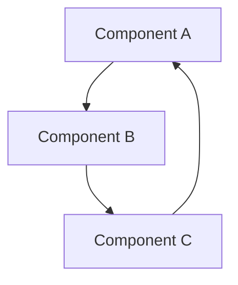

# Coupling / Fan-out Analysis Spec

## Purpose

This spec defines how the `architecture-analysis-agent` performs a Coupling and Fan-out analysis. It builds the directed dependency graph of all components, computes afferent/efferent coupling and instability metrics, classifies high-risk structural patterns (critical hubs, volatile leaves, god objects, cycles), and generates recommendations to reduce structural risk.

**Output file**: `analysis/COUPLING-<YYYY-MM-DD>.md`

---

## Dependency Graph Construction

Before classification, build the directed dependency graph: a list of directed edges `A → B` meaning "A depends on B".

**Sources (in priority order):**

1. `docs/05-integration-points.md` — explicit consumer/producer relationships, API calls, event subscriptions
2. `docs/04-data-flow-patterns.md` — per-flow sequences (extract each hop as a dependency edge)
3. `docs/components/**/*.md` — "Depends On", "Consumed By", "Integrations", or "Calls" sections
4. `docs/03-architecture-layers.md` — layer-to-layer dependency arrows in Mermaid diagrams
5. ARCHITECTURE.md Section 5 (integration map) and Section 4 (data flows) as fallback

**Component inventory**: the complete node list from `docs/components/README.md`. Every listed component must appear in the graph even if it has no edges (isolated components are noted in the Summary Verdict).

**External dependencies**: include external systems (third-party SaaS, external APIs) as nodes if they are depended on by internal components. They contribute to fan-out counts but are excluded from fan-in computation (external systems don't depend on internal components in the architectural sense).

---

## Coupling Metrics

For each internal component, compute:

| Metric | Definition |
|--------|-----------|
| **Fan-in (Ca)** | Number of other components that depend on this component (afferent coupling) |
| **Fan-out (Ce)** | Number of components this component depends on (efferent coupling) — includes external dependencies |
| **Instability (I)** | I = Ce / (Ca + Ce) — ranges 0 (maximally stable) to 1 (maximally unstable) |
| **Abstractness note** | Not computed (requires code analysis) — flag if needed in Documentation Gaps |

---

## Classification

Classify each component. A component may hold more than one classification (e.g., a component can be both K1 and K3).

### K1 — Critical Hub (High Fan-in)

- **Threshold**: Fan-in ≥ 5
- **Risk**: Many components break if this one fails or changes its interface. Instability is LOW but criticality is HIGH.
- **Note**: Combine with SPOF analysis — K1 components with no redundancy are doubly risky (cite SPOF analysis if present in `analysis/SPOF-*.md`).

**Table columns:**
```
# | Component | Fan-in | Instability (I) | Dependents (list)
```
- `#` = K1-01, K1-02 …
- `Dependents` = comma-separated list of components that depend on this one

### K2 — Volatile Leaf (High Fan-out)

- **Threshold**: Fan-out ≥ 5
- **Risk**: Component depends on many others — any of its dependencies failing or changing its interface breaks this component. Instability is HIGH.
- **Note**: High fan-out components are hard to test in isolation.

**Table columns:**
```
# | Component | Fan-out | Instability (I) | Dependencies (list)
```
- `#` = K2-01, K2-02 …
- `Dependencies` = comma-separated list of components this one depends on

### K3 — God Object (High Fan-in AND High Fan-out)

- **Threshold**: Fan-in ≥ 3 AND Fan-out ≥ 3
- **Risk**: Component has both high criticality (many depend on it) and high instability (depends on many). Change is risky in both directions. Prime decomposition candidate.

**Table columns:**
```
# | Component | Fan-in | Fan-out | Instability (I) | Risk Narrative
```
- `#` = K3-01, K3-02 …
- `Risk Narrative` = 1-sentence description of why this coupling is architecturally risky

### K4 — Cyclical Dependency

- **Definition**: any directed cycle in the component graph (A → B → C → A, or even A → B → A)
- **Risk**: Cycles prevent independent deployment, make change propagation unpredictable, and indicate hidden coupling or circular data ownership.

**Detection procedure**: Walk the graph and identify all strongly connected components (cycles). List each cycle as an ordered path.

For each detected cycle:
- List the components in cycle order: `A → B → C → A`
- Cite the source files that document each dependency edge in the cycle
- Classify the coupling type: Synchronous call / Event / Shared data store / Callback

**Table columns:**
```
# | Cycle Path | Coupling Type | Source Citations
```
- `#` = K4-01, K4-02 …

**Mermaid cycle subgraph** (for each K4 cycle):


---

## Distribution Histogram

Build an ASCII histogram of fan-in and fan-out values across all components:

```
Fan-in Distribution                Fan-out Distribution
Count                              Count
  5 │ ██                             5 │ █
  4 │ ███                            4 │ ██
  3 │ █████                          3 │ ████
  2 │ ███████                        2 │ ██████
  1 │ ████████                       1 │ ████████
    └──────────────                    └──────────────
      0  1  2  3  4  5+                 0  1  2  3  4  5+
```

This gives an at-a-glance view of how coupling is distributed — a long tail to the right indicates a hub-and-spoke structure.

---

## Report Sections (in order)

1. **Executive Summary** — total components, K1/K2/K3/K4 counts, most-coupled component, one-line structural verdict
2. **Coupling Metrics Table** — all components with fan-in, fan-out, instability, classification flags
3. **Critical Hubs (K1)** — full table (omit section if no K1 components)
4. **Volatile Leaves (K2)** — full table (omit section if no K2 components)
5. **God Objects (K3)** — full table with risk narrative (omit section if no K3 components)
6. **Cyclical Dependencies (K4)** — table + Mermaid subgraphs for each cycle (omit section if no cycles detected)
7. **Fan-in / Fan-out Distribution** — ASCII histogram
8. **Top 5 Decoupling Recommendations** — ordered by (risk tier × coupling count); each cites finding ID + source file
9. **Summary Verdict** — structural risk posture: stability vs. instability distribution, whether the architecture is hub-and-spoke vs. layered vs. mesh, coupling debt identified
10. **Documentation Gaps** — components with no documented dependencies (not provably isolated — just undocumented), edges inferred from diagrams only (no textual confirmation)

---

## Evidence Extraction Priority

| Data needed | Primary source | Fallback |
|-------------|---------------|---------|
| Full component list | `docs/components/README.md` | ARCHITECTURE.md Section 5 component table |
| Dependency edges (API calls) | `docs/05-integration-points.md` | Component `.md` "Calls" / "Integrations" sections |
| Dependency edges (data flows) | `docs/04-data-flow-patterns.md` sequences | ARCHITECTURE.md Section 4 |
| Dependency edges (diagrams) | Mermaid in `docs/03-architecture-layers.md` (extract edges from `-->` arrows) | ARCHITECTURE.md Section 3 diagrams |
| Consumer/producer relationships | `docs/05-integration-points.md` event/queue section | Component `.md` "Consumes From" / "Publishes To" |
| External system nodes | `docs/05-integration-points.md` external systems table | ARCHITECTURE.md Section 5 |
