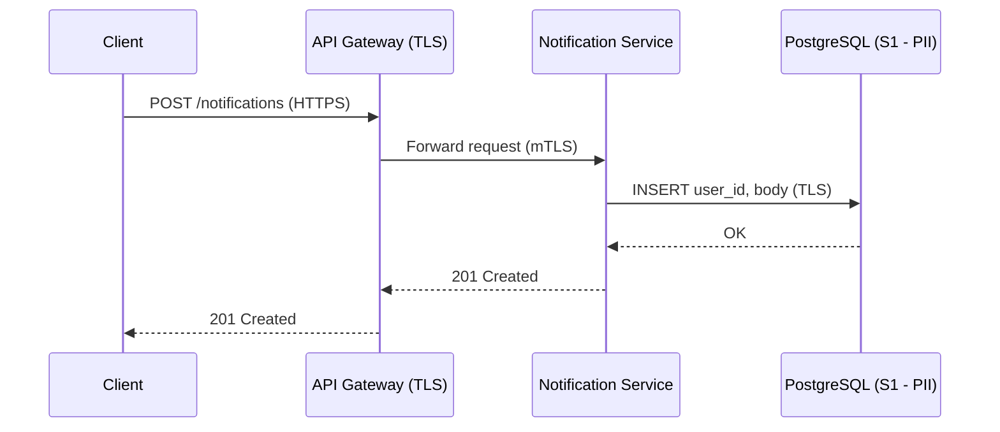

# Data Sensitivity & Flow Analysis Spec

## Purpose

This spec defines how the `architecture-analysis-agent` performs a Data Sensitivity and Flow analysis. It classifies every data store, queue, and cache by sensitivity tier, traces data flows involving sensitive data, identifies encryption and retention gaps, and generates data protection recommendations. It cross-references existing compliance contracts when available.

**Output file**: `analysis/DATA-SENSITIVITY-<YYYY-MM-DD>.md`

---

## Classification Model

### Data Sensitivity Tiers

Apply to every data store, queue, cache, and log target documented in the architecture.

| Tier | Label | Examples | Controls Required |
|------|-------|---------|-------------------|
| **S1** | Restricted | PII, PHI, payment card data, credentials, API keys, signing keys, PII-adjacent (user IDs linkable to individuals) | Encryption in transit (TLS 1.2+), encryption at rest (envelope/TDE), access logging, data masking in logs, retention ceiling per compliance policy, deletion guarantee |
| **S2** | Confidential | Internal business data (contracts, pricing, internal metrics), session tokens, non-PII user preferences | Encryption in transit required, encryption at rest recommended, access control required |
| **S3** | Internal | Operational metadata, aggregate/anonymized metrics, deployment state, non-sensitive config | Access control recommended; encryption best-effort |
| **S4** | Public | Publicly served content, open API responses, documentation | No special controls required |
| **Unknown** | Undocumented sensitivity | Store/flow exists in docs but no data classification is stated | Must appear in Documentation Gaps |

---

## Data Inventory

Enumerate all data stores, queues, and caches from:
- `docs/components/**/*.md` — "Stores", "Data Model", "DDL", or "Redis Key Schema" sections
- `docs/02-data-architecture.md` — entity model, data stores list
- `docs/07-security-architecture.md` — data classification table (if present)
- `compliance-docs/DATA_AI_*.md` — data governance section (if present)
- ADRs mentioning specific data stores or their data content

**Data Inventory table:**
```
Store / Queue / Cache | Type | Sensitivity Tier | Contains (examples) | Encryption at Rest | Encryption in Transit | Retention Policy | Source
```

- `Type` = relational DB / document store / object store / message queue / cache / log / search index
- `Contains (examples)` = 2–3 representative data field types (e.g., "user_id, email, notification_text")
- Encryption = Documented / Not Documented / None (if explicitly stated as unencrypted)
- `Retention Policy` = documented period (e.g., "90 days") or "[NOT DOCUMENTED]"

---

## Sensitive Data Flow Map

Identify and trace every data flow that **touches an S1 or S2 data store**.

For each sensitive flow:
1. Extract the flow path from `docs/04-data-flow-patterns.md` (or ARCHITECTURE.md Section 4)
2. Trace only the portion of the flow that carries sensitive data
3. Classify each hop's transport security

**Per-flow analysis table:**
```
Step | From | To | Protocol | Carries Sensitive Data? | Encryption in Transit | Gap
```
- `Protocol` = HTTPS / gRPC-TLS / mTLS / AMQP / plain HTTP / Redis protocol / internal cluster / etc.
- `Gap` = G1–G5 classification (see below) or "None"

**Render Mermaid sequence diagrams for the top 3 flows touching S1 (Restricted) data:**



Annotate each arrow with the transport protocol and whether it is encrypted.

---

## Gap Classification

For each S1 or S2 data store or flow, check for the following gaps:

| Gap | Definition | Severity |
|-----|-----------|---------|
| **G1** | S1 data flows over unencrypted transport (plain HTTP, unencrypted queue, etc.) | CRITICAL |
| **G2** | S1 data stored without encryption at rest (no TDE, no envelope encryption) | CRITICAL |
| **G3** | Retention period exceeds the compliance ceiling documented in the architecture (e.g., GDPR 30-day deletion SLA, PCI 90-day log retention max) | HIGH |
| **G4** | S1 data crosses a trust boundary without an explicit ADR or security architecture decision authorizing it | HIGH |
| **G5** | Data store sensitivity is undocumented — cannot assess controls | MEDIUM |

**Cross-reference check**: if `compliance-docs/SECURITY_*.md` exists, scan its Non-Compliant rows for items related to data encryption, access control, or retention. Cite the relevant compliance requirement code alongside the G-prefix gap. Do the same for `compliance-docs/DATA_AI_*.md`.

---

## Encryption Gaps Table

Collect all G1 and G2 findings:

```
# | Gap | Data Store / Flow | Sensitivity | Protocol / Storage | Missing Control | Source
```
- `#` = G1-01, G1-02 … / G2-01, G2-02 …

---

## Retention Gaps Table

Collect all G3 findings:

```
# | Data Store | Documented Retention | Compliance Ceiling | Overage | Source
```
- `Compliance Ceiling` = the retention limit stated in the architecture's compliance policy or ADRs; "[NOT DOCUMENTED]" if the policy is not in the docs

---

## Heat Map

Build a **3×3 ASCII heat map**:
- **Y-axis (vertical)**: Sensitivity — S4/Unknown (bottom) to S1 Restricted (top)
- **X-axis (horizontal)**: Control Coverage — FULL (left) to NONE (right)

**Control Coverage scoring:**
- FULL = encryption in transit + at rest + access logging + retention policy all documented
- PARTIAL = some controls documented but not all required for the tier
- NONE = no controls documented (or explicitly absent)

Plot data store / flow IDs at their coordinates (e.g., "G1-01", "G3-02").

```
         S1 - RESTRICTED
              │
  [...]  ─────┼───── [...]
              │
  [...]  ─────┼───── [...]
              │
  [...]  ─────┼───── [...]
              │
         S4 - PUBLIC
   FULL ──────┼──────── NONE
         CONTROL COVERAGE
```

---

## Report Sections (in order)

1. **Executive Summary** — total S1/S2/S3/S4/Unknown stores, G1–G5 gap counts, highest-risk finding, one-line data protection verdict
2. **Data Inventory** — full table (all classified stores, queues, caches)
3. **Sensitive Data Flow Map** — per-flow analysis table + Mermaid diagrams for top-3 S1 flows
4. **Encryption Gaps (G1 + G2)** — critical gap table (omit section if no gaps found)
5. **Retention Gaps (G3)** — retention table (omit section if no documented retention ceiling)
6. **Cross-Boundary Leakage (G4)** — list of unauthorized trust-boundary crossings (omit if none)
7. **Data Sensitivity Heat Map** — sensitivity × control coverage (3×3 ASCII)
8. **Top 5 Data Protection Recommendations** — ordered by (severity × sensitivity tier); each cites finding ID + source file + compliance contract reference if applicable
9. **Compliance Cross-Reference** — table linking G-prefix findings to Non-Compliant rows in `compliance-docs/SECURITY_*.md` and `compliance-docs/DATA_AI_*.md` (omit section if no compliance contracts present)
10. **Summary Verdict** — overall data protection posture: what is protected, what is exposed, where the compliance ceiling is breached
11. **Documentation Gaps** — stores with undocumented sensitivity (G5), flows with no documented transport protocol, retention policies not stated

---

## Evidence Extraction Priority

| Data needed | Primary source | Fallback |
|-------------|---------------|---------|
| Data store list | `docs/components/README.md` (Type = database/cache/queue) | ARCHITECTURE.md Section 5 |
| Data classification | `docs/07-security-architecture.md` data classification table | `docs/02-data-architecture.md` |
| Data field examples | `docs/components/**/*.md` DDL / Redis key schema / data model sections | ARCHITECTURE.md Section 2 |
| Encryption at rest | Component `.md` files "Security" section | `docs/07-security-architecture.md` |
| Encryption in transit | `docs/07-security-architecture.md` trust boundary controls | `docs/05-integration-points.md` security column |
| Data flows | `docs/04-data-flow-patterns.md` | ARCHITECTURE.md Section 4 |
| Retention policy | `docs/09-operational-considerations.md` backup/retention section | Component `.md` files / ADRs |
| Compliance ceiling | ADRs referencing GDPR, PCI, HIPAA, data retention policy | `docs/10-compliance.md` |
| Existing compliance gaps | `compliance-docs/SECURITY_*.md`, `compliance-docs/DATA_AI_*.md` | Not available if compliance contracts not generated |
| Trust boundary definitions | `docs/07-security-architecture.md` trust boundary inventory | ARCHITECTURE.md Section 7 |
