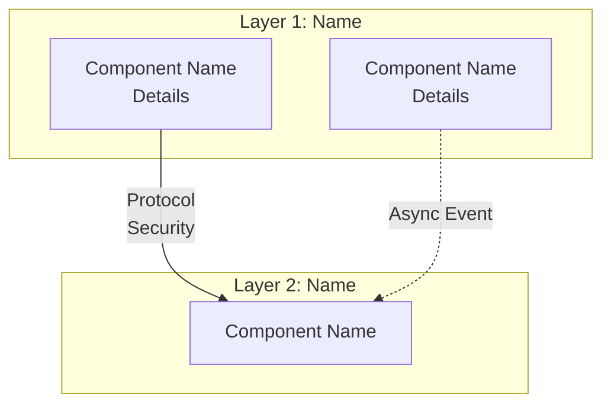

# Architecture Documentation Guide

> A comprehensive guide for creating system architecture documentation ARCHITECTURE.md

## Purpose

This guide provides a structured approach to documenting complex system architectures. Incorporates industry best practices for technical documentation.

**Use this guide when:**
- Starting a new system architecture from scratch
- Documenting an existing system's architecture
- Standardizing architecture documentation across multiple projects
- Onboarding teams to a new system
- Communicating architecture decisions to stakeholders

## Related Documentation

This guide focuses on **what to write** and **how to structure** architecture documentation content.

For supporting operations and algorithms:
- **→ SKILL.md**: Operational workflows, when to trigger actions, context-efficient editing strategies
- **→ METRIC_CALCULATIONS.md**: Algorithms for index updates and metric consistency detection
- **→ DESIGN_DRIVER_CALCULATIONS.md**: Implementation details for Design Drivers calculation
- **→ VALIDATIONS.md**: Structure enforcement rules, required principles, section name validation
- **→ ADR_GUIDE.md**: Architectural Decision Record format and creation guidelines
- **→ RESTRUCTURING_GUIDE.md**: Multi-file docs/ directory structure, naming conventions, cross-reference conventions, verification checklist

## C4 Model Alignment

Components in this architecture follow the **C4 model** (IcePanel convention):

### C4 Level 1 — Systems
Systems are logical groups of applications and data stores, typically owned by a single development team. In multi-system architectures, each system becomes a **folder** under `docs/components/`.

### C4 Level 2 — Containers
Each component file represents a **container** — a separately deployable/runnable unit. Containers are classified as:

| Type | C4 Category | Examples |
|------|------------|---------|
| API Service | App | REST API, GraphQL server, gRPC service |
| Web Application | App | SPA, SSR frontend, admin portal |
| Worker/Consumer | App | Message consumer, background processor, scheduler |
| Database | Store | PostgreSQL, MongoDB, SQL Server |
| Cache | Store | Redis, Memcached |
| Message Broker | Store | Kafka, RabbitMQ, Azure Service Bus |
| Object Storage | Store | S3, Azure Blob, MinIO |
| Gateway | App | API Gateway, reverse proxy, load balancer |

### Boundary Test
Before creating a component file, verify:
- "Can this be deployed independently?" → YES = valid container
- "Does this run as its own process/container?" → YES = valid container
- Code module inside a deployable → NOT a container (C3 level — document within parent)
- External system you don't own → NOT a container (reference in integration docs)

### Naming Convention (IcePanel)
- Technology in brackets: `[Spring Boot 3.2]`, `[PostgreSQL 16]`, `[React 18 SPA]`
- Communication protocols on relationships: HTTPS, gRPC, AMQP, TCP

---

## Architecture Type Selection

**Before creating your ARCHITECTURE.md, choose your architecture type.** The architecture type determines the structure and content of **Section 4 (Meta Architecture)** and **Section 5 (Component Details)**.

### Available Architecture Types

1. **META Architecture** - 6-layer enterprise model for large systems with complex integrations
2. **3-Tier Architecture** - Classic web application pattern (Presentation → Application → Data)
3. **Microservices Architecture** - Cloud-native distributed systems with independent services
4. **N-Layer Architecture** - Customizable patterns (DDD, Clean Architecture, Hexagonal)

### How to Select

When creating a new ARCHITECTURE.md, the skill will prompt you to select your architecture type. Refer to:
- **`templates/ARCHITECTURE_TYPE_SELECTOR.md`** - Decision guide with comparison matrix

### Type-Specific Templates

Each architecture type has dedicated templates:
- **Section 4 Templates**: `templates/SECTION_4_*.md` (layer/tier structure)
- **Section 5 Templates**: `templates/SECTION_5_*.md` (component organization)

The skill automatically loads the appropriate templates based on your selection.

### Changing Architecture Type

To change the architecture type of an existing ARCHITECTURE.md:
1. Re-invoke the skill and specify the new type
2. The skill will detect the change and update Sections 4 and 5
3. **Manual review required** to ensure component mappings align with new structure

---

## Document Structure Overview

A comprehensive architecture document follows this hierarchical structure. Each section is stored in its corresponding `docs/NN-name.md` file (see **RESTRUCTURING_GUIDE.md** for the full directory layout):

```
S1+S2. Executive Summary + System Overview → docs/01-system-overview.md  (S1 and S2 combined)
S3.    Architecture Principles             → docs/02-architecture-principles.md
S4.    Architecture Layers                 → docs/03-architecture-layers.md
S5.    Component Details                   → docs/components/NN-<component>.md  (one file per component)
S6.    Data Flow Patterns                  → docs/04-data-flow-patterns.md
S7.    Integration Points                  → docs/05-integration-points.md
S8.    Technology Stack                    → docs/06-technology-stack.md
S9.    Security Architecture               → docs/07-security-architecture.md
S10.   Scalability & Performance           → docs/08-scalability-and-performance.md
S11.   Operational Considerations          → docs/09-operational-considerations.md
S12.   Architecture Decision Records (ADRs)→ adr/ directory (separate files per ADR)
       References                          → docs/10-references.md
```

> **WARNING — Section numbers ≠ file prefix numbers.**
> Internal section numbers (S1-S12) identify content concepts. File prefix numbers (01-10) are filesystem ordering only. They do NOT align.
> - S9 (Security Architecture) = `docs/07-security-architecture.md` — **NOT** `docs/09-*`
> - `docs/09-operational-considerations.md` = S11 (Operational Considerations)
> - When a user says "update Section 9", resolve to S9 → `docs/07-security-architecture.md`
> Always use **S-prefix** to identify sections and **file paths** to identify files. Never assume file prefix NN = section number N.

**IMPORTANT**: Section names must match exactly as shown above. See the architecture-docs skill guide for strict section name enforcement rules.

**IMPORTANT**: `ARCHITECTURE.md` at the project root is the **navigation index only** (~130 lines). All section content lives in the `docs/` files listed above.

---

## Explorer-Friendly Headers (v3.14.0)

Every newly-created or edited `docs/NN-*.md` section file and `docs/components/**/*.md` component file MUST include an **Explorer Header** — a 5–10 line block placed immediately after the H1 title that surfaces the doc's key concepts, terms, technologies, and component names.

### Why

The plugin's `architecture-explorer` agent (Haiku-tier classifier, `agents/builders/architecture-explorer.md`) reads only the first 60 lines + section headings of each candidate file when deciding whether the file is relevant to a downstream task (compliance, analysis, peer-review, handoff, Q&A, ADR application). If the load-bearing terms only appear deep in the body, the explorer can miss them and route the file to `irrelevant_files[]` — costing the downstream agent a documentation gap. A short, dense header in the first 60 lines maximizes the explorer's classification accuracy.

`ARCHITECTURE.md` at the project root is exempt — it is a navigation index, read in full, no header needed.

### Format

Place the header between the H1 and the first regular section. Use this exact frontmatter-style fence so it is easy for the explorer to find and ignore the body of the doc when scoring:

```markdown
# Section 8: Scalability & Performance

<!-- EXPLORER_HEADER
key_concepts: SLO, SLI, MTTR, error budget, HPA, auto-scaling, p95, p99
technologies: Prometheus, Grafana, Datadog
components: api-gateway, payment-service, inbox-hub
scope: Service-level objectives, horizontal pod autoscaling, latency budgets
related_adrs: ADR-014, ADR-022
-->

> One-paragraph summary of what this doc covers, written for a reader who needs to decide in 30 seconds whether to read the full doc.

## 8.1 Service Level Objectives
...
```

Field guidance:

- **key_concepts** — comma-separated list of 5–15 domain terms a downstream synthesis agent would search for. Pull from the doc's actual content. Match the vocabulary in `agents/configs/explorer/<task_type>.json` `relevance_keywords.boost[]` where applicable.
- **technologies** — concrete tools/products named in the doc (Prometheus, AWS, Kubernetes, Spring Boot, etc.). Skip generic terms like "database" or "API".
- **components** — kebab-case component names referenced in the doc, matching `docs/components/<NN>-<slug>.md` filenames.
- **scope** — one short sentence (≤120 chars) explaining what the doc covers and what it explicitly does NOT cover.
- **related_adrs** — ADR identifiers (ADR-NNN) whose decisions are reflected in this doc. Helps the explorer's ADR intersection logic.

The trailing `>` blockquote is the **30-second summary** — a human-readable distillation that complements the machine-readable header. It is also surfaced to the explorer (it lives within the first 60 lines) and to humans skimming the doc.

### What goes in `docs/components/NN-<slug>.md`

Component files follow the same rule with one variation — the `components` field is replaced by `component_self`:

```markdown
# Payment Service

<!-- EXPLORER_HEADER
key_concepts: PCI compliance, idempotency, refund, chargeback, settlement
technologies: Spring Boot 3.3, PostgreSQL 16, Stripe API
component_self: payment-service
component_type: api-service
related_adrs: ADR-018, ADR-031
-->

> Payment Service ingests authorization requests from the order-checkout flow, calls the Stripe API for capture/refund/void operations, and persists ledger entries with idempotency guarantees.

## Component Metadata
...
```

### Maintenance

When you edit a doc, update the EXPLORER_HEADER if the change adds/removes a key concept, technology, or component reference. Stale headers are worse than missing ones — they actively mislead the classifier. The header is part of the doc's source-of-truth, not a derived index.

### Backwards compatibility

Legacy docs without an EXPLORER_HEADER continue to work — the explorer falls back to scoring against headings + body sample. There is no breaking change. The header simply boosts classification accuracy for new and updated docs going forward.

---

## Document Index & Navigation

**Purpose**: `ARCHITECTURE.md` serves as the navigation index — a short (~130 lines) table linking to all `docs/NN-name.md` section files. This replaces the old line-number-based Document Index.

Every project should have `ARCHITECTURE.md` at the project root containing:
- A Documentation table linking to each `docs/` file
- An ADR table linking to each `adr/` file
- Nothing else (no section content)

This enables:
- Quick navigation to specific sections by following file links
- Context-efficient editing — read only the target `docs/` file (50–400 lines each)
- Easy maintenance — edits go to individual `docs/` files, not a monolithic document

### Navigation Index Template

`ARCHITECTURE.md` should follow the template in **RESTRUCTURING_GUIDE.md** (`ARCHITECTURE.md Navigation Index Template` section). Key shape:

```markdown
# <System Name> — Architecture

> <One-line system description>

## Documentation

| # | Section | File | Description |
|---|---------|------|-------------|
| S1+S2 | Executive Summary & System Overview | [docs/01-system-overview.md](docs/01-system-overview.md) | ... |
...

## Architecture Decision Records

| ADR | Title | Status |
|-----|-------|--------|
| [ADR-001](adr/ADR-001-name.md) | Title | Accepted |
```

### How to Navigate

**When Reading:**
1. Read `ARCHITECTURE.md` in full (it's ~130 lines — no offset needed)
2. Find your target section in the Documentation table
3. Read the linked `docs/NN-name.md` file in full (50–400 lines — no offset needed)

**When Editing:**
- Edit the target `docs/NN-name.md` file directly
- Only update `ARCHITECTURE.md` when adding, removing, or renaming a `docs/` file

### Context Guidelines

With the multi-file structure, context management is straightforward:

| Operation | What to Read | Approx Lines |
|-----------|-------------|--------------|
| Find target section | `ARCHITECTURE.md` | ~130 |
| Edit one section | 1 `docs/` file | ~50–400 |
| Edit component | 1 `docs/components/` file | ~40–200 |
| Full architecture review | All `docs/` files | ~2,000–3,500 |

### Foundational Context & Source Attribution Requirement

Architecture documentation follows a dependency hierarchy. Sections 1+2 (System Overview), Section 3 (Architecture Principles), and ADRs form the **Tier 0 foundation** — the source of truth for all downstream content. Sections 4–11 are derived content organized in tiers:

- **Tier 1**: S4 (Layers) — derives from S1+2, S3, ADRs
- **Tier 2**: S5 (Components) — derives from foundation + S4
- **Tier 3**: S6 (Data Flow), S7 (Integration), S8 (Tech Stack) — derive from foundation + S5 and/or S4
- **Tier 4**: S9 (Security), S10 (Scalability) — derive from foundation + S5, S7, S8
- **Tier 5**: S11 (Operations) — derives from foundation + S5, S8, S10

**Source Attribution Rule**: Every claim in a downstream section that originates from another section MUST carry a cross-reference link to its source. Metrics repeated from S1 Key Metrics, design choices governed by ADRs, and constraints from S3 principles must include traceable citations (e.g., `(see [Key Metrics](01-system-overview.md#key-metrics))`, `per [ADR-003](../adr/ADR-003-title.md))`).

**Unverifiable Claims**: If a specific claim (metric, decision, constraint) cannot be traced to an existing section, user input, or ADR, insert a `<!-- TODO: Add source reference -->` marker. These markers signal content that needs sourcing during review.

For the full dependency map, loading procedure, and citation format table, see the **Foundational Context Anchor Protocol** in SKILL.md.

---

## Section 1: Executive Summary

**Purpose**: High-level overview for executives and stakeholders.

**Important**: Section 1 (Executive Summary) and Section 2 (System Overview) are combined in `docs/01-system-overview.md`. The `ARCHITECTURE.md` file at the project root is the navigation index only — it does not contain section content.

**Complete Template (Including Index):**
```markdown
<!-- ARCHITECTURE_VERSION: 1.0.0 -->
<!-- ARCHITECTURE_STATUS: Draft -->
<!-- ARCHITECTURE_RELEASED: YYYY-MM-DD -->

# [System Name] - [Tagline]

> [One-paragraph mission statement]

**Version**: 1.0.0
**Status**: Draft | Released | Deprecated
**Released**: YYYY-MM-DD (leave empty while Status: Draft)
**Architect**: [Name or Team]
**Supersedes**: — (or: v0.9.0)

<!-- Navigation index lives in ARCHITECTURE.md at the project root (see
     RESTRUCTURING_GUIDE.md → "ARCHITECTURE.md Navigation Index Template").
     This file (docs/01-system-overview.md) contains Sections 1+2 only. -->

---

## 1. Executive Summary

### System Overview

[System description paragraph]

**Key Metrics:**

#### Read TPS
- **Average Read TPS**: [Value] transactions/second
- **Peak Read TPS**: [Value] transactions/second
- **Measurement Period**: [Time frame for measurements, e.g., "Average over last 30 days in production; Peak observed during Black Friday 2024"]

#### Processing TPS
- **Average Processing TPS**: [Value] transactions/second
- **Peak Processing TPS**: [Value] transactions/second
- **Measurement Period**: [Time frame for measurements, e.g., "Average over last quarter; Peak during end-of-month batch processing"]

#### Write TPS
- **Average Write TPS**: [Value] transactions/second
- **Peak Write TPS**: [Value] transactions/second
- **Measurement Period**: [Time frame for measurements, e.g., "Average over last month; Peak during data migration events"]

**Additional Metrics:**
- **Availability SLA**: [Value]% uptime
- **Latency Targets**: p95 < [Value]ms, p99 < [Value]ms
- **[Other Metric]**: [Value and context]

**Technology Stack:** [Primary technologies: language, framework, cloud platform]

**Deployment:** [Cloud provider, orchestration platform, deployment model]

**Business Value:**
- **Value Proposition 1**: [Impact statement]
- **Value Proposition 2**: [Impact statement]
- **Value Proposition 3**: [Impact statement]
```

**Maintaining the Navigation Index:**

1. **Initial Creation**: Create `ARCHITECTURE.md` at the project root using the Navigation Index Template (see RESTRUCTURING_GUIDE.md → "ARCHITECTURE.md Navigation Index Template").
2. **When Adding a Section File**: Add a new row to the Documentation table in `ARCHITECTURE.md` with the S-prefix, title, file link, and one-line description.
3. **When Renaming or Removing a File**: Update the matching row (or remove it) in `ARCHITECTURE.md`. Do not leave dangling links.
4. **ADR Table**: Add a row to the Architecture Decision Records table when a new ADR is accepted; let `architecture-definition-record` manage status changes.
5. **No line numbers required**: The multi-file structure reads each `docs/NN-*.md` file in full (50–400 lines), so line ranges are not tracked or maintained.

---

### Architecture Versioning

Every `ARCHITECTURE.md` carries a **semantic version** (MAJOR.MINOR.PATCH) in the header metadata block. This version is the canonical reference for all downstream artifacts (compliance contracts, handoffs, traceability reports).

**Metadata block format**:

```markdown
<!-- ARCHITECTURE_VERSION: 1.2.0 -->
<!-- ARCHITECTURE_STATUS: Released -->
<!-- ARCHITECTURE_RELEASED: 2026-04-08 -->

# [System Name] - [Tagline]

> [One-paragraph mission statement]

**Version**: 1.2.0
**Status**: Released
**Released**: 2026-04-08
**Architect**: Platform Architecture Team
**Supersedes**: v1.1.0
```

**Semver rules for architecture docs**:
- **MAJOR** (1.0.0 → 2.0.0): Breaking structural changes — new system added, architecture type changed, core principles changed, major ADR superseded
- **MINOR** (1.0.0 → 1.1.0): New components, new sections, new integrations, new ADRs accepted
- **PATCH** (1.0.0 → 1.0.1): Corrections, clarifications, metric updates, typo fixes

**Status values**:
- `Draft` — work in progress; not yet ready for compliance or handoff consumers
- `Released` — frozen baseline; compliance contracts and handoffs should reference this version
- `Deprecated` — superseded by a newer version; retained for historical reference

**Lifecycle**:
1. **Initial creation** → `v1.0.0` / Status: `Draft` (no `Released` date)
2. **First release** → Status: `Released` + `Released: YYYY-MM-DD`
3. **Minor update** → bump to `v1.1.0`, re-release
4. **Breaking change** → bump to `v2.0.0`, set `Supersedes: v1.X.X`

**Per-component versions** (in `docs/components/**/*.md`): Each component file carries its own `Component Version` alongside the parent `Architecture Version`. See Section 5 for the component header template.

**CHANGELOG**: All released versions are documented in `docs/CHANGELOG.md` with Added / Changed / Deprecated / Superseded sections (Keep a Changelog format).

**Git tag (when repo is under version control)**: Each released version MUST be tagged as `architecture-v{version}` (e.g., `architecture-v1.2.0`). The tag is namespaced to distinguish from plugin/app version tags.

---

## Section 2: System Overview

**Purpose**: Context about the problem, solution, and key use cases.

**Template:**
```markdown
## System Overview

### Problem Statement
[Industry/domain] faces challenges with [specific problem]. Current solutions suffer from [pain points].

### Solution
[System name] addresses this by [approach]. Key differentiators: [3-5 bullet points]

### Design Drivers

This architecture is driven by the following key factors:

#### Value Delivery
**Description**: Effectiveness of change in customer experience
- **Threshold**: >50% = High Impact, ≤50% = Low Impact
- **Current Assessment**: [HIGH / LOW] Impact
- **Justification**: [Specific percentage or business value metric from Section 1 Executive Summary]
- **Example**: "System delivers 70% cost reduction (see [Key Metrics](01-system-overview.md#key-metrics))" → HIGH

#### Scale
**Description**: Estimated number of customers impacted
- **Threshold**: >100K = High, ≤100K = Low
- **Current Assessment**: [HIGH / LOW] Impact
- **Justification**: [Specific customer/transaction volume from Section 2.3 Use Cases]
- **Example**: "System impacts 500,000 customers/day (see [Primary Use Cases](01-system-overview.md#primary-use-cases))" → HIGH

#### Impacts
**Description**: Implementation complexity across configuration, development, and applications
- **Threshold**: >5 = High, ≤5 = Low
- **Current Assessment**: [HIGH / LOW] Impact
- **Justification**: [Component count from Section 5 + Technology count from Section 8]
- **Example**: "System requires 8 components/technologies (see [Components](components/README.md) + [Technology Stack](06-technology-stack.md))" → HIGH

**Last Calculated**: YYYY-MM-DD
**Calculation Method**: [Automatic / Manual Override]

**Note**: Design Drivers can be automatically calculated using the architecture-docs skill during architecture reviews. The skill will extract metrics from Sections 1, 2.3, 5, and 8 to determine impact levels.

### Primary Use Cases
1. **Use Case 1**: [Description]
2. **Use Case 2**: [Description]
3. **Use Case 3**: [Description]
```

**Design Drivers Guidance:**

The Design Drivers subsection provides a quantifiable assessment of the architecture's impact across three dimensions. This helps justify architecture complexity and communicate value to stakeholders.

### What Design Drivers Measure

Design Drivers assess architecture impact using three quantifiable dimensions:

**1. Value Delivery - Effectiveness of Change**

Measures the effectiveness of the change from a customer experience perspective.

- **Threshold**: >50% = HIGH Impact, ≤50% = LOW Impact
- **Data Source**: Section 1 Executive Summary, Business Value bullets
- **What to Look For**: Percentage improvements in cost reduction, efficiency gains, time savings, productivity increases, or customer satisfaction metrics
- **Examples**:
  - "70% cost reduction" → HIGH (70% > 50%)
  - "45% time savings" → LOW (45% ≤ 50%)
  - "60% efficiency improvement" → HIGH (60% > 50%)

**Calculation Approach**:
1. Review Section 1 Business Value bullets for percentage metrics
2. Identify the maximum percentage value
3. Compare to 50% threshold
4. Include source line number in justification

**2. Scale - Breadth of Impact**

Measures the estimated number of customers or transactions impacted by the system.

- **Threshold**: >100,000 = HIGH Impact, ≤100,000 = LOW Impact
- **Data Source**: Section 2.3 Use Cases, Success Metrics subsections
- **What to Look For**: Daily/monthly volumes for customers, users, transactions, payments, jobs, or events processed
- **Examples**:
  - "500,000+ reminders per day" → HIGH (500,000 > 100,000)
  - "50,000 customers" → LOW (50,000 ≤ 100,000)
  - "1,000,000 transactions/month" → HIGH (1M > 100K)

**Calculation Approach**:
1. Review Section 2.3 Success Metrics for volume indicators
2. Extract customer counts, transaction volumes, daily/monthly throughput
3. Identify the maximum volume
4. Compare to 100,000 threshold
5. Include source line number in justification

**3. Impacts - Implementation Complexity**

Measures implementation complexity by counting architectural components and technologies.

- **Threshold**: >5 total = HIGH Impact, ≤5 total = LOW Impact
- **Data Sources**: Section 5 (Component Details) + Section 8 (Technology Stack)
- **What to Count**:
  - Components: Count ### subsection headers in Section 5 (e.g., ### 5.1, 5.2, 5.3)
  - Technologies: Count technology table rows in Section 8 (excluding headers)
  - Total: Component count + Technology count
- **Examples**:
  - 5 components + 3 technologies = 8 total → HIGH (8 > 5)
  - 3 components + 2 technologies = 5 total → LOW (5 ≤ 5)
  - 6 components + 0 technologies = 6 total → HIGH (6 > 5)

**Calculation Approach**:
1. Count component subsections in Section 5 (pattern: `^###\s+\d+\.\d+`)
2. Count technology table rows in Section 8 (exclude headers and separators)
3. Sum the counts
4. Compare to 5 threshold
5. Provide breakdown in justification

### Why Design Drivers Matter

Design Drivers provide quantifiable justification for:
- **Architecture Complexity**: "8 components/technologies" explains why the solution is sophisticated
- **Investment Level**: "500,000 customers/day" justifies infrastructure costs and engineering resources
- **Business Value**: "70% cost reduction" demonstrates ROI and strategic importance

**Use Cases**:
- Architecture reviews and audits
- Stakeholder presentations and buy-in
- Budget justification and resource allocation
- Validating architecture decisions against business goals
- Quarterly architecture assessments

### When to Calculate

**Manual Assessment** (Initial Documentation):
- When creating Section 2 during initial architecture documentation
- Review Section 1, Section 2.3, Section 5, and Section 8
- Manually extract metrics and apply thresholds
- Document assessment with source line numbers

**Automatic Calculation** (Architecture Reviews):
- During architecture reviews or audits
- After significant architecture changes
- When explicitly requested: "calculate design drivers"
- Skill automatically extracts metrics and applies thresholds
- Presents results for user review and approval

### Automation Support

The architecture-docs skill includes a Design Drivers calculation workflow that:

**What It Does**:
1. **Extracts Metrics**: Automatically reads Section 1, 2.3, 5, and 8
2. **Applies Algorithms**: Uses regex patterns and counting logic to extract percentages, volumes, and component counts
3. **Determines Impact Levels**: Compares extracted values to thresholds (50%, 100K, 5)
4. **Generates Justifications**: Creates human-readable justifications with source line numbers
5. **Presents for Review**: Shows calculation report before making any changes
6. **Updates Document**: After user approval, updates Section 2.2.1 with calculated values

**Context Efficiency**:
- Loads only required sections (not entire document)
- Achieves 75-80% context reduction vs. full document load
- Sequential section loading for minimal memory footprint

**How to Trigger**:
- Request "architecture review"
- Explicitly ask to "calculate design drivers"
- Skill automatically prompts during architecture audits

**Implementation Details**:
For detailed extraction algorithms, edge case handling, and calculation logic, see:
→ **DESIGN_DRIVER_CALCULATIONS.md** § Algorithm 1, 2, 3

For operational workflows and when to trigger calculations, see:
→ **SKILL.md** § Design Drivers Workflow

### Threshold Edge Cases

**Exactly at Threshold**:
- 50% exactly → LOW Impact (threshold is >50%, not ≥50%)
- 100,000 exactly → LOW Impact (threshold is >100K, not ≥100K)
- 5 exactly → LOW Impact (threshold is >5, not ≥5)
- These cases are flagged for user review with a note

**Multiple Metrics**:
- If multiple percentages exist (e.g., 70%, 45%, 60%), use the maximum (70%)
- If multiple volumes exist (e.g., 500K customers, 1M transactions), use the maximum (1M)
- Rationale: Assess overall impact based on strongest metric

**Missing Data**:
- If no percentage metrics found in Section 1 → Default to LOW with note "No quantifiable metrics found"
- If no volume metrics in Section 2.3 → Default to LOW with note "No volume metrics found"
- If Section 5 or 8 missing → Calculate with available data, note missing section

### Manual Override

Users can override any calculated value:
- Change impact level (HIGH ↔ LOW)
- Provide custom justification
- Specify different threshold or metric
- Mark as "Manual Override" with reason and date

When manual override exists:
- Subsequent automatic calculations prompt before overwriting
- Preserve manual override unless user explicitly approves change
- Document override reason in "Calculation Method" field

---

## Visualizing Your Architecture

**Purpose**: Create visual representations of your architecture using Mermaid diagrams for improved clarity and communication.

### Why Use Mermaid Diagrams?

**Benefits over ASCII art or external diagram tools**:
- ✅ **Interactive**: Zoom, pan, and click components in rendered view
- ✅ **Maintainable**: Text-based, easy to update without manual alignment
- ✅ **Version Control Friendly**: Git diffs work seamlessly
- ✅ **GitHub/GitLab Native**: Renders automatically in markdown viewers
- ✅ **Professional**: Modern, polished appearance with color-coding
- ✅ **Accessible**: Screen readers can parse the underlying text

### When to Add Diagrams

**Section 4 (Architecture Layers/Tiers)**:
- **Required for**: Visual representation of layer/tier structure
- **Diagram Type**: Layer flow diagram using `graph TB` (top-to-bottom)
- **Shows**: Components grouped by layers, data flow between layers
- **Benefit**: Helps stakeholders quickly understand system organization

**Section 6 (Data Flow Patterns)**:
- **Recommended for**: Complex request/response flows
- **Diagram Type**: Sequence diagrams or flowcharts
- **Shows**: Step-by-step data movement through components
- **Benefit**: Clarifies integration patterns and communication protocols

### Quick Mermaid Syntax Reference

**Basic Structure** (Layer/Tier Diagram):
````markdown

````

**Arrow Types**:
- **Solid arrows (`-->`)**: Synchronous calls (REST, gRPC, SOAP)
- **Dashed arrows (`-.->`)**: Asynchronous events (Kafka, message queues)

**Color Styling** (Optional but Recommended):
````markdown

````

**Standard Color Palette**:
- **Blue** (`#4A90E2`): Entry points, schedulers
- **Orange** (`#F5A623`): Workers, executors
- **Green** (`#7ED321`): Query services, read models
- **Purple** (`#BD10E0`): Event streaming (Kafka, queues)
- **Teal** (`#50E3C2`): Domain services
- **Gray** (`#9B9B9B`): Infrastructure (API Gateway, load balancers)

### Section 4 Template Examples

Each Section 4 template (META, 3-Tier, Microservices) includes a complete Mermaid diagram example that you can copy and customize:

- **SECTION_4_META.md**: 6-layer architecture with business capabilities and domain services
- **SECTION_4_3TIER.md**: Classic 3-tier showing presentation → business → data layers
- **SECTION_4_MICROSERVICES.md**: Service mesh topology with API Gateway and independent services

### Complete Instructions

For comprehensive Mermaid diagram guidance, including:
- Detailed component guidelines and naming conventions
- Data flow labeling (protocols, security, timeouts, retries)
- Legend templates
- Step-by-step creation and update instructions
- Common scenarios (adding services, topics, changing protocols)
- Best practices and validation checklists

**See**: [MERMAID_DIAGRAMS_GUIDE.md](MERMAID_DIAGRAMS_GUIDE.md)

---

## Section 3: Architecture Principles

**Purpose**: Guiding principles that drive architectural decisions.

**Required Principles (in order):**

All architecture documents must include these 9 core principles in this exact order:

1. **Separation of Concerns**: Each component has a single, well-defined responsibility
2. **High Availability**: System remains operational during infrastructure failures
3. **Scalability First**: Design for horizontal scalability from day one
4. **Security by Design**: Security is not an afterthought
5. **Observability**: All components emit metrics, logs, and traces
6. **Resilience**: System degrades gracefully under failure
7. **Simplicity**: Choose the simplest solution that meets requirements
8. **Cloud-Native**: Design for cloud deployment and orchestration
9. **Open Standards**: Prefer open standards over proprietary solutions

**Optional Principle:**

10. **Decouple Through Events**: *(Apply selectively where temporal independence and scalability are prioritized)*
    - Loose coupling via domain events
    - Asynchronous communication patterns

**Document Header Rule:**

The section heading must reflect the actual principle count:
- If only principles 1–9 are included: `## Architecture Principles (9 Core Principles)`
- If optional principle 10 is also included: `## Architecture Principles (10 Core Principles)`

**Template Structure:**

Each principle must follow this three-part structure:

```markdown
## Architecture Principles (9 Core Principles)

### 1. Separation of Concerns

**Description:**
Each component has a single, well-defined responsibility with clear boundaries between layers and modules.

**Implementation:**
- [How this principle is applied in your system]
- [Specific technologies, patterns, or architectural choices]
- [Examples of separation in your architecture]

**Trade-offs:**
- [Costs or downsides of implementing this principle]
- [Complexity introduced, performance impacts, etc.]

### 2. High Availability

**Description:**
System remains operational during infrastructure failures through redundancy and fault tolerance.

**Implementation:**
- [Your HA strategy: clustering, multi-zone deployment, etc.]
- [Specific configurations and technologies used]
- [Health checks, failover mechanisms]

**Trade-offs:**
- [Increased infrastructure complexity and cost]
- [Additional operational overhead]

### 3. Scalability First

**Description:**
Design for horizontal scalability from day one, enabling linear capacity scaling by adding resources.

**Implementation:**
- [Stateless services, auto-scaling configuration]
- [Specific scaling strategies and triggers]
- [Technologies used: Kubernetes HPA, load balancers, etc.]

**Trade-offs:**
- [State management complexity]
- [Distributed coordination challenges]

### 4. Security by Design

**Description:**
Security is not an afterthought but built into every layer with encryption, authentication, and authorization.

**Implementation:**
- [Encryption standards: mTLS, TLS version]
- [Authentication/authorization: OAuth, RBAC, etc.]
- [Secrets management, key vault solutions]
- [Audit logging and compliance measures]

**Trade-offs:**
- [Performance overhead from encryption]
- [Development complexity increase]

### 5. Observability

**Description:**
All components emit metrics, logs, and traces to provide full visibility into system behavior and failures.

**Implementation:**
- [Logging strategy: structured logging, correlation IDs]
- [Metrics collection: Prometheus, CloudWatch, etc.]
- [Tracing: distributed tracing tools]
- [Dashboards and alerting setup]

**Trade-offs:**
- [Storage and processing overhead for metrics/logs]
- [Additional infrastructure cost]

### 6. Resilience

**Description:**
System degrades gracefully under failure with automatic handling of transient issues and isolation of persistent failures.

**Implementation:**
- [Retry strategies: exponential backoff]
- [Circuit breakers and bulkheads]
- [Timeouts and dead-letter queues]
- [Graceful degradation patterns]

**Trade-offs:**
- [Increased complexity in error handling logic]
- [Potential for delayed failure detection]

### 7. Simplicity

**Description:**
Choose the simplest solution that meets requirements, avoiding over-engineering and unnecessary complexity.

**Implementation:**
- [Technology choices favoring simplicity]
- [Design patterns chosen for clarity]
- [Examples of choosing simple over complex solutions]

**Trade-offs:**
- [May require refactoring as requirements grow]
- [Balance between simplicity and flexibility]

### 8. Cloud-Native

**Description:**
Design for cloud deployment and orchestration, leveraging cloud platform capabilities.

**Implementation:**
- [Container orchestration: Kubernetes, ECS, etc.]
- [Cloud services utilized: managed databases, message queues]
- [Infrastructure as Code approach]
- [12-factor app principles applied]

**Trade-offs:**
- [Potential vendor lock-in]
- [Cloud provider dependency]

### 9. Open Standards

**Description:**
Prefer open standards over proprietary solutions to ensure interoperability and avoid vendor lock-in.

**Implementation:**
- [Standard protocols: REST, gRPC, OpenAPI]
- [Open source technologies chosen]
- [Industry standards followed]

**Trade-offs:**
- [May miss proprietary optimizations]
- [Potential performance trade-offs]

### 10. Decouple Through Events *(Optional - apply selectively)*

**Description:**
Use asynchronous domain events to decouple components where temporal independence and scalability are prioritized over immediate consistency.

**Implementation:**
- **Synchronous Patterns**: [Describe where sync APIs are used, e.g., REST for user-facing operations]
- **Asynchronous Patterns**: [Describe where async events are used, e.g., Kafka for background processing]
- [Consumer groups, idempotency, schema management]

**When to Use Async:**
- [Scenarios where async is appropriate, e.g., background jobs, notifications]

**When to Use Sync:**
- [Scenarios requiring sync, e.g., user-facing APIs, immediate feedback needed]

**Trade-offs:**
- Eventual consistency requires careful handling in business logic
- Increased debugging complexity for async flows
- Not all interactions benefit from async (user-facing APIs need immediate responses)
- [Additional trade-offs specific to your implementation]
```

**Important Notes:**

- All 9 core principles are **required** in every ARCHITECTURE.md
- Principles must appear in the **exact order** listed above
- Each principle must include all three subsections: **Description**, **Implementation**, and **Trade-offs**
- The **Implementation** section must be customized with system-specific details (not generic placeholders)
- The **Trade-offs** section must honestly assess the costs and downsides
- Decouple Through Events (principle #10) is **optional** and should only be included where asynchronous patterns provide clear benefits for temporal decoupling and scalability

---

## Section 4: Meta Architecture

> **Foundational Traceability**: Before writing/editing S4, load: **S1** (business scope/scale), **S3** (scalability/modularity principles), **ADRs** (architecture style decisions). S4 derives the layer model directly from business requirements and governing principles.

**Purpose**: Define the architecture model that organizes system components according to their responsibilities and functions.

**Architecture Type**: This section's structure depends on your chosen architecture type. The skill automatically loads the appropriate template based on your selection.

**Available Templates**:
- `templates/SECTION_4_MICROSERVICES.md` - **Microservices (Recommended)** - API Gateway, Service Mesh, Services, Event Bus, cloud-native patterns
- `templates/SECTION_4_META.md` - META 6-layer model (Channels → UX → Business Scenarios → Integration → Domain → Core)
- `templates/SECTION_4_3TIER.md` - Classic 3-tier (Presentation → Application/Business Logic → Data)
- `templates/SECTION_4_NLAYER_PATTERNS.md` - Customizable N-layer patterns (DDD, Clean Architecture, Hexagonal)

**Note**: The Microservices Architecture template is shown below as the recommended default example. When creating your ARCHITECTURE.md, the skill will prompt for architecture type selection and load the corresponding template.

---

## Microservices Architecture Components (Recommended Default Template)

## Architecture Overview

| Component Layer | Function |
|----------------|----------|
| **API Gateway** | Single entry point for clients, handles routing, authentication, rate limiting, and request aggregation. |
| **Service Mesh** | Infrastructure layer managing service-to-service communication, observability, and resilience. |
| **Microservices** | Independently deployable services implementing bounded contexts and business capabilities. |
| **Data Stores** | Decentralized data management with database-per-service pattern. |
| **Event Bus** | Asynchronous communication backbone for event-driven interactions between services. |
| **Supporting Infrastructure** | Configuration, service discovery, secrets management, and cross-cutting concerns. |

---

### Component Documentation Template

For each component layer, document the following information:

**Template:**
```markdown
## Microservices Architecture Components

### API Gateway

**Purpose**: [What the API Gateway provides to clients]

**Capabilities**:
- Request routing and load balancing
- Authentication and authorization (JWT, OAuth 2.0)
- Rate limiting and throttling
- Request/response transformation
- API composition and aggregation

**Technologies**:
- Primary: [Kong, AWS API Gateway, Azure API Management, etc.]
- Supporting: [Authentication provider, caching layer]

**Key Responsibilities**:
- Centralized authentication
- API versioning management
- Cross-cutting concerns (CORS, compression)
- Client-specific API composition (BFF pattern)

**Communication Patterns**:
- Inbound: HTTPS from external clients
- Outbound: HTTP/gRPC to microservices
- Protocols: [REST, GraphQL, gRPC]

**Non-Functional Requirements**:
- Performance: [Latency overhead, throughput]
- Availability: [High availability setup]
- Scalability: [Concurrent connections capacity]

---

### Service Mesh

**Purpose**: [What the service mesh provides to services]

**Capabilities**:
- Service-to-service authentication (mTLS)
- Traffic management (canary deployments, circuit breaking)
- Observability (distributed tracing, metrics)
- Resilience (retries, timeouts, circuit breakers)

**Technologies**:
- Primary: [Istio, Linkerd, Consul Connect, AWS App Mesh]
- Supporting: [Envoy proxy, Jaeger, Prometheus]

**Key Responsibilities**:
- Automatic mTLS for service communication
- Traffic shaping and routing
- Distributed tracing injection
- Health checks and circuit breaking

**Communication Patterns**:
- Sidecar proxy pattern
- Control plane ↔ data plane communication
- Protocols: [gRPC for control plane, HTTP/gRPC for data plane]

**Non-Functional Requirements**:
- Performance: [Proxy overhead <10ms p99]
- Availability: [Control plane redundancy]
- Scalability: [Support for N services]

---

### Microservices

**Purpose**: [What microservices provide to the system]

Document each microservice using this template:

#### Service: [Service Name]

**Bounded Context**: [Domain/business capability this service owns]

**Responsibilities**:
- Responsibility 1
- Responsibility 2
- Responsibility 3

**Technologies**:
- Primary: [Language, framework - e.g., Java/Spring Boot, Node.js/Express, Go]
- Supporting: [Libraries, tools]

**API Endpoints**:
- `POST /api/v1/resource`: [Description]
- `GET /api/v1/resource/{id}`: [Description]
- `PUT /api/v1/resource/{id}`: [Description]

**Data Store**:
- Type: [PostgreSQL, MongoDB, DynamoDB, etc.]
- Schema: [Brief description or link to schema]
- Data Ownership: [What data this service owns]

**Events Published**:
- `resource.created`: [When and what data]
- `resource.updated`: [When and what data]

**Events Consumed**:
- `other.event`: [From which service, what action taken]

**Dependencies**:
- Upstream Services: [Services this service calls]
- Downstream Services: [Services that call this service]

**Non-Functional Requirements**:
- Performance: [Response time, throughput]
- Availability: [SLA, redundancy]
- Scalability: [Scaling strategy, resource limits]

---

### Data Stores (Database-per-Service)

**Purpose**: [Decentralized data management strategy]

**Pattern**: Database-per-Service

**Data Stores**:

| Service | Database Type | Technology | Purpose |
|---------|--------------|------------|---------|
| Service A | Relational | PostgreSQL | [Transactional data] |
| Service B | Document | MongoDB | [Flexible schema] |
| Service C | Key-Value | Redis | [Caching, sessions] |

**Data Consistency Strategy**:
- **Saga Pattern**: [For distributed transactions]
- **Event Sourcing**: [If applicable]
- **CQRS**: [If applicable]
- **Eventual Consistency**: [How handled]

**Data Synchronization**:
- Method: [Events, CDC, scheduled sync]
- Tools: [Kafka, Debezium, custom]

**Non-Functional Requirements**:
- Performance: [Query latency, throughput]
- Availability: [Backup strategy, failover]
- Scalability: [Sharding, replication]

---

### Event Bus

**Purpose**: [Asynchronous communication and event streaming]

**Capabilities**:
- Event publishing and subscription
- Event ordering and partitioning
- Event replay and history
- Dead-letter queue handling

**Technologies**:
- Primary: [Kafka, RabbitMQ, AWS EventBridge, Azure Event Hubs]
- Supporting: [Schema registry, monitoring]

**Event Topics**:

| Topic | Producers | Consumers | Purpose |
|-------|-----------|-----------|---------|
| `topic.name` | [Services] | [Services] | [What events flow here] |

**Key Responsibilities**:
- Reliable event delivery
- Event schema validation
- Event retention and replay
- Topic partitioning for scalability

**Communication Patterns**:
- Pub/Sub model
- Event sourcing (if applicable)
- CQRS read model updates

**Non-Functional Requirements**:
- Performance: [Throughput, latency]
- Availability: [Replication factor, durability]
- Scalability: [Partitioning strategy, consumer groups]

---

### Supporting Infrastructure

**Purpose**: [Cross-cutting infrastructure services]

**Components**:

#### Service Discovery
- Technology: [Consul, Eureka, Kubernetes DNS]
- Purpose: Dynamic service registration and lookup

#### Configuration Management
- Technology: [Spring Cloud Config, Consul KV, Kubernetes ConfigMaps]
- Purpose: Centralized configuration for all services

#### Secrets Management
- Technology: [HashiCorp Vault, AWS Secrets Manager, Azure Key Vault]
- Purpose: Secure storage and rotation of secrets

#### Distributed Logging
- Technology: [ELK Stack, Splunk, CloudWatch]
- Purpose: Centralized log aggregation and search

#### Monitoring & Alerting
- Technology: [Prometheus, Grafana, Datadog, New Relic]
- Purpose: Metrics collection and visualization

**Non-Functional Requirements**:
- Performance: [Minimal performance overhead]
- Availability: [High availability for critical infrastructure]
- Scalability: [Support system growth]
```

**Example Implementation:**

```markdown
## Microservices Architecture Components

### API Gateway

**Purpose**: Provide unified entry point for e-commerce platform clients (web, mobile, partners).

**Capabilities**:
- Request routing to appropriate microservices
- JWT authentication and OAuth 2.0 authorization
- Rate limiting per client tier (free: 100 req/min, premium: 1000 req/min)
- Request/response transformation and aggregation
- API composition for mobile and web clients

**Technologies**:
- Primary: Kong API Gateway, Redis (rate limiting)
- Supporting: Auth0 (authentication), DataDog (monitoring)

**Key Responsibilities**:
- Centralized authentication and JWT validation
- API versioning (v1, v2) management
- CORS, compression, and caching
- Backend-for-Frontend (BFF) pattern for mobile/web

**Communication Patterns**:
- Inbound: HTTPS from web/mobile clients, partners
- Outbound: HTTP/gRPC to Order, Product, User microservices
- Protocols: REST (external), gRPC (internal services)

**Non-Functional Requirements**:
- Performance: <20ms p99 latency overhead
- Availability: 99.99% uptime (4x instances, load balanced)
- Scalability: Handle 10,000 concurrent connections

---

### Service Mesh

**Purpose**: Manage secure service-to-service communication and observability.

**Capabilities**:
- Automatic mTLS between all microservices
- Traffic management (canary: 10% traffic, blue-green deployments)
- Distributed tracing with Jaeger
- Circuit breakers and retry policies

**Technologies**:
- Primary: Istio with Envoy proxies
- Supporting: Jaeger (tracing), Prometheus (metrics), Grafana (visualization)

**Key Responsibilities**:
- Zero-trust security with mTLS
- Canary deployments for gradual rollouts
- Request tracing across microservices
- Automatic health checks and failover

**Communication Patterns**:
- Sidecar proxy per microservice pod
- Control plane (Istiod) manages configuration
- Protocols: gRPC (control plane), HTTP/gRPC (data plane)

**Non-Functional Requirements**:
- Performance: <5ms p99 proxy overhead
- Availability: Control plane: 3 replicas, HA setup
- Scalability: Support 50+ microservices

---

### Microservices

**Purpose**: Implement business capabilities as independently deployable services.

#### Service: Order Service

**Bounded Context**: Order Management

**Responsibilities**:
- Create and manage customer orders
- Order status tracking and updates
- Integration with inventory and payment services
- Order history and cancellation

**Technologies**:
- Primary: Java 17, Spring Boot 3.1, Spring Cloud
- Supporting: Resilience4j (circuit breakers), OpenAPI 3.0

**API Endpoints**:
- `POST /api/v1/orders`: Create new order
- `GET /api/v1/orders/{id}`: Get order details
- `PUT /api/v1/orders/{id}/status`: Update order status
- `DELETE /api/v1/orders/{id}`: Cancel order

**Data Store**:
- Type: PostgreSQL 15
- Schema: orders, order_items, order_status_history tables
- Data Ownership: All order-related data

**Events Published**:
- `order.created`: When order is placed (includes order ID, user ID, items)
- `order.cancelled`: When order is cancelled
- `order.completed`: When order is fulfilled

**Events Consumed**:
- `payment.confirmed`: From Payment Service (trigger order processing)
- `inventory.reserved`: From Inventory Service (confirm stock availability)

**Dependencies**:
- Upstream Services: Payment Service, Inventory Service, User Service
- Downstream Services: Notification Service, Analytics Service

**Non-Functional Requirements**:
- Performance: <100ms p95 response time
- Availability: 99.95% SLA, 3 replicas minimum
- Scalability: Horizontal scaling 3-20 instances based on CPU/memory

---

#### Service: Product Service

**Bounded Context**: Product Catalog Management

**Responsibilities**:
- Product catalog management (CRUD)
- Product search and filtering
- Product recommendations
- Inventory level integration

**Technologies**:
- Primary: Node.js 20, Express.js, TypeScript
- Supporting: Elasticsearch (search), Redis (caching)

**API Endpoints**:
- `GET /api/v1/products`: List products with pagination
- `GET /api/v1/products/{id}`: Get product details
- `POST /api/v1/products/search`: Search products
- `GET /api/v1/products/{id}/recommendations`: Get recommendations

**Data Store**:
- Type: MongoDB (primary), Elasticsearch (search index)
- Schema: products collection with flexible schema for attributes
- Data Ownership: Product catalog, descriptions, images, metadata

**Events Published**:
- `product.updated`: When product details change
- `product.created`: When new product added

**Events Consumed**:
- `inventory.updated`: From Inventory Service (update stock levels)

**Dependencies**:
- Upstream Services: Inventory Service (stock levels)
- Downstream Services: Recommendation Engine, Search Service

**Non-Functional Requirements**:
- Performance: <50ms p95 for product details, <200ms for search
- Availability: 99.99% SLA, read replicas for high availability
- Scalability: Auto-scale 5-30 instances, ElastiCache for hot products

---

### Data Stores (Database-per-Service)

**Purpose**: Decentralized data management ensuring service autonomy and scalability.

**Pattern**: Database-per-Service

**Data Stores**:

| Service | Database Type | Technology | Purpose |
|---------|--------------|------------|---------|
| Order Service | Relational | PostgreSQL 15 | Transactional order data with ACID guarantees |
| Product Service | Document | MongoDB 6.0 | Flexible product catalog with varied attributes |
| User Service | Relational | PostgreSQL 15 | User accounts, profiles, preferences |
| Analytics Service | Columnar | ClickHouse | High-performance analytics queries |
| Session Service | Key-Value | Redis 7.0 | User sessions and temporary data |

**Data Consistency Strategy**:
- **Saga Pattern**: Orchestration for order workflow (order → payment → inventory → fulfillment)
- **Event Sourcing**: Order Service uses event sourcing for audit trail
- **CQRS**: Analytics Service maintains read-optimized views
- **Eventual Consistency**: Cross-service data sync via events within 5 seconds

**Data Synchronization**:
- Method: Event-driven via Kafka, Debezium CDC for legacy systems
- Tools: Kafka Connect, custom event handlers

**Non-Functional Requirements**:
- Performance: <10ms p99 for primary key lookups
- Availability: Multi-AZ deployment, automated backups every 6 hours
- Scalability: Read replicas for high-traffic services, horizontal sharding for Order/User services

---

### Event Bus

**Purpose**: Enable asynchronous, decoupled communication between microservices.

**Capabilities**:
- Event publishing with guaranteed delivery
- Topic partitioning for parallel processing
- Event replay for recovery and debugging
- Dead-letter queues for failed events

**Technologies**:
- Primary: Apache Kafka 3.4 (5-node cluster)
- Supporting: Confluent Schema Registry, Kafka Connect, Kafdrop (monitoring)

**Event Topics**:

| Topic | Producers | Consumers | Purpose |
|-------|-----------|-----------|---------|
| `orders.events` | Order Service | Analytics, Notification, Inventory | Order lifecycle events |
| `payments.events` | Payment Service | Order, Analytics, Fraud Detection | Payment status updates |
| `inventory.events` | Inventory Service | Order, Product, Analytics | Stock level changes |
| `users.events` | User Service | Recommendation, Analytics, Marketing | User activity tracking |

**Key Responsibilities**:
- Reliable event delivery with at-least-once semantics
- Avro schema validation via Schema Registry
- 7-day event retention for replay
- 10 partitions per topic for parallelism

**Communication Patterns**:
- Pub/Sub for domain events
- Event sourcing for Order Service
- CQRS read model updates for Analytics Service

**Non-Functional Requirements**:
- Performance: <5ms p99 publish latency, 50K events/second throughput
- Availability: Replication factor 3, min in-sync replicas 2
- Scalability: Dynamic partition rebalancing, consumer groups for load distribution

---

### Supporting Infrastructure

**Purpose**: Provide cross-cutting infrastructure services for all microservices.

**Components**:

#### Service Discovery
- Technology: Kubernetes DNS + Consul
- Purpose: Dynamic service registration and health-aware routing

#### Configuration Management
- Technology: Spring Cloud Config Server + Kubernetes ConfigMaps
- Purpose: Centralized configuration with environment-specific overrides

#### Secrets Management
- Technology: HashiCorp Vault + Kubernetes Secrets
- Purpose: Secure storage of API keys, DB credentials, certificates with auto-rotation

#### Distributed Logging
- Technology: ELK Stack (Elasticsearch, Logstash, Kibana) + Filebeat
- Purpose: Centralized log aggregation with full-text search and dashboards

#### Monitoring & Alerting
- Technology: Prometheus + Grafana + Alertmanager
- Purpose: Metrics collection (CPU, memory, request rates), custom dashboards, PagerDuty integration

**Non-Functional Requirements**:
- Performance: <1% overhead from logging/monitoring
- Availability: HA deployment for Vault and Consul (3 replicas)
- Scalability: Support 50+ services with centralized observability
```

---

## Section 5: Component Details

> **Foundational Traceability**: Before writing/editing S5, load: **S1** (key metrics/use cases), **S3** (separation of concerns), **S4** (layer structure — components must map to layers), **ADRs** (component boundary decisions). Layer boundaries from S4 determine component grouping.

**Purpose**: Deep dive into each component within the architecture, organized according to your chosen architecture type.

**Architecture Type**: This section's organization depends on your chosen architecture type. The skill automatically loads the appropriate template based on your selection.

**Available Templates**:
- `templates/SECTION_5_META.md` - Components grouped by 6 META layers
- `templates/SECTION_5_3TIER.md` - Components grouped by 3 tiers (Presentation, Application, Data)
- `templates/SECTION_5_MICROSERVICES.md` - Microservice catalog with comprehensive service details

**Note**: The generic component template is shown below. When creating your ARCHITECTURE.md, the skill will load the type-specific template that matches your Section 4 architecture type.

---

## Generic Component Template (All Architecture Types)

### Component Template
```markdown
### Component Name

**Type**: Service | Database | Message Queue | Cache | Gateway
**Technology**: [Specific technology used]
**Version**: [Version number]
**Location**: [Package/directory path]

**Purpose**:
[1-2 sentence description of what this component does]

**Responsibilities**:
- Responsibility 1
- Responsibility 2
- Responsibility 3

**APIs/Interfaces**:
- API 1: [Description, endpoints]
- API 2: [Description, endpoints]

**Dependencies**:
- Depends on: [Other components this depends on]
- Depended by: [Components that depend on this]

**Configuration**:
- Config param 1: [Description, default]
- Config param 2: [Description, default]

**Scaling**:
- Horizontal: [Yes/No, approach]
- Vertical: [Limits, approach]

**Failure Modes**:
- Failure 1: [Impact, mitigation]
- Failure 2: [Impact, mitigation]

**Monitoring**:
- Key metrics: [Metrics to track]
- Alerts: [Alert conditions]
- Logs: [What is logged]
```

**Example:**

> **Note:** The following example uses illustrative file paths (`services/user-service/`, `proto/user/v1/user.proto`) that represent a typical microservices project structure. When documenting your own system, replace these with your actual project paths.

```markdown
### User Service

**Type**: Microservice
**Technology**: Go 1.21 + gRPC
**Version**: v2.3.1
**Location**: `services/user-service/` *(example path)*

**Purpose**:
Manages user identity, authentication, and profile information.

**Responsibilities**:
- User registration and authentication
- Profile management
- Session management
- Role-based access control (RBAC)

**APIs/Interfaces**:
- gRPC API: `UserService` (see proto/user/v1/user.proto)
- REST API: `/api/v1/users/*` (via API Gateway transcoding)
- Events: Publishes to `user.created`, `user.updated` topics

**Dependencies**:
- PostgreSQL: User data persistence
- Redis: Session cache
- NATS: Event publishing

**Configuration**:
- `DB_CONNECTION_STRING`: PostgreSQL connection (required)
- `SESSION_TTL`: Session timeout in seconds (default: 3600)
- `BCRYPT_COST`: Password hashing cost (default: 12)

**Scaling**:
- Horizontal: Stateless, scales linearly with load
- Vertical: 2 vCPU, 4GB RAM per instance

**Failure Modes**:
- Database unavailable: Returns 503, sessions fail to persist
- Redis unavailable: Falls back to database sessions (slower)
- NATS unavailable: Events queued locally, retry on reconnect

**Monitoring**:
- Metrics: Request rate, latency, error rate, active sessions
- Alerts: Error rate > 1%, p99 latency > 500ms
- Logs: All authentication attempts, errors
```

---

## Section 6: Data Flow Patterns

> **Foundational Traceability**: Before writing/editing S6, load: **S1** (throughput metrics), **S3** (event-driven/async principles), **S5** (component names — flows reference components as source/destination nodes), **ADRs** (data pipeline decisions). Throughput metrics from S1 Key Metrics constrain flow design.

**Purpose**: Document how data moves through the system for key operations.

**Template:**
```markdown
## Data Flow Patterns

### [Operation Name] Flow

**Flow Steps**:
1. Component A → Component B: [Action]
2. Component B → Component C: [Action]
[Continue for key steps]

**Performance**: [Latency p50/p99, throughput]
**Error Handling**: [Key error scenarios and mitigations]

### [Event Name] Event Flow

**Event**: `event.name.v1`
**Publisher**: [Component]
**Subscribers**: [Components]
**Guarantees**: [Delivery, ordering, retention]
```

---

## Section 7: Integration Points

> **Foundational Traceability**: Before writing/editing S7, load: **S1** (integration count), **S3** (loose coupling principle), **S5** (component interfaces — integrations connect to specific components), **ADRs** (protocol decisions). The loose coupling principle from S3 constrains protocol choices.

**Purpose**: Document all external integrations and third-party dependencies.

**Template:**
```markdown
## Integration Points

### [Integration Name]

**Type**: REST API | gRPC | Message Queue | Database | SaaS
**Provider**: [Company/service name]
**Purpose**: [Why we integrate with this]

**Integration Details**:
- Protocol: [HTTP/HTTPS, gRPC, AMQP, etc.]
- Authentication: [API key, OAuth, mTLS, etc.]
- Endpoints: [Base URL, key endpoints]
- Rate Limits: [Requests per second/minute]
- SLA: [Uptime guarantee, support level]

**Data Exchanged**:
- Outbound: [What we send]
- Inbound: [What we receive]

**Error Handling**:
- Timeout: [Timeout value, retry logic]
- Rate limiting: [Backoff strategy]
- Service unavailable: [Fallback behavior]

**Monitoring**:
- Health check: [How we monitor availability]
- Metrics: [Integration-specific metrics]

**Security**:
- Credentials: [How stored (secrets manager, etc.)]
- Encryption: [TLS version, cipher suites]
- IP Whitelisting: [If applicable]

**Cost**:
- Pricing model: [Per request, monthly, etc.]
- Expected monthly cost: [Estimate]

**Documentation**:
- API Docs: [Link]
- Support: [Contact method]
```

---

## Section 8: Technology Stack

> **Foundational Traceability**: Before writing/editing S8, load: **S1** (constraints), **S3** (tech selection criteria), **S4** (architecture type — constrains tech patterns, e.g., microservices → containers/mesh), **S5** (per-component tech — S8 aggregates component-level choices), **ADRs** (technology decisions).

**Purpose**: Comprehensive list of all technologies used in the system.

**Template:**
```markdown
## Technology Stack

### Languages
| Language | Version | Use Case | Justification |
|----------|---------|----------|---------------|
| Go | 1.21+ | Backend services | Performance, concurrency |
| TypeScript | 5.0+ | Frontend | Type safety |
| Python | 3.11+ | Data processing | Libraries, ecosystem |

### Frameworks & Libraries
| Framework | Version | Component | Purpose |
|-----------|---------|-----------|---------|
| gRPC | 1.60+ | API layer | Inter-service communication |
| Vue 3 | 3.4+ | Frontend | UI framework |

### Databases
| Database | Version | Use Case | Data Type |
|----------|---------|----------|-----------|
| PostgreSQL | 16+ | Primary DB | Transactional data |
| Redis | 7.0+ | Cache | Session, temp data |
| ScyllaDB | 5.0+ | Time-series | Events, metrics |

### Infrastructure
| Service | Version | Purpose |
|---------|---------|---------|
| Kubernetes | 1.28+ | Orchestration |
| Docker | 24+ | Containerization |
| Terraform | 1.6+ | IaC |

### Observability
| Tool | Purpose |
|------|---------|
| Prometheus | Metrics collection |
| Grafana | Metrics visualization |
| Jaeger | Distributed tracing |
| ELK Stack | Log aggregation |

### Security
| Tool | Purpose |
|------|---------|
| HashiCorp Vault | Secrets management |
| cert-manager | Certificate management |
| OWASP ZAP | Security testing |

### CI/CD
| Tool | Purpose |
|------|---------|
| GitHub Actions | CI/CD pipelines |
| ArgoCD | GitOps deployment |
| Trivy | Container scanning |
```

---

## Section 9: Security Architecture

> **Foundational Traceability**: Before writing/editing S9, load: **S1** (compliance requirements), **S3** (security by design principle), **S5** (component security boundaries), **S7** (integration auth mechanisms), **S8** (security tools), **ADRs** (security framework decisions). S9 has the heaviest dependency set — security controls span components, integration auth, and security tooling.

**Purpose**: Document security controls, threat model, and compliance requirements.

**Template:**
```markdown
## Security Architecture

### Security Principles
1. **Defense in Depth**: Multiple layers of security controls
2. **Least Privilege**: Minimum necessary permissions
3. **Zero Trust**: Verify everything, trust nothing
4. **Encryption Everywhere**: Data encrypted in transit and at rest

### Threat Model

**Assets**:
- User data (PII, credentials)
- Financial transactions
- API keys and secrets
- Intellectual property

**Threats**:
1. **Unauthorized Access**: [Mitigation]
2. **Data Breach**: [Mitigation]
3. **DDoS Attack**: [Mitigation]
4. **SQL Injection**: [Mitigation]
5. **Man-in-the-Middle**: [Mitigation]

### Security Controls

**Authentication & Authorization**:
- Method: [OAuth 2.0, JWT, mTLS, etc.]
- Session management: [Approach]
- MFA: [Required for whom]
- RBAC: [Role model]

**Network Security**:
- Network segmentation: [VPCs, subnets]
- Firewall rules: [Ingress/egress]
- DDoS protection: [Service/approach]
- WAF: [Rules, provider]

**Data Security**:
- Encryption at rest: [Algorithm, key management]
- Encryption in transit: [TLS version]
- PII handling: [Tokenization, masking]
- Backup encryption: [Approach]

**Application Security**:
- Input validation: [Framework, approach]
- Output encoding: [Method]
- CSRF protection: [Tokens]
- Rate limiting: [Per endpoint, global]

**Secrets Management**:
- Storage: [HashiCorp Vault, AWS Secrets Manager, etc.]
- Rotation: [Frequency, automation]
- Access control: [IAM policies]

**Compliance**:
- Standards: [SOC 2, PCI-DSS, GDPR, HIPAA, etc.]
- Audit logging: [What, where, retention]
- Data residency: [Requirements, implementation]

### Security Monitoring

**Detection**:
- IDS/IPS: [Tool, rules]
- Anomaly detection: [ML-based, rules-based]
- Vulnerability scanning: [Tool, frequency]

**Response**:
- Incident response plan: [Link to runbook]
- Security team contact: [On-call rotation]
- Breach notification: [Process, timeline]
```

---

## Section 10: Scalability & Performance

> **Foundational Traceability**: Before writing/editing S10, load: **S1** (SLO/throughput — source of truth for performance targets), **S3** (scalability principle), **S5** (per-component scaling strategies), **S8** (infrastructure capabilities), **ADRs** (scaling strategy decisions). S1 Key Metrics are the authoritative source for all performance targets repeated here.

**Purpose**: Document how the system scales and performance characteristics.

**Template:**
```markdown
## Scalability & Performance

### Scalability Model

**Horizontal Scaling**:
| Component | Scaling Strategy | Limits |
|-----------|-----------------|--------|
| API Gateway | Auto-scale 2-50 instances | CPU > 70% |
| App Services | Auto-scale 3-100 instances | Request queue > 100 |
| Database | Read replicas (5 max) | Replication lag < 100ms |

**Vertical Scaling**:
| Component | Min Resources | Max Resources |
|-----------|--------------|---------------|
| App Service | 2 vCPU, 4GB RAM | 8 vCPU, 16GB RAM |
| Database | 4 vCPU, 16GB RAM | 32 vCPU, 128GB RAM |

**Data Partitioning**:
- Strategy: [Sharding, partitioning approach]
- Partition key: [Field used for partitioning]
- Rebalancing: [Automated or manual]

### Performance Targets

**Latency**:
| Operation | p50 | p95 | p99 |
|-----------|-----|-----|-----|
| Read API | <50ms | <100ms | <200ms |
| Write API | <100ms | <200ms | <500ms |
| Batch Job | N/A | N/A | <30min |

**Throughput**:

| Category | Average TPS | Peak TPS | Measurement Period |
|----------|-------------|----------|--------------------|
| Read TPS | [Value] transactions/second | [Value] transactions/second | [Time frame, e.g., "Average over last 30 days; Peak during event X"] |
| Processing TPS | [Value] transactions/second | [Value] transactions/second | [Time frame, e.g., "Average over last quarter; Peak during batch processing"] |
| Write TPS | [Value] transactions/second | [Value] transactions/second | [Time frame, e.g., "Average over last month; Peak during migration"] |

**Note**: These TPS metrics should match the values documented in Section 1: Executive Summary, Key Metrics.

**Capacity Planning**:
- Current load: [Metrics]
- Growth projection: [% per month/year]
- Capacity headroom: [Safety margin]
- Next scaling milestone: [When, what action]

### Performance Optimization

**Caching Strategy**:
- L1 (Application): [In-memory cache, TTL]
- L2 (Distributed): [Redis, TTL]
- CDN: [CloudFlare, assets cached]

**Database Optimization**:
- Indexing strategy: [Key indexes]
- Query optimization: [Approach]
- Connection pooling: [Pool size, timeout]

**Async Processing**:
- Message queue: [Technology]
- Background jobs: [Framework]
- Batch processing: [Schedule, size]
```

---

## Section 11: Operational Considerations

> **Foundational Traceability**: Before writing/editing S11, load: **S1** (availability targets), **S3** (observability principle), **S5** (per-component operational requirements), **S8** (infrastructure/observability tools), **S10** (alerting thresholds — S10 performance targets drive S11 monitoring alerts), **ADRs** (deployment/DR decisions).

**Purpose**: Document deployment, monitoring, and operational procedures.

**Template:**
```markdown
## Operational Considerations

### Deployment

**Environments**:
- Development: [Purpose, update frequency]
- Staging: [Purpose, resembles production]
- Production: [Multi-region, HA setup]

**Deployment Strategy**:
- Method: [Blue-green, rolling, canary]
- Rollback procedure: [Automated, manual]
- Deployment frequency: [Daily, weekly, on-demand]
- Deployment windows: [Anytime, maintenance windows]

**Infrastructure as Code**:
- Tool: [Terraform, CloudFormation, etc.]
- Repository: [Git repo location]
- State management: [Remote state, locking]

### Monitoring & Observability

**Metrics**:
- **Golden Signals**: Latency, Traffic, Errors, Saturation
- **Business Metrics**: [Revenue, conversions, etc.]
- **Infrastructure Metrics**: [CPU, memory, disk, network]

**Dashboards**:
- Overview: [System health at a glance]
- Service-specific: [Per-service deep dive]
- Infrastructure: [Host, container metrics]

**Alerting**:
| Alert | Threshold | Severity | On-call |
|-------|-----------|----------|---------|
| API error rate | >1% | Critical | Yes |
| Database CPU | >80% | Warning | No |
| Disk space | <10% | Critical | Yes |

**Logging**:
- Format: [JSON, structured]
- Aggregation: [ELK, Loki, CloudWatch]
- Retention: [Duration per log level]
- PII handling: [Redaction, masking]

### Backup & Disaster Recovery

**Backup Strategy**:
| Data Store | Frequency | Retention | Location |
|------------|-----------|-----------|----------|
| PostgreSQL | Hourly | 30 days | S3 + Glacier |
| Redis | Daily | 7 days | S3 |
| File storage | Daily | 90 days | S3 + vault |

**Disaster Recovery**:
- RTO (Recovery Time Objective): [Target]
- RPO (Recovery Point Objective): [Target]
- Failover procedure: [Automated, manual]
- DR testing: [Frequency, procedure]

### Cost Management

**Cost Breakdown**:
| Service | Monthly Cost | Percentage |
|---------|-------------|------------|
| Compute | $X,XXX | XX% |
| Storage | $X,XXX | XX% |
| Network | $X,XXX | XX% |
| Managed Services | $X,XXX | XX% |
| **Total** | **$XX,XXX** | **100%** |

**Optimization Opportunities**:
- Reserved instances: [Potential savings]
- Storage tiering: [Cold data archival]
- Resource right-sizing: [Over-provisioned services]
```

---

## Section 12: Architecture Decision Records (ADRs)

**Purpose**: Document key architectural decisions in separate ADR files.

Architecture decisions should be documented using Architecture Decision Records (ADRs). For complete guidance on creating and managing ADRs, see [ADR_GUIDE.md](ADR_GUIDE.md).

**Template:**
```markdown
## Architecture Decision Records

Architectural decisions are documented in ADRs. See [ADR_GUIDE.md](ADR_GUIDE.md) for the complete ADR template and guidelines.

### Active ADRs

| ID | Title | Status | Date | Impact |
|----|-------|--------|------|--------|
| [ADR-001](adr/ADR-001.md) | [Title] | Accepted | YYYY-MM-DD | High/Medium/Low |
```

**Automatic ADR File Generation**:

When using the architecture-docs skill to create ARCHITECTURE.md, you will be prompted to automatically generate these ADR files. The skill will:
- Read the table above
- Create each ADR file in the `adr/` directory
- Populate metadata (title, status, date) from the table
- Use the standard template (`adr/ADR-000-template.md`)

You can skip automatic generation and create ADRs manually as architectural decisions are made. To add ADRs later, simply update this table and manually create the files using the template.

For complete ADR creation guide and template details, see: [ADR_GUIDE.md](ADR_GUIDE.md)

---

## References

**Related Guides:**
- [ADR_GUIDE.md](ADR_GUIDE.md) - Complete guide for Architecture Decision Records
- [MERMAID_DIAGRAMS_GUIDE.md](MERMAID_DIAGRAMS_GUIDE.md) - Complete Mermaid architecture diagram instructions

**External Resources:**
- [C4 Model](https://c4model.com/) - Architecture diagram approach
- [arc42](https://arc42.org/) - Architecture documentation template
- [BIAN](https://bian.org/) - Banking Industry Architecture Network (General Overview)
- [BIAN Service Landscape V12.0](https://bian.org/servicelandscape-12-0-0/views/view_51891.html) - Official Service Domain Definitions (Default Version for META Architecture)
- **BIAN V12.0 Default**: V12.0 is the default and recommended version for all META architecture implementations

---

**Document Version**: 2.0.0
**Last Updated**: 2025-01-18
**Maintained By**: Architecture Team