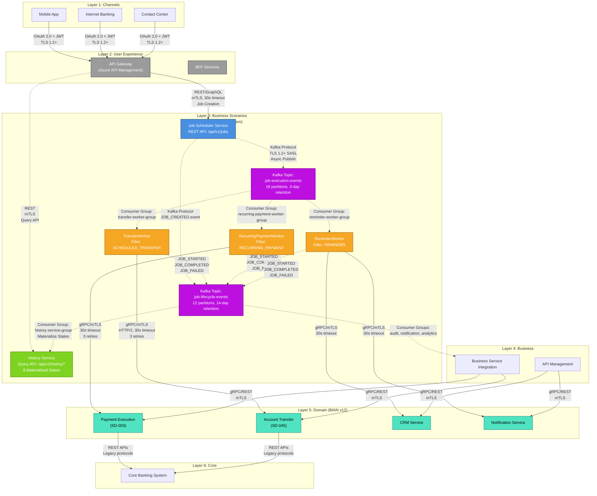
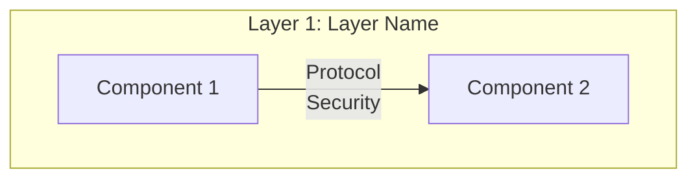

# Mermaid Architecture Diagram Instructions

## For: solutions-architect-skills Plugin Enhancement

**Version**: 1.0
**Date**: 2025-12-03
**Purpose**: Enable Mermaid architecture diagram generation and updates in the `solutions-architect-skills:architecture-docs` skill

---

## 1. Introduction

### Purpose

This document provides comprehensive instructions for adding Mermaid diagram generation capabilities to the `solutions-architect-skills` plugin. It includes templates, guidelines, and examples based on a successful implementation in a task scheduling system architecture.

### Why Mermaid Over ASCII Art?

**Benefits of Mermaid Diagrams**:
- ✅ **Interactive**: Zoom, pan, clickable components
- ✅ **Color-coded**: Visual distinction between component types
- ✅ **Maintainable**: Text-based, easy to update without manual alignment
- ✅ **Professional**: Modern, polished appearance
- ✅ **GitHub/GitLab Native**: Renders automatically in markdown viewers
- ✅ **Version Control Friendly**: Git diffs work well with text format
- ✅ **Accessible**: Screen readers can parse the underlying text
- ✅ **Exportable**: Can generate PNG, SVG, PDF for presentations

**ASCII Art Limitations**:
- ❌ Manual alignment required
- ❌ Difficult to maintain
- ❌ No interactivity
- ❌ No color-coding
- ❌ Breaks easily with edits
- ❌ Time-consuming to create

---

## 2. Prerequisites

### Mermaid Version Compatibility

**Minimum Version**: Mermaid 8.0+
**Recommended Version**: Mermaid 10.0+ (for best styling support)

### Rendering Compatibility

**Native Rendering** (no plugins required):
- GitHub (markdown files)
- GitLab (markdown files)
- Azure DevOps (markdown files)

**With Extensions/Plugins**:
- **VS Code**: Install "Markdown Preview Mermaid Support" extension
- **JetBrains IDEs**: Enable Mermaid plugin in Markdown settings
- **MkDocs**: Add `pymdownx.superfences` with Mermaid support
- **Docusaurus**: Built-in Mermaid support (v2.0+)
- **Confluence**: Install "Mermaid Diagrams for Confluence" app

### Testing Rendering

**Command Line** (Mermaid CLI):
```bash
npm install -g @mermaid-js/mermaid-cli
mmdc -i ARCHITECTURE.md -o architecture-diagram.png
```

**Online Editor** (for testing):
- https://mermaid.live/

---

## 3. Complete Mermaid Diagram Template

### Full Working Example

This example shows a 6-layer META architecture with Layer 3 (Business Scenarios) event-driven components in detail:

````markdown

````

### Structure Breakdown

**Diagram Type**: `graph TB` (top-to-bottom flowchart)
- **TB** = Top-to-Bottom (vertical layout)
- Alternative: `graph LR` (left-to-right) for horizontal layouts

**Key Sections**:
1. **Subgraphs**: One per META architecture layer (6 layers)
2. **Components**: Labeled rectangles with names and descriptions
3. **Data Flows**: Arrows connecting components
4. **Styling**: classDef declarations for color-coding

**Comments**: Use `%%` for comments (ignored in rendering)

---

## 4. Component Guidelines

### Component Types and Representation

#### 1. Microservices / Applications

**Syntax**:
```mermaid
ComponentName["Display Name<br/>Additional Info"]
```

**Examples**:
```mermaid
Scheduler["Job Scheduler Service<br/>REST API: /api/v1/jobs"]
TransferWorker["TransferWorker<br/>Filter: SCHEDULED_TRANSFER"]
```

**Guidelines**:
- Use PascalCase for component IDs (e.g., `TransferWorker`)
- Use descriptive display names
- Add key info with `<br/>` line breaks
- Keep descriptions concise (1-2 lines max)

#### 2. Event Streaming Topics (Kafka, RabbitMQ)

**Syntax**:
```mermaid
TopicName["Kafka Topic:<br/>topic-name<br/>partitions, retention"]
```

**Example**:
```mermaid
Kafka1["Kafka Topic:<br/>job-execution-events<br/>18 partitions, 3-day retention"]
```

**Guidelines**:
- Prefix with "Kafka Topic:" or "RabbitMQ Queue:"
- Include partition count and retention policy
- Use purple color styling

#### 3. Databases / Data Stores

**Syntax**:
```mermaid
DBName[("Database Name<br/>Type")]
```

**Example**:
```mermaid
JobStore[("Azure SQL<br/>Job Store")]
```

**Guidelines**:
- Use `(( ))` for cylindrical database shape
- Include database type and purpose

#### 4. External Systems / APIs

**Syntax**:
```mermaid
SystemName["System Name<br/>(External)"]
```

**Example**:
```mermaid
CoreBanking["Core Banking System"]
```

**Guidelines**:
- Clearly mark as external if applicable
- Use rounded rectangles for external systems

### Naming Conventions

**Component IDs** (internal references):
- PascalCase: `JobScheduler`, `TransferWorker`, `HistoryService`
- No spaces, no special characters
- Descriptive but concise

**Display Names** (visible labels):
- Title Case or Sentence case
- Include context (e.g., "TransferWorker" not just "Worker")
- Add clarifying info (API endpoints, filters, pod counts)

---

## 5. Data Flow Guidelines

### Synchronous Flows (Solid Arrows)

**Syntax**:
```mermaid
SourceComponent -->|Protocol<br/>Security<br/>Timeout| TargetComponent
```

**Examples**:
```mermaid
APIGateway -->|REST/GraphQL<br/>mTLS, 30s timeout<br/>Job Creation| Scheduler
TransferWorker -->|gRPC/mTLS<br/>HTTP/2, 30s timeout<br/>3 retries| TransferService
```

**Guidelines**:
- Use solid arrows (`-->`) for synchronous REST, gRPC, SOAP calls
- Label with protocol (REST, gRPC, HTTP/2)
- Include security mechanism (mTLS, OAuth 2.0 + JWT, API Key)
- Specify timeout (e.g., 30s timeout)
- Add retry policy if applicable (e.g., 3 retries with exponential backoff)
- Optionally include circuit breaker thresholds

**Standard Labels**:
- `OAuth 2.0 + JWT<br/>TLS 1.2+` (channel authentication)
- `REST/GraphQL<br/>mTLS, 30s timeout` (internal API calls)
- `gRPC/mTLS<br/>HTTP/2, 30s timeout<br/>3 retries` (domain service calls)

### Asynchronous Flows (Dashed Arrows)

**Syntax**:
```mermaid
SourceComponent -.->|Event Type<br/>Protocol| TargetComponent
```

**Examples**:
```mermaid
Scheduler -.->|Kafka Protocol<br/>TLS 1.2+ SASL<br/>Async Publish| Kafka1
Kafka1 -.->|Consumer Group:<br/>transfer-worker-group| TransferWorker
TransferWorker -.->|JOB_STARTED<br/>JOB_COMPLETED<br/>JOB_FAILED| Kafka2
```

**Guidelines**:
- Use dashed arrows (`-.->`) for asynchronous events (Kafka, RabbitMQ, event buses)
- Label with event type or consumer group
- Include protocol (Kafka Protocol, AMQP)
- Specify security (TLS 1.2+ SASL)
- List event types if multiple events flow on same path

**Standard Labels**:
- `Kafka Protocol<br/>TLS 1.2+ SASL<br/>Async Publish` (publisher to topic)
- `Consumer Group:<br/>group-name` (topic to consumer)
- `JOB_STARTED<br/>JOB_COMPLETED<br/>JOB_FAILED` (event types)

### Bidirectional Flows

**Syntax**:
```mermaid
Component1 <-->|Request/Response| Component2
```

**Example**:
```mermaid
APIGateway <-->|REST<br/>mTLS<br/>Query API| HistoryService
```

**Guidelines**:
- Use bidirectional arrows (`<-->`) sparingly
- Typically for request/response patterns
- Can combine with dashed for async bidirectional

---

## 6. Standard Color Scheme

### Color Palette

**Blue - Entry Points / Schedulers**:
- Fill: `#4A90E2`
- Stroke: `#2E5C8A`
- Text: White (`#fff`)
- **Use for**: Job schedulers, cron services, entry point services

**Orange - Workers / Executors**:
- Fill: `#F5A623`
- Stroke: `#B8791A`
- Text: White (`#fff`)
- **Use for**: Worker microservices, executors, processors

**Green - Query Services / CQRS Read Models**:
- Fill: `#7ED321`
- Stroke: `#5A9B18`
- Text: White (`#fff`)
- **Use for**: History services, query APIs, CQRS read models, reporting services

**Purple - Event Streaming**:
- Fill: `#BD10E0`
- Stroke: `#8A0CA3`
- Text: White (`#fff`)
- **Use for**: Kafka topics, RabbitMQ queues, event buses

**Teal - Domain Services**:
- Fill: `#50E3C2`
- Stroke: `#3AA893`
- Text: Black (`#000`)
- **Use for**: BIAN service domains, business logic services, domain APIs

**Gray - Infrastructure**:
- Fill: `#9B9B9B`
- Stroke: `#6B6B6B`
- Text: White (`#fff`)
- **Use for**: API Gateway, load balancers, proxies, infrastructure components

### Applying Color Scheme

**Step 1: Define Color Classes**:
```mermaid
classDef scheduler fill:#4A90E2,stroke:#2E5C8A,stroke-width:2px,color:#fff
classDef worker fill:#F5A623,stroke:#B8791A,stroke-width:2px,color:#fff
classDef history fill:#7ED321,stroke:#5A9B18,stroke-width:2px,color:#fff
classDef kafka fill:#BD10E0,stroke:#8A0CA3,stroke-width:2px,color:#fff
classDef domain fill:#50E3C2,stroke:#3AA893,stroke-width:2px,color:#000
classDef gateway fill:#9B9B9B,stroke:#6B6B6B,stroke-width:2px,color:#fff
```

**Step 2: Assign Classes to Components**:
```mermaid
class Scheduler scheduler
class TransferWorker,ReminderWorker,RecurringWorker worker
class HistoryService history
class Kafka1,Kafka2 kafka
class PaymentService,TransferService,CRMService,NotificationService domain
class APIGateway,BFF gateway
```

**Guidelines**:
- Define all classes at the end of the diagram (after data flows)
- Assign multiple components to same class with comma separation
- Use consistent naming for classDef IDs

---

## 7. Legend Template

### Complete Reusable Legend

Include this legend after every Mermaid architecture diagram:

```markdown
**Diagram Legend**:

**Arrow Types**:
- **Solid arrows (→)**: Synchronous calls (REST/gRPC with mTLS)
- **Dashed arrows (-.->)**: Asynchronous events (Kafka publish/subscribe)

**Security Protocols**:
- **OAuth 2.0 + JWT**: Channel authentication
- **mTLS**: Mutual TLS for internal service-to-service communication
- **TLS 1.2+**: Transport layer encryption
- **SASL**: Kafka authentication (Simple Authentication and Security Layer)

**Timeouts & Retries**:
- **30s timeout**: Standard timeout for synchronous REST/gRPC calls
- **3 retries**: Exponential backoff (2s, 4s, 8s) for transient failures
- **Circuit Breaker**: Opens after 5 consecutive failures

**Component Colors**:
- **Blue**: Entry points (schedulers, cron services)
- **Orange**: Worker microservices (execution layer)
- **Green**: Query services (CQRS read models, reporting)
- **Purple**: Event streaming (Kafka topics, message queues)
- **Teal**: Domain services (BIAN service domains, business logic)
- **Gray**: Infrastructure (API Gateway, load balancers)

**[Optional] Kafka Consumer Groups**:
- `group-name-1`: Purpose description
- `group-name-2`: Purpose description

**[Optional] Data Flow Patterns**:
- **Pattern 1**: Description of flow
- **Pattern 2**: Description of flow
```

### Customizing the Legend

**Add sections as needed**:
- Database schemas
- Scaling policies
- Retry strategies
- Event types
- API versions

**Keep it concise**:
- Max 10 bullet points per section
- Use bold for emphasis
- Use code formatting for technical terms

---

## 8. Step-by-Step Instructions

### Creating a New Mermaid Diagram

**Step 1: Identify Architecture Layers**

List all layers in your architecture:
- Example: Channels, User Experience, Business Scenarios, Business, Domain, Core

**Step 2: Map Components to Layers**

For each layer, identify:
- Components (services, APIs, databases)
- External systems
- Event streaming infrastructure

**Step 3: Define Data Flows**

Identify:
- **Synchronous**: REST APIs, gRPC calls, SOAP services
- **Asynchronous**: Kafka events, message queues, webhooks

**Step 4: Create Mermaid Diagram**



**Step 5: Apply Color Scheme**

Add classDef declarations and assign classes to components (see Section 6).

**Step 6: Add Legend**

Include comprehensive legend explaining all diagram elements (see Section 7).

**Step 7: Validate Rendering**

Test in:
- GitHub/GitLab preview
- VS Code Mermaid preview
- https://mermaid.live/

### Updating an Existing Mermaid Diagram

**Step 1: Locate Diagram Section**

Find the Mermaid diagram in ARCHITECTURE.md (typically Section 4).

**Step 2: Identify Changes**

Determine what needs to change:
- Add new component
- Remove obsolete component
- Update data flow
- Modify security annotations

**Step 3: Update Component Definitions**

**Add Component**:
```mermaid
%% In appropriate layer subgraph
NewComponent["New Component Name<br/>Description"]
```

**Remove Component**:
- Delete component definition
- Delete all arrows referencing the component
- Remove from class assignments

**Step 4: Update Data Flows**

**Add Flow**:
```mermaid
SourceComponent -->|Protocol<br/>Security| NewComponent
```

**Remove Flow**:
- Delete the arrow line

**Modify Flow**:
- Update label with new protocol/security/timeout

**Step 5: Update Styling**

If new component type:
```mermaid
classDef newtype fill:#HEXCOLOR,stroke:#HEXCOLOR,stroke-width:2px,color:#fff
class NewComponent newtype
```

**Step 6: Update Legend**

Add new sections if needed:
- New component color
- New protocol
- New consumer group

**Step 7: Validate Rendering**

Test updated diagram renders correctly.

---

## 9. Integration Checklist

Before committing Mermaid diagram changes, verify:

### Syntax Validation
- ✅ Mermaid code renders without errors in GitHub/GitLab preview
- ✅ All opening subgraphs have closing `end` statements
- ✅ All component IDs are unique (no duplicates)
- ✅ All arrows reference valid component IDs
- ✅ Quotes are properly closed in labels

### Visual Validation
- ✅ All layers are visible and properly labeled
- ✅ Components are in the correct layers
- ✅ Data flows are accurate (direction, labels)
- ✅ Colors are applied correctly (classDef assignments)
- ✅ No overlapping arrows or components
- ✅ Diagram layout is readable (not too cluttered)

### Content Validation
- ✅ Security protocols are accurate (mTLS, OAuth, SASL)
- ✅ Timeouts and retries match architecture specifications
- ✅ Consumer groups are correctly labeled
- ✅ Event types are listed accurately
- ✅ Component descriptions are up-to-date

### Legend Validation
- ✅ Legend explains all arrow types used
- ✅ Legend documents all security protocols used
- ✅ Legend lists all component colors used
- ✅ Legend includes consumer groups if applicable
- ✅ Legend includes data flow patterns if complex

### Cross-Reference Validation
- ✅ Diagram matches component details in Section 5
- ✅ Data flows match descriptions in Section 6
- ✅ Integration points match Section 7
- ✅ Performance metrics referenced (not shown on diagram)

---

## 10. Common Scenarios and Examples

### Scenario 1: Add New Microservice

**Task**: Add a new "NotificationWorker" microservice that consumes events from Kafka.

**Steps**:

1. **Add component to Layer 3 subgraph**:
```mermaid
subgraph Layer3["Layer 3: Business Scenarios"]
    %% Existing components...

    %% New component
    NotificationWorker["NotificationWorker<br/>Filter: NOTIFICATION"]
end
```

2. **Add data flow from Kafka topic**:
```mermaid
Kafka1 -.->|Consumer Group:<br/>notification-worker-group| NotificationWorker
```

3. **Add data flow to domain service**:
```mermaid
NotificationWorker -->|gRPC/mTLS<br/>30s timeout| NotificationService
```

4. **Add lifecycle event publishing**:
```mermaid
NotificationWorker -.->|JOB_STARTED<br/>JOB_COMPLETED<br/>JOB_FAILED| Kafka2
```

5. **Apply color styling**:
```mermaid
class NotificationWorker worker
```

6. **Update legend** (add to consumer groups section):
```markdown
- `notification-worker-group`: Consume job-execution-events filtered by NOTIFICATION type
```

---

### Scenario 2: Add New Kafka Topic

**Task**: Add a new "job-retry-events" Kafka topic for retry management.

**Steps**:

1. **Add topic component to Layer 3**:
```mermaid
Kafka3["Kafka Topic:<br/>job-retry-events<br/>6 partitions, 7-day retention"]
```

2. **Add producer flow**:
```mermaid
TransferWorker -.->|Retry Event<br/>Kafka Protocol| Kafka3
```

3. **Add consumer flow**:
```mermaid
Kafka3 -.->|Consumer Group:<br/>retry-handler-group| RetryHandler
```

4. **Apply color styling**:
```mermaid
class Kafka3 kafka
```

5. **Update legend** (add to description):
```markdown
**Kafka Topics**:
- job-execution-events: Job dispatch events
- job-lifecycle-events: Job state changes
- job-retry-events: Failed job retry attempts (new)
```

---

### Scenario 3: Update Data Flow (Change Security Protocol)

**Task**: Change Worker → Domain Service calls from gRPC/mTLS to REST/mTLS.

**Steps**:

1. **Locate existing data flow arrows**:
```mermaid
TransferWorker -->|gRPC/mTLS<br/>HTTP/2, 30s timeout<br/>3 retries| TransferService
```

2. **Update arrow labels**:
```mermaid
TransferWorker -->|REST/mTLS<br/>30s timeout<br/>3 retries| TransferService
```

3. **Update legend** (if protocol change is significant):
```markdown
**Security Protocols**:
- **mTLS**: Mutual TLS for internal service-to-service communication (REST and gRPC)
```

---

### Scenario 4: Add New Layer

**Task**: Add Layer 7 (External Systems) below Layer 6.

**Steps**:

1. **Add new subgraph**:
```mermaid
%% Layer 7: External Systems
subgraph Layer7["Layer 7: External Systems"]
    PaymentGateway["Payment Gateway<br/>(External)"]
    CreditBureau["Credit Bureau API<br/>(External)"]
end
```

2. **Add data flows from Layer 6**:
```mermaid
CoreBanking -->|HTTPS/REST<br/>API Key| PaymentGateway
CoreBanking -->|HTTPS/REST<br/>mTLS| CreditBureau
```

3. **Apply color styling** (use gray for external):
```mermaid
classDef external fill:#9B9B9B,stroke:#6B6B6B,stroke-width:2px,color:#fff
class PaymentGateway,CreditBureau external
```

4. **Update legend**:
```markdown
**Component Colors**:
- **Gray**: Infrastructure and external systems
```

---

### Scenario 5: Replace Existing Component

**Task**: Replace "StatusTrackingService" with "HistoryService".

**Steps**:

1. **Find and delete old component**:
```mermaid
%% DELETE THIS:
StatusTrackingService["Status Tracking Service"]
```

2. **Add new component**:
```mermaid
HistoryService["History Service<br/>Query API: /api/v1/history/*<br/>8 Materialized States"]
```

3. **Update all arrows referencing old component**:
```mermaid
%% OLD:
Kafka2 -.->|Consumer Group:<br/>status-tracker-group| StatusTrackingService

%% NEW:
Kafka2 -.->|Consumer Group:<br/>history-service-group<br/>Materialize States| HistoryService
```

4. **Update class assignments**:
```mermaid
%% OLD:
class StatusTrackingService worker

%% NEW:
class HistoryService history
```

5. **Update legend** (consumer groups):
```markdown
- `history-service-group`: Consumes job-lifecycle-events for state materialization (replaces status-tracker-group)
```

---

## 11. Best Practices

### Do's

✅ **Use consistent naming conventions**:
- Component IDs: PascalCase
- Consumer groups: kebab-case
- Topics: kebab-case

✅ **Keep diagrams focused**:
- Show 1-2 layers in detail, others simplified
- Avoid cluttering with every single component

✅ **Label all arrows**:
- Include protocol, security, timeout
- Be concise but informative

✅ **Use color-coding consistently**:
- Apply same colors across all diagrams
- Document color meanings in legend

✅ **Test rendering regularly**:
- Check in GitHub/GitLab preview
- Validate in Mermaid live editor

✅ **Version control diagrams**:
- Commit diagram changes with descriptive messages
- Reference architecture decision records (ADRs)

### Don'ts

❌ **Don't overload diagrams**:
- Avoid showing every component in one diagram
- Create multiple focused diagrams instead

❌ **Don't forget the legend**:
- Always include comprehensive legend
- Explain all symbols and colors used

❌ **Don't use ambiguous labels**:
- "Service A" → "Job Scheduler Service"
- "DB" → "Azure SQL Job Store"

❌ **Don't mix ASCII and Mermaid**:
- Choose one format per document
- If migrating, replace all diagrams at once

❌ **Don't neglect security annotations**:
- Always show mTLS, OAuth, API keys
- Don't assume readers know protocols

❌ **Don't use custom colors without documentation**:
- Stick to standard palette
- If adding new color, document in legend

---

## 12. Integration with solutions-architect-skills

### Recommended Skill Enhancement

**Skill Name**: `solutions-architect-skills:architecture-docs`

**New Capabilities to Add**:

1. **Generate Mermaid Diagrams**:
   - Use this template as base
   - Prompt for architecture layers
   - Prompt for components per layer
   - Prompt for data flows
   - Auto-generate Mermaid code

2. **Update Existing Diagrams**:
   - Parse existing Mermaid diagram
   - Identify components and flows
   - Offer modification options (add/remove/update)
   - Regenerate Mermaid code

3. **Validate Diagrams**:
   - Check syntax correctness
   - Verify all IDs are unique
   - Ensure all arrows reference valid components
   - Validate legend completeness

4. **Export Diagrams**:
   - Generate PNG/SVG using Mermaid CLI
   - Export for presentations

### Implementation Hints

**Prompt Templates**:
- "Generate a Mermaid architecture diagram for [ARCHITECTURE_NAME]"
- "Update the Mermaid diagram in ARCHITECTURE.md to add [COMPONENT_NAME]"
- "Replace the ASCII diagram with a Mermaid diagram in [FILE_PATH]"

**Required Inputs**:
- Architecture layers (e.g., "6-layer META architecture")
- Components per layer
- Data flow types (sync vs async)
- Security protocols

**Auto-Generated Sections**:
- classDef declarations (use standard color palette)
- Legend (use template from Section 7)
- Component descriptions (from architecture doc)

---

## 13. Reference Implementation

**Source Project**: Task Scheduling System
**File**: `/home/shadowx4fox/task-scheduling/ARCHITECTURE.md` (Section 4, lines 550-695)

**Summary Document**: `/home/shadowx4fox/task-scheduling/MERMAID_DIAGRAM_UPDATE_SUMMARY.md`

**Key Highlights**:
- 6-layer META architecture
- Layer 3 event-driven components in detail
- 2 Kafka topics with 4 consumer groups
- Color-coded: Blue (scheduler), Orange (workers), Green (history service), Purple (Kafka), Teal (domain services)
- Complete legend with arrow types, security protocols, timeouts, consumer groups
- Successfully replaced ASCII diagram

**Results**:
- ✅ 145 lines of Mermaid code + legend
- ✅ Renders in GitHub/GitLab natively
- ✅ Interactive, color-coded, maintainable
- ✅ Professional appearance

---

## 14. Conclusion

This document provides everything needed to add Mermaid architecture diagram generation to the `solutions-architect-skills` plugin:

- ✅ Complete working template
- ✅ Component guidelines
- ✅ Data flow patterns
- ✅ Standard color scheme
- ✅ Reusable legend
- ✅ Step-by-step instructions
- ✅ Common scenarios with examples
- ✅ Best practices
- ✅ Reference implementation

**Next Steps**:
1. Review this document with plugin developers
2. Implement Mermaid generation capability in the skill
3. Test with sample architectures
4. Roll out to all `solutions-architect-skills` users

**Questions or Feedback**:
Contact the architecture documentation team or submit issues to the plugin repository.

---

**Version History**:
- **v1.0 (2025-12-03)**: Initial release with complete Mermaid diagram template and guidelines based on task scheduling system implementation
