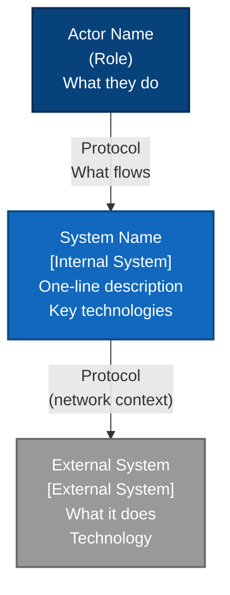
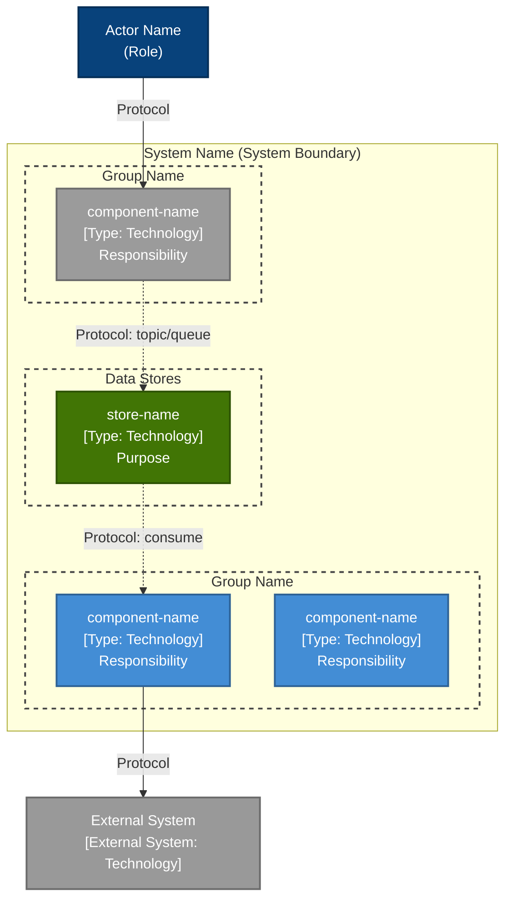
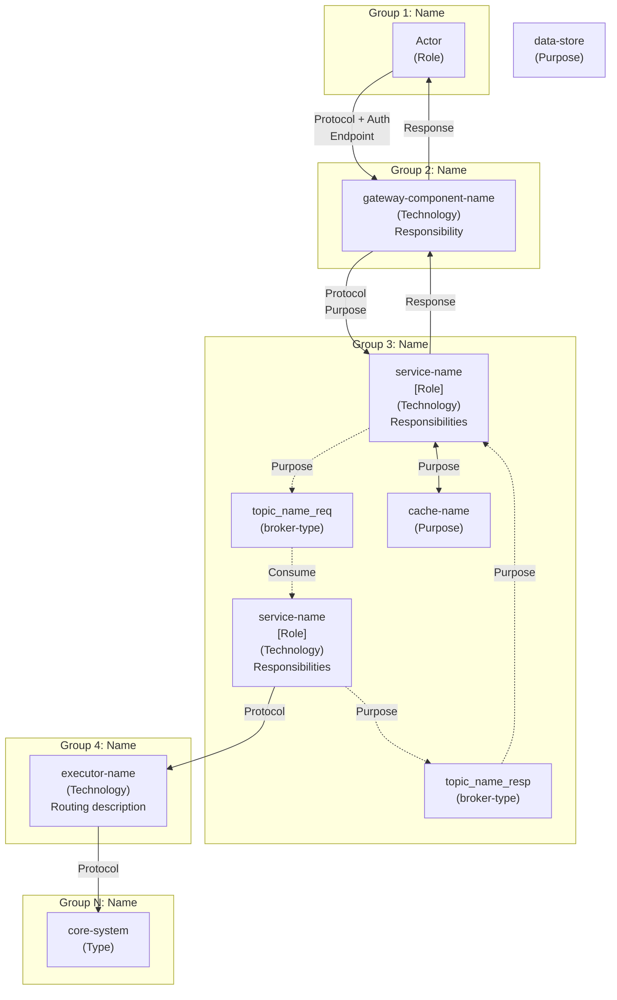

# Architecture Diagram Generation Guide

> Reference for generating the 4 standard architecture diagrams in `docs/03-architecture-layers.md`.
> Each diagram serves a different audience and zoom level. Generate all 4 when creating or updating architecture documentation.
> Diagrams adapt their grouping, naming, and color conventions to the detected architecture type.

---

## Overview

| # | Diagram | Format | Audience | Shows |
|---|---------|--------|----------|-------|
| 1 | Logical View | ASCII art | Executives, architects | Layers/tiers/groups as horizontal bands with components inside, arrows between groups only |
| 2 | C4 Level 1 — System Context | Mermaid `graph TB` | Non-technical stakeholders | The system as a single box, external actors, external systems |
| 3 | C4 Level 2 — Container | Mermaid `graph TB` | Development teams | All containers inside the system boundary, grouped by layer/tier, with protocols |
| 4 | Detailed View | Mermaid `graph TB` | Architects, SREs | Full component wiring with topic names, queue names, all async/sync flows |

**Ordering in the file**: Always place diagrams in this order (1→2→3→4) under a `## Architecture Diagrams` heading.

**Architecture type detection**: Read the `<!-- ARCHITECTURE_TYPE: ... -->` comment in `docs/03-architecture-layers.md` to determine the active type. All 4 diagrams adapt to this type.

---

## Architecture Type Adaptation

All 4 diagrams use the same grouping logic, determined by the detected architecture type:

| Architecture Type | Grouping Strategy | Group Naming Pattern | Layer/Group Source |
|-------------------|-------------------|---------------------|--------------------|
| META | 6 layers: Channels → UX → Business Scenarios → Business → Domain → Core | `LAYER N — NAME` | `docs/03-architecture-layers.md` layer summary table |
| BIAN | 5 layers matching BIAN V12.0 service landscape | `LAYER N — NAME` | `docs/03-architecture-layers.md` layer summary table |
| 3-TIER | 3 tiers: Presentation → Logic → Data | `TIER N — NAME` | `docs/03-architecture-layers.md` tier definitions |
| N-LAYER | Layers from architecture doc (varies: Domain, Application, Infrastructure, etc.) | `LAYER — NAME` | `docs/03-architecture-layers.md` layer definitions |
| MICROSERVICES | Functional groups: API Gateway, Services, Data Stores, Message Brokers | `GROUP — NAME` | `docs/03-architecture-layers.md` component groupings |

---

## Diagram 1 — Logical View (ASCII)

**Purpose**: High-level logical view showing the architecture structure. Each layer/tier/group is a visual band containing its components. Arrows flow between groups only — no internal wiring.

**Format**: ASCII art inside a fenced code block (no language tag). Never use Mermaid for this diagram — ASCII guarantees rendering on all platforms and Mermaid versions.

**When to use**: All architecture types. For MICROSERVICES without layers, use functional groups (Gateway, Services, Stores, Brokers) as the horizontal bands.

### Structure Rules

1. **Outer box per group**: Full-width rectangle using `┌─┐│└─┘` box-drawing characters
2. **Group title**: Centered, uppercase, format per type (see Architecture Type Adaptation table)
3. **Component boxes inside**: Smaller rectangles nested inside the group box
4. **Inter-group arrows**: Centered between group boxes, using `│` and `▼` with protocol label
5. **Conceptual links**: Use `· · ·` (dotted) for non-runtime relationships (e.g., "implements")
6. **Legend**: Always include at the bottom

### Layout Pattern

```
┌─────────────────────────────────────────────────────────────────────────────────────────┐
│                              GROUP TITLE (per type naming)                               │
│                                                                                         │
│   [optional sub-group label]:                                                           │
│   ┌───────────────────────┐ ┌───────────────────────┐ ┌───────────────────────────┐    │
│   │  Component Name       │ │  Component Name       │ │  Component Name           │    │
│   │  [C4 Type]            │ │  [C4 Type]            │ │  [C4 Type]                │    │
│   │  Responsibility 1     │ │  Responsibility 1     │ │  Responsibility 1         │    │
│   │  Responsibility 2     │ │  Responsibility 2     │ │  Responsibility 2         │    │
│   └───────────────────────┘ └───────────────────────┘ └───────────────────────────┘    │
│                                                                                         │
└─────────────────────────────────────────────────────────────────────────────────────────┘
                                          │
                                          ▼  Protocol label
┌─────────────────────────────────────────────────────────────────────────────────────────┐
│                              NEXT GROUP TITLE                                           │
│  ...                                                                                    │
└─────────────────────────────────────────────────────────────────────────────────────────┘
```

### Component Box Content

Each component box contains exactly these lines:
1. **Line 1**: Component name (display name or technical name)
2. **Line 2**: `[C4 Type]` or `[C4 Type · Technology]` — from the component's `**Type:**` field
3. **Lines 3+**: 1–3 key responsibilities (short phrases, not sentences)

### Inter-Group Arrow Format

```
                                          │
                                          ▼  PROTOCOL (network context)
```

- `▼` for synchronous calls (solid arrow down)
- `· · ·` for conceptual/non-runtime links (e.g., domain model alignment)
- Protocol label on the same line as `▼`, after two spaces
- Examples: `HTTPS + OAuth2`, `HTTP (AKS internal)`, `REST (private network)`, `gRPC/mTLS`

### Sizing Rules

- **Outer box width**: 89 characters (fits 90-column terminals)
- **Inner component boxes**: Size to fit content, arranged horizontally within the group
- **Spacing**: 1 space between adjacent component boxes
- **Groups with many components**: Split into labeled sub-groups (e.g., "Applications:" and "Support Stores:")

### Legend (always include)

```
Legend:
  ▼  = Synchronous call (request flows top → down)
  · · · = Conceptual alignment (not a runtime call)
  [Type] = C4 L2 container type
  All [technology] services: [Framework] on [Platform] (min N replicas)
  Response path: implicit — bottom → up via [mechanism]
```

### Data Sources

| Element | Source File | Field |
|---------|-----------|-------|
| Group names (layers/tiers) | `docs/03-architecture-layers.md` | Layer/tier summary table |
| Components per group | `docs/03-architecture-layers.md` | Each group section → `**Components:**` |
| Component types | `docs/components/**/*.md` | `**Type:**` field |
| Component responsibilities | `docs/components/**/*.md` | `## Responsibilities` section (pick top 2–3) |
| Protocols between groups | `docs/03-architecture-layers.md` | `**Communication Patterns:**` per group |
| C4 types | `docs/components/README.md` | Type column |

---

## Diagram 2 — C4 Level 1 System Context (Mermaid)

**Purpose**: Highest zoom level. Shows the system as a single box, who uses it, and what external systems it depends on.

**Format**: Mermaid `graph TB` — compatible with Mermaid 8.x+.

### Structure Rules

1. **3–7 boxes max**: 1 internal system, 1–3 external actors, 1–3 external systems
2. **No internal details**: The system is a single opaque box — no containers, no layers
3. **Actor labels**: Include role and what they do (e.g., "Cash withdrawals and deposits for clients")
4. **Arrow labels**: Protocol + what flows (e.g., "HTTPS + OAuth2 / pacs.008 / pacs.003")
5. **Phase 2 systems**: Use dashed arrows (`-.->`) with "Phase 2" label

### Template



### Color Conventions (C4 standard — all architecture types)

| Element | Fill | Meaning |
|---------|------|---------|
| Person/Actor | `#08427B` (dark blue) | External user or system that initiates interaction |
| Internal System | `#1168BD` (blue) | The system being documented |
| External System | `#999999` (gray) | Systems outside your control |

### Architecture Type → C4 L1 Translation

| Architecture Type | What collapses into Internal System box | What becomes External Actor/System |
|-------------------|----------------------------------------|-----------------------------------|
| META | Layers 2–5 (UX through Domain) | Layer 1 actors → Person boxes; Layer 6 core/legacy → External System boxes |
| BIAN | All BIAN service domains | External channels → Person boxes; Core banking/legacy → External System boxes |
| 3-TIER | All 3 tiers (Presentation + Logic + Data) | External users → Person boxes; External integrations → External System boxes |
| N-LAYER | All internal layers (UI through Infrastructure) | External users → Person boxes; External systems → External System boxes |
| MICROSERVICES | All services + stores + brokers | External users/clients → Person boxes; External APIs/systems → External System boxes |

### Data Sources

| Element | Source File |
|---------|-----------|
| System name + description | `ARCHITECTURE.md` top-level description |
| External actors | `docs/01-system-overview.md` → `**External Actor:**` or user/actor references |
| External systems | `docs/01-system-overview.md` → `**Internal Dependencies:**` (items marked external) |
| Protocols | `docs/05-integration-points.md` → external integrations section |

---

## Diagram 3 — C4 Level 2 Container (Mermaid)

**Purpose**: Zooms into the system boundary. Shows all deployable containers, grouped by architectural layer/tier/group, with protocols on every arrow.

**Format**: Mermaid `graph TB` — compatible with Mermaid 8.x+.

### Structure Rules

1. **System boundary subgraph**: Wraps all internal containers
2. **Group subgraphs inside**: Group containers by layer/tier/functional group (per Architecture Type Adaptation table)
3. **External actor outside**: Above the system boundary
4. **External systems outside**: Below the system boundary
5. **Every arrow has a protocol label**: `HTTPS`, `HTTP`, `AMQP`, `Kafka`, `JDBC`, `Redis protocol`
6. **Solid arrows** (`-->`) for synchronous calls
7. **Dashed arrows** (`-.->`) for asynchronous messaging
8. **Container labels**: `component-name\n[C4 Type: Technology]\nKey responsibility`

### Template



### Color Conventions (C4 standard — all architecture types)

| Element | Fill | classDef name |
|---------|------|--------------|
| External actor | `#08427B` dark blue | `person` |
| Gateway containers | `#9B9B9B` gray | `gateway` |
| Application containers | `#438DD5` medium blue | `app` |
| Store containers | `#417505` dark green | `store` |
| External systems | `#999999` gray | `external` |
| Group subgraphs | transparent, dashed | `boundary` |

### Data Sources

| Element | Source File |
|---------|-----------|
| All containers | `docs/components/README.md` → 5-column table |
| Container details | `docs/components/**/*.md` → Type, Technology, Purpose, APIs |
| Protocols | `docs/05-integration-points.md` → all integration entries |
| Async topics/queues | `docs/05-integration-points.md` → internal integrations section |
| Group structure | `docs/03-architecture-layers.md` → layer/tier summary table |

---

## Diagram 4 — Detailed View (Mermaid)

**Purpose**: Full wiring diagram showing every component, topic name, queue name, and flow. The most detailed diagram — used by architects and SREs for operational understanding.

**Format**: Mermaid `graph TB` — compatible with Mermaid 8.x+.

### Structure Rules

1. **One subgraph per architectural group**: Named per Architecture Type Adaptation table (layer, tier, or functional group)
2. **Every component inside its group subgraph**: Using full technical names
3. **Message broker topics as separate nodes**: Show actual topic/queue names
4. **Solid arrows** for sync, **dashed arrows** for async
5. **Arrow labels**: Include protocol AND purpose (e.g., `"Publish validated\nISO 20022 XML"`)
6. **Domain alignment** (if applicable): Dotted lines from domain model to implementing containers
7. **Standalone data stores**: If a data store serves multiple groups, place it outside subgraphs

### Template



### Color Conventions by Architecture Type

#### META / BIAN

| Group Role | Fill | classDef name |
|-----------|------|--------------|
| Channel (L1) | `#4A90E2` blue | `channel` |
| User Experience (L2) | `#9B9B9B` gray | `ux` |
| Business Scenarios (L3) | `#F5A623` orange | `scenario` |
| Business (L4) | `#7ED321` green | `business` |
| Domain (L5) | `#50E3C2` teal | `domain` |
| Core (L6) | `#D0021B` red | `core` |
| Messaging (brokers/topics) | `#BD10E0` purple | `messaging` |
| Data stores | `#417505` dark green | `datastore` |

#### 3-TIER

| Group Role | Fill | classDef name |
|-----------|------|--------------|
| Presentation (Tier 1) | `#4A90E2` blue | `presentation` |
| Logic (Tier 2) | `#F5A623` orange | `logic` |
| Data (Tier 3) | `#417505` dark green | `data` |
| Messaging (brokers/topics) | `#BD10E0` purple | `messaging` |
| Data stores | `#417505` dark green | `datastore` |

#### N-LAYER

| Group Role | Fill | classDef name |
|-----------|------|--------------|
| UI / Presentation | `#4A90E2` blue | `ui` |
| Application / Service | `#F5A623` orange | `application` |
| Domain / Business | `#7ED321` green | `domain` |
| Infrastructure / Persistence | `#9B9B9B` gray | `infrastructure` |
| Messaging (brokers/topics) | `#BD10E0` purple | `messaging` |
| Data stores | `#417505` dark green | `datastore` |

#### MICROSERVICES

| Group Role | Fill | classDef name |
|-----------|------|--------------|
| API Gateway | `#9B9B9B` gray | `gateway` |
| Application Services | `#438DD5` medium blue | `service` |
| Workers / Consumers | `#F5A623` orange | `worker` |
| Messaging (brokers/topics) | `#BD10E0` purple | `messaging` |
| Data stores | `#417505` dark green | `datastore` |
| External systems | `#999999` gray | `external` |

### Data Sources

| Element | Source File |
|---------|-----------|
| All components + types | `docs/components/README.md` |
| Component responsibilities | `docs/components/**/*.md` → Responsibilities, Purpose |
| Topic/queue names | `docs/05-integration-points.md` → internal integrations section |
| Full flow wiring | `docs/04-data-flow-patterns.md` → all flow sections |
| Domain model (if applicable) | `docs/03-architecture-layers.md` → Domain layer/section |
| Protocols per integration | `docs/05-integration-points.md` |

---

## Mermaid Compatibility Rules

Target: **Mermaid 8.8.0+** (VS Code, GitHub, GitLab).

### DO

- Use `graph TB` (not `flowchart TB` — `flowchart` is unreliable in 8.x)
- Use `subgraph NAME["Label"]` for grouping
- Use `-->` for solid arrows, `-.->` for dashed arrows, `-.-` for dotted lines (no arrow)
- Use `|"label"| ` for edge labels (quoted)
- Use `\n` for line breaks inside node labels
- Use `classDef` + `class` for styling

### DO NOT

- Do not use `direction LR` inside subgraphs (requires Mermaid 10+)
- Do not use nested subgraphs more than 2 levels deep (fragile in 8.x)
- Do not use HTML tags (`<b>`, `<i>`, `<sup>`) in labels
- Do not use emoji characters in node labels (rendering varies)
- Do not use `|` pipe characters inside node label text (breaks parsing) — use `/` instead
- Do not connect subgraph IDs as link endpoints (`L1 --> L2` fails) — connect nodes only
- Do not use `flowchart` keyword — use `graph` for maximum compatibility

---

## Generation Workflow

When generating or updating diagrams:

1. **Read** `docs/03-architecture-layers.md` for group structure (layers/tiers) and component placement
2. **Read** `docs/components/README.md` for the component index (names, types, technologies)
3. **Read** `docs/05-integration-points.md` for protocols and topic/queue names
4. **Read** `docs/04-data-flow-patterns.md` for flow wiring between components
5. **Detect** architecture type from `<!-- ARCHITECTURE_TYPE: ... -->` comment in `docs/03-architecture-layers.md`
6. **Select** grouping strategy, naming pattern, and color conventions from the Architecture Type Adaptation table and Diagram 4 color conventions
7. **Generate** all 4 diagrams in order (ASCII logical → C4 L1 → C4 L2 → Detailed)
8. **Place** all diagrams under `## Architecture Diagrams` in `docs/03-architecture-layers.md`
9. **Include** a `**Reading the diagram:**` section after the ASCII logical view with bullet points explaining the arrow conventions

### Update vs. Create

- **Create**: Generate all 4 diagrams from scratch using source files
- **Update**: When components change (add/remove/rename), update all 4 diagrams to match. Check that every component in `docs/components/README.md` appears in Diagrams 1, 3, and 4. Diagram 2 (C4 L1) only shows system-level boxes — individual components do not appear.
