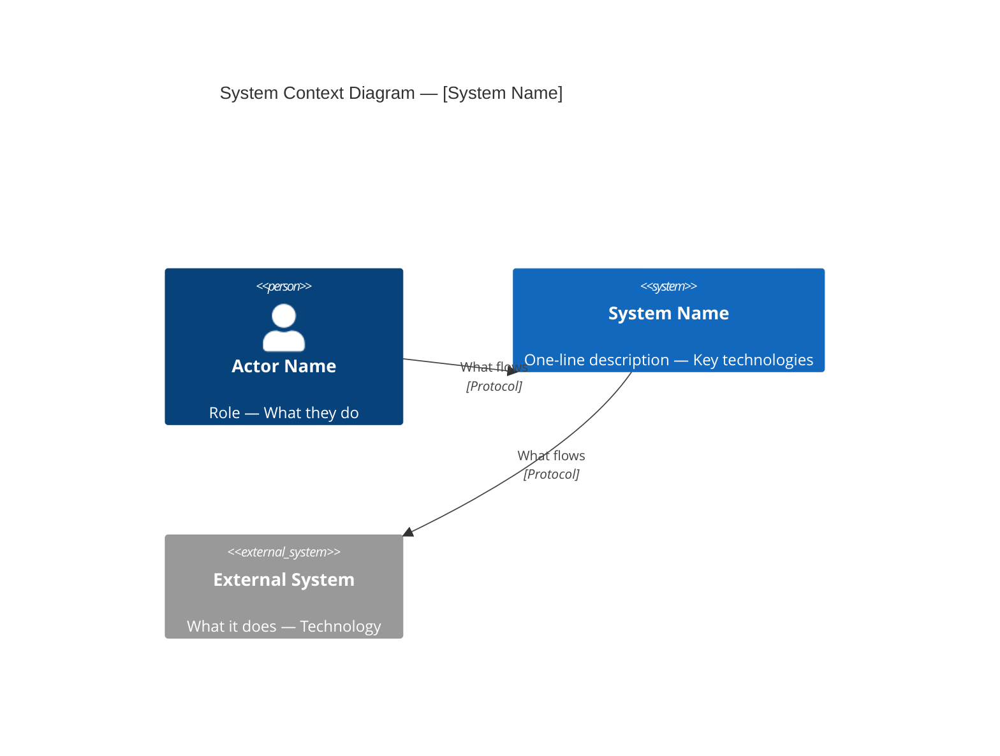
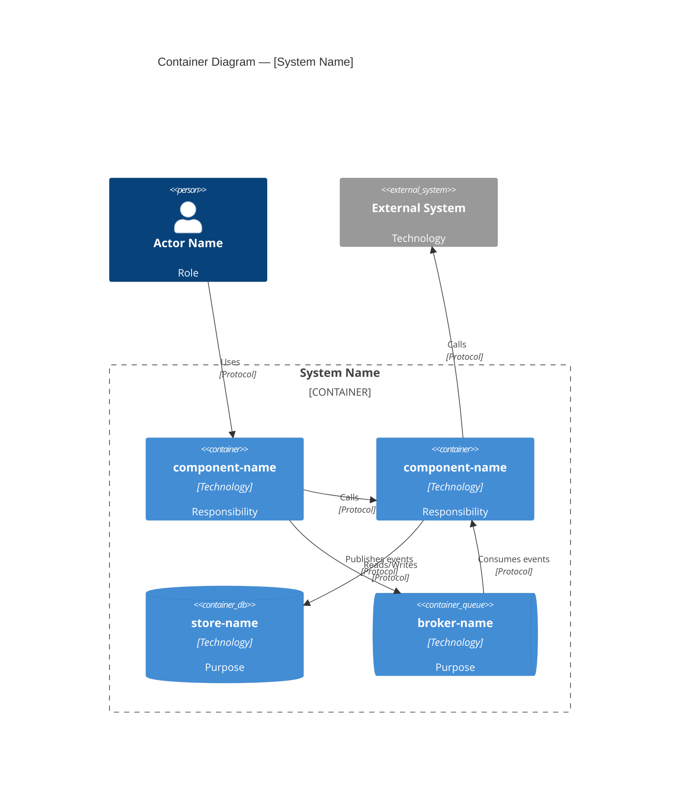
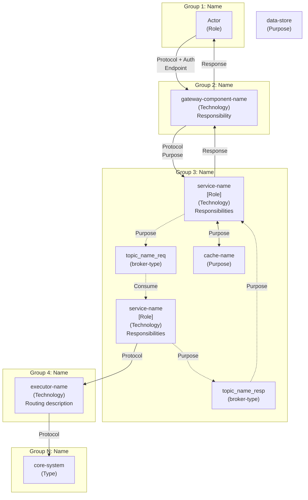
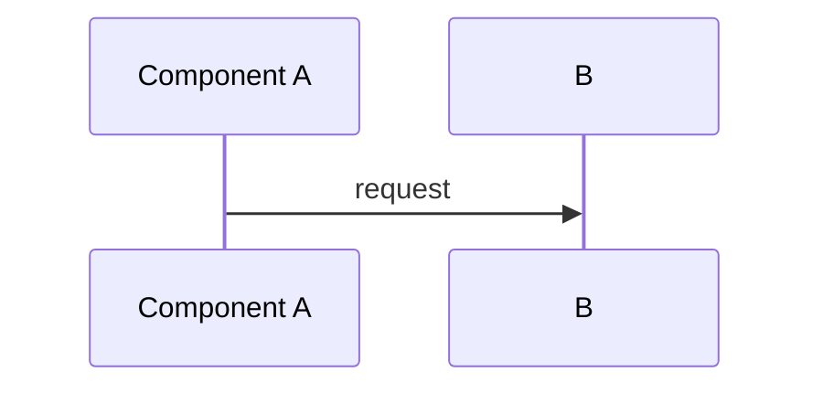
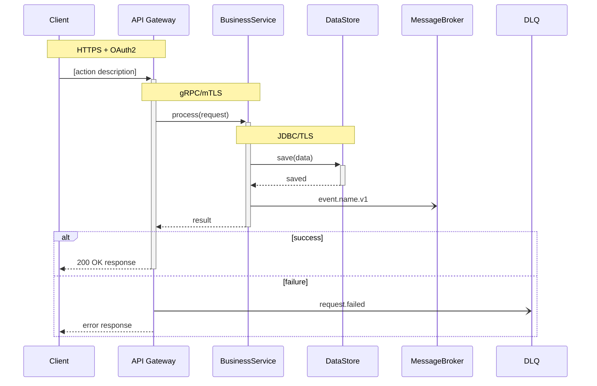

# Architecture Diagram Generation Guide

> Reference for generating the 4 standard architecture diagrams in `docs/03-architecture-layers.md`.
> Each diagram serves a different audience and zoom level. Generate all 4 when creating or updating architecture documentation.
> Diagrams adapt their grouping, naming, and color conventions to the detected architecture type.

---

## Overview

| # | Diagram | Format | Audience | Shows |
|---|---------|--------|----------|-------|
| 1 | Logical View | ASCII art | Executives, architects | Layers/tiers/groups as horizontal bands with components inside, arrows between groups only |
| 2 | C4 Level 1 — System Context | Mermaid `graph TB` | Non-technical stakeholders | The system as a single box, external actors, external systems |
| 3 | C4 Level 2 — Container | Mermaid `C4Container` | Development teams | All containers inside the system boundary, grouped by C4 category (apps, stores, brokers), with protocols |
| 4 | Detailed View | Mermaid `graph TB` | Architects, SREs | Full component wiring with topic names, queue names, all async/sync flows |

**Ordering in the file**: Always place diagrams in this order (1→2→3→4) under a `## Architecture Diagrams` heading.

**Architecture type detection**: Read the `<!-- ARCHITECTURE_TYPE: ... -->` comment in `docs/03-architecture-layers.md` to determine the active type. All 4 diagrams adapt to this type.

---

## Architecture Type Adaptation

Diagrams 1 (Logical View) and 4 (Detailed View) use architecture-specific grouping. Diagrams 2 (C4 L1) and 3 (C4 L2) use pure C4 conventions — they do NOT group by architecture layers/tiers.

| Architecture Type | Grouping Strategy | Group Naming Pattern | Layer/Group Source |
|-------------------|-------------------|---------------------|--------------------|
| META | 6 layers: Channels → UX → Business Scenarios → Business → Domain → Core | `LAYER N — NAME` | `docs/03-architecture-layers.md` layer summary table |
| BIAN | 5 layers matching BIAN V12.0 service landscape | `LAYER N — NAME` | `docs/03-architecture-layers.md` layer summary table |
| 3-TIER | 3 tiers: Presentation → Logic → Data | `TIER N — NAME` | `docs/03-architecture-layers.md` tier definitions |
| N-LAYER | Layers from architecture doc (varies: Domain, Application, Infrastructure, etc.) | `LAYER — NAME` | `docs/03-architecture-layers.md` layer definitions |
| MICROSERVICES | Functional groups: API Gateway, Services, Data Stores, Message Brokers | `GROUP — NAME` | `docs/03-architecture-layers.md` component groupings |

---

## Diagram 1 — Logical View (ASCII)

**Purpose**: High-level logical view showing the architecture structure. Each layer/tier/group is a visual band containing its components. Arrows flow between groups only — no internal wiring.

**Format**: ASCII art inside a fenced code block (no language tag). Never use Mermaid for this diagram — ASCII guarantees rendering on all platforms and Mermaid versions.

**When to use**: All architecture types. For MICROSERVICES without layers, use functional groups (Gateway, Services, Stores, Brokers) as the horizontal bands.

### Structure Rules

1. **Outer box per group**: Full-width rectangle using `┌─┐│└─┘` box-drawing characters
2. **Group title**: Centered, uppercase, format per type (see Architecture Type Adaptation table)
3. **Component boxes inside**: Smaller rectangles nested inside the group box
4. **Inter-group arrows**: Centered between group boxes, using `│` and `▼` with protocol label
5. **Conceptual links**: Use `· · ·` (dotted) for non-runtime relationships (e.g., "implements")
6. **Legend**: Always include at the bottom

### Layout Pattern

```
┌─────────────────────────────────────────────────────────────────────────────────────────┐
│                              GROUP TITLE (per type naming)                               │
│                                                                                         │
│   [optional sub-group label]:                                                           │
│   ┌───────────────────────┐ ┌───────────────────────┐ ┌───────────────────────────┐    │
│   │  Component Name       │ │  Component Name       │ │  Component Name           │    │
│   │  [C4 Type]            │ │  [C4 Type]            │ │  [C4 Type]                │    │
│   │  Responsibility 1     │ │  Responsibility 1     │ │  Responsibility 1         │    │
│   │  Responsibility 2     │ │  Responsibility 2     │ │  Responsibility 2         │    │
│   └───────────────────────┘ └───────────────────────┘ └───────────────────────────┘    │
│                                                                                         │
└─────────────────────────────────────────────────────────────────────────────────────────┘
                                          │
                                          ▼  Protocol label
┌─────────────────────────────────────────────────────────────────────────────────────────┐
│                              NEXT GROUP TITLE                                           │
│  ...                                                                                    │
└─────────────────────────────────────────────────────────────────────────────────────────┘
```

### Component Box Content

Each component box contains exactly these lines:
1. **Line 1**: Component name (display name or technical name)
2. **Line 2**: `[C4 Type]` or `[C4 Type · Technology]` — from the component's `**Type:**` field
3. **Lines 3+**: 1–3 key responsibilities (short phrases, not sentences)

### Inter-Group Arrow Format

```
                                          │
                                          ▼  PROTOCOL (network context)
```

- `▼` for synchronous calls (solid arrow down)
- `· · ·` for conceptual/non-runtime links (e.g., domain model alignment)
- Protocol label on the same line as `▼`, after two spaces
- Examples: `HTTPS + OAuth2`, `HTTP (AKS internal)`, `REST (private network)`, `gRPC/mTLS`

### Sizing Rules

- **Outer box width**: 89 characters (fits 90-column terminals)
- **Inner component boxes**: Size to fit content, arranged horizontally within the group
- **Spacing**: 1 space between adjacent component boxes
- **Groups with many components**: Split into labeled sub-groups (e.g., "Applications:" and "Support Stores:")

### Legend (always include)

```
Legend:
  ▼  = Synchronous call (request flows top → down)
  · · · = Conceptual alignment (not a runtime call)
  [Type] = C4 L2 container type
  All [technology] services: [Framework] on [Platform] (min N replicas)
  Response path: implicit — bottom → up via [mechanism]
```

### Data Sources

| Element | Source File | Field |
|---------|-----------|-------|
| Group names (layers/tiers) | `docs/03-architecture-layers.md` | Layer/tier summary table |
| Components per group | `docs/03-architecture-layers.md` | Each group section → `**Components:**` |
| Component types | `docs/components/**/*.md` | `**Type:**` field |
| Component responsibilities | `docs/components/**/*.md` | `## Responsibilities` section (pick top 2–3) |
| Protocols between groups | `docs/03-architecture-layers.md` | `**Communication Patterns:**` per group |
| C4 types | `docs/components/README.md` | Type column |

---

## Diagram 2 — C4 Level 1 System Context (Mermaid C4)

**Purpose**: Highest zoom level. Shows the system as a single box, who uses it, and what external systems it depends on.

**Format**: Mermaid `C4Context` — native C4 diagram type.

### Structure Rules

1. **3–7 elements max**: 1 internal system, 1–3 external actors, 1–3 external systems
2. **No internal details**: The system is a single opaque box — no containers, no layers
3. **Actor labels**: Use `Person()` or `Person_Ext()` with role description in third parameter
4. **Relationship labels**: Use `Rel()` with description and protocol — e.g., `Rel(actor, system, "Submits payments", "HTTPS + OAuth2")`
5. **Phase 2 systems**: Add "(Phase 2)" suffix in the description parameter

### Template



### Color Conventions (C4 standard — built-in)

Native Mermaid C4 diagrams apply C4 color conventions automatically:

| Element | Function | Built-in Color |
|---------|----------|---------------|
| Person/Actor | `Person()` / `Person_Ext()` | Dark blue |
| Internal System | `System()` | Blue |
| External System | `System_Ext()` | Gray |

No `classDef` or manual styling is needed — the Mermaid C4 renderer handles colors.

### Architecture Type → C4 L1 Translation

| Architecture Type | What collapses into `System()` | What becomes `Person()` / `System_Ext()` |
|-------------------|----------------------------------------|-----------------------------------|
| META | Layers 2–5 (UX through Domain) | Layer 1 actors → `Person()`; Layer 6 core/legacy → `System_Ext()` |
| BIAN | All BIAN service domains | External channels → `Person()`; Core banking/legacy → `System_Ext()` |
| 3-TIER | All 3 tiers (Presentation + Logic + Data) | External users → `Person()`; External integrations → `System_Ext()` |
| N-LAYER | All internal layers (UI through Infrastructure) | External users → `Person()`; External systems → `System_Ext()` |
| MICROSERVICES | All services + stores + brokers | External users/clients → `Person()`; External APIs/systems → `System_Ext()` |

### Data Sources

| Element | Source File |
|---------|-----------|
| System name + description | `ARCHITECTURE.md` top-level description |
| External actors | `docs/01-system-overview.md` → `**External Actor:**` or user/actor references |
| External systems | `docs/01-system-overview.md` → `**Internal Dependencies:**` (items marked external) |
| Protocols | `docs/05-integration-points.md` → external integrations section |

---

## Diagram 3 — C4 Level 2 Container (Mermaid C4)

**Purpose**: Zooms into the system boundary. Shows all deployable containers grouped by C4 category (apps/services, data stores, message brokers), with protocols on every arrow. This diagram uses pure C4 conventions — architecture-specific layers belong in Diagrams 1 and 4.

**Format**: Mermaid `C4Container` — native C4 diagram type.

### Structure Rules

1. **System boundary**: Use `Container_Boundary()` to wrap all internal containers
2. **Pure C4 grouping**: Group containers by C4 element type — `Container()` for apps/services, `ContainerDb()` for databases, `ContainerQueue()` for message brokers/queues. The element function itself provides visual differentiation (box vs cylinder vs queue shape). Do NOT group by architecture-specific layers/tiers — that belongs in Diagrams 1 and 4
3. **External actor outside**: Declared before the boundary
4. **External systems outside**: Declared after the boundary
5. **Every relationship has a protocol label**: Use the 4th parameter of `Rel()` — `HTTPS`, `gRPC`, `Kafka`, `JDBC`, etc.
6. **Sync vs async**: Indicate in the relationship description (3rd parameter) — e.g., "Publishes events (async)" vs "Queries (sync)"

### Template



### Color Conventions (C4 standard — built-in)

Native Mermaid C4 diagrams apply consistent styling automatically:

| Element | Function | Built-in Appearance |
|---------|----------|-------------------|
| External actor | `Person()` | Dark blue box with person icon |
| Application containers | `Container()` | Blue box |
| Database containers | `ContainerDb()` | Blue cylinder |
| Queue/broker containers | `ContainerQueue()` | Blue queue shape |
| External systems | `System_Ext()` | Gray box |
| System boundary | `Container_Boundary()` | Dashed border |

**Custom styling** (optional): Use `UpdateElementStyle()` to differentiate container categories by color if needed — e.g., green for stores, gray for gateways.

### Data Sources

| Element | Source File |
|---------|-----------|
| All containers | `docs/components/README.md` → 5-column table |
| Container details | `docs/components/**/*.md` → Type, Technology, Purpose, APIs |
| Protocols | `docs/05-integration-points.md` → all integration entries |
| Async topics/queues | `docs/05-integration-points.md` → internal integrations section |
| Group structure | `docs/03-architecture-layers.md` → layer/tier summary table |

---

## Diagram 4 — Detailed View (Mermaid)

**Purpose**: Full wiring diagram showing every component, topic name, queue name, and flow. The most detailed diagram — used by architects and SREs for operational understanding.

**Format**: Mermaid `graph TB`.

### Structure Rules

1. **One subgraph per architectural group**: Named per Architecture Type Adaptation table (layer, tier, or functional group)
2. **Every component inside its group subgraph**: Using full technical names
3. **Message broker topics as separate nodes**: Show actual topic/queue names
4. **Solid arrows** for sync, **dashed arrows** for async
5. **Arrow labels**: Include protocol AND purpose (e.g., `"Publish validated\nISO 20022 XML"`)
6. **Domain alignment** (if applicable): Dotted lines from domain model to implementing containers
7. **Standalone data stores**: If a data store serves multiple groups, place it outside subgraphs

### Template



### Color Conventions by Architecture Type

#### META / BIAN

| Group Role | Fill | classDef name |
|-----------|------|--------------|
| Channel (L1) | `#4A90E2` blue | `channel` |
| User Experience (L2) | `#9B9B9B` gray | `ux` |
| Business Scenarios (L3) | `#F5A623` orange | `scenario` |
| Business (L4) | `#7ED321` green | `business` |
| Domain (L5) | `#50E3C2` teal | `domain` |
| Core (L6) | `#D0021B` red | `core` |
| Messaging (brokers/topics) | `#BD10E0` purple | `messaging` |
| Data stores | `#417505` dark green | `datastore` |

#### 3-TIER

| Group Role | Fill | classDef name |
|-----------|------|--------------|
| Presentation (Tier 1) | `#4A90E2` blue | `presentation` |
| Logic (Tier 2) | `#F5A623` orange | `logic` |
| Data (Tier 3) | `#417505` dark green | `data` |
| Messaging (brokers/topics) | `#BD10E0` purple | `messaging` |
| Data stores | `#417505` dark green | `datastore` |

#### N-LAYER

| Group Role | Fill | classDef name |
|-----------|------|--------------|
| UI / Presentation | `#4A90E2` blue | `ui` |
| Application / Service | `#F5A623` orange | `application` |
| Domain / Business | `#7ED321` green | `domain` |
| Infrastructure / Persistence | `#9B9B9B` gray | `infrastructure` |
| Messaging (brokers/topics) | `#BD10E0` purple | `messaging` |
| Data stores | `#417505` dark green | `datastore` |

#### MICROSERVICES

| Group Role | Fill | classDef name |
|-----------|------|--------------|
| API Gateway | `#9B9B9B` gray | `gateway` |
| Application Services | `#438DD5` medium blue | `service` |
| Workers / Consumers | `#F5A623` orange | `worker` |
| Messaging (brokers/topics) | `#BD10E0` purple | `messaging` |
| Data stores | `#417505` dark green | `datastore` |
| External systems | `#999999` gray | `external` |

#### Dark Theme Palettes (all architecture types)

When `<!-- DIAGRAM_THEME: dark -->` is active, replace the light-mode `classDef` declarations with these dark-mode variants. The classDef **names** remain identical — only the color values change. Dark fills are ~15-20% lighter than light-mode counterparts. Strokes are lighter than fills to remain visible against dark backgrounds. Text color flips to `#000` on lighter fills for WCAG AA contrast.

**META / BIAN dark classDef**:

| Group Role | Dark Fill | Dark Stroke | Text | classDef name |
|-----------|-----------|-------------|------|--------------|
| Channel (L1) | `#5BA0F2` | `#7DB8FF` | `#fff` | `channel` |
| User Experience (L2) | `#B0B0B0` | `#D0D0D0` | `#000` | `ux` |
| Business Scenarios (L3) | `#FFB83D` | `#FFCE6D` | `#000` | `scenario` |
| Business (L4) | `#8FE432` | `#A8F060` | `#000` | `business` |
| Domain (L5) | `#60F3D2` | `#80FFE6` | `#000` | `domain` |
| Core (L6) | `#F03050` | `#FF6080` | `#fff` | `core` |
| Messaging | `#D040F0` | `#E070FF` | `#fff` | `messaging` |
| Data stores | `#5CAE20` | `#78D040` | `#000` | `datastore` |

**3-TIER dark classDef**:

| Group Role | Dark Fill | Dark Stroke | Text | classDef name |
|-----------|-----------|-------------|------|--------------|
| Presentation (Tier 1) | `#5BA0F2` | `#7DB8FF` | `#fff` | `presentation` |
| Logic (Tier 2) | `#FFB83D` | `#FFCE6D` | `#000` | `logic` |
| Data (Tier 3) | `#5CAE20` | `#78D040` | `#000` | `data` |
| Messaging | `#D040F0` | `#E070FF` | `#fff` | `messaging` |
| Data stores | `#5CAE20` | `#78D040` | `#000` | `datastore` |

**N-LAYER dark classDef**:

| Group Role | Dark Fill | Dark Stroke | Text | classDef name |
|-----------|-----------|-------------|------|--------------|
| UI / Presentation | `#5BA0F2` | `#7DB8FF` | `#fff` | `ui` |
| Application / Service | `#FFB83D` | `#FFCE6D` | `#000` | `application` |
| Domain / Business | `#8FE432` | `#A8F060` | `#000` | `domain` |
| Infrastructure | `#B0B0B0` | `#D0D0D0` | `#000` | `infrastructure` |
| Messaging | `#D040F0` | `#E070FF` | `#fff` | `messaging` |
| Data stores | `#5CAE20` | `#78D040` | `#000` | `datastore` |

**MICROSERVICES dark classDef**:

| Group Role | Dark Fill | Dark Stroke | Text | classDef name |
|-----------|-----------|-------------|------|--------------|
| API Gateway | `#B0B0B0` | `#D0D0D0` | `#000` | `gateway` |
| Application Services | `#5A9DE5` | `#7DB8FF` | `#fff` | `service` |
| Workers / Consumers | `#FFB83D` | `#FFCE6D` | `#000` | `worker` |
| Messaging | `#D040F0` | `#E070FF` | `#fff` | `messaging` |
| Data stores | `#5CAE20` | `#78D040` | `#000` | `datastore` |
| External systems | `#AAAAAA` | `#CCCCCC` | `#000` | `external` |

### Data Sources

| Element | Source File |
|---------|-----------|
| All components + types | `docs/components/README.md` |
| Component responsibilities | `docs/components/**/*.md` → Responsibilities, Purpose |
| Topic/queue names | `docs/05-integration-points.md` → internal integrations section |
| Full flow wiring | `docs/04-data-flow-patterns.md` → all flow sections |
| Domain model (if applicable) | `docs/03-architecture-layers.md` → Domain layer/section |
| Protocols per integration | `docs/05-integration-points.md` |

---

## Data Flow Diagrams — Sequence Diagrams

**Purpose**: Per-flow sequence diagrams showing step-by-step interactions between components for each documented data flow. One diagram per H3 flow subsection in `docs/04-data-flow-patterns.md`.

**Format**: Mermaid `sequenceDiagram`.



**Placement**: Insert each diagram **immediately after its corresponding H3 subsection** in `docs/04-data-flow-patterns.md`, with heading `#### Diagram: [Flow Name] Sequence`.

### Syntax Reference

#### Message Types

| Type | Syntax | Use For |
|------|--------|---------|
| Sync request | `A->>B: description` | REST, gRPC, JDBC calls (solid arrow) |
| Sync response | `B-->>A: description` | Return values, acknowledgements (dashed arrow) |
| Async (fire-and-forget) | `A-)B: description` | Kafka publish, queue push, event emit (open arrow) |
| Participant declaration | `participant Alias as Full Name` | Declare and alias participants |
| Activation | `activate A` / `deactivate A` | Show processing scope (or use `+`/`-` on arrows) |
| Note | `Note over A,B: text` | Protocol annotations, context notes |
| Note (single) | `Note right of A: text` | Side annotations for a single participant |

#### Control Flow

| Construct | Syntax | Use For |
|-----------|--------|---------|
| Conditional | `alt condition` ... `else condition` ... `end` | Branching logic (success/failure paths) |
| Optional | `opt condition` ... `end` | Optional execution path |
| Loop | `loop condition` ... `end` | Retry loops, polling, batch processing |
| Parallel | `par description` ... `and description` ... `end` | Concurrent operations (fan-out) |
| Critical | `critical description` ... `option fallback` ... `end` | Critical sections with fallback |
| Break | `break condition` ... `end` | Early exit from a flow |

### Architecture Conventions

1. **Participant naming**: Use component technical names from `docs/components/README.md` with aliases for readability — e.g., `participant APIGW as API Gateway`, `participant PS as PaymentService`
2. **Sync calls with protocols**: Use `Note over` to annotate protocol context:
   ```
   Note over Client,APIGW: HTTPS + OAuth2
   Client->>+APIGW: POST /payments
   APIGW->>+AuthService: validateToken()
   AuthService-->>-APIGW: token valid
   ```
3. **Async events**: Use open-arrow syntax with topic/queue name:
   ```
   PS-)Kafka: payment.completed.v1
   Kafka-)NS: consume(payment.completed.v1)
   ```
4. **Error paths**: Use `alt` for success/failure branching:
   ```
   alt success
       PS-->>APIGW: 200 OK {payment_id}
   else failure
       PS-)DLQ: payment.failed
       PS-->>APIGW: 500 Error
   end
   ```
5. **Parallel processing**: Use `par` for concurrent fan-out:
   ```
   par Send email
       NS->>EmailService: sendEmail()
   and Send SMS
       NS->>SMSService: sendSMS()
   end
   ```
6. **Activation bars**: Use `+`/`-` on arrows to show processing scope:
   ```
   Client->>+APIGW: submitPayment()
   APIGW->>+PS: process()
   PS->>+Bank: transfer()
   Bank-->>-PS: status
   PS-->>-APIGW: result
   APIGW-->>-Client: response
   ```

### Template



### Data Sources

| Element | Source File |
|---------|-----------|
| Flow steps | `docs/04-data-flow-patterns.md` → each `### [Flow Name] Flow` H3 subsection |
| Participant names | `docs/components/README.md` → Component column |
| Protocols | `docs/05-integration-points.md` → integration entries |
| Topic/queue names | `docs/05-integration-points.md` → internal integrations section |
| Error handling | `docs/04-data-flow-patterns.md` → `**Error Handling:**` per flow |
| Performance constraints | `docs/04-data-flow-patterns.md` → `**Performance:**` per flow |

---

## Mermaid Compatibility Rules

### Target Version

All generated Mermaid diagrams target **Mermaid v11.4.1** (Mermaid Chart VS Code extension 2.1.0+).

### Topology Diagrams — Diagrams 1 and 4 (graph TB)

Applies to: Diagram 1 (ASCII Logical View) and Diagram 4 (Detailed View) — these use `graph TB`.

### DO

- Use `graph TB` (or `flowchart TB` — both supported in v11)
- Use `subgraph NAME["Label"]` for grouping
- Use `-->` for solid arrows, `-.->` for dashed arrows, `-.-` for dotted lines (no arrow)
- Use `|"label"| ` for edge labels (quoted)
- Use `\n` for line breaks inside node labels
- Use `classDef` + `class` for styling
- Use `direction LR` inside subgraphs when horizontal layout aids readability

### DO NOT

- Do not use HTML tags (`<b>`, `<i>`, `<sup>`) in labels
- Do not use emoji characters in node labels (rendering varies)
- Do not use `|` pipe characters inside node label text (breaks parsing) — use `/` instead
- Do not connect subgraph IDs as link endpoints (`L1 --> L2` fails) — connect nodes only

### C4 Diagrams — Diagrams 2 and 3 (C4Context / C4Container)

Applies to: Diagram 2 (C4 L1 System Context) uses `C4Context`; Diagram 3 (C4 L2 Container) uses `C4Container`.

**DO:**
- Use `C4Context` or `C4Container` as the first line inside the Mermaid fence block
- Use `Person()`, `System()`, `System_Ext()` for C4 L1 elements
- Use `Container()`, `ContainerDb()`, `ContainerQueue()`, `Container_Boundary()` for C4 L2 elements
- Use `Rel(from, to, "description", "protocol")` for all relationships
- Use `title` for diagram titles
- Use `UpdateElementStyle()` for custom colors when needed

**DO NOT:**
- Do not mix `graph TB` syntax (`-->`, `subgraph`, `classDef`) with C4 diagram types
- Do not use `\n` in labels — use the function parameters for multi-line information
- Do not use HTML tags in element labels

### Data Flow Diagrams (Sequence Diagrams)

**DO:**
- Use `sequenceDiagram` as the first line inside the Mermaid fence block
- Use `participant Alias as Full Name` for declaring participants
- Use `->>` for sync requests (solid arrow), `-->>` for sync responses (dashed arrow)
- Use `-)` for async fire-and-forget messages (open arrow)
- Use `+`/`-` on arrows for activation bars (e.g., `->>+` to activate, `-->>-` to deactivate)
- Use `alt/else/end` for branching, `opt/end` for optional paths, `loop/end` for retries
- Use `par/and/end` for concurrent fan-out
- Use `critical/option/end` for critical sections with fallback
- Use `break/end` for early exit from a flow
- Use `Note over A,B: text` for protocol annotations

**DO NOT:**
- Do not use `graph TB` or `flowchart` syntax inside sequence diagrams
- Do not use HTML tags in participant names or messages
- Do not use emoji characters in labels (rendering varies)
- Do not nest `alt` blocks more than 2 levels deep (readability degrades)

---

## Theme Preference Detection

Mermaid diagrams render differently on light vs. dark backgrounds. Before generating diagrams, detect the user's preferred theme to apply appropriate colors.

### Detection Step

**When**: Run once per session, before generating any diagrams. Reuse the result for all diagrams in the same session.

**How**: Check `docs/03-architecture-layers.md` for `<!-- DIAGRAM_THEME: light|dark -->`. If present, use that value. If absent, ask the user:

```
Do you use a light or dark theme in your editor/viewer? (Default: light)
```

Store the answer as `<!-- DIAGRAM_THEME: light -->` or `<!-- DIAGRAM_THEME: dark -->` in `docs/03-architecture-layers.md`, immediately after the `<!-- ARCHITECTURE_TYPE: ... -->` comment.

### Theme Application by Diagram Type

| Diagram | Light Theme | Dark Theme |
|---------|------------|------------|
| Diagram 1 (ASCII Logical View) | No change needed | No change needed — plain text works on both |
| Diagram 2 (C4 L1 System Context) | No init block (Mermaid default) | Add `%%{init: {'theme': 'dark'}}%%` as first line |
| Diagram 3 (C4 L2 Container) | No init block (Mermaid default) | Add `%%{init: {'theme': 'dark'}}%%` as first line |
| Diagram 4 (Detailed View) | Light classDef palette | Dark classDef palette (see "Dark Theme Palettes" above) |
| Sequence Diagrams | No init block (Mermaid default) | Add `%%{init: {'theme': 'dark'}}%%` as first line |

### Dark Theme Init Block

When dark theme is active, prepend this directive as the **very first line** inside the Mermaid code fence, before `C4Context`, `C4Container`, or `sequenceDiagram`:

```
%%{init: {'theme': 'dark'}}%%
```

**Example — C4 L1 (dark)**:
````
```mermaid
%%{init: {'theme': 'dark'}}%%
C4Context
    title System Context Diagram — [System Name]
    ...
```
````

**Example — Sequence diagram (dark)**:
````
```mermaid
%%{init: {'theme': 'dark'}}%%
sequenceDiagram
    participant A as Component A
    ...
```
````

---

## Generation Workflow

When generating or updating diagrams:

1. **Read** `docs/03-architecture-layers.md` for group structure (layers/tiers) and component placement
2. **Read** `docs/components/README.md` for the component index (names, types, technologies)
3. **Read** `docs/05-integration-points.md` for protocols and topic/queue names
4. **Read** `docs/04-data-flow-patterns.md` for flow wiring between components
5. **Detect** architecture type from `<!-- ARCHITECTURE_TYPE: ... -->` comment in `docs/03-architecture-layers.md`
5.5. **Detect** theme preference from `<!-- DIAGRAM_THEME: ... -->` comment in `docs/03-architecture-layers.md` — if absent, ask user and persist (see "Theme Preference Detection" section above)
6. **Select** grouping strategy, naming pattern, and color conventions from the Architecture Type Adaptation table and Diagram 4 color conventions — use light or dark palette per detected theme
7. **Generate** all 4 topology diagrams in order (ASCII logical → C4 L1 → C4 L2 → Detailed)
8. **Place** all 4 topology diagrams under `## Architecture Diagrams` in `docs/03-architecture-layers.md`
9. **Include** a `**Reading the diagram:**` section after the ASCII logical view with bullet points explaining the arrow conventions
10. **Generate** sequence diagrams — one per H3 flow subsection in `docs/04-data-flow-patterns.md`
11. **Place** each sequence diagram immediately after its H3 subsection with heading `#### Diagram: [Flow Name] Sequence`

### Update vs. Create

- **Create**: Generate all 4 topology diagrams + all sequence diagrams from scratch using source files
- **Update**: When components change (add/remove/rename), update all 4 topology diagrams to match. Check that every component in `docs/components/README.md` appears in Diagrams 1, 3, and 4. Diagram 2 (C4 L1) only shows system-level boxes — individual components do not appear. Also update sequence diagrams if affected participants or flows changed.
