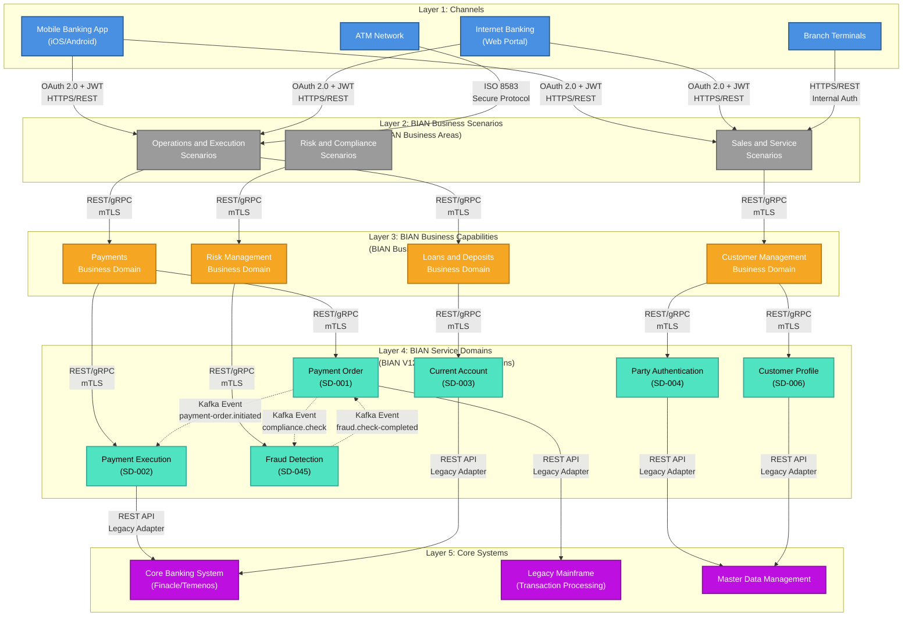

# Section 4: Meta Architecture - BIAN 5-Layer Architecture

<!-- ARCHITECTURE_TYPE: BIAN -->

**Purpose**: Define the BIAN-compliant layered architecture model that organizes system components according to BIAN V12.0 business hierarchy and banking industry standards.

This template follows the **BIAN 5-Layer Architecture** pattern, designed for banking and financial services systems requiring full BIAN V12.0 certification and compliance across all architectural layers.

**BIAN Standard**: This template uses **BIAN V12.0** as the mandatory standard across Layers 2, 3, and 4. See the [BIAN Service Landscape V12.0](https://bian.org/servicelandscape-12-0-0/views/view_51891.html) for official service domain definitions.

**Key Distinction from META Architecture**: BIAN architecture implements full BIAN V12.0 compliance across three layers (Business Scenarios, Business Capabilities, and Service Domains), whereas META architecture applies BIAN only to Layer 5 (Domain). BIAN architecture is optimized for BIAN certification and complete traceability through the BIAN business hierarchy.

---

## Layers Overview

| Layer | Function | BIAN V12.0 Mapping |
|-------|----------|-------------------|
| **Layer 1: Channels** | User interaction points across all channels (web, mobile, ATM, branch, API). | Channel implementation patterns |
| **Layer 2: BIAN Business Scenarios** | Business process orchestration and scenario management. | BIAN Business Areas (5 areas) |
| **Layer 3: BIAN Business Capabilities** | Business capability management and coordination. | BIAN Business Domains (30+ domains) |
| **Layer 4: BIAN Service Domains** | Atomic banking services following BIAN V12.0 service domain model. | BIAN Service Domains (326+ domains) |
| **Layer 5: Core Systems** | Legacy and core banking systems providing foundational services. | System of record |

**BIAN Hierarchy Traceability**:
- **BIAN Business Areas** (5 areas) → Implemented in Layer 2: BIAN Business Scenarios
- **BIAN Business Domains** (30+ domains) → Implemented in Layer 3: BIAN Business Capabilities
- **BIAN Service Domains** (326+ domains) → Implemented in Layer 4: BIAN Service Domains

---

## Layer Documentation Template

For each layer, document the following information:

### Layer 1: Channels

**Purpose**: Manage user interaction across all banking channels (web, mobile, ATM, branch, API gateway)

**Components**:
- Component 1: [Name and brief description - e.g., Mobile Banking App]
- Component 2: [Name and brief description - e.g., Internet Banking Portal]
- Component 3: [Name and brief description - e.g., ATM Network Interface]
- Component 4: [Name and brief description - e.g., Branch Terminal System]

**Technologies**:
- Primary: [Main technology stack - e.g., React Native, Angular, Java]
- Supporting: [Additional technologies, frameworks - e.g., OAuth 2.0, Firebase]

**Key Responsibilities**:
- Provide omnichannel access to banking services
- Manage channel-specific user authentication
- Adapt user experience to channel capabilities
- Handle channel-specific security requirements
- Orchestrate multi-channel user journeys
- Manage session state across channels

**Communication Patterns**:
- Inbound: [How users interact with channels - HTTPS, mobile protocols]
- Outbound: [How channels communicate with Layer 2 - REST, GraphQL]
- Protocols: [HTTPS/REST, OAuth 2.0, WebSockets, etc.]

**Non-Functional Requirements**:
- Performance: [Latency, throughput requirements - e.g., <500ms response time]
- Availability: [SLA, uptime requirements - e.g., 99.95% uptime]
- Scalability: [How this layer scales - e.g., auto-scaling to 100K concurrent users]

---

### Layer 2: BIAN Business Scenarios

**Purpose**: Orchestrate transversal business processes and scenarios aligned with BIAN Business Areas

**BIAN V12.0 Alignment**: This layer maps business scenarios to the 5 BIAN Business Areas defined in [BIAN Service Landscape V12.0](https://bian.org/servicelandscape-12-0-0/views/view_51891.html):
1. **Sales and Service** - Customer-facing scenarios (onboarding, sales, servicing)
2. **Reference Data** - Data management scenarios (party, product, market data)
3. **Operations and Execution** - Transaction execution scenarios (payments, settlements)
4. **Risk and Compliance** - Risk management and regulatory scenarios
5. **Business Support** - Internal operational scenarios (reporting, analytics)

**Components**:
- Business Scenario Orchestrator: [Description - e.g., Workflow engine coordinating BIAN Business Areas]
- Process Management: [Description - e.g., BPMN engine for scenario flows]
- Business Rules Engine: [Description - e.g., Rules engine for scenario logic]

**Technologies**:
- Primary: [Workflow/orchestration technology - e.g., Camunda, Apache Airflow]
- Supporting: [Rules engine, process automation - e.g., Drools, custom]

**Key Responsibilities**:
- Orchestrate end-to-end business scenarios across BIAN Business Areas
- Coordinate business capabilities (Layer 3) to fulfill scenarios
- Implement cross-domain business process flows
- Apply business rules and policies at scenario level
- Manage scenario state and lifecycle
- Ensure regulatory compliance for business scenarios

**BIAN Business Area Mapping**:
Document which BIAN Business Areas are implemented in this layer:

| Business Scenario | BIAN Business Area | BIAN Business Domains (Layer 3) | Description |
|-------------------|-------------------|--------------------------------|-------------|
| [Scenario Name] | [Sales and Service / Reference Data / Operations and Execution / Risk and Compliance / Business Support] | [List of Business Domains involved] | [What this scenario orchestrates] |

**Communication Patterns**:
- Inbound: [From Layer 1 Channels - REST, GraphQL]
- Outbound: [To Layer 3 BIAN Business Capabilities - REST, events]
- Protocols: [Synchronous: REST, gRPC; Asynchronous: Kafka, message queues]

**Non-Functional Requirements**:
- Performance: [Process execution time - e.g., <2 seconds for scenario orchestration]
- Availability: [Business continuity requirements - e.g., 99.9% uptime]
- Scalability: [Process volume handling - e.g., 10K concurrent scenarios]

---

### Layer 3: BIAN Business Capabilities

**Purpose**: Implement business capabilities aligned with BIAN Business Domains

**BIAN V12.0 Alignment**: This layer implements the 30+ BIAN Business Domains defined in [BIAN Service Landscape V12.0](https://bian.org/servicelandscape-12-0-0/views/view_51891.html). Each business domain groups related BIAN Service Domains (Layer 4).

**BIAN Business Domains** (examples - see [BIAN V12.0](https://bian.org/servicelandscape-12-0-0/views/view_51891.html) for complete list):
- **Customer Management**: Party, customer relationship, customer portfolio
- **Product Management**: Product directory, product design, product deployment
- **Channel Management**: Channel activity analysis, servicing mandate
- **Payments**: Payment order, payment execution, payment initiation
- **Loans and Deposits**: Consumer loan, current account, savings account
- **Risk Management**: Market risk, credit risk, operational risk
- **Compliance**: Regulatory compliance, fraud detection
- [Additional business domains as applicable]

**Components**:
- Business Capability Services: [Description - e.g., Services implementing BIAN Business Domains]
- Business API Layer: [Description - e.g., API facade for business capabilities]
- Business Domain Coordinator: [Description - e.g., Coordinates service domains within a business domain]

**Technologies**:
- Primary: [Business services platform - e.g., Spring Boot, Node.js]
- Supporting: [API management, orchestration - e.g., Kong, Apigee]

**Key Responsibilities**:
- Implement BIAN Business Domain logic
- Coordinate BIAN Service Domains (Layer 4) within each business domain
- Expose business capabilities through standardized APIs
- Manage business domain state and lifecycle
- Enforce business domain policies and rules
- Ensure cross-domain consistency

**BIAN Business Domain Mapping**:
Document which BIAN Business Domains are implemented in this layer:

| BIAN Business Domain | BIAN Business Area (Layer 2) | BIAN Service Domains (Layer 4) | Responsibilities |
|---------------------|------------------------------|-------------------------------|------------------|
| [Domain Name] | [Parent Business Area] | [List of Service Domains in this domain] | [What this capability manages] |

**Communication Patterns**:
- Inbound: [From Layer 2 Business Scenarios - REST, events]
- Outbound: [To Layer 4 BIAN Service Domains - REST, gRPC, events]
- Protocols: [REST, gRPC, domain events, Kafka]

**Non-Functional Requirements**:
- Performance: [Capability response time - e.g., <300ms for API calls]
- Availability: [Business domain availability - e.g., 99.95% uptime]
- Scalability: [Domain-specific scaling - e.g., horizontal scaling by business domain]

---

### Layer 4: BIAN Service Domains

**Purpose**: Implement atomic banking services as defined by BIAN V12.0 Service Domain model

**BIAN V12.0 Alignment**: This layer implements the 326+ BIAN Service Domains from the [BIAN Service Landscape V12.0](https://bian.org/servicelandscape-12-0-0/views/view_51891.html). Each service domain is an atomic, independently deployable banking service.

**CRITICAL**: All service domains in this layer MUST be validated against the official [BIAN V12.0 Service Landscape](https://bian.org/servicelandscape-12-0-0/views/view_51891.html) to ensure accurate naming and compliance.

**Service Domain Documentation Template**:

For each BIAN Service Domain, document the following:

#### BIAN Service Domain: [Official BIAN Service Domain Name]

**BIAN Metadata** (MANDATORY):
- **Official BIAN Name**: [Exact name from BIAN V12.0 Service Landscape - e.g., "Payment Order", "Current Account"]
- **BIAN ID**: [Internal tracking ID - e.g., SD-001 for document tracking only]
- **BIAN Version**: V12.0 (mandatory)
- **BIAN Business Domain**: [Parent business domain - e.g., "Payments", "Loans and Deposits"]
- **BIAN Business Area**: [Parent business area - e.g., "Operations and Execution"]
- **BIAN Service Landscape URL**: [Direct link to service domain in BIAN V12.0 landscape]

**Control Record** ([BIAN Standard](https://bian.org/servicelandscape-12-0-0/views/view_51891.html)):
- **Control Record Type**: [As defined in BIAN spec - e.g., "PaymentOrderProcedure"]
- **Structure**: [Document control record structure per BIAN specification]
- **Lifecycle**: [Active, completed, suspended states per BIAN]

**Service Operations** ([BIAN Standard](https://bian.org/servicelandscape-12-0-0/views/view_51891.html)):
Document the standard BIAN service operations for this domain:
- **Initiate**: [Create new control record - description of initiate operation]
- **Update**: [Modify existing control record - description of update operation]
- **Retrieve**: [Query control record - description of retrieve operation]
- **Control**: [Manage control record lifecycle - description of control operation]
- **Exchange**: [If applicable - exchange operation description]
- **Execute**: [If applicable - execute operation description]
- **Request**: [If applicable - request operation description]

**Behavior Qualifiers** ([BIAN Standard](https://bian.org/servicelandscape-12-0-0/views/view_51891.html)):
- [List behavior qualifiers as defined in BIAN spec for this service domain]
- [Example: "registration", "valuation", "compliance" for specific domains]

**Functional Patterns** ([BIAN Standard](https://bian.org/servicelandscape-12-0-0/views/view_51891.html)):
- **Pattern Type**: [Managed Object, Tracked Object, Administered Object, Governed Object, etc.]
- **Pattern Description**: [How this service domain follows the BIAN functional pattern]

**Implementation Details**:
- **Technology Stack**: [Primary language/framework - e.g., Java/Spring Boot, Node.js]
- **Database**: [Data store - e.g., PostgreSQL, MongoDB]
- **API Endpoints**: [List key endpoints following BIAN service operations]
  - `POST /service-domain/initiate`: Initiate service domain
  - `PUT /service-domain/{id}/update`: Update control record
  - `GET /service-domain/{id}/retrieve`: Retrieve control record
  - `PUT /service-domain/{id}/control`: Control lifecycle

**Data Ownership**:
- [What data this service domain owns - aligned with BIAN control record]

**Dependencies**:
- **Upstream Service Domains**: [BIAN Service Domains this domain depends on]
- **Downstream Service Domains**: [BIAN Service Domains that depend on this domain]

**Events Published** (if event-driven):
- `[service-domain].[event-name]`: [When and what data - e.g., "payment-order.initiated"]

**Events Consumed** (if event-driven):
- `[other-domain].[event-name]`: [From which service domain, what action taken]

**Non-Functional Requirements**:
- Performance: [Service response time - e.g., <200ms p95]
- Availability: [Service SLA - e.g., 99.99% uptime]
- Scalability: [Scaling strategy - e.g., horizontal scaling 2-10 instances]

**BIAN Compliance Level**:
- **Level**: Full BIAN V12.0 Compliance (required for BIAN architecture type)
- **Validation Date**: [When compliance was validated]
- **Deviations**: [None for full compliance, or document any customizations]

---

**Technologies** (Layer 4 Overview):
- Primary: [Microservices framework - e.g., Spring Boot, Node.js]
- Supporting: [Databases, caching, messaging - e.g., PostgreSQL, Redis, Kafka]

**Key Responsibilities** (Layer 4 Overview):
- Implement BIAN Service Domain functional patterns
- Maintain BIAN control records per specification
- Expose BIAN service operations (Initiate, Update, Retrieve, Control, etc.)
- Ensure BIAN behavior qualifier implementation
- Manage service domain lifecycle per BIAN standards
- Publish domain events for state changes

**Communication Patterns**:
- Inbound: [From Layer 3 BIAN Business Capabilities - REST, gRPC]
- Outbound: [To Layer 5 Core Systems - REST, legacy protocols, events]
- Protocols: [REST, gRPC, Kafka, legacy protocols as needed]

**BIAN Service Domain Catalog**:

| BIAN Service Domain | BIAN ID | BIAN Business Domain | BIAN Business Area | Technology | Team Owner |
|--------------------|---------|---------------------|-------------------|------------|------------|
| [Official BIAN Name] | SD-001 | [Business Domain] | [Business Area] | [Tech Stack] | [Team] |
| [Official BIAN Name] | SD-002 | [Business Domain] | [Business Area] | [Tech Stack] | [Team] |
| [Official BIAN Name] | SD-003 | [Business Domain] | [Business Area] | [Tech Stack] | [Team] |

**Implementation Guidance**:
1. Validate all service domain names against the official [BIAN V12.0 Service Landscape](https://bian.org/servicelandscape-12-0-0/views/view_51891.html)
2. Assign internal BIAN IDs (SD-XXX format) for document tracking only
3. Implement all mandatory BIAN service operations for each service domain
4. Document control records per BIAN specification
5. Implement behavior qualifiers as defined in BIAN V12.0
6. Follow BIAN functional patterns (Managed Object, Tracked Object, etc.)
7. Ensure full traceability: Service Domain → Business Domain → Business Area

---

### Layer 5: Core Systems

**Purpose**: Provide foundational banking services through legacy and core banking systems

**Systems**:
- Core Banking System: [Name, vendor, version - e.g., Finacle 10.x, Temenos T24]
- Transaction Processing System: [Name, description]
- Legacy Mainframe: [System name, purpose]
- Master Data Management: [System for customer, product, reference data]

**Technologies**:
- Primary: [Core banking platform, mainframe - e.g., IBM z/OS, Oracle Database]
- Supporting: [Databases, interfaces, adapters - e.g., DB2, MQ, ESB]

**Key Responsibilities**:
- Provide system of record for core banking data
- Process critical banking transactions
- Maintain account balances and ledgers
- Ensure regulatory compliance and audit trails
- Support BIAN Service Domains (Layer 4) with foundational services
- Manage master data for customers, products, accounts

**Communication Patterns**:
- Inbound: [From Layer 4 BIAN Service Domains - REST APIs, legacy protocols]
- Outbound: [Data replication, events, batch files]
- Protocols: [Legacy protocols (MQ, file transfer), REST APIs, SOAP, database replication]

**BIAN Integration Strategy**:
- **Adapter Pattern**: [How core systems are wrapped to support BIAN Service Domains]
- **Data Synchronization**: [How core data is synchronized with BIAN service domains]
- **Transaction Coordination**: [How distributed transactions are managed]
- **Event Publishing**: [How core system events are published to BIAN layers]

**Modernization Strategy**:
- Current State: [Assessment of legacy systems and technical debt]
- Target State: [Modernization goals aligned with BIAN architecture]
- Migration Approach: [Strangler pattern, lift-and-shift, progressive modernization]
- BIAN Alignment: [How modernization supports BIAN compliance]
- Gradual Evolution: [Phased approach to minimize business disruption]

**Non-Functional Requirements**:
- Performance: [Transaction processing rate - e.g., 10K TPS]
- Availability: [24/7 uptime requirements - e.g., 99.99% availability]
- Scalability: [Capacity planning - e.g., vertical scaling for mainframe]
- Resilience: [Disaster recovery, backup strategy - e.g., RPO <15 min, RTO <1 hour]

---

## Example Implementation

### Layer 1: Channels - Mobile Banking App

**Purpose**: Provide retail customers with mobile access to banking services on iOS and Android.

**Components**:
- Mobile Banking App (iOS): Native iOS app using Swift
- Mobile Banking App (Android): Native Android app using Kotlin
- Mobile BFF (Backend for Frontend): Node.js API tailored for mobile clients

**Technologies**:
- Primary: Swift (iOS), Kotlin (Android), Node.js (BFF)
- Supporting: OAuth 2.0, Firebase Cloud Messaging, Biometric Authentication

**Key Responsibilities**:
- User authentication with biometrics (Face ID, Touch ID, fingerprint)
- Account overview and transaction history
- Fund transfers and bill payments
- Mobile-specific features (QR payments, mobile check deposit)
- Push notifications for account alerts

**Communication Patterns**:
- Inbound: User interactions via mobile app
- Outbound: HTTPS/REST to Mobile BFF, which calls Layer 2 Business Scenarios
- Protocols: HTTPS/REST, OAuth 2.0, WebSockets for real-time updates

**Non-Functional Requirements**:
- Performance: <500ms response time for API calls, <2s for screen load
- Availability: 99.95% uptime (4.4 hours/year downtime)
- Scalability: Support 500K monthly active users, auto-scaling BFF 2-10 instances

---

### Layer 4: BIAN Service Domain - Payment Order

#### BIAN Service Domain: Payment Order

**BIAN Metadata** (MANDATORY):
- **Official BIAN Name**: Payment Order
- **BIAN ID**: SD-001 (internal tracking)
- **BIAN Version**: V12.0
- **BIAN Business Domain**: Payments
- **BIAN Business Area**: Operations and Execution
- **BIAN Service Landscape URL**: https://bian.org/servicelandscape-12-0-0/views/view_51891.html

**Control Record** ([BIAN Standard](https://bian.org/servicelandscape-12-0-0/views/view_51891.html)):
- **Control Record Type**: PaymentOrderProcedure
- **Structure**: Includes payment details, parties, amounts, dates, status
- **Lifecycle**: Initiated → In Progress → Completed / Failed / Cancelled

**Service Operations** ([BIAN Standard](https://bian.org/servicelandscape-12-0-0/views/view_51891.html)):
- **Initiate**: Create new payment order (validate parties, amounts, compliance)
- **Update**: Modify payment order details (before execution)
- **Retrieve**: Query payment order status and details
- **Control**: Manage payment order lifecycle (cancel, suspend, resume)
- **Execute**: Trigger payment execution (hand off to Payment Execution SD)

**Behavior Qualifiers** ([BIAN Standard](https://bian.org/servicelandscape-12-0-0/views/view_51891.html)):
- compliance, reporting, booking

**Functional Patterns** ([BIAN Standard](https://bian.org/servicelandscape-12-0-0/views/view_51891.html)):
- **Pattern Type**: Tracked Object
- **Pattern Description**: Manages lifecycle of payment orders from initiation through completion

**Implementation Details**:
- **Technology Stack**: Java 17, Spring Boot 3.1, Spring Data JPA
- **Database**: PostgreSQL 15 (payment_orders, payment_order_events tables)
- **API Endpoints**:
  - `POST /payment-order/initiate`: Initiate new payment order
  - `PUT /payment-order/{id}/update`: Update payment order
  - `GET /payment-order/{id}/retrieve`: Retrieve payment order details
  - `PUT /payment-order/{id}/control`: Control payment order lifecycle
  - `POST /payment-order/{id}/execute`: Execute payment order

**Data Ownership**:
- Payment order control records
- Payment order status and lifecycle events
- Payment order compliance checks

**Dependencies**:
- **Upstream Service Domains**: Party Authentication (SD-004), Account Verification (SD-007)
- **Downstream Service Domains**: Payment Execution (SD-002), Payment Routing (SD-003)

**Events Published**:
- `payment-order.initiated`: When payment order created
- `payment-order.updated`: When payment order modified
- `payment-order.executed`: When payment handed to execution
- `payment-order.completed`: When payment fully processed
- `payment-order.failed`: When payment fails validation or execution

**Events Consumed**:
- `payment-execution.completed`: From Payment Execution (SD-002), updates payment order status
- `compliance.check-completed`: From Fraud Detection (SD-045), validates payment

**Non-Functional Requirements**:
- Performance: <200ms p95 response time, 1000 TPS
- Availability: 99.99% uptime (52 minutes/year downtime)
- Scalability: Horizontal scaling 3-15 pods based on load

**BIAN Compliance Level**:
- **Level**: Full BIAN V12.0 Compliance
- **Validation Date**: 2025-01-15
- **Deviations**: None

---

## Architecture Diagram (Mermaid)

This section provides a visual representation of the 5-layer BIAN architecture using Mermaid diagrams.

**Purpose**: Visualize the BIAN layer structure, BIAN hierarchy mapping, and communication patterns between layers.

**Diagram Note**: Layer 4 components MUST reference official [BIAN V12.0 Service Domains](https://bian.org/servicelandscape-12-0-0/views/view_51891.html). All service domain names must be validated against the BIAN V12.0 Service Landscape.

### BIAN Architecture Diagram Example

The following diagram shows a complete 5-layer BIAN architecture with BIAN Business Areas, Business Domains, and Service Domains:

````markdown

````

### Legend

**Arrow Types**:
- **Solid arrows (`-->`)**: Synchronous calls (REST, gRPC)
- **Dashed arrows (`-.->`)**: Asynchronous events (Kafka, message queues)

**Colors**:
- **Blue**: Layer 1 (Channels)
- **Gray**: Layer 2 (BIAN Business Scenarios / BIAN Business Areas)
- **Orange**: Layer 3 (BIAN Business Capabilities / BIAN Business Domains)
- **Teal**: Layer 4 (BIAN Service Domains)
- **Purple**: Layer 5 (Core Systems)

**BIAN Hierarchy Visualization**:
- **Layer 2 → BIAN Business Areas**: 5 business areas (Sales and Service, Operations and Execution, Risk and Compliance, etc.)
- **Layer 3 → BIAN Business Domains**: 30+ business domains (Customer Management, Payments, Loans and Deposits, etc.)
- **Layer 4 → BIAN Service Domains**: 326+ service domains (Payment Order SD-001, Payment Execution SD-002, etc.)

### Customization Instructions

To customize this diagram for your specific BIAN architecture:

1. **Update Layer 1 Channels**: Replace example channels with your actual channel implementations
2. **Update Layer 2 Business Scenarios**: Map your business scenarios to BIAN Business Areas
3. **Update Layer 3 Business Capabilities**: Identify which BIAN Business Domains are implemented
4. **Update Layer 4 Service Domains**: Replace example service domains with your BIAN V12.0 service domains (validate names against [BIAN Service Landscape](https://bian.org/servicelandscape-12-0-0/views/view_51891.html))
5. **Update Layer 5 Core Systems**: Replace with your actual core banking systems
6. **Add/Remove Communication Flows**: Update arrows based on your actual integration patterns
7. **Adjust Colors**: Modify the `classDef` styling to match your organization's standards

**For detailed diagram creation and update instructions**, see [MERMAID_DIAGRAMS_GUIDE.md](../MERMAID_DIAGRAMS_GUIDE.md).

---

## Guidelines

1. **All 5 layers are required** in BIAN architecture
2. **Document layers in order**: Channels → BIAN Business Scenarios → BIAN Business Capabilities → BIAN Service Domains → Core Systems
3. **Each layer must include all subsections**: Purpose, Components, Technologies, Key Responsibilities, Communication Patterns, Non-Functional Requirements
4. **Flow direction**: Requests typically flow top-down (Channels → Core), responses flow bottom-up
5. **BIAN V12.0 compliance is mandatory** for Layers 2, 3, and 4:
   - Layer 2: Map to BIAN Business Areas (5 areas)
   - Layer 3: Map to BIAN Business Domains (30+ domains)
   - Layer 4: Implement BIAN Service Domains (326+ domains)
6. **BIAN hierarchy traceability**: Every service domain must be traceable to its parent business domain and business area
7. **BIAN service domain validation**: All service domain names in Layer 4 must be validated against the official [BIAN V12.0 Service Landscape](https://bian.org/servicelandscape-12-0-0/views/view_51891.html)
8. **BIAN service operations**: All Layer 4 service domains must implement BIAN standard service operations (Initiate, Update, Retrieve, Control, etc.)
9. **BIAN control records**: Document control record structure per BIAN specification for each service domain
10. **BIAN functional patterns**: Identify and document the BIAN functional pattern for each service domain (Managed Object, Tracked Object, etc.)
11. **BIAN metadata**: All Layer 4 service domains must include complete BIAN metadata (BIAN ID, version, business domain, business area)
12. **Core systems integration**: Layer 5 must document how core systems support BIAN service domains through adapters and integration patterns
13. **Modernization strategy**: Document progressive modernization approach aligned with BIAN architecture goals

---

## Validation Checklist

**Structure Validation**:
- [ ] All 5 layers documented in order (Channels, BIAN Business Scenarios, BIAN Business Capabilities, BIAN Service Domains, Core Systems)
- [ ] Each layer has all required subsections (Purpose, Components, Technologies, Key Responsibilities, Communication Patterns, Non-Functional Requirements)
- [ ] Communication patterns defined for inter-layer communication
- [ ] Technologies specified for each layer
- [ ] Non-functional requirements quantified (not placeholders)

**BIAN V12.0 Compliance Validation**:
- [ ] Layer 2: Business scenarios mapped to BIAN Business Areas (5 areas)
- [ ] Layer 2: BIAN Business Area mapping table included
- [ ] Layer 3: Business capabilities mapped to BIAN Business Domains (30+ domains)
- [ ] Layer 3: BIAN Business Domain mapping table included
- [ ] Layer 4: All service domains validated against [BIAN V12.0 Service Landscape](https://bian.org/servicelandscape-12-0-0/views/view_51891.html)
- [ ] Layer 4: Service domain catalog table included with BIAN IDs
- [ ] Layer 4: Each service domain has complete BIAN metadata (Official Name, BIAN ID, Version, Business Domain, Business Area, URL)
- [ ] Layer 4: Control records documented per BIAN specification
- [ ] Layer 4: Service operations documented (Initiate, Update, Retrieve, Control, etc.)
- [ ] Layer 4: Behavior qualifiers documented per BIAN spec
- [ ] Layer 4: Functional patterns documented per BIAN spec
- [ ] Layer 4: BIAN compliance level documented (Full/Partial/Custom)

**BIAN Hierarchy Traceability**:
- [ ] Clear mapping: BIAN Service Domain → BIAN Business Domain → BIAN Business Area
- [ ] BIAN hierarchy visualization in architecture diagram
- [ ] Cross-references between layers 2, 3, and 4

**Integration and Implementation**:
- [ ] Layer 5: Core systems integration strategy documented
- [ ] Layer 5: BIAN adapter pattern documented
- [ ] Layer 5: Modernization strategy aligned with BIAN architecture
- [ ] Architecture diagram included (Mermaid format showing all 5 layers)
- [ ] BIAN V12.0 reference URLs included throughout document
- [ ] Event-driven patterns documented (if applicable)

**Quality Checks**:
- [ ] No placeholder content (all sections filled with real information)
- [ ] All BIAN service domain names use exact BIAN V12.0 terminology
- [ ] BIAN IDs (SD-XXX) used consistently for internal tracking
- [ ] All required BIAN URLs reference https://bian.org/servicelandscape-12-0-0/views/view_51891.html
