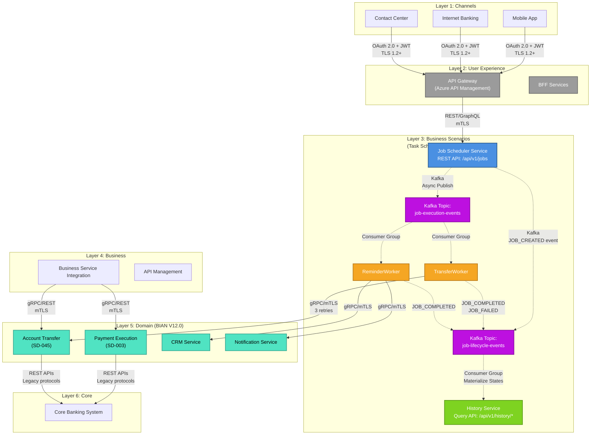

# Section 4: Meta Architecture - META 6-Layer Enterprise Model

<!-- ARCHITECTURE_TYPE: META -->

**Purpose**: Define the layered architecture model that organizes system components according to their responsibilities and functions.

This template follows the **META 6-Layer Enterprise Architecture** model, designed for large enterprise systems with complex integrations and regulatory compliance requirements.

**BIAN Standard**: This template uses **BIAN V12.0** as the default and recommended version for Layer 5 (Domain) service domain modeling. See the [BIAN Service Landscape V12.0](https://bian.org/servicelandscape-12-0-0/views/view_51891.html) for official service domain definitions.

---

## Layers Overview

| Layer | Function |
|-------|----------|
| **Channels** | Manages interaction with end users through various channels (web, mobile, chatbots, IVR, etc.). |
| **User Experience** | Centralizes user experience and personalization logic, managing user journeys and flows. |
| **Business Scenarios** | Defines and orchestrates transversal business processes and scenarios. |
| **Business** | Implements main business capabilities, aligned with strategic objectives, ensuring BIAN N2 compliance. |
| **Domain** | Represents the functional core of the business, modeled under [BIAN V12.0](https://bian.org/servicelandscape-12-0-0/views/view_51891.html) standard. |
| **Core** | Manages central and legacy systems that support critical operations. |

---

## Layer Documentation Template

For each layer, document the following information:

### Layer 1: Channels

**Purpose**: Manage interaction with end users through various channels (web, mobile, chatbots, IVR, etc.)

**Components**:
- Component 1: [Name and brief description]
- Component 2: [Name and brief description]
- Component 3: [Name and brief description]

**Technologies**:
- Primary: [Main technology stack]
- Supporting: [Additional technologies, frameworks]

**Key Responsibilities**:
- Orchestrate omnichannel experience
- Adapt presentation and flow according to the channel
- Encapsulate presentation and access logic
- Manage channel-specific user interactions

**Communication Patterns**:
- Inbound: [How this layer receives requests]
- Outbound: [How this layer communicates with other layers]
- Protocols: [HTTP/REST, gRPC, messaging, etc.]

**Non-Functional Requirements**:
- Performance: [Latency, throughput requirements]
- Availability: [SLA, uptime requirements]
- Scalability: [How this layer scales]

---

### Layer 2: User Experience

**Purpose**: Centralize user experience and personalization logic

**Components**:
- BFF (Backend for Frontend): [Description]
- API Gateway: [Description]
- Session Management: [Description]

**Technologies**:
- Primary: [Main technology stack]
- Supporting: [Additional technologies, frameworks]

**Key Responsibilities**:
- Manage user journeys and flows
- Apply personalization and context rules
- Service orchestration and composition
- User session management
- Experience personalization
- Response formatting and aggregation

**Communication Patterns**:
- Inbound: [From Channels layer]
- Outbound: [To Business Scenarios and Business layers]
- Protocols: [REST, GraphQL, etc.]

**Non-Functional Requirements**:
- Performance: [Response time targets]
- Availability: [High availability requirements]
- Scalability: [Horizontal scaling approach]

---

### Layer 3: Business Scenarios

**Purpose**: Define and orchestrate transversal business processes and scenarios

**Components**:
- Scenario Orchestrator: [Description]
- Process Engine: [Description]
- Business Rules Engine: [Description]

**Technologies**:
- Primary: [Workflow/orchestration technology]
- Supporting: [Rules engine, process automation]

**Key Responsibilities**:
- Model end-to-end business processes
- Integrate business and domain capabilities
- Adapt flows to regulatory or market requirements
- Cross-domain business process orchestration
- Business rule execution
- Transaction coordination
- Workflow management

**Communication Patterns**:
- Inbound: [From User Experience layer]
- Outbound: [To Business and Domain layers]
- Protocols: [Sync/async patterns, events]

**Non-Functional Requirements**:
- Performance: [Process execution time]
- Availability: [Business continuity requirements]
- Scalability: [Process volume handling]

---

### Layer 4: Business

**Purpose**: Implement main business capabilities, aligned with strategic objectives

**Components**:
- Business Capability Services: [Description]
- Business API Layer: [Description]
- Business Rules Management: [Description]

**Technologies**:
- Primary: [Business services platform]
- Supporting: [API management, business rules engine]

**Key Responsibilities**:
- Manage business rules and logic
- Expose business services through APIs
- Ensure interoperability and compliance with BIAN N2 standard
- Implement business capability orchestration

**Communication Patterns**:
- Inbound: [From Business Scenarios layer]
- Outbound: [To Domain and external services]
- Protocols: [REST, SOAP, messaging, file transfer]

**Non-Functional Requirements**:
- Performance: [Message throughput]
- Availability: [Integration uptime]
- Scalability: [Message volume capacity]

---

### Layer 5: Domain

**Purpose**: Represent the functional core of the business, modeled under [BIAN V12.0](https://bian.org/servicelandscape-12-0-0/views/view_51891.html) standard

**Service Domains** ([BIAN V12.0](https://bian.org/servicelandscape-12-0-0/views/view_51891.html)):

Reference the [BIAN Service Landscape](https://bian.org/servicelandscape-12-0-0/views/view_51891.html) to identify appropriate service domains for your system.

- Service Domain 1: [BIAN Capability Name, BIAN ID (e.g., SD-001 - internal tracking), description]
- Service Domain 2: [BIAN Capability Name, BIAN ID (e.g., SD-003 - internal tracking), description]
- Service Domain 3: [BIAN Capability Name, BIAN ID (e.g., SD-045 - internal tracking), description]

**Note**: Validate each service domain **name (Capability)** against the official [BIAN V12.0 Service Landscape](https://bian.org/servicelandscape-12-0-0/views/view_51891.html) to ensure accurate alignment. BIAN IDs (SD-XXX) are for internal document tracking only to count how many service domains are used.

**Technologies**:
- Primary: [Microservices framework]
- Supporting: [Databases, caching, messaging]

**Key Responsibilities**:
- Implementation of BIAN Service Domains
- Ensure functional consistency across domains
- Domain-specific business logic
- Data ownership and management
- Domain event publishing
- Allow customization under ISO20022 if necessary

**Communication Patterns**:
- Inbound: [From Business layer]
- Outbound: [To Core systems and other domains]
- Protocols: [REST, gRPC, domain events]

**BIAN Alignment**:
- **Service Domain Model**: BIAN V12.0 (default and recommended version)
- **Official Reference**: [BIAN Service Landscape V12.0](https://bian.org/servicelandscape-12-0-0/views/view_51891.html)
- **Control Records**: [How implemented - document control record structure per BIAN spec]
- **Service Operations**: [Activation, configuration, feedback - reference official BIAN operations]
- **Compliance Level**: [Document alignment level - Full/Partial/Custom]

**Implementation Guidance**:
1. Validate service domain **names (Capabilities)** against the official BIAN V12.0 landscape
2. Assign internal BIAN IDs (e.g., SD-001, SD-002) for document tracking purposes only
3. Implement service operations according to BIAN V12.0 specifications for the validated capability
4. Maintain control records as defined in BIAN standards

**Non-Functional Requirements**:
- Performance: [Service response time]
- Availability: [Domain availability targets]
- Scalability: [Domain-specific scaling strategy]

---

### Layer 6: Core

**Purpose**: Manage central and legacy systems that support critical operations

**Systems**:
- Core Banking System: [Name, vendor, version]
- Transaction Processing: [Name, description]
- Legacy Systems: [List of critical legacy systems]

**Technologies**:
- Primary: [Mainframe, core banking platform]
- Supporting: [Databases, interfaces]

**Key Responsibilities**:
- Provide fundamental services (core banking, ERP, etc.)
- Integrate legacy capabilities with modern ecosystem
- Ensure operational continuity and resilience
- Account management
- Transaction processing
- Balance and ledger management
- Master data management

**Communication Patterns**:
- Inbound: [From Domain layer]
- Outbound: [Data replication, events]
- Protocols: [Legacy protocols, files, APIs]

**Modernization Strategy**:
- Current State: [Assessment of current systems]
- Target State: [Modernization goals]
- Migration Approach: [Progressive modernization - Strangler pattern, lift-and-shift, etc.]
- Gradual Evolution: [How legacy systems evolve while ensuring continuity]

**Non-Functional Requirements**:
- Performance: [Transaction processing rate]
- Availability: [24/7 uptime requirements]
- Scalability: [Capacity planning]

---

## Example Implementation

### Layer 1: Channels

**Purpose**: Provide omnichannel access to banking services for retail and corporate customers.

**Components**:
- Mobile Banking App (iOS/Android): Native applications for retail customers
- Internet Banking Portal: Web-based portal for account management
- ATM Network Interface: Integration with ATM network for cash services
- Contact Center Platform: Unified platform for customer service representatives

**Technologies**:
- Primary: React Native (Mobile), Angular (Web), Java Spring Boot (APIs)
- Supporting: OAuth 2.0, Firebase, CDN (CloudFront)

**Key Responsibilities**:
- User authentication and authorization
- Channel-specific presentation logic
- Device management and security
- Multi-factor authentication orchestration

**Communication Patterns**:
- Inbound: User requests via HTTPS
- Outbound: REST API calls to User Experience layer
- Protocols: HTTPS/REST, OAuth 2.0, WebSockets (real-time notifications)

**Non-Functional Requirements**:
- Performance: <500ms response time for API calls
- Availability: 99.95% uptime (4.4 hours/year downtime)
- Scalability: Auto-scaling to handle 100K concurrent users

---

## Architecture Diagram (Mermaid)

This section provides a visual representation of the 6-layer META architecture using Mermaid diagrams.

**Purpose**: Visualize the layer structure, component placement, and data flow between layers.

**Diagram Note**: Layer 5 components should reference official [BIAN V12.0 Service Domains](https://bian.org/servicelandscape-12-0-0/views/view_51891.html). Example services shown: Payment Execution (SD-003), Account Transfer (SD-045).

### META Architecture Diagram Example

The following diagram shows a complete 6-layer META architecture with detailed Layer 3 (Business Scenarios) event-driven components:

````markdown

````

### Legend

**Arrow Types**:
- **Solid arrows (`-->`)**: Synchronous calls (REST, gRPC, SOAP)
- **Dashed arrows (`-.->`)**: Asynchronous events (Kafka, message queues)

**Colors**:
- **Blue**: Entry points, schedulers
- **Orange**: Workers, executors
- **Green**: Query services, read models
- **Purple**: Event streaming (Kafka, message queues)
- **Teal**: Domain services (BIAN Service Domains)
- **Gray**: Infrastructure (API Gateway, load balancers)

### Customization Instructions

To customize this diagram for your specific architecture:

1. **Update Layer Components**: Replace example components with your actual services
2. **Update Protocols**: Modify data flow labels with your actual protocols and security
3. **Update BIAN Service Domains**: Replace SD-003, SD-045 with your BIAN identifiers
4. **Adjust Colors**: Modify the `classDef` styling to match your organization's standards
5. **Add/Remove Flows**: Update arrow connections based on your integration patterns

**For detailed diagram creation and update instructions**, see [MERMAID_DIAGRAMS_GUIDE.md](../MERMAID_DIAGRAMS_GUIDE.md).

---

## Guidelines

1. **All 6 layers are required** in META architecture
2. **Document layers in order**: Channels → UX → Business Scenarios → Business → Domain → Core
3. **Each layer must include all subsections**: Purpose, Components, Technologies, Key Responsibilities, Communication Patterns, Non-Functional Requirements
4. **Flow direction**: Requests typically flow top-down (Channels → Core), responses flow bottom-up
5. **Integration points**: Clearly define how each layer communicates with adjacent layers
6. **BIAN compliance**: Layer 4 (Business) should ensure BIAN N2 compliance; Layer 5 (Domain) should align with BIAN v12 Service Domain model
7. **ISO20022 customization**: Layer 5 (Domain) should allow customization under ISO20022 standard if necessary
8. **Modernization strategy**: Layer 6 (Core) should include plans for progressive legacy system evolution

---

## Validation Checklist

- [ ] All 6 layers documented (Channels, UX, Business Scenarios, Business, Domain, Core)
- [ ] Each layer has all required subsections
- [ ] Communication patterns defined for inter-layer communication
- [ ] Technologies specified for each layer
- [ ] Non-functional requirements quantified (not just placeholders)
- [ ] BIAN N2 compliance documented in Layer 4 (Business)
- [ ] BIAN V12.0 alignment documented in Layer 5 (Domain)
- [ ] BIAN service domain names (Capabilities) validated against [official landscape](https://bian.org/servicelandscape-12-0-0/views/view_51891.html)
- [ ] BIAN IDs (SD-XXX) used for internal document tracking only
- [ ] BIAN reference URLs included for service domain definitions
- [ ] ISO20022 customization mentioned in Layer 5 (Domain) if applicable
- [ ] Modernization strategy included in Layer 6 (Core)
- [ ] Architecture diagram included (Mermaid format recommended, see MERMAID_DIAGRAMS_GUIDE.md)