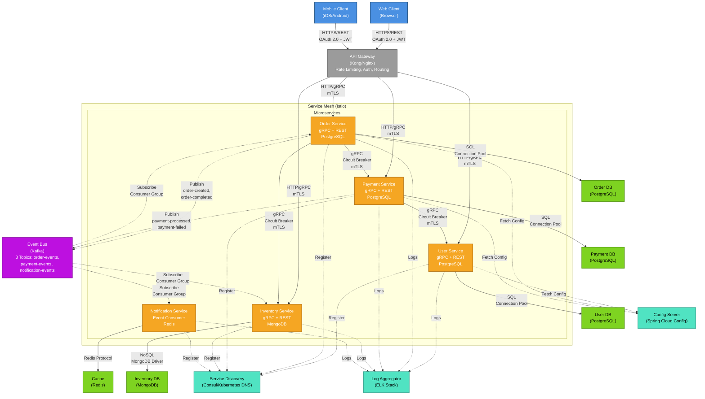

# Section 4: Meta Architecture - Microservices Architecture

<!-- ARCHITECTURE_TYPE: MICROSERVICES -->

**Purpose**: Define the microservices architecture model with independently deployable services organized around business capabilities.

This template follows the **Microservices Architecture** pattern, designed for cloud-native distributed systems with high scalability and independent service deployment.

---

## Architecture Overview

| Component Layer | Function |
|----------------|----------|
| **API Gateway** | Single entry point for clients, handles routing, authentication, rate limiting, and request aggregation. |
| **Service Mesh** | Infrastructure layer managing service-to-service communication, observability, and resilience. |
| **Microservices** | Independently deployable services implementing bounded contexts and business capabilities. |
| **Data Stores** | Decentralized data management with database-per-service pattern. |
| **Event Bus** | Asynchronous communication backbone for event-driven interactions between services. |
| **Supporting Infrastructure** | Configuration, service discovery, secrets management, and cross-cutting concerns. |

---

## Component Documentation Template

### API Gateway

**Purpose**: [What the API Gateway provides to clients]

**Capabilities**:
- Request routing and load balancing
- Authentication and authorization (JWT, OAuth 2.0)
- Rate limiting and throttling
- Request/response transformation
- API composition and aggregation

**Technologies**:
- Primary: [Kong, AWS API Gateway, Azure API Management, etc.]
- Supporting: [Authentication provider, caching layer]

**Key Responsibilities**:
- Centralized authentication
- API versioning management
- Cross-cutting concerns (CORS, compression)
- Client-specific API composition (BFF pattern)

**Communication Patterns**:
- Inbound: HTTPS from external clients
- Outbound: HTTP/gRPC to microservices
- Protocols: [REST, GraphQL, gRPC]

**Non-Functional Requirements**:
- Performance: [Latency overhead, throughput]
- Availability: [High availability setup]
- Scalability: [Concurrent connections capacity]

---

### Service Mesh

**Purpose**: [What the service mesh provides to services]

**Capabilities**:
- Service-to-service authentication (mTLS)
- Traffic management (canary deployments, circuit breaking)
- Observability (distributed tracing, metrics)
- Resilience (retries, timeouts, circuit breakers)

**Technologies**:
- Primary: [Istio, Linkerd, Consul Connect, AWS App Mesh]
- Supporting: [Envoy proxy, Jaeger, Prometheus]

**Key Responsibilities**:
- Automatic mTLS for service communication
- Traffic shaping and routing
- Distributed tracing injection
- Health checks and circuit breaking

**Communication Patterns**:
- Sidecar proxy pattern
- Control plane ↔ data plane communication
- Protocols: [gRPC for control plane, HTTP/gRPC for data plane]

**Non-Functional Requirements**:
- Performance: [Proxy overhead <10ms p99]
- Availability: [Control plane redundancy]
- Scalability: [Support for N services]

---

### Microservices

**Purpose**: [What microservices provide to the system]

Document each microservice using this template:

#### Service: [Service Name]

**Bounded Context**: [Domain/business capability this service owns]

**Responsibilities**:
- Responsibility 1
- Responsibility 2
- Responsibility 3

**Technologies**:
- Primary: [Language, framework - e.g., Java/Spring Boot, Node.js/Express, Go]
- Supporting: [Libraries, tools]

**API Endpoints**:
- `POST /api/v1/resource`: [Description]
- `GET /api/v1/resource/{id}`: [Description]
- `PUT /api/v1/resource/{id}`: [Description]

**Data Store**:
- Type: [PostgreSQL, MongoDB, DynamoDB, etc.]
- Schema: [Brief description or link to schema]
- Data Ownership: [What data this service owns]

**Events Published**:
- `resource.created`: [When and what data]
- `resource.updated`: [When and what data]

**Events Consumed**:
- `other.event`: [From which service, what action taken]

**Dependencies**:
- Upstream Services: [Services this service calls]
- Downstream Services: [Services that call this service]

**Non-Functional Requirements**:
- Performance: [Response time, throughput]
- Availability: [SLA, redundancy]
- Scalability: [Scaling strategy, resource limits]

---

### Data Stores (Database-per-Service)

**Purpose**: [Decentralized data management strategy]

**Pattern**: Database-per-Service

**Data Stores**:

| Service | Database Type | Technology | Purpose |
|---------|--------------|------------|---------|
| Service A | Relational | PostgreSQL | [Transactional data] |
| Service B | Document | MongoDB | [Flexible schema] |
| Service C | Key-Value | Redis | [Caching, sessions] |

**Data Consistency Strategy**:
- **Saga Pattern**: [For distributed transactions]
- **Event Sourcing**: [If applicable]
- **CQRS**: [If applicable]
- **Eventual Consistency**: [How handled]

**Data Synchronization**:
- Method: [Events, CDC, scheduled sync]
- Tools: [Kafka, Debezium, custom]

**Non-Functional Requirements**:
- Performance: [Query latency, throughput]
- Availability: [Backup strategy, failover]
- Scalability: [Sharding, replication]

---

### Event Bus

**Purpose**: [Asynchronous communication and event streaming]

**Capabilities**:
- Event publishing and subscription
- Event ordering and partitioning
- Event replay and history
- Dead-letter queue handling

**Technologies**:
- Primary: [Kafka, RabbitMQ, AWS EventBridge, Azure Event Hubs]
- Supporting: [Schema registry, monitoring]

**Event Topics**:

| Topic | Producers | Consumers | Purpose |
|-------|-----------|-----------|---------|
| `topic.name` | [Services] | [Services] | [What events flow here] |

**Key Responsibilities**:
- Reliable event delivery
- Event schema validation
- Event retention and replay
- Topic partitioning for scalability

**Communication Patterns**:
- Pub/Sub model
- Event sourcing (if applicable)
- CQRS read model updates

**Non-Functional Requirements**:
- Performance: [Throughput, latency]
- Availability: [Replication factor, durability]
- Scalability: [Partitioning strategy, consumer groups]

---

### Supporting Infrastructure

**Purpose**: [Cross-cutting infrastructure services]

**Components**:

#### Service Discovery
- Technology: [Consul, Eureka, Kubernetes DNS]
- Purpose: Dynamic service registration and lookup

#### Configuration Management
- Technology: [Spring Cloud Config, Consul KV, Kubernetes ConfigMaps]
- Purpose: Centralized configuration for all services

#### Secrets Management
- Technology: [HashiCorp Vault, AWS Secrets Manager, Azure Key Vault]
- Purpose: Secure storage and rotation of secrets

#### Distributed Logging
- Technology: [ELK Stack, Splunk, CloudWatch]
- Purpose: Centralized log aggregation and search

#### Monitoring & Alerting
- Technology: [Prometheus, Grafana, Datadog, New Relic]
- Purpose: Metrics collection and visualization

---

## Service Catalog

List all microservices in the system:

| Service Name | Bounded Context | Primary Technology | Data Store | Team Owner |
|--------------|----------------|-------------------|------------|------------|
| [Service 1] | [Context] | [Tech] | [DB] | [Team] |
| [Service 2] | [Context] | [Tech] | [DB] | [Team] |
| [Service 3] | [Context] | [Tech] | [DB] | [Team] |

---

## Communication Patterns

### Synchronous Communication
- **Pattern**: REST over HTTP, gRPC
- **Use Cases**: Request-response, real-time queries
- **Circuit Breakers**: [Resilience4j, Hystrix]
- **Timeouts**: [Default timeout values]

### Asynchronous Communication
- **Pattern**: Event-driven via message bus
- **Use Cases**: State changes, eventual consistency, notifications
- **Retry Strategy**: [Exponential backoff]
- **Dead Letter Queue**: [Handling failed events]

---

## Example Implementation

### API Gateway

**Purpose**: Provide unified API entry point for mobile and web clients.

**Capabilities**:
- JWT-based authentication
- Rate limiting (100 req/min per client)
- API versioning (v1, v2)
- Request aggregation for mobile clients

**Technologies**:
- Primary: Kong Gateway 3.x
- Supporting: Redis (rate limiting), Auth0 (authentication)

**Key Responsibilities**:
- Validate JWT tokens
- Route requests to appropriate microservices
- Apply rate limits per client tier (free, premium, enterprise)
- Transform API v1 calls to v2 internally

**Communication Patterns**:
- Inbound: HTTPS from clients (mobile apps, web apps)
- Outbound: HTTP/2 with gRPC to microservices
- Protocols: REST (client-facing), gRPC (internal)

**Non-Functional Requirements**:
- Performance: <50ms routing overhead, 10K req/sec throughput
- Availability: 99.99% uptime, active-active setup across 3 AZs
- Scalability: Auto-scaling 2-10 instances based on traffic

---

### Microservice: Order Service

**Bounded Context**: Order Management (order lifecycle from creation to fulfillment)

**Responsibilities**:
- Create and manage customer orders
- Calculate order totals and apply discounts
- Coordinate order fulfillment workflow
- Track order status changes

**Technologies**:
- Primary: Java 17, Spring Boot 3.1, Spring Data JPA
- Supporting: Resilience4j, Micrometer, Lombok

**API Endpoints**:
- `POST /api/v1/orders`: Create new order
- `GET /api/v1/orders/{id}`: Retrieve order details
- `PUT /api/v1/orders/{id}/status`: Update order status
- `GET /api/v1/orders/customer/{customerId}`: List customer orders

**Data Store**:
- Type: PostgreSQL 15
- Schema: orders, order_items, order_status_history tables
- Data Ownership: All order-related data

**Events Published**:
- `order.created`: When order is placed (includes order ID, customer ID, total)
- `order.confirmed`: When payment confirmed
- `order.shipped`: When order dispatched

**Events Consumed**:
- `payment.completed`: From Payment Service, triggers order confirmation
- `inventory.reserved`: From Inventory Service, confirms stock availability

**Dependencies**:
- Upstream Services: Payment Service, Inventory Service, Customer Service
- Downstream Services: Notification Service, Shipping Service

**Non-Functional Requirements**:
- Performance: <200ms response time (95th percentile), 500 TPS
- Availability: 99.9% uptime, 2 replicas minimum
- Scalability: Horizontal scaling 2-10 pods based on CPU (70% threshold)

---

## Architecture Diagram (Mermaid)

This section provides a visual representation of the microservices architecture using Mermaid diagrams.

**Purpose**: Visualize the service topology, API Gateway, service mesh, and communication patterns.

### Microservices Architecture Diagram Example

The following diagram shows a cloud-native microservices architecture with API Gateway, service mesh, and event-driven communication:

````markdown

````

### Legend

**Arrow Types**:
- **Solid arrows (`-->`)**: Synchronous calls (HTTP/REST, gRPC, SQL)
- **Dashed arrows (`-.->`)**: Asynchronous operations (events, service registration, logging, config fetch)

**Colors**:
- **Blue**: Clients (web, mobile)
- **Gray**: API Gateway and load balancers
- **Orange**: Microservices
- **Purple**: Event Bus (Kafka, message brokers)
- **Green**: Databases (PostgreSQL, MongoDB, Redis)
- **Teal**: Supporting infrastructure (service discovery, config, logging)

**Communication Patterns**:
- **Client → API Gateway**: HTTPS/REST with OAuth 2.0 + JWT authentication
- **API Gateway → Services**: HTTP/gRPC with mTLS (mutual TLS)
- **Service → Service (Sync)**: gRPC with circuit breakers and mTLS (via service mesh)
- **Service → Event Bus**: Kafka protocol for publish/subscribe patterns
- **Service → Database**: Database-per-service pattern (no shared databases)
- **Service → Infrastructure**: Service discovery registration, config fetch, log streaming

**Service Mesh Benefits**:
- Automatic mTLS between services
- Load balancing and traffic management
- Circuit breaker and retry policies
- Distributed tracing (Jaeger/Zipkin integration)
- Observability (metrics, logs, traces)

### Customization Instructions

To customize this diagram for your specific architecture:

1. **Update Services**: Replace example services (User, Order, Payment, Inventory, Notification) with your actual microservices
2. **Update Databases**: Modify database technologies based on your data storage choices
3. **Update Event Bus**: Replace Kafka with your message broker (RabbitMQ, AWS SQS, Azure Service Bus, etc.)
4. **Update Service Mesh**: Change Istio to your service mesh (Linkerd, Consul Connect, AWS App Mesh) or remove if not using one
5. **Add/Remove Communication Flows**: Update arrows based on your actual service dependencies
6. **Adjust Colors**: Modify the `classDef` styling to match your organization's standards

**For detailed diagram creation and update instructions**, see [MERMAID_DIAGRAMS_GUIDE.md](../MERMAID_DIAGRAMS_GUIDE.md).

---

## Guidelines

1. **Service independence**: Each microservice must be independently deployable
2. **Database-per-service**: No shared databases between services
3. **API-first design**: Well-defined APIs (OpenAPI/Swagger) for all services
4. **Bounded contexts**: Align services with DDD bounded contexts
5. **Decentralized governance**: Teams own their services end-to-end
6. **Observability**: All services must emit logs, metrics, and traces
7. **Resilience patterns**: Circuit breakers, retries, timeouts for all inter-service calls

---

## Validation Checklist

- [ ] API Gateway documented with routing and authentication strategy
- [ ] Service Mesh configured (or justification for not using one)
- [ ] All microservices cataloged with bounded contexts
- [ ] Database-per-service pattern followed
- [ ] Event bus and topics documented
- [ ] Synchronous and asynchronous communication patterns defined
- [ ] Service discovery and configuration management specified
- [ ] Observability stack documented (logging, metrics, tracing)
- [ ] Resilience patterns implemented (circuit breakers, retries)
- [ ] Each service has defined SLA and scaling strategy
- [ ] Service topology diagram included showing services and communication patterns (Mermaid format recommended, see MERMAID_DIAGRAMS_GUIDE.md)